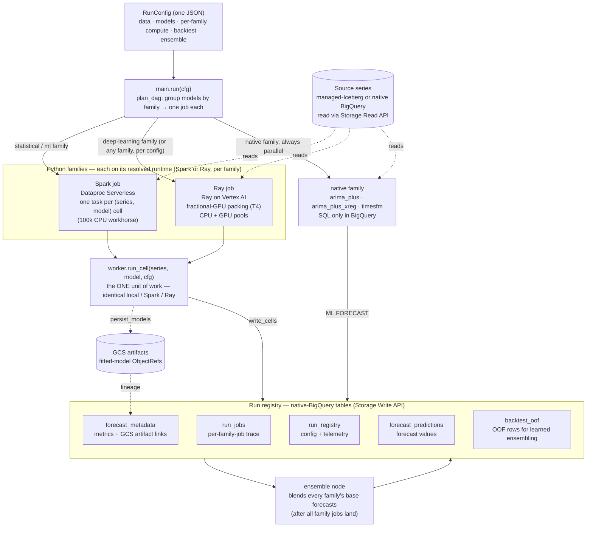

# scale-forecasting

**Massively-parallel time-series forecasting on Google Cloud — Spark, Ray, and BigQuery, one config away.**

Forecast tens of thousands of time series in parallel, backtest and ensemble many
methods, and capture every run's lineage in BigQuery — from a local notebook or from
Airflow, with the *same* code. Deploy the whole thing into a fresh project with one
`terraform apply`, complete with 100k example series to run against immediately.

> **Status.** The local dev loop and the GCP Terraform deploy are both working end-to-end
> (Spark, Ray, and BigQuery engines all run against a live deployment). Composer/Airflow
> **scheduled** orchestration is **in development** — the Terraform provisions the environment,
> but the run DAG it would host is not shipped yet; today runs are driven ad-hoc from a notebook,
> CLI, or local script (the *same* `main.run` code a DAG will call). See the
> [Architecture](#architecture) diagram for how a config flows through the runtimes to the registry.
>
> 🛠️ **Developing this repo?** [`DEVELOPMENT.md`](./DEVELOPMENT.md) holds the decision log and the
> outstanding/in-progress work items — a temporary working doc, removed before production.

---

## Why it exists

Large-scale forecasting usually means a pile of bespoke cluster code that only its
author understands. This project is the opposite bet: a small, readable codebase —
**one capability per file** — that still scales to 100k+ series, so a data scientist
can open any file, understand it in one read, and fork it to their needs.

## What it does

**Univariate time-series forecasting at scale** — fit many methods to tens of thousands of series in
parallel, with backtesting, custom holidays, and ensembling built in. One JSON config describes the
whole run.

- **One run, a job per model family.** A config's models are grouped into families
  (statistical / ml / deep-learning / native) and each family runs as its **own parallel job** under
  one `run_id`. Two **Python** runtimes — Dataproc Serverless (**Spark**) and **Ray** on Vertex AI —
  run the identical per-series unit of work, chosen **per family**; **BigQuery** runs its SQL-only
  native models **in parallel**, no Python compute. See [Methods](#methods) and
  [The three runtimes](#the-three-runtimes).
- **Ray packs fractional GPUs.** Ray's reason to exist here is **NeuralProphet on fractional GPUs** —
  many series share one T4 (auto-profiled `gpu_fraction`), so a deep-learning model scales without a
  GPU per series. See [The three runtimes](#the-three-runtimes).
- **Backtesting + ensembling out of the box** — expanding/sliding folds with a full metric panel,
  and both calculated and learned ensembles.
- **Custom holidays and transforms** — add holiday country codes and a target transform (`log1p` /
  `boxcox`) from config. A generic exogenous-regressor seam is **started but not shipped end-to-end**:
  the `exog` config field and the model `X` frame are plumbed through and several models consume
  them (`sarimax`, `ucm`, `prophet`, `lightgbm`, `xgboost`), but the shipped example series are
  univariate — bring your own source table with driver columns to exercise it. Treat multivariate
  as a supported-but-unexampled path, not a turnkey feature.
- **BigQuery lineage** — every run's config, per-model metrics, forecasts, and artifact links are
  captured in native BigQuery tables, written via the **Storage Write API** for high-speed updates
  (config, telemetry, and quantiles as native `JSON` columns). Layout:
  [output_schemas.md](./docs/output_schemas.md).
- **Pick your input storage** — the example series ship in **both** managed-Iceberg and
  native BigQuery, so you can benchmark the identical data on either format by name.
- **Config-driven** — one JSON file describes the whole run; the same file runs locally
  and under Composer. Every setting: [configuration_reference.md](./docs/configuration_reference.md).

## Methods

One model per file (`src/scale_forecasting/models/`); each ends in `register(...)` so it shows up in
`playground --list` automatically. Add your own with [`docs/adding_a_model.md`](./docs/adding_a_model.md).

| Model | Runtime | Family | Notes |
|-------|---------|--------|-------|
| [`theta`](./src/scale_forecasting/models/theta.py) | Python | statistical | Simple, strong baseline. |
| [`holtwinters`](./src/scale_forecasting/models/holtwinters.py) | Python | statistical | Holt-Winters exponential smoothing. |
| [`sarimax`](./src/scale_forecasting/models/sarimax.py) | Python | statistical | Seasonal ARIMA; supports exog. |
| [`ucm`](./src/scale_forecasting/models/ucm.py) | Python | statistical | Unobserved-components (structural) state-space. |
| [`stl_bagging`](./src/scale_forecasting/models/stl_bagging.py) | Python | statistical | STL decomposition + bagged base forecasts. |
| [`prophet`](./src/scale_forecasting/models/prophet_model.py) | Python | statistical | Additive trend/seasonality/holidays. |
| [`neuralprophet`](./src/scale_forecasting/models/neuralprophet_model.py) | Python | deep learning | **The GPU model** — fractional-GPU packing on Ray. |
| [`lightgbm`](./src/scale_forecasting/models/lightgbm_model.py) | Python | ML | Gradient boosting on lag/calendar features. |
| [`xgboost`](./src/scale_forecasting/models/xgboost_model.py) | Python | ML | Gradient boosting on lag/calendar features. |
| [`arima_plus`](./src/scale_forecasting/models/bigquery_native.py) | BigQuery | native | SQL-only `ARIMA_PLUS`; runs ∥ the Python runtime. |
| [`timesfm`](./src/scale_forecasting/models/bigquery_native.py) | BigQuery | native | SQL-only foundation-model forecaster. |

Plus **ensembles** across the base models (calculated: `mean`/`median`/`inverse_error`; learned:
`nnls`/`ridge`/`xgb`) — see [configuration_reference.md](./docs/configuration_reference.md#ensemble--ensembleconfig).

## Architecture

A run is one validated JSON config. It selects the data, the model list, the per-family runtimes,
backtest and ensemble settings — and is persisted verbatim into the run registry, so the config *is*
the experiment record. `main.run` resolves it into an **execution DAG**: one job per model family, all
in parallel under one `run_id`, plus a downstream ensemble node.



<a name="the-three-runtimes"></a>

- **The three runtimes, chosen per family.** Each Python model family runs on **Spark _or_ Ray**,
  chosen per family (`compute.families.<family>.runtime`, defaulting to the run-level
  `python_runtime`); the native family always runs in BigQuery. So one run can put its statistical
  family on Spark, its deep-learning family on Ray, and its native family in BigQuery — all in
  parallel under one `run_id`, and a run's wall-clock is the *slowest* family, not the sum.
  - **Spark** (Dataproc Serverless) is the 100k CPU workhorse: it fans out **one task per
    `(series, model)` cell** (series cross-joined with the family's models), so a job finishes in
    ~its slowest cell. See [07](./notebooks/07_scale_review.ipynb) for the 100k scale review.
  - **Ray** (on Vertex AI) is for **fractional-GPU packing**: NeuralProphet's per-series fit is small,
    so many series share one T4 via an auto-profiled `gpu_fraction` — a deep-learning family at fleet
    scale without a GPU per series. (For CPU-only work at 100k, Spark is the workhorse; Ray earns its
    place on the GPU path.)
  - **BigQuery** runs `arima_plus` / `arima_plus_xreg` / `timesfm` in SQL, in parallel, under the
    same `run_id`.
- **The one unit of work.** `worker.run_cell(series, model, cfg) -> CellResult` fits,
  (optionally) backtests, and predicts one `(series, model)` cell. The *same* function
  runs locally, inside a Spark Pandas UDF, and inside a Ray task. Engines differ only in
  how they fan it out and collect results — that's what makes "same code everywhere" real.
- **Ray vs Spark, for the PySpark crowd.** If you fan `(series, model)` work out today with
  `applyInPandas` + pandas UDFs, Ray runs the **identical** `worker.run_cell` over the
  **same** input table (Iceberg or native — read through the BigQuery Storage Read API), so
  the storage format is transparent to engine code. You get Ray ∥ BigQuery under one `run_id`
  with no Spark session to stand up or tune — and because the Ray ecosystem can also host
  Spark workloads (via RayDP), a team can consolidate many frameworks on one cluster.
  *(The Ray engine reads the source panel two ways, selected by `compute.ray_read_mode`: the
  default `driver_collect` (BigQuery Storage Read API client) and the opt-in `ray_data`
  (`ray.data.read_bigquery`) — both hit the same Storage Read API, so the storage format stays
  transparent. Both readers materialize one driver-side panel before the fan-out shards it —
  a bounded choice, because Ray is the GPU/modest-scale runtime here and Spark is the
  100k-series one; keeping the panel distributed as `ray.data` blocks all the way into the
  fan-out is the change that would lift that ceiling, and it is gated on a live Ray run at a
  scale that makes the driver the bottleneck.)* Spark-on-Ray (RayDP) is **out of scope**, not
  queued: this deploys Spark and Ray as first-class peer runtimes with their own submitters,
  so hosting one inside the other adds a third path to maintain for a consolidation benefit a
  team already gets by choosing a runtime per family — which the config does.
- **Scale without a bottleneck.** Workers return data, not RPCs; results are written to
  BigQuery in bulk (Storage Write API). Parallelism is bounded by compute, not a tracking
  server's QPS.
- **Lineage.** Native-BigQuery tables — `run_registry` (config) → `forecast_metadata` (metrics + GCS
  artifact links) → `forecast_predictions` (values), plus `backtest_oof` for learned ensembling and
  `run_jobs`, which records one row per family job (its runtime, hardware, and platform job id) so a
  run's cross-system trace is queryable. These run-collection tables are always native (native `JSON`
  columns, `WRITE_TRUNCATE` reseed) and are written via the **Storage Write API**; the *input* table
  ships in both Iceberg and native so you can compare storage formats on the same run shape. Full
  column-by-column layout: [output_schemas.md](./docs/output_schemas.md).

Read `src/scale_forecasting/config.py` (the run contract) and
`src/scale_forecasting/worker.py` (the unit of work) to see the whole shape.

## Quickstart

No GCP needed — run a real model on sample data in under a minute.

```bash
uv sync                                            # install into a local venv
uv run python -m scale_forecasting.playground --list           # see every model
uv run python -m scale_forecasting.playground --model theta --backtest
```

That runs the **same** `worker.run_cell` the cluster runs, on a small generated
panel, and prints the forecast horizon plus the backtest metric panel. For an
interactive version — pick a model, plot the forecast and its interval — open
[`notebooks/model_playground.ipynb`](./notebooks/model_playground.ipynb).

**Add your own model** in one file: copy [`docs/model_template.py`](./docs/model_template.py)
into `src/scale_forecasting/models/`, add one import line, and it shows up in the
list above automatically. Full walkthrough: [`docs/adding_a_model.md`](./docs/adding_a_model.md).

**Demo notebooks** (run + review against a live deployment) live in [`notebooks/`](./notebooks):
[`01_spark_via_connect`](./notebooks/01_spark_via_connect.ipynb) drives the Spark UDF fan-out over a
Dataproc **Spark Connect** endpoint; [`02_bigquery_native`](./notebooks/02_bigquery_native.ipynb)
runs the BigQuery-native models; [`03_combo_and_ensemble`](./notebooks/03_combo_and_ensemble.ipynb)
runs Spark ∥ BigQuery under one `run_id` with ensembles, then reviews base + ensemble models side by
side on `v_model_leaderboard`; [`04_ray_on_vertex`](./notebooks/04_ray_on_vertex.ipynb) runs the
Python-runtime models on an autoscaling Ray-on-Vertex cluster ∥ the BigQuery natives (job submission
works from any authenticated client — local or in-GCP — because the cluster is provisioned on a
PSC-I network attachment with a dashboard-capable head node, wired by the Terraform network module).

Finally, [`07_scale_review`](./notebooks/07_scale_review.ipynb) runs nothing — point it at one
`run_id` per approach (e.g. the `configs/*_100k.json` runs) and it renders the **cross-approach
comparison**: wall-clock and provisioning overhead from `v_run_summary`, the per-family-job placement
from `v_run_jobs`, and accuracy parity (same model, same answer across runtimes) from
`v_model_leaderboard`.

Every notebook has a one-click **Run in Colab Enterprise** header — the Terraform-deployed runtime
templates carry the `SF_*` run identity in their env, so it's open → pick a runtime → **Run all**,
no environment cell. The same notebooks run green headless via the acceptance harness
(`pytest -m gcp tests/integration/test_notebook_acceptance.py`, or
`python -m scale_forecasting.notebook_acceptance`), which the deploy and any notebook change are
verified against. See [`docs/notebook_runtimes.md`](./docs/notebook_runtimes.md).

## Documentation

Full map with one-line pointers: **[`docs/README.md`](./docs/README.md)**. The essentials:

- **Read the codebase** → [`docs/architecture.md`](./docs/architecture.md) — the
  module-calling-module call tree, from entrypoints to the one unit of work.
- **Run and review** → [`docs/running_and_reviewing.md`](./docs/running_and_reviewing.md) — submit
  (Spark / Ray / BigQuery), watch it land, review the leaderboard, re-ensemble.
- **Use it from Python** → [`docs/using_the_sdk.md`](./docs/using_the_sdk.md) — the `Forecaster`
  easy path and the direct Spark/Ray path.
- **Every config knob** → [`docs/configuration_reference.md`](./docs/configuration_reference.md).
- **Deploy** → [`docs/deploying_on_gcp.md`](./docs/deploying_on_gcp.md) +
  [`terraform/README.md`](./terraform/README.md).
- **When something breaks** → [`docs/troubleshooting.md`](./docs/troubleshooting.md).

## Deploy on GCP

Deploy the whole platform into a Google Cloud project with Terraform, in **two stages** — *bootstrap*
(the project + the Terraform state bucket), then *main* (everything else: dataset, buckets, service
accounts, network, connection, budget). The first apply also builds the shared Spark/Ray runtime
image and seeds **100,000 example series**, so a fresh deploy is a working solution-in-a-box you can
forecast against immediately.

- **Copy-paste runbook** — auth → clone → bootstrap → main → verify, plus the operator permissions
  you need: [`terraform/README.md`](./terraform/README.md)
- **Reviewer's guide** — what each module builds, which services it uses, why each IAM role is
  granted and who uses it, and the greenfield-vs-brownfield toggles:
  [`docs/deploying_on_gcp.md`](./docs/deploying_on_gcp.md)
- **Demo it** — the guided workshop over a deployed platform:
  [`docs/workshop.md`](./docs/workshop.md)

**Cost:** effectively free at rest — buckets, dataset, service accounts, and network plumbing cost
nothing until compute runs. The 100k seed is a one-time **~$0.15 / ~8.5 min** batch (content-addressed,
so it runs once; `run_seed = false` skips it, `seed_num_series = 100` smoke-tests first). **Composer**
(the scheduled-DAG host, still in development) is the only real at-rest cost (~$300–400/mo) and is
**off by default**.

**Greenfield or brownfield.** Defaults create everything (the 5-minute path). For a locked-down org,
flip `create_service_accounts` / `create_network` / `enable_apis` off and pass your existing SAs,
subnet, and pre-enabled APIs in by variable — the modules then create nothing and thread your values
through.

## License

Apache-2.0 — see [`LICENSE`](./LICENSE).
