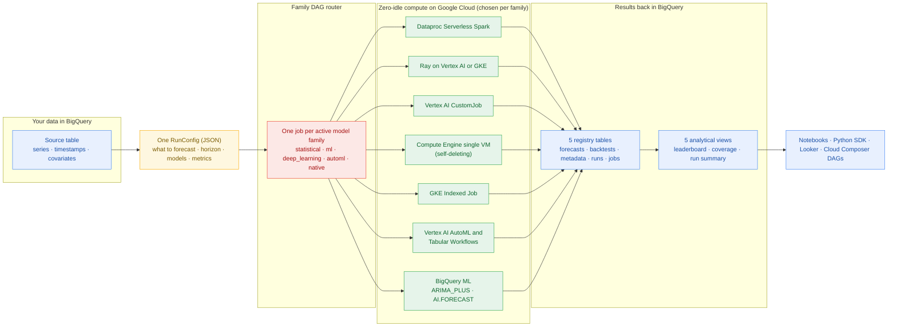

# scale-forecasting

**Enterprise time-series forecasting on Google Cloud — from 10 series on a laptop to 100,000+ in BigQuery, with one JSON configuration and no idle compute.**

[](https://console.cloud.google.com/vertex-ai/colab/import/https%3A%2F%2Fraw.githubusercontent.com%2Fstatmike%2Fscale-forecasting%2Fmain%2Fnotebooks%2F00_model_playground.ipynb)
[](https://statmike.github.io/scale-forecasting/)
[](./docs/getting_started.md)
[](./docs/workshop.md)
[](./terraform/README.md)
[](./LICENSE)

`34 models` · `5 families` · `21 evaluation metrics` · `7 Google Cloud runtimes` · `5 Analytical SQL Views` · `validated at 100k series`


```mermaid
flowchart LR
    subgraph IN["Your data in BigQuery"]
        SRC["Source table<br/>series · timestamps · covariates"]
    end
    CFG["One RunConfig (JSON)<br/>what to forecast · horizon · models · metrics"]
    subgraph ROUTE["Family DAG router"]
        R["One job per active model family<br/>statistical · ml · deep_learning · automl · native"]
    end
    subgraph RUN["Zero-idle compute on Google Cloud (chosen per family)"]
        S["Dataproc Serverless Spark"]
        RY["Ray on Vertex AI or GKE"]
        V["Vertex AI CustomJob"]
        G["Compute Engine single VM<br/>(self-deleting)"]
        K["GKE Indexed Job"]
        A["Vertex AI AutoML and<br/>Tabular Workflows"]
        B["BigQuery ML<br/>ARIMA_PLUS · AI.FORECAST"]
    end
    subgraph OUT["Results back in BigQuery"]
        REG["5 registry tables<br/>forecasts · backtests · metadata · runs · jobs"]
        VIEWS["5 analytical views<br/>leaderboard · coverage · run summary"]
    end
    USE["Notebooks · Python SDK · Looker · Cloud Composer DAGs"]

    SRC --> CFG --> R
    R --> S & RY & V & G & K & A & B
    S & RY & V & G & K & A & B --> REG --> VIEWS --> USE

    classDef data fill:#E8F0FE,stroke:#4285F4,color:#174EA6
    classDef config fill:#FEF7E0,stroke:#F9AB00,color:#7A5A00
    classDef route fill:#FCE8E6,stroke:#EA4335,color:#A50E0E
    classDef compute fill:#E6F4EA,stroke:#34A853,color:#0D652D
    class SRC,REG,VIEWS,USE data
    class CFG config
    class R route
    class S,RY,V,G,K,A,B compute
```

---

## What you just found

You describe *what* to forecast in one JSON file — the BigQuery table, the horizon, the models, the covariates, and the evaluation metrics. `scale-forecasting` decides *how*: it splits active models into up to five family jobs, dispatches each family in parallel to the Google Cloud runtime you chose for it, scores every model with rolling-origin backtesting and conformal prediction intervals, blends the winners into ensembles, reconciles hierarchical trees, and streams forecasts, leaderboards, and feature attributions back to BigQuery. When the run ends, the compute is gone.

- **Use `scale-forecasting` when** you want to evaluate or operate multiple model families (statistical, gradient-boosted trees, PyTorch deep learning, Vertex AI AutoML, and BigQuery ML) under one schema, one backtest contract, and one BigQuery leaderboard — from a handful of series to 100,000+.
- **Use a simpler path when** a single SQL query (`AI.FORECAST` or `ARIMA_PLUS` directly in BigQuery) already answers the question; you can still adopt `scale-forecasting` later to benchmark that SQL baseline against 32 Python and AutoML models on the same holdout folds.

---

## Three ways to start

### Journey 1 — Try it locally in 5 minutes (no cloud, no credentials)

Install the pure offline package (or clone the repo and run `uv sync`) to fit models, run backtests, and inspect metrics in memory on your machine:

```bash
pip install scale-forecasting
python -m scale_forecasting.playground --list
python -m scale_forecasting.playground --model theta --backtest --horizon 14
```

```python
import scale_forecasting as sf
from scale_forecasting import playground

result = playground.run_one(model="theta", horizon=14, backtest=True)
plan = sf.Forecaster.from_file("configs/ensemble_demo.json").dry_run()
print(result.metrics["wape"], plan.run_id)
```

Continue in [`notebooks/00_model_playground.ipynb`](./notebooks/00_model_playground.ipynb) or [Getting started (`docs/getting_started.md`)](./docs/getting_started.md).

### Journey 2 — Deploy to your Google Cloud project in 15 minutes

Provision the BigQuery dataset, Cloud Storage buckets, least-privilege service accounts, VPC networking, container image, Colab Enterprise runtime template, and 100,000-series seed dataset with two Terraform stages:

```bash
cd terraform/bootstrap && terraform init
terraform apply -var="project_id=YOUR_PROJECT_ID" -var="billing_account=YOUR_BILLING_ID"

cd ../main && terraform init
terraform apply -var="project_id=YOUR_PROJECT_ID"
```

> **Estimated cost & ongoing services:** One-time provisioning (Cloud Build image build + Dataproc Serverless 100k seed batch) costs an estimated **~\$0.15–\$0.50**. At rest, datasets, buckets, VPC networking, and service accounts have no running compute cost (only standard Cloud Storage and BigQuery storage rates for stored bytes). Forecast runs bill only while batches, VMs, pods, or queries execute. **Always-on disclosure:** Cloud Composer 3 (`create_composer = false` by default) and standing GKE clusters incur continuous hourly charges while provisioned. See [`docs/deploying_on_gcp.md`](./docs/deploying_on_gcp.md) and [`terraform/README.md`](./terraform/README.md).

### Journey 3 — Run 100,000+ series on Google Cloud

Launch any declarative configuration from the CLI, Python SDK, or a generated Cloud Composer 3 DAG:

```bash
# Run directly from the CLI or stage native gcloud / kubectl / bq / ray commands
python -m scale_forecasting.main --config configs/ensemble_demo.json
python -m scale_forecasting.main --config configs/spark_serverless_100k.json --emit-airflow dags/sf_100k.py
```

Full operator loop: [Running and reviewing (`docs/running_and_reviewing.md`)](./docs/running_and_reviewing.md) and [Platform overview (`docs/overview.md`)](./docs/overview.md).

---

## One configuration, every engine

Every run is a validated [`RunConfig`](./docs/configuration_reference.md) (such as [`configs/ensemble_demo.json`](./configs/ensemble_demo.json)). To move a model family between Dataproc Serverless, Ray, Vertex AI CustomJob, Compute Engine, or GKE, change `compute.families.<family>.runtime` — nothing else:

```json
{
  "run_name": "hybrid_stacked_ensemble",
  "data": {"source_table": "source_series_iceberg", "series_limit": 100, "horizon": 14},
  "models": ["theta", "holtwinters", "xgboost", "arima_plus"],
  "compute": {
    "families": {
      "statistical": {"runtime": "spark"},
      "ml": {"runtime": "spark"}
    }
  },
  "backtest": {"enabled": true, "scheme": "expanding", "n_folds": 3, "decision_metric": "wape"},
  "ensemble": {"enabled": true, "strategies": ["mean", "inverse_error", "nnls", "xgb"]}
}
```

---

## Why Google Cloud for forecasting at any scale

| Pillar | What it means for you | Proof in this repository |
| :--- | :--- | :--- |
| **Data stays in BigQuery** | Workers read source tables via the BigQuery Storage Read API with contiguous per-worker `[start_id, end_id]` pushdown and stream results back through the Storage Write API. | [`docs/reading_source_data.md`](./docs/reading_source_data.md) · [`docs/writing_results.md`](./docs/writing_results.md) |
| **Compute only while it runs** | Active model families launch in parallel (`dag.py`); fast CPU families tear down immediately while GPU families finish; single-VM GCE enforces triple-redundant self-deletion. | [`docs/runtimes_reference.md`](./docs/runtimes_reference.md) · [`docs/architecture.md`](./docs/architecture.md) |
| **Seven runtimes, one contract** | Run `spark`, `ray`, `vertex`, `gce`, `gke`, `vertex_automl`, and `bigquery` concurrently under one `run_id` across CPU and NVIDIA `T4`, `L4`, `A100`, `A100_80GB` GPUs. | [`docs/runtimes_reference.md`](./docs/runtimes_reference.md) · [`docs/validation.md`](./docs/validation.md) |
| **Managed and open models on one leaderboard** | Benchmark BigQuery ML (`ARIMA_PLUS`, `AI.FORECAST` / `TimesFM`) and Vertex AI AutoML alongside 28 open-source statistical, tree, and deep learning models on identical folds. | [`docs/models_reference.md`](./docs/models_reference.md) · [`docs/output_schemas.md`](./docs/output_schemas.md) |
| **Governed by construction** | Content-addressed `run_id`, snapshot-pinned reads, 5 registry tables, 5 analytical SQL views, surgical cell repair (`retry_run`), and 42 live-validated smoke configurations. | [`docs/output_schemas.md`](./docs/output_schemas.md) · [`docs/operations.md`](./docs/operations.md) · [`docs/validation.md`](./docs/validation.md) |
| **Modular install & 1-file extensibility** | `pip install scale-forecasting` has zero Google Cloud dependencies; `[gcp]`, `[spark]`, `[ray]`, `[models]`, and `[all]` are opt-in extras; new models ship in 1 file with no image rebuild. | [`docs/runtime_dependencies.md`](./docs/runtime_dependencies.md) · [`docs/adding_a_model.md`](./docs/adding_a_model.md) |

---

## What's inside

| Family | Models (`34` total) | Runtimes | Highlights |
| :--- | :--- | :--- | :--- |
| **`statistical`** (`18`) | `theta`, `auto_theta`, `holtwinters`, `autoets`, `auto_arima`, `sarimax`, `tbats`, `auto_ces`, `stl_bagging`, `ucm`, `kalman`, `prophet`, `croston`, `fft`, `naive_mean`, `naive_seasonal`, `naive_drift`, `naive_moving_average` | `spark`, `ray`, `vertex`, `gce`, `gke` | Fast local baselines, state-space, intermittent demand, and harmonic decomposition. |
| **`ml`** (`5`) | `lightgbm`, `xgboost`, `catboost`, `random_forest`, `regression_lags` | `spark`, `ray`, `vertex`, `gce`, `gke` | Lag/calendar/exogenous features plus Tier 1 & Tier 2 TreeSHAP / linear / deviation attributions. |
| **`deep_learning`** (`5`) | `tide`, `tft`, `tsmixer`, `patchtst`, `neuralprophet` | `spark`, `ray`, `vertex`, `gce`, `gke` | `local`, `global`, and `hybrid` panel regimes with fractional or dedicated GPU execution. |
| **`automl`** (`4`) | `vertex_l2l`, `vertex_tide`, `vertex_tft`, `vertex_seq2seq` | `vertex_automl` | Managed Vertex AI Tabular Workflows & AutoML training jobs with Stage-1 HPO reuse and baseline attributions. |
| **`native`** (`2`) | `arima_plus`, `timesfm` (`AI.FORECAST`) | `bigquery` | Pure BigQuery SQL execution with zero cluster provisioning. |

- **Evaluation & calibration:** **21 evaluation metrics** (16 point + 5 interval: `wape`, `smape`, `mape`, `maape`, `ope`, `mae`, `rmse`, `mse`, `rmsle`, `bias`, `mase`, `mase_seasonal`, `rmsse`, `msse`, `r2`, `cv`, `coverage`, `pinball`, `interval_score`, `interval_width`, `msis`) and empirical conformal prediction intervals ([`docs/metrics_reference.md`](./docs/metrics_reference.md)).
- **Hierarchy, ensembles & explainability:** All 7 Hyndman FPP3 reconciliation methods (`mint_shrink`, `wls_var`, `wls_struct`, `ols`, `bottom_up`, `top_down`, `middle_out`), 6 ensemble strategies (`mean`, `median`, `inverse_error`, `nnls`, `ridge`, `xgb`), and two-tier feature attributions (`attributions_df` / `plot_attributions`).

---

## Learn by doing (11 notebooks across 4 tracks)

All notebooks in [`notebooks/`](./notebooks/README.md) include committed outputs and one-click **Colab Enterprise** launch links:

- **Track 1 — Local sandbox & plugins (no GCP setup):** [`00_model_playground.ipynb`](./notebooks/00_model_playground.ipynb) · [`09_custom_models_and_metrics.ipynb`](./notebooks/09_custom_models_and_metrics.ipynb)
- **Track 2 — Cloud runtimes:** [`01_bigquery_native_sql.ipynb`](./notebooks/01_bigquery_native_sql.ipynb) · [`02_vertex_and_gce_vms.ipynb`](./notebooks/02_vertex_and_gce_vms.ipynb) · [`03_spark_serverless_and_connect.ipynb`](./notebooks/03_spark_serverless_and_connect.ipynb) · [`04_ray_on_vertex_gpu.ipynb`](./notebooks/04_ray_on_vertex_gpu.ipynb)
- **Track 3 — Covariates, hierarchy, HPO & ensembles:** [`05_covariates_and_global_models.ipynb`](./notebooks/05_covariates_and_global_models.ipynb) · [`06_hierarchical_reconciliation.ipynb`](./notebooks/06_hierarchical_reconciliation.ipynb) · [`07_hpo_backtesting_and_ensembles.ipynb`](./notebooks/07_hpo_backtesting_and_ensembles.ipynb)
- **Track 4 — Master multi-engine DAG & operations:** [`08_multi_engine_master_workflow.ipynb`](./notebooks/08_multi_engine_master_workflow.ipynb) · [`10_registry_operations_and_scale.ipynb`](./notebooks/10_registry_operations_and_scale.ipynb)
- **Team lab:** [Hands-on workshop guide (`docs/workshop.md`)](./docs/workshop.md)

---

## Where next

- **Start here:** [Getting started](./docs/getting_started.md) · [Platform overview](./docs/overview.md) · [Choosing a runtime](./docs/choosing_a_runtime.md) · [Cost estimates & controls](./docs/cost_estimates.md) · [Why Google Cloud](./docs/why_google_cloud.md) · [FAQ](./docs/faq.md) · [Glossary](./docs/glossary.md) · [Documentation map](./docs/README.md)
- **Reference:** [Compute runtimes](./docs/runtimes_reference.md) · [Configuration](./docs/configuration_reference.md) · [Models & ensembles](./docs/models_reference.md) · [Evaluation metrics](./docs/metrics_reference.md) · [Output schemas & views](./docs/output_schemas.md)
- **Operate & extend:** [Python SDK (`Forecaster`)](./docs/using_the_sdk.md) · [Running & reviewing](./docs/running_and_reviewing.md) · [Operations & repair](./docs/operations.md) · [Quota & 100k scale](./docs/quota_and_scale.md) · [System validation ledger](./docs/validation.md) · [API reference](https://statmike.github.io/scale-forecasting/api/)

---

## License

Apache-2.0 — see [`LICENSE`](./LICENSE).
