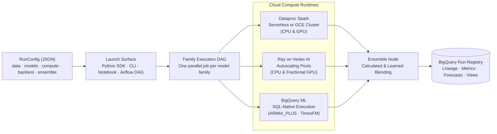
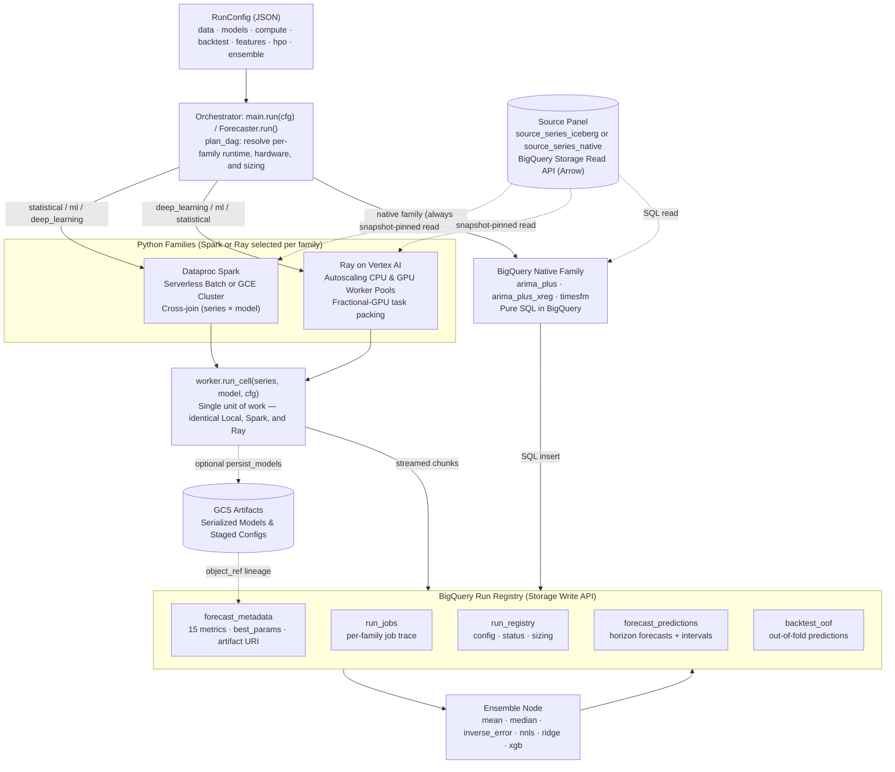

# scale-forecasting

**Massively parallel time-series forecasting on Google Cloud — Spark, Ray, and BigQuery, one config away.**

Forecast tens of thousands of time series in parallel, backtest and ensemble 18 statistical, machine-learning, deep-learning, and SQL-native models, and capture every run's lineage in BigQuery — from a local notebook, the Python SDK, the CLI, or Cloud Composer (Airflow), using the *same* code. Deploy the complete platform into a Google Cloud project with `terraform apply`, pre-seeded with 100,000 example series across both Apache Iceberg and native BigQuery tables.

---

## Why It Exists

Large-scale forecasting often turns into a tangle of bespoke cluster scripts, fragile dependency builds, and disconnected evaluation queries. `scale-forecasting` takes the opposite approach: a clean, modular Python package — **one capability per file** — where a single JSON configuration defines the entire experiment and scales from a 3-series local smoke test to 100,000+ series in the cloud without changing a line of code.


```mermaid
flowchart LR
    cfg["RunConfig (JSON)<br/>data · models · compute · backtest · ensemble"]
    sdk["Launch Surface<br/>Python SDK · CLI · Notebook · Airflow DAG"]
    dag["Family Execution DAG<br/>One parallel job per model family"]
    
    subgraph runtimes["Cloud Compute Runtimes"]
        spark["Dataproc Spark<br/>Serverless or GCE Cluster<br/>(CPU & GPU)"]
        ray["Ray on Vertex AI<br/>Autoscaling Pools<br/>(CPU & Fractional GPU)"]
        bq["BigQuery ML<br/>SQL-Native Execution<br/>(ARIMA_PLUS · TimesFM)"]
    end

    ens["Ensemble Node<br/>Calculated & Learned Blending"]
    reg[("BigQuery Run Registry<br/>Lineage · Metrics · Forecasts · Views")]

    cfg --> sdk --> dag
    dag --> spark & ray & bq
    spark & ray & bq --> ens --> reg
```

---

## Key Capabilities

- **One config, one deterministic `run_id`, parallel per-family execution.** A run groups your selected models into up to four families (`statistical`, `ml`, `deep_learning`, and `native`) and launches each family as its own parallel job under a single content-addressed `run_id`. A run's wall-clock time is bounded by its slowest family, not the sum of all families.
- **Three first-class runtimes, chosen per family:**
  - **Dataproc Spark (Serverless or GCE Cluster):** The 100k-series CPU workhorse (with optional L4 GPU support). Cross-joins series with models so every `(series, model)` cell runs as an independent parallel task.
  - **Ray on Vertex AI:** Designed for fractional-GPU packing and flexible worker pools. Multiple deep-learning fits share a single GPU via an automatically profiled `gpu_fraction`, scaling `neuralprophet` across a fleet without requiring a dedicated GPU per series.
  - **BigQuery Native (BQML & AI.FORECAST):** Runs `arima_plus`, `arima_plus_xreg`, and `timesfm` directly inside BigQuery SQL in parallel with your Python families.
- **One unit of work everywhere.** [`worker.run_cell(series, model, cfg)`](./src/scale_forecasting/worker.py) fits, backtests, calibrates intervals, and predicts a single `(series, model)` cell. The exact same function executes in your local terminal, inside a Spark Pandas UDF, and inside a Ray remote task.
- **Rigorous rolling-origin backtesting and interval calibration.** Supports `expanding`, `sliding`, `expanding_frozen`, and `expanding_stale` cross-validation schemes, a 15-metric evaluation panel (point + prediction-interval accuracy), conformal residual interval calibration, and automatic per-series point-forecast arm selection (`raw`, `mean`, `median`, or `auto`).
- **Rich feature engineering and hyperparameter optimization.** Add country holidays, Fourier seasonality terms, automatic level-shift step detection, target transforms (`log1p`, `boxcox`), exogenous covariates (`exog`), and covariate lags (`exog_lags`) directly from config. Tune model hyperparameters with Optuna either fleet-wide or per series.
- **Calculated and learned ensembling.** Blend base forecasts using calculated rules (`mean`, `median`, `inverse_error`) or out-of-fold learned weights (`nnls`, `ridge`, `xgb`), either within a single run (`barrier` or `microbatch`) or across multiple historical runs.
- **Zero-rebuild code delivery.** The container image bakes only locked third-party dependencies (`uv.lock` $\rightarrow$ `docker/requirements.txt`). Your `src/scale_forecasting` package is zipped and delivered at job submission time, so any new model, metric, or code edit takes effect on the very next run without rebuilding a container image.
- **Complete BigQuery lineage and operator tooling.** Every run logs its verbatim config, per-job telemetry, per-series evaluation metrics, out-of-fold predictions, and final forecasts via the BigQuery Storage Write API, backed by pre-built SQL views and an 8-verb operator CLI/`Registry` SDK (`init`, `doctor`, `close-runs`, `drop-run`, `sweep-orphans`, `reap-clusters`, `snapshot`, `export`).

---

## Forecasting Models & Ensembles

Every model lives in its own file under [`src/scale_forecasting/models/`](./src/scale_forecasting/models/README.md) and registers itself with the model catalogue. Add your own in a single file following [`docs/adding_a_model.md`](./docs/adding_a_model.md).

| Model | Family | Runtime | Highlights |
| :--- | :--- | :--- | :--- |
| [`naive_mean`](./src/scale_forecasting/models/naive_mean.py) | `statistical` | Python (Spark / Ray) | Historical mean baseline with analytical prediction intervals. |
| [`naive_seasonal`](./src/scale_forecasting/models/naive_seasonal.py) | `statistical` | Python (Spark / Ray) | Repeats the last observed seasonal cycle. |
| [`naive_drift`](./src/scale_forecasting/models/naive_drift.py) | `statistical` | Python (Spark / Ray) | Linear extrapolation between the first and last observations. |
| [`naive_moving_average`](./src/scale_forecasting/models/naive_moving_average.py) | `statistical` | Python (Spark / Ray) | Trailing moving-average baseline (tunable window). |
| [`theta`](./src/scale_forecasting/models/theta.py) | `statistical` | Python (Spark / Ray) | Assimakopoulos-Nikolopoulos Theta method (`statsmodels`). |
| [`holtwinters`](./src/scale_forecasting/models/holtwinters.py) | `statistical` | Python (Spark / Ray) | Holt-Winters seasonal exponential smoothing. |
| [`autoets`](./src/scale_forecasting/models/autoets.py) | `statistical` | Python (Spark / Ray) | State-space Exponential Smoothing (Error-Trend-Seasonal). |
| [`croston`](./src/scale_forecasting/models/croston.py) | `statistical` | Python (Spark / Ray) | Croston / SBA / TSB intermittent-demand forecaster for sparse series. |
| [`sarimax`](./src/scale_forecasting/models/sarimax.py) | `statistical` | Python (Spark / Ray) | Seasonal ARIMA with exogenous regressors (`exog`). |
| [`ucm`](./src/scale_forecasting/models/ucm.py) | `statistical` | Python (Spark / Ray) | Unobserved Components (structural state-space) model; supports `exog`. |
| [`stl_bagging`](./src/scale_forecasting/models/stl_bagging.py) | `statistical` | Python (Spark / Ray) | STL decomposition + block-bootstrapped bagged ETS forecasts. |
| [`prophet`](./src/scale_forecasting/models/prophet_model.py) | `statistical` | Python (Spark / Ray) | Additive piecewise trend, multi-seasonality, and exogenous regressors. |
| [`regression_lags`](./src/scale_forecasting/models/regression_lags.py) | `ml` | Python (Spark / Ray) | Ridge regression over autoregressive target lags, calendar features, and `exog`. |
| [`lightgbm`](./src/scale_forecasting/models/lightgbm_model.py) | `ml` | Python (Spark / Ray) | Gradient boosted trees (`LightGBM`) with recursive multi-step prediction. |
| [`xgboost`](./src/scale_forecasting/models/xgboost_model.py) | `ml` | Python (Spark / Ray) | Gradient boosted trees (`XGBoost`) on CPU or GPU (`device="cuda"`). |
| [`neuralprophet`](./src/scale_forecasting/models/neuralprophet_model.py) | `deep_learning` | Python (Spark / Ray) | PyTorch AR-Net + trend/seasonality forecaster; fractional-GPU packing on Ray. |
| [`arima_plus`](./src/scale_forecasting/models/bigquery_native.py) | `native` | BigQuery SQL | Managed `CREATE MODEL ... ARIMA_PLUS` in BigQuery ML. |
| [`arima_plus_xreg`](./src/scale_forecasting/models/bigquery_native.py) | `native` | BigQuery SQL | Managed `ARIMA_PLUS_XREG` with exogenous covariates in BigQuery ML. |
| [`timesfm`](./src/scale_forecasting/models/bigquery_native.py) | `native` | BigQuery SQL | Zero-shot foundation-model forecasting via BigQuery `AI.FORECAST` (`TimesFM`). |

**Ensemble Strategies (`ensemble.strategies`):**
- **Calculated (backtest-free or metric-weighted):** `mean`, `median`, `inverse_error`
- **Learned (fitted per series on out-of-fold predictions):** `nnls` (non-negative least squares), `ridge` (L2-regularized linear blend), `xgb` (gradient-boosted meta-learner)

---

## Architecture Overview

A run starts from one validated [`RunConfig`](./src/scale_forecasting/config.py). [`main.run`](./src/scale_forecasting/main.py) (or an emitted Cloud Composer DAG) resolves the config into an execution DAG: one node per model family plus a downstream ensemble node.


```mermaid
flowchart TB
    cfg["RunConfig (JSON)<br/>data · models · compute · backtest · features · hpo · ensemble"]
    entry["Orchestrator: main.run(cfg) / Forecaster.run()<br/>plan_dag: resolve per-family runtime, hardware, and sizing"]
    cfg --> entry

    subgraph py["Python Families (Spark or Ray selected per family)"]
        direction LR
        spark["Dataproc Spark<br/>Serverless Batch or GCE Cluster<br/>Cross-join (series × model)"]
        ray["Ray on Vertex AI<br/>Autoscaling CPU & GPU Worker Pools<br/>Fractional-GPU task packing"]
    end

    bq["BigQuery Native Family<br/>arima_plus · arima_plus_xreg · timesfm<br/>Pure SQL in BigQuery"]

    entry -->|"statistical / ml / deep_learning"| spark
    entry -->|"deep_learning / ml / statistical"| ray
    entry -->|"native family (always parallel)"| bq

    cell["worker.run_cell(series, model, cfg)<br/>Single unit of work — identical Local, Spark, and Ray"]
    spark --> cell
    ray --> cell

    data[("Source Panel<br/>source_series_iceberg or source_series_native<br/>BigQuery Storage Read API (Arrow)")]
    data -.->|snapshot-pinned read| spark
    data -.->|snapshot-pinned read| ray
    data -.->|SQL read| bq

    subgraph reg["BigQuery Run Registry (Storage Write API)"]
        direction LR
        r0["run_registry<br/>config · status · sizing"]
        r1["run_jobs<br/>per-family job trace"]
        r2["forecast_metadata<br/>15 metrics · best_params · artifact URI"]
        r3["forecast_predictions<br/>horizon forecasts + intervals"]
        r4["backtest_oof<br/>out-of-fold predictions"]
    end

    ens["Ensemble Node<br/>mean · median · inverse_error · nnls · ridge · xgb"]
    cell -->|streamed chunks| reg
    bq -->|SQL insert| reg
    reg --> ens
    ens --> reg

    art[("GCS Artifacts<br/>Serialized Models & Staged Configs")]
    cell -.->|optional persist_models| art
    art -.->|object_ref lineage| r2
```

---

## Quickstart (Local, Zero Cloud Setup)

Run any Python model locally on synthetic data in under a minute — no GCP project or credentials required:

```bash
uv sync                                                                # create .venv from uv.lock
uv run python -m scale_forecasting.playground --list                   # list all 18 models
uv run python -m scale_forecasting.playground --model theta --backtest # fit, backtest, and print metrics
```

This executes the exact same [`worker.run_cell`](./src/scale_forecasting/worker.py) function that runs on Dataproc and Vertex AI. For an interactive visual walkthrough, open [`notebooks/model_playground.ipynb`](./notebooks/model_playground.ipynb).

### Extending the Platform in One File

- **Add a model:** Copy [`docs/model_template.py`](./docs/model_template.py) into [`src/scale_forecasting/models/`](./src/scale_forecasting/models/README.md), implement `fit` and `predict`, and add one import line. Walkthrough: [`docs/adding_a_model.md`](./docs/adding_a_model.md).
- **Add a metric:** Copy [`docs/metric_template.py`](./docs/metric_template.py) into [`src/scale_forecasting/metrics/`](./src/scale_forecasting/metrics/README.md) and add its name to `METRIC_NAMES`. Its BigQuery column, `ADD COLUMN` migration, Storage Write API protobuf field, and leaderboard view update automatically. Walkthrough: [`docs/adding_a_metric.md`](./docs/adding_a_metric.md).

---

## Interactive Notebooks

The [`notebooks/`](./notebooks/README.md) directory walks through every execution pattern and includes one-click **Run in Colab Enterprise** links pre-wired to the Terraform-provisioned runtime template (`sf-main`):

| Notebook | What It Demonstrates |
| :--- | :--- |
| [`model_playground.ipynb`](./notebooks/model_playground.ipynb) | Local interactive sandbox — fit, backtest, and plot any model on synthetic data with zero cloud setup. |
| [`01_spark_via_connect.ipynb`](./notebooks/01_spark_via_connect.ipynb) | Interactive Spark execution over **Dataproc Spark Connect** plus a serverless batch comparison. |
| [`02_bigquery_native.ipynb`](./notebooks/02_bigquery_native.ipynb) | SQL-only forecasting in BigQuery (`arima_plus` and `timesfm`) with zero Python cluster provisioning. |
| [`03_combo_and_ensemble.ipynb`](./notebooks/03_combo_and_ensemble.ipynb) | Multi-engine execution (Spark $\parallel$ BigQuery) under one `run_id`, followed by within-run and cross-run ensembling. |
| [`04_ray_on_vertex.ipynb`](./notebooks/04_ray_on_vertex.ipynb) | Autoscaling **Ray on Vertex AI** (including GPU-packed `neuralprophet`) running in parallel with BigQuery native models. |
| [`07_scale_review.ipynb`](./notebooks/07_scale_review.ipynb) | **100k-series scale comparison** — wall-clock timing, cluster overhead, and numerical accuracy parity across engines. |
| [`08_run_and_monitor.ipynb`](./notebooks/08_run_and_monitor.ipynb) | Launch a multi-engine run in the background and drive a live-refreshing progress dashboard with runtime probe escalation. |
| [`09_review_run.ipynb`](./notebooks/09_review_run.ipynb) | Read-only post-run analysis of any `run_id`: model leaderboard, metric distributions, ensemble lift, and job timeline. |

---

## Repository Map

Every directory includes a `README.md` with an overview and visual diagrams of its contents:

| Directory | Purpose |
| :--- | :--- |
| [`docs/`](./docs/README.md) | User guides, architecture reference, operational runbooks, system validation ledger, and auto-generated API docs. |
| [`configs/`](./configs/README.md) | Ready-to-run JSON configurations for demos, 10k/100k scale runs, A/B comparisons, and the [`configs/smokes/`](./configs/smokes/README.md) validation suite. |
| [`notebooks/`](./notebooks/README.md) | Interactive Jupyter / Colab Enterprise notebooks covering every runtime, monitoring, and post-run review workflow. |
| [`src/scale_forecasting/`](./src/scale_forecasting/README.md) | Core Python package (`Forecaster` SDK, `main.run` orchestrator, `worker.run_cell`, and specialized subpackages). |
| [`docker/`](./docker/README.md) | Dependency-only container image (`Dockerfile`), Cloud Build definitions, Dataproc GPU image customization, and locked `requirements.txt`. |
| [`terraform/`](./terraform/README.md) | Two-stage Terraform deployment (`bootstrap` and `main`) that provisions the GCP project, data lake, runtimes, and 100k-series seed. |
| [`tests/`](./tests/README.md) | Offline unit/contract test suite (`tests/unit/`), live cloud integration tests (`tests/integration/`), and smoke test harness (`tests/smokes/`). |

---

## Documentation

Full documentation map: **[`docs/README.md`](./docs/README.md)** (also published at **https://statmike.github.io/scale-forecasting/**).

- **Architecture & Call Tree:** [`docs/architecture.md`](./docs/architecture.md)
- **Running, Monitoring & Reviewing:** [`docs/running_and_reviewing.md`](./docs/running_and_reviewing.md)
- **Python SDK & Direct Runners:** [`docs/using_the_sdk.md`](./docs/using_the_sdk.md)
- **Configuration Reference:** [`docs/configuration_reference.md`](./docs/configuration_reference.md)
- **Backtesting & Calibration Methodology:** [`docs/backtesting.md`](./docs/backtesting.md)
- **Quota, Sizing & 100k Scale Guide:** [`docs/quota_and_scale.md`](./docs/quota_and_scale.md)
- **BigQuery Registry & Output Schemas:** [`docs/output_schemas.md`](./docs/output_schemas.md)
- **Deploying on GCP:** [`docs/deploying_on_gcp.md`](./docs/deploying_on_gcp.md) & [`terraform/README.md`](./terraform/README.md)
- **Operations & Maintenance Runbook:** [`docs/operations.md`](./docs/operations.md)
- **System Validation & Smoke Suite:** [`docs/validation.md`](./docs/validation.md) & [`docs/smoke_testing.md`](./docs/smoke_testing.md)
- **Troubleshooting:** [`docs/troubleshooting.md`](./docs/troubleshooting.md)

---

## Deploy on Google Cloud

Deploy the complete platform into a Google Cloud project with Terraform in two stages: **Stage 1 (`bootstrap`)** creates the project and Terraform state bucket; **Stage 2 (`main`)** provisions the APIs, service accounts, VPC subnet, GCS buckets, BigQuery dataset, BigLake connection, Artifact Registry image build, Colab Enterprise runtime template, and a one-time Dataproc batch that seeds **100,000 synthetic time series**.

- **Step-by-step runbook:** [`terraform/README.md`](./terraform/README.md)
- **Architecture & IAM reviewer's guide:** [`docs/deploying_on_gcp.md`](./docs/deploying_on_gcp.md)
- **Guided demo workshop:** [`docs/workshop.md`](./docs/workshop.md)

**Cost & Brownfield Flexibility:** Storage, datasets, service accounts, and networking have near-zero idle cost. The initial image build and 100k-series data seed run once (~8.5 minutes, ~\$0.15). Cloud Composer 3 (`create_composer = false` by default) is optional and only provisioned when scheduled Airflow DAG hosting is desired. For existing enterprise environments, toggle `create_project`, `enable_apis`, `create_service_accounts`, or `create_network` off in `terraform.tfvars` to bring your own pre-provisioned resources.

---

## License

Apache-2.0 — see [`LICENSE`](./LICENSE).
