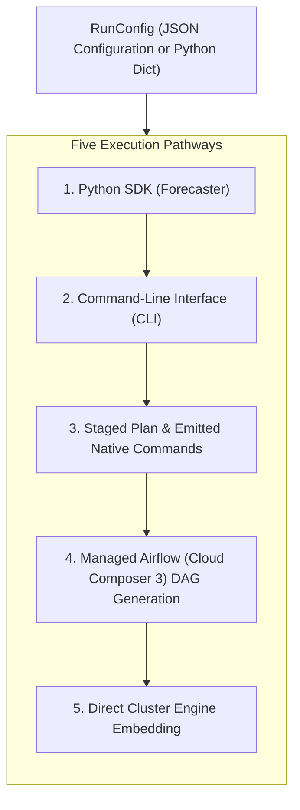
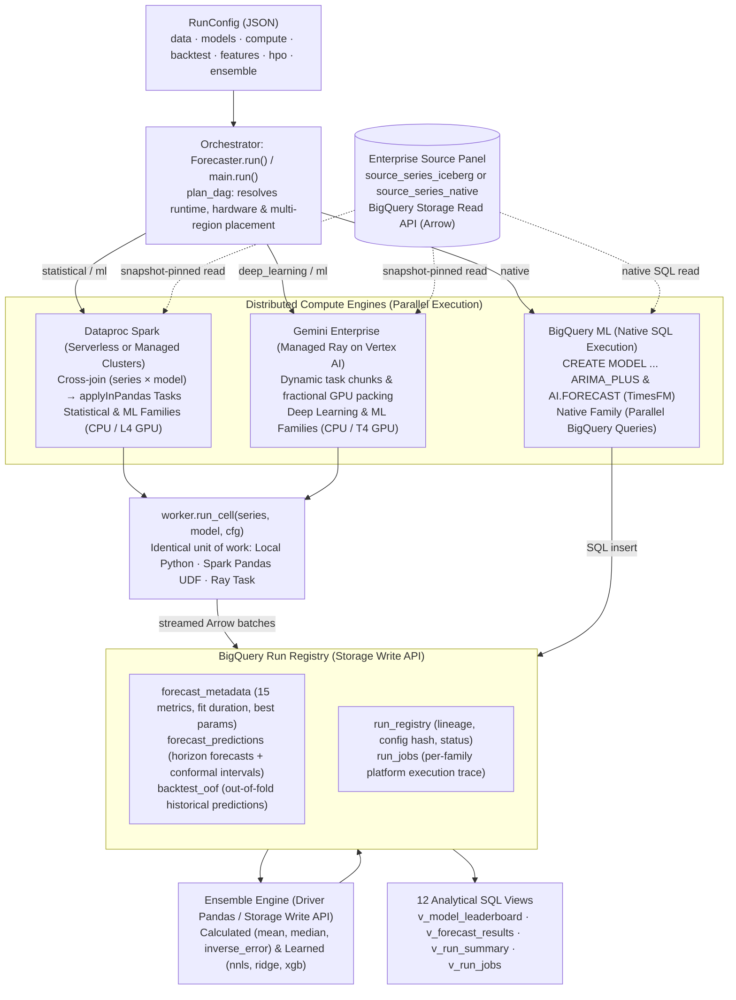
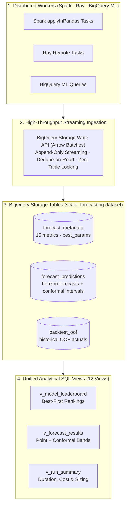
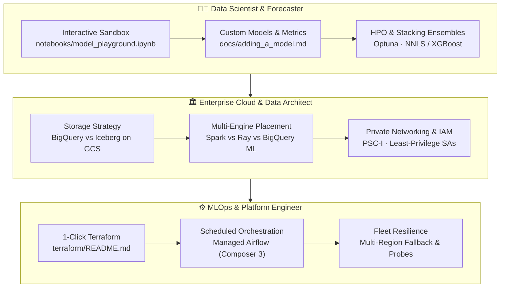
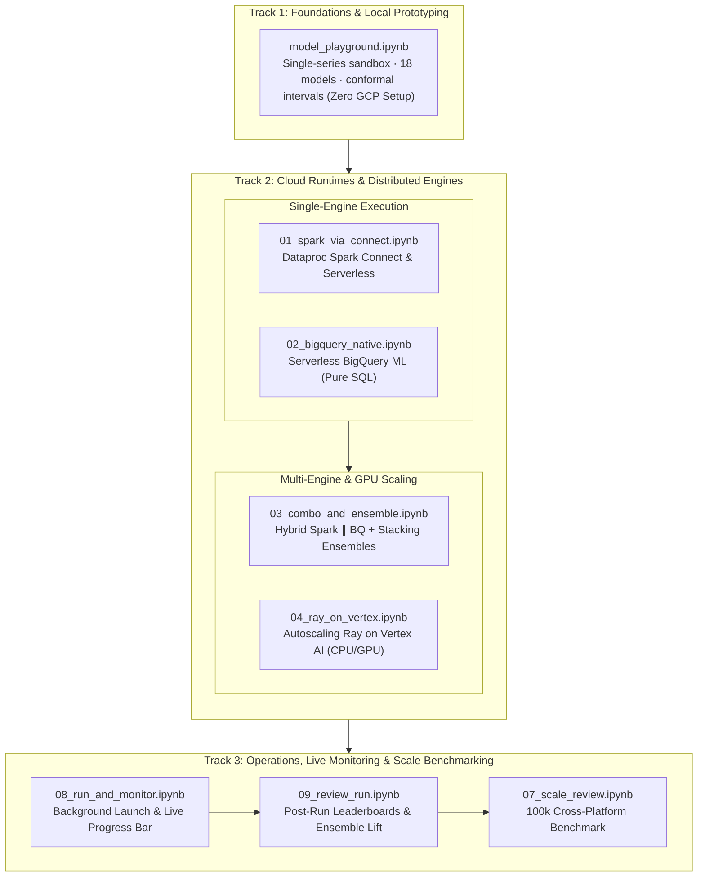

# scale-forecasting

<p align="center">
  <b>Enterprise-Grade, Massively Parallel Time-Series Forecasting on Google Cloud</b><br>
  <i>One declarative JSON configuration. 18 models. Hybrid distributed execution across BigQuery ML, Managed Service for Apache Spark (Dataproc), and Gemini Enterprise (Managed Ray on Vertex AI).</i>
</p>

<p align="center">
  <a href="https://console.cloud.google.com/vertex-ai/colab/import/https%3A%2F%2Fraw.githubusercontent.com%2Fstatmike%2Fscale-forecasting%2Fmain%2Fnotebooks%2Fmodel_playground.ipynb"></a>
  <a href="https://statmike.github.io/scale-forecasting/"></a>
  <a href="./docs/workshop.md"></a>
  <a href="./terraform/README.md"></a>
</p>

<p align="center">
  <a href="#quickstart-local-in-5-minutes">⚡ Quickstart</a> •
  <a href="#why-scale-forecasting">💡 Why Scale Forecasting</a> •
  <a href="#the-technology-stack">🛠️ The Stack</a> •
  <a href="#how-runs-work-declarative-json-configurations">⚙️ Configurations</a> •
  <a href="#five-flexible-ways-to-run">🚀 Ways to Run</a> •
  <a href="#hybrid-distributed-execution--the-family-dag">🏛️ Architecture</a> •
  <a href="#model--ensemble-catalog">📊 Models</a> •
  <a href="#evaluation-metrics-catalog">📈 Metrics</a> •
  <a href="#ensemble-stacking-re-ensembling--cross-run-blending">🤝 Ensembles</a> •
  <a href="#the-bigquery-telemetry--collection-system">📡 Telemetry & Views</a> •
  <a href="#operational-lifecycle-diagnostics--surgical-repair">🩺 Operations & Repair</a> •
  <a href="#interactive-notebook-suite">📓 Notebooks</a> •
  <a href="#deploy-on-google-cloud-in-15-minutes">☁️ Deploy on GCP</a>
</p>

---

## What Is `scale-forecasting`?

`scale-forecasting` brings the modeling flexibility of modern time-series ecosystems (Prophet, Statsmodels, LightGBM, XGBoost, NeuralProphet) to **enterprise Google Cloud scale**. It allows data science and engineering teams to forecast **100,000+ time series** concurrently, perform rigorous rolling-origin backtesting, stack models into learned ensembles, and capture complete experiment lineage in BigQuery — all orchestrated from a single JSON configuration.

The entire platform deploys with 1-click Terraform, pre-seeded with a 100,000-series dataset across both native BigQuery and BigLake Apache Iceberg tables on Google Cloud Storage.

---

## Why Scale Forecasting?

Traditional forecasting workflows break down when scaled to hundreds of thousands of series across retail, supply chain, energy, or financial hierarchies:

| Challenge | Traditional Approach | The `scale-forecasting` Solution | Deep Dive |
| :--- | :--- | :--- | :--- |
| **Library Fragmentation** | Separate, incompatible codebases for Statsmodels, Prophet, PyTorch, and SQL models. | **Unified Model Contract:** Single [`BaseModel`](./src/scale_forecasting/models/base_model.py) interface. 18 models run with identical inputs, outputs, and metrics. | [`docs/adding_a_model.md`](./docs/adding_a_model.md) |
| **Compute Scaling Limits** | Single-node memory exhaustion (OOMs); slow sequential loops. | **Hybrid Distributed Execution:** Automatic fan-out across Managed Service for Apache Spark (Dataproc Serverless), Gemini Enterprise (Managed Ray on Vertex AI), and BigQuery ML. | [`docs/quota_and_scale.md`](./docs/quota_and_scale.md) |
| **Infrastructure Lock-In** | Forced choice between pure Spark or pure SQL. | **Multi-Engine DAG:** Run Spark, Ray, and BigQuery ML *concurrently under one `run_id`*, bounded by the slowest family rather than their sum. | [`docs/architecture.md`](./docs/architecture.md) |
| **Uncertainty & Calibration** | Gaussian assumptions that fail on real-world skewed distributions. | **Conformal Residual Intervals:** Empirical, distribution-free prediction intervals calibrated against rolling backtest errors. | [`docs/backtesting.md`](./docs/backtesting.md) |
| **Operational Opacity** | Disconnected log files and missing evaluation tracking. | **Real-Time BigQuery Registry:** Streaming telemetry via the Storage Write API into 12 analytical SQL views and interactive dashboards. | [`docs/output_schemas.md`](./docs/output_schemas.md) |
| **Brittle Failures** | One failed series fails the entire distributed job. | **Surgical Cell Repair & Probes:** Re-runs only failed cells without recomputing successful ones; reconciles platform state automatically. | [`docs/operations.md`](./docs/operations.md) |

---

## The Technology Stack

`scale-forecasting` integrates best-of-breed open-source forecasting algorithms with Google Cloud's data and AI services:

| Component / Layer | Google Cloud Service & Architecture | Primary Role in Platform | Documentation |
| :--- | :--- | :--- | :--- |
| **Data Warehouse & Lakehouse** | **[BigQuery](https://cloud.google.com/bigquery/docs)** & **[BigLake Apache Iceberg](https://cloud.google.com/bigquery/docs/iceberg-tables)** | Stores input time series, acts as the central run registry (`run_registry`, `forecast_predictions`, `forecast_metadata`), and exposes 12 analytical SQL views. | [BigQuery Overview](https://cloud.google.com/bigquery/docs) |
| **SQL-Native Machine Learning** | **[BigQuery ML](https://cloud.google.com/bigquery/docs/bqml-introduction)** | Executes `ARIMA_PLUS`, `ARIMA_PLUS_XREG`, and zero-shot foundation models via `AI.FORECAST` (`TimesFM`) directly in SQL. | [BigQuery ML Guide](https://cloud.google.com/bigquery/docs/bqml-introduction) |
| **Distributed Big Data Engine** | **[Managed Service for Apache Spark (Dataproc)](https://cloud.google.com/dataproc/docs)** | Executes massively parallel cross-joins and pandas UDFs (`applyInPandas`) on Dataproc Serverless or managed Dataproc clusters (where worker VMs and autoscaling are fully managed by the service). | [Dataproc Serverless Docs](https://cloud.google.com/dataproc-serverless/docs) |
| **Distributed AI & Ray Compute** | **[Gemini Enterprise / Vertex AI (Managed Ray)](https://cloud.google.com/vertex-ai/docs/open-source/ray/overview)** | Dynamic autoscaling Ray actor pools with fractional GPU packing (NVIDIA L4/T4) for deep learning models like `NeuralProphet`. | [Managed Ray on Vertex AI](https://cloud.google.com/vertex-ai/docs/open-source/ray/overview) |
| **Interactive Analytics** | **[Colab Enterprise](https://cloud.google.com/colab/docs/enterprise-overview)** | Hosted, collaborative Jupyter notebooks pre-wired to the deployment runtime template (`sf-main`) with zero client configuration. | [Colab Enterprise Overview](https://cloud.google.com/colab/docs/enterprise-overview) |
| **Workflow Orchestration** | **[Managed Service for Apache Airflow (Cloud Composer)](https://cloud.google.com/composer/docs)** | Automated end-to-end DAG scheduling, fan-out orchestration across engines, and SLA monitoring. | [Managed Airflow Docs](https://cloud.google.com/composer/docs) |
| **Secure Networking** | **[Virtual Private Cloud (VPC)](https://cloud.google.com/vpc/docs)** & **[Private Service Connect (PSC-I)](https://cloud.google.com/vpc/docs/private-service-connect)** | Private worker subnet, Cloud NAT for outbound dependency resolution, and PSC interface attachments for secure Ray cluster access. | [Private Service Connect](https://cloud.google.com/vpc/docs/private-service-connect) |
| **Infrastructure as Code** | **[Terraform (Google Provider)](https://registry.terraform.io/providers/hashicorp/google/latest/docs)** | 1-click automated deployment of all buckets, datasets, networking, service accounts, and seed datasets. | [Terraform Provider](https://registry.terraform.io/providers/hashicorp/google/latest/docs) |

---

## Quickstart (Local in 5 Minutes)

Experiment locally with zero cloud setup, zero credentials, and zero compute costs.

```bash
# 1. Clone the repository and install dependencies with uv
git clone https://github.com/statmike/scale-forecasting.git && cd scale-forecasting
uv sync

# 2. Explore available models and fit your first forecast
uv run python -m scale_forecasting.playground --list
uv run python -m scale_forecasting.playground --model theta --backtest --horizon 14
```

### Python SDK Quickstart

The high-level [`Forecaster`](./docs/using_the_sdk.md) SDK unifies validation, execution, and review:

```python
import scale_forecasting as sf

# 1. Initialize from a declarative config file or dictionary
forecaster = sf.Forecaster.from_file("configs/quickstart_100.json")

# 2. Preflight validation & cost sizing (offline, zero GCP calls)
dry_run = forecaster.dry_run()
print(f"Planned Run ID : {dry_run.run_id}")
print(f"Total Fits     : {dry_run.fanout.n_series} series × {len(dry_run.python_models) + len(dry_run.bq_models)} models")

# 3. Execute locally or across Google Cloud (Spark, Ray, BigQuery ML)
result = forecaster.run()

# 4. Interactive review: leaderboard, quantile distributions, and ensemble lift
review = sf.review_run(result.run_id)
sf.plot_leaderboard(review)
```

---

## How Runs Work: Declarative JSON Configurations

In `scale-forecasting`, **a single declarative JSON file defines the entire experiment**. The configuration specifies which data to read, which models to fit, how to route each model family across cloud engines, how to backtest and calibrate prediction intervals, and how to combine forecasts with stacked ensembles.

Every configuration automatically receives a deterministic, content-addressed `<slug>-<12hex>` **`run_id`** calculated from its contents, guaranteeing complete provenance and idempotent re-runs.

### Example Configuration: Hybrid Multi-Engine Forecasting

Here is an example configuration ([`configs/ensemble_demo.json`](./configs/ensemble_demo.json)) that mixes statistical models on Spark with SQL models in BigQuery and trains a stacked ensemble:

```json
{
  "run_name": "hybrid_stacked_ensemble",
  "data": {
    "table": "source_series_iceberg",
    "limit_series": 100,
    "horizon": 14
  },
  "models": [
    "theta",
    "holtwinters",
    "xgboost",
    "arima_plus"
  ],
  "compute": {
    "families": {
      "statistical": {"runtime": "spark"},
      "ml": {"runtime": "spark"},
      "native": {"runtime": "bigquery"}
    }
  },
  "backtest": {
    "scheme": "expanding",
    "n_folds": 3,
    "horizon": 14,
    "decision_metric": "wape"
  },
  "ensemble": {
    "strategies": ["mean", "inverse_error", "nnls", "xgb"]
  }
}
```

### What Each Section Controls
- **`data`:** Target table (BigLake Iceberg or native BigQuery), series count limit, target column, date column, frequency, and forecast horizon.
- **`models`:** List of model identifiers to run. Models are automatically grouped into execution families (`statistical`, `ml`, `deep_learning`, `native`).
- **`compute`:** Runtime engine selection per family (`spark`, `ray`, `bigquery`), machine types, executor counts, and multi-region fallback options.
- **`backtest`:** Cross-validation scheme (`expanding`, `sliding`), fold counts, evaluation metric selection, and conformal interval calibration.
- **`features`:** Automated country holidays, Fourier seasonality terms, structural level-shift detection, and exogenous covariate lags.
- **`hpo`:** Optuna hyperparameter optimization settings (trial counts, search spaces, and fleet-wide vs. per-series tuning).
- **`ensemble`:** Blending strategies (`mean`, `median`, `inverse_error`, `nnls`, `ridge`, `xgb`) and execution trigger (`barrier` or `microbatch`).

➡️ **Full documentation of every field, rule, and default: [Configuration Reference Guide (`docs/configuration_reference.md`)](./docs/configuration_reference.md).**

---

## Five Flexible Ways to Run

`scale-forecasting` adapts to your development, testing, and production operational environments:


```mermaid
flowchart TD
    cfg["RunConfig (JSON Configuration or Python Dict)"]

    subgraph Entrypoints["Five Execution Pathways"]
        direction TB
        E1["1. Python SDK (Forecaster)"]
        E2["2. Command-Line Interface (CLI)"]
        E3["3. Staged Plan & Emitted Native Commands"]
        E4["4. Managed Airflow (Cloud Composer 3) DAG Generation"]
        E5["5. Direct Cluster Engine Embedding"]
        E1 --> E2 --> E3 --> E4 --> E5
    end

    cfg --> Entrypoints
```

1. **Python SDK (`Forecaster`):** Thin, high-level facade for interactive notebooks (Colab Enterprise) and custom Python applications. Handles dry runs, feasibility checks, live progress monitoring, and post-run evaluation.
2. **Command-Line Interface (CLI):** Full-featured CLI for CI/CD runners, terminal execution, and automation scripts:
   ```bash
   uv run python -m scale_forecasting.main --config configs/ensemble_demo.json
   ```
3. **Staged Plan & Emitted Native Commands (`launch_plan.stage_run`):** Stages application code (`src/`) and configuration to Cloud Storage, files an `EMITTED` registry tracking row, and **prints native copy-pasteable platform CLI commands** (`gcloud dataproc batches submit`, `bq query`, `ray job submit`). Enables zero-dependency launches from bare shells.
4. **Automated Apache Airflow DAG Generation (`--emit-airflow`):** Compiles your JSON config into a production-ready, self-contained Python Apache Airflow DAG file with parallel operators for Dataproc, Ray, and BigQuery ML, ready to drop into Cloud Composer 3.
5. **Direct Cluster Embedding:** Already running a PySpark or Ray cluster? Embed the exact same model machinery directly into your existing pipelines using `make_group_runner` (for Spark `applyInPandas`) or `make_chunk_runner` (for Ray actor pools).

➡️ **Learn more about execution surfaces: [Using the SDK (`docs/using_the_sdk.md`)](./docs/using_the_sdk.md) and [Running & Reviewing (`docs/running_and_reviewing.md`)](./docs/running_and_reviewing.md).**

---

## Hybrid Distributed Execution & The Family DAG

When a run is submitted, the orchestrator compiles your configuration into an **execution DAG**: models are grouped into up to four distinct families, each dispatched to its optimal compute engine in parallel. Total wall-clock time is bounded by the slowest family, not their sum.


```mermaid
flowchart TB
    cfg["RunConfig (JSON)<br/>data · models · compute · backtest · features · hpo · ensemble"]
    orch["Orchestrator: Forecaster.run() / main.run()<br/>plan_dag: resolves runtime, hardware & multi-region placement"]
    cfg --> orch

    subgraph compute["Distributed Compute Engines (Parallel Execution)"]
        spark["Dataproc Spark (Serverless or Managed Clusters)<br/>Cross-join (series × model) → applyInPandas Tasks<br/>Statistical & ML Families (CPU / L4 GPU)"]
        ray["Gemini Enterprise (Managed Ray on Vertex AI)<br/>Dynamic task chunks & fractional GPU packing<br/>Deep Learning & ML Families (CPU / T4 GPU)"]
        bq["BigQuery ML (Native SQL Execution)<br/>CREATE MODEL ... ARIMA_PLUS & AI.FORECAST (TimesFM)<br/>Native Family (Parallel BigQuery Queries)"]
    end

    orch -->|"statistical / ml"| spark
    orch -->|"deep_learning / ml"| ray
    orch -->|"native"| bq

    unit["worker.run_cell(series, model, cfg)<br/>Identical unit of work: Local Python · Spark Pandas UDF · Ray Task"]
    spark --> unit
    ray --> unit

    source[("Enterprise Source Panel<br/>source_series_iceberg or source_series_native<br/>BigQuery Storage Read API (Arrow)")]
    source -.->|snapshot-pinned read| spark
    source -.->|snapshot-pinned read| ray
    source -.->|native SQL read| bq

    subgraph registry["BigQuery Run Registry (Storage Write API)"]
        direction TB
        r_meta["forecast_metadata (15 metrics, fit duration, best params)<br/>forecast_predictions (horizon forecasts + conformal intervals)<br/>backtest_oof (out-of-fold historical predictions)"]
        r_trace["run_registry (lineage, config hash, status)<br/>run_jobs (per-family platform execution trace)"]
    end

    unit -->|streamed Arrow batches| registry
    bq -->|SQL insert| registry

    ens["Ensemble Engine (Driver Pandas / Storage Write API)<br/>Calculated (mean, median, inverse_error) & Learned (nnls, ridge, xgb)"]
    registry --> ens
    ens --> registry

    views["12 Analytical SQL Views<br/>v_model_leaderboard · v_forecast_results · v_run_summary · v_run_jobs"]
    registry --> views
```

### Automated Sizing & Fleet Resource Planning: How It Estimates Your Clusters

`scale-forecasting` includes an automated resource planning engine ([`scale_forecasting.resources`](./docs/api/resources.md)) that analyzes workload requirements and dynamically sizes distributed compute before launching:

- **Estimating Dataproc Spark Executors:**
  - Evaluates total fan-out ($N_{\text{series}} \times M_{\text{models}}$) and empirical per-cell memory footprints.
  - Automatically derives optimal `initialExecutors` and `maxExecutors` (e.g. ramping from baseline up to 20+ executors for 100k series).
  - Derives `spark.executor.cores` and `spark.executor.memory` alongside `spark.executor.memoryOverhead` to avoid Spark executor Out-Of-Memory (OOM) failures while preventing over-provisioning.
  - On GPU runs (Dataproc Serverless L4), dynamically derives fractional GPU shares (`1 / spark.executor.cores`) and automatically releases the RAPIDS SQL memory pool (`pool=NONE`) so PySpark Python worker fits have full access to GPU memory.
- **Estimating Gemini Enterprise (Managed Ray) Worker Pools:**
  - Automatically sizes Ray worker pools: derives `min_nodes` and `max_nodes` based on total task fan-out and per-node packing limits.
  - Derives node packaging density: clamps maximum per-task memory ask to 85% of schedulable node RAM (`_MAX_SLOT_MEMORY_FRACTION`), preventing tasks from starvation against Ray's internal plasma object store.
  - Calibrates fractional GPU packing (`gpu_fraction`): dynamically calculates how many concurrent deep learning fits (`neuralprophet`) can fit onto an NVIDIA L4 or T4 card (~0.125 share per fit), ensuring high GPU saturation without thrashing.
- **Offline Sizing & Feasibility Checks Ahead of Time:**
  - **Dry Run Estimation (`--dry-run`):** Run `uv run python -m scale_forecasting.main --config <file> --dry-run` or `forecaster.dry_run()` to preview the planned execution DAG, deterministic `run_id`, series count, and estimated fit fan-out without touching any cloud resources or incurring costs.
  - **Feasibility & Quota Analysis (`--feasibility`):** Run with `--feasibility` or `forecaster.feasibility()` to query the live BigQuery source panel: computes exact series lengths, cost multipliers, fold-coverage histograms, and verifies that series meet minimum training thresholds.
  - **Quota Preflight & Resilience:** Pre-flight checks regional Compute Engine vCPU and Vertex AI GPU quota limits; if capacity is constrained, the multi-region fallback automatically hops across candidate regions (`us-central1` $\rightarrow$ `us-east4` $\rightarrow$ `us-west1`) without failing the run.

➡️ **Detailed sizing arithmetic and 100k scale benchmarks: [Quota, Sizing & Scale Guide (`docs/quota_and_scale.md`)](./docs/quota_and_scale.md).**

---

## Model & Ensemble Catalog

Every model lives in its own self-contained file under [`src/scale_forecasting/models/`](./src/scale_forecasting/models/README.md).

| Model | Family | Runtime Engine | Capabilities & Methodology |
| :--- | :--- | :--- | :--- |
| **`naive_mean`** | `statistical` | Spark / Ray | Historical mean baseline with analytical Gaussian intervals. |
| **`naive_seasonal`** | `statistical` | Spark / Ray | Repeats historical seasonal cycles (weekly/monthly/annual). |
| **`naive_drift`** | `statistical` | Spark / Ray | Linear drift extrapolation between first and last observations. |
| **`naive_moving_average`** | `statistical` | Spark / Ray | Trailing moving average with tunable window lengths. |
| **`theta`** | `statistical` | Spark / Ray | Assimakopoulos-Nikolopoulos decomposition method (`statsmodels`). |
| **`holtwinters`** | `statistical` | Spark / Ray | Additive and multiplicative Holt-Winters seasonal exponential smoothing. |
| **`autoets`** | `statistical` | Spark / Ray | Automated Error-Trend-Seasonal state-space model. |
| **`croston`** | `statistical` | Spark / Ray | Intermittent-demand forecaster (Croston / SBA / TSB) for sparse data. |
| **`sarimax`** | `statistical` | Spark / Ray | Seasonal ARIMA with exogenous calendar & economic covariates. |
| **`ucm`** | `statistical` | Spark / Ray | Unobserved Components state-space model with cycle/trend decomposition. |
| **`stl_bagging`** | `statistical` | Spark / Ray | STL decomposition with block-bootstrapped bagged ETS ensembles. |
| **`prophet`** | `statistical` | Spark / Ray | Piecewise trend, multi-period Fourier seasonality, and holiday events. |
| **`regression_lags`** | `ml` | Spark / Ray | Regularized Ridge regression with autoregressive target and covariate lags. |
| **`lightgbm`** | `ml` | Spark / Ray | Gradient boosted decision trees (`LightGBM`) with recursive multi-step forecasting. |
| **`xgboost`** | `ml` | Spark / Ray | Gradient boosted decision trees (`XGBoost`) on CPU or GPU (`device="cuda"`). |
| **`neuralprophet`** | `deep_learning` | Spark / Ray | PyTorch AR-Net; supports fractional GPU allocation on Ray worker pools. |
| **`arima_plus`** | `native` | BigQuery ML | Pure BigQuery SQL: automated pipeline with anomaly detection & holiday modeling. |
| **`arima_plus_xreg`** | `native` | BigQuery ML | BigQuery ML ARIMA with user-supplied exogenous feature tables. |
| **`timesfm`** | `native` | BigQuery ML | Zero-shot foundation model forecasting via BigQuery `AI.FORECAST`. |

### Adding a Custom Model in 1 File (Zero Image Rebuilds)

The platform is designed for rapid extension by data scientists:
- **Zero Container Image Rebuilds:** Third-party dependencies are pre-compiled into the container image (`docker/requirements.txt`). Your Python code in `src/scale_forecasting` is zipped and shipped dynamically at job submission time. Any code edit, new model, or new metric takes effect immediately on the very next run without rebuilding a Docker image!
- **Lightweight Model Contract:** Implement [`BaseModel`](./src/scale_forecasting/models/base_model.py) with `fit(series)` and `predict(steps, quantiles)`.
- **1-File Workflow:**
  1. Copy [`docs/model_template.py`](./docs/model_template.py) to `src/scale_forecasting/models/my_custom_model.py`.
  2. Implement your training and forecasting logic using any library (Scikit-learn, Statsforecast, PyTorch, etc.).
  3. Export the class in `src/scale_forecasting/models/__init__.py`.
  4. The model is instantly available in the CLI, Python SDK, interactive notebooks, and JSON configurations on the very next run!

➡️ **Step-by-step walkthrough: [Adding a Model Guide (`docs/adding_a_model.md`)](./docs/adding_a_model.md).**

---

## Evaluation Metrics Catalog

`scale-forecasting` scores models across a comprehensive 15-metric evaluation panel covering both point-forecast accuracy and prediction-interval quality. Every metric is computed per series per fold and stored in `forecast_metadata`:

| Metric | Category | Methodology | Interpretation |
| :--- | :--- | :--- | :--- |
| **`wape`** | Point Accuracy | Weighted Absolute Percentage Error: $\frac{\sum \|y - \hat{y}\|}{\sum \|y\|}$ | Scale-independent; robust to zeros. Default decision metric. |
| **`mae`** | Point Accuracy | Mean Absolute Error: $\frac{1}{H}\sum \|y - \hat{y}\|$ | Standard average error magnitude in target units. |
| **`rmse`** | Point Accuracy | Root Mean Squared Error: $\sqrt{\frac{1}{H}\sum (y - \hat{y})^2}$ | Penalizes large outlier forecast errors heavily. |
| **`mape`** | Point Accuracy | Mean Absolute Percentage Error | Percentage error; handles non-zero demand series. |
| **`mase`** | Point Accuracy | Mean Absolute Scaled Error (scaled by naive in-sample diff) | Compares forecast accuracy relative to a naive random-walk baseline. |
| **`mase_seasonal`** | Point Accuracy | Seasonal MASE (scaled by seasonal lag in-sample diff) | Relative accuracy against a seasonal naive baseline. |
| **`bias`** | Point Accuracy | Mean Error: $\frac{1}{H}\sum (\hat{y} - y)$ | Directional over-forecasting ($>0$) or under-forecasting ($<0$). |
| **`mse`** | Point Accuracy | Mean Squared Error: $\frac{1}{H}\sum (y - \hat{y})^2$ | Raw quadratic loss. |
| **`rmsse`** | Point Accuracy | Root Mean Squared Scaled Error | Quadratic loss normalized by naive in-sample diff. |
| **`pinball`** | Interval / Quantile | Pinball loss (quantile loss) across requested quantiles | Evaluates asymmetric quantile regression quality. |
| **`coverage`** | Interval Quality | Empirical coverage: fraction of actuals inside $[y_{lower}, y_{upper}]$ | Target is $1 - \alpha$ (e.g. 80% or 95%). |
| **`interval_score`** | Interval Quality | Winkler interval score (width + penalty for actuals outside bounds) | Balances narrowness against coverage violations. |
| **`interval_width`** | Interval Quality | Average width: $\frac{1}{H}\sum (y_{upper} - y_{lower})$ | Narrower intervals indicate higher model confidence. |
| **`conformal_coverage`** | Conformal Calibration | Coverage of calibrated conformal prediction intervals | Distribution-free, empirical coverage guarantee. |
| **`conformal_interval_width`** | Conformal Calibration | Average width of calibrated conformal intervals | Measures uncertainty spread under conformal calibration. |

### Adding a Custom Metric in 1 File

Need a domain-specific loss function (such as asymmetric financial penalties or custom inventory holding costs)?
1. Copy [`docs/metric_template.py`](./docs/metric_template.py) to `src/scale_forecasting/metrics/my_custom_metric.py`.
2. Implement `compute(y_true, y_pred, ...)` using standard NumPy / pandas functions.
3. Add the metric name to `METRIC_NAMES` in `src/scale_forecasting/metrics/__init__.py`.
4. The platform automatically handles BigQuery schema migrations (`ADD COLUMN`), Storage Write API protobuf serialization, and analytical SQL view aggregations!

➡️ **Step-by-step walkthrough: [Adding a Metric Guide (`docs/adding_a_metric.md`)](./docs/adding_a_metric.md).**

---

## Ensemble Stacking, Re-Ensembling & Cross-Run Blending

Combining individual forecasts consistently beats even the best single model. `scale-forecasting` includes a powerful ensembling engine with both fast heuristic consensus rules and machine-learned stacking meta-learners.

### Ensembling Strategies
- **Calculated (Fast, Backtest-Free):**
  - `mean`: Simple arithmetic average across all member models.
  - `median`: Robust median consensus (resistant to single-model divergence).
  - `inverse_error`: Weighted inversely by each model's historical backtest validation loss ($\propto 1 / \text{error}$).
- **Learned Stacking (Trained on Out-of-Fold Predictions):**
  - `nnls`: Non-Negative Least Squares linear regression (weights sum to 1, non-negative coefficients).
  - `ridge`: L2-regularized linear meta-learner.
  - `xgb`: Non-linear gradient-boosted tree meta-learner (`XGBoost`).

### Re-Ensembling & Cross-Run Combinations Without Re-Fitting
Ensembles are keyed by `ensemble_id = make_ensemble_id(cfg.ensemble)` in BigQuery, making ensembling **independent of model fitting**:
- **Post-Run Re-Ensembling:** Test new ensemble strategies on an already-completed run without re-fitting base models:
  ```bash
  uv run python -m scale_forecasting.ensemble_run --run-id <run_id> --config configs/new_ensemble.json
  ```
- **Multiple Coexisting Ensembles:** Multiple ensemble configurations can run against the same base models; each receives a distinct `ensemble_id` and appears side-by-side in `v_model_leaderboard`.
- **Ensemble Lift:** The platform computes `ensemble_lift` (percentage error reduction over the best single base model), allowing you to verify whether combining models improved performance.

➡️ **Deep dive on ensembling methodology: [Backtesting & Ensembling (`docs/backtesting.md`)](./docs/backtesting.md).**

---

## The BigQuery Telemetry & Collection System

The platform uses Google Cloud's **BigQuery Storage Write API** to stream real-time telemetry from thousands of remote executors directly into BigQuery.


```mermaid
flowchart TD
    subgraph Workers["1. Distributed Workers (Spark · Ray · BigQuery ML)"]
        direction LR
        W1["Spark applyInPandas Tasks"]
        W2["Ray Remote Tasks"]
        W3["BigQuery ML Queries"]
    end

    subgraph Ingest["2. High-Throughput Streaming Ingestion"]
        direction LR
        Stream["BigQuery Storage Write API (Arrow Batches)<br/>Append-Only Streaming · Dedupe-on-Read · Zero Table Locking"]
    end

    subgraph Tables["3. BigQuery Storage Tables (scale_forecasting dataset)"]
        direction LR
        T1[("forecast_metadata<br/>15 metrics · best_params")]
        T2[("forecast_predictions<br/>horizon forecasts + conformal intervals")]
        T3[("backtest_oof<br/>historical OOF actuals")]
    end

    subgraph Views["4. Unified Analytical SQL Views (12 Views)"]
        direction LR
        V1["v_model_leaderboard<br/>Best-First Rankings"]
        V2["v_forecast_results<br/>Point + Conformal Bands"]
        V3["v_run_summary<br/>Duration, Cost & Sizing"]
    end

    Workers --> Ingest --> Tables --> Views
```

### Live Progress Monitoring & Probe Escalation
While a 100k run is executing, [`Forecaster.monitor()`](./docs/using_the_sdk.md) renders a real-time, in-place progress bar tracking cell accumulation:
- **Low-Overhead Heartbeat:** Standard polling queries BigQuery metadata counts with zero load on compute clusters.
- **Automated Probe Escalation:** If an engine produces no writes for >300 seconds, the monitor automatically queries platform APIs (Dataproc Batch API, Vertex Ray dashboard) to verify executor health and diagnose potential issues.

### 12 Analytical SQL Views
Data analysts and business stakeholders query clean SQL views without knowing which compute engine generated the forecast:
- `v_model_leaderboard`: Ranks every base model and ensemble by validation metric.
- `v_forecast_results`: Unrolls future point predictions and conformal confidence intervals.
- `v_run_summary`: Roll-up of run status, duration, compute efficiency, and total fits.
- `v_run_jobs`: Execution breakdown per family (runtime, hardware, machine type, platform job ID).
- `v_residual_distribution`: Per-series error distribution quantiles (`p10`/`p50`/`p90`).

➡️ **Full schema reference and query cookbook: [Output Schemas & Views Guide (`docs/output_schemas.md`)](./docs/output_schemas.md).**

---

## Operational Lifecycle, Diagnostics & Surgical Repair

Enterprise batch jobs must be manageable, debuggable, and recoverable when unexpected failures occur.

### Complete 8-Verb Operator CLI & `Registry` SDK
Manage your deployment using `python -m scale_forecasting.registry.ops` or the `sf.Registry` Python SDK:

| Operation | Command / Method | Purpose |
| :--- | :--- | :--- |
| **Diagnostic Health Check** | `doctor` / `Registry.doctor()` | Inspects deployment health: BigQuery tables, GCS buckets, BigLake connections, service accounts, and regional quotas. |
| **Reconcile Stale Runs** | `close-runs` / `Registry.close_runs()` | Queries cloud platform APIs to reconcile non-terminal runs and mark dead jobs `FAILED`. |
| **Surgical Run Repair** | `retry_run` / `Forecaster.retry()` | Analyzes a failed run and re-executes **only failed cells**, merging them into the existing `run_id` without re-fitting successful ones. |
| **Drop Run Across Tiers** | `drop-run <run_id>` / `Registry.drop_run()` | Cascades deletion of a run across all BigQuery tables and Cloud Storage artifact directories. |
| **Sweep Staging Orphans** | `sweep-orphans` / `Registry.sweep_orphans()` | Cleans up orphaned staged application code packages from Cloud Storage. |
| **Reap Leaked Clusters** | `reap-clusters` / `Registry.reap_clusters()` | Reclaims orphaned Ray-on-Vertex clusters whose parent processes were abruptly terminated. |
| **Point-in-Time Snapshot** | `snapshot <run_id>` | Creates an immutable point-in-time snapshot table of run forecasts. |
| **Data Export** | `export <run_id>` | Exports predictions and evaluation metrics to external Parquet or CSV files. |

➡️ **Operational runbooks and troubleshooting: [Operations Guide (`docs/operations.md`)](./docs/operations.md).**

---

## Three Persona Journeys

Whether you are building models, architecting cloud platforms, or managing production operations, `scale-forecasting` provides a tailored path:


```mermaid
flowchart TD
    subgraph DataScientist["🧑‍🔬 Data Scientist & Forecaster"]
        direction LR
        DS1["Interactive Sandbox<br/>notebooks/model_playground.ipynb"] --> DS2["Custom Models & Metrics<br/>docs/adding_a_model.md"] --> DS3["HPO & Stacking Ensembles<br/>Optuna · NNLS / XGBoost"]
    end

    subgraph Architect["🏛️ Enterprise Cloud & Data Architect"]
        direction LR
        AR1["Storage Strategy<br/>BigQuery vs Iceberg on GCS"] --> AR2["Multi-Engine Placement<br/>Spark vs Ray vs BigQuery ML"] --> AR3["Private Networking & IAM<br/>PSC-I · Least-Privilege SAs"]
    end

    subgraph MLOps["⚙️ MLOps & Platform Engineer"]
        direction LR
        OP1["1-Click Terraform<br/>terraform/README.md"] --> OP2["Scheduled Orchestration<br/>Managed Airflow (Composer 3)"] --> OP3["Fleet Resilience<br/>Multi-Region Fallback & Probes"]
    end

    DataScientist --> Architect --> MLOps
```

---

## Interactive Notebook Suite

The [`notebooks/`](./notebooks/README.md) directory provides a structured learning curriculum with direct **Run in Colab Enterprise** integrations:


```mermaid
flowchart TD
    subgraph Track1["Track 1: Foundations & Local Prototyping"]
        NB0["model_playground.ipynb<br/>Single-series sandbox · 18 models · conformal intervals (Zero GCP Setup)"]
    end

    subgraph Track2["Track 2: Cloud Runtimes & Distributed Engines"]
        direction TB
        subgraph Single["Single-Engine Execution"]
            direction LR
            NB1["01_spark_via_connect.ipynb<br/>Dataproc Spark Connect & Serverless"]
            NB2["02_bigquery_native.ipynb<br/>Serverless BigQuery ML (Pure SQL)"]
        end
        subgraph Multi["Multi-Engine & GPU Scaling"]
            direction LR
            NB3["03_combo_and_ensemble.ipynb<br/>Hybrid Spark ∥ BQ + Stacking Ensembles"]
            NB4["04_ray_on_vertex.ipynb<br/>Autoscaling Ray on Vertex AI (CPU/GPU)"]
        end
        Single --> Multi
    end

    subgraph Track3["Track 3: Operations, Live Monitoring & Scale Benchmarking"]
        direction LR
        NB8["08_run_and_monitor.ipynb<br/>Background Launch & Live Progress Bar"] --> NB9["09_review_run.ipynb<br/>Post-Run Leaderboards & Ensemble Lift"] --> NB7["07_scale_review.ipynb<br/>100k Cross-Platform Benchmark"]
    end

    Track1 --> Track2 --> Track3
```

| Notebook | Focus Area | Runtime Environment | What You Will Learn |
| :--- | :--- | :--- | :--- |
| [`model_playground.ipynb`](./notebooks/model_playground.ipynb) | Foundations | Local Python (In-Memory) | Fit, score, and plot any of the 16 Python models on synthetic data with zero cloud credentials. |
| [`01_spark_via_connect.ipynb`](./notebooks/01_spark_via_connect.ipynb) | Distributed Spark | Dataproc Spark Connect / Batch | Drive distributed Spark fan-out interactively, compare with serverless batch execution, and inspect write speed. |
| [`02_bigquery_native.ipynb`](./notebooks/02_bigquery_native.ipynb) | Cloud SQL | BigQuery ML (`ARIMA_PLUS`, `TimesFM`) | Execute SQL-native forecasting over native and Iceberg tables without provisioning any compute clusters. |
| [`03_combo_and_ensemble.ipynb`](./notebooks/03_combo_and_ensemble.ipynb) | Multi-Engine Hybrid | Spark Serverless $\parallel$ BigQuery ML | Run Spark and BigQuery concurrently under one `run_id`, blend models with stacking ensembles, and evaluate lift. |
| [`04_ray_on_vertex.ipynb`](./notebooks/04_ray_on_vertex.ipynb) | Distributed Ray | Ray on Vertex AI (CPU & T4 GPU) | Provision an ephemeral Ray-on-Vertex cluster via Private Service Connect, pack GPUs fractionally, and observe auto-teardown. |
| [`08_run_and_monitor.ipynb`](./notebooks/08_run_and_monitor.ipynb) | Operations & Telemetry | Background Thread + BigQuery | Launch a cloud job and monitor real-time cell completion via `Forecaster.monitor()` with automated probe escalation. |
| [`09_review_run.ipynb`](./notebooks/09_review_run.ipynb) | Post-Run Evaluation | BigQuery Registry Views | Generate the model leaderboard, inspect per-series error quantiles (`p10`/`p50`/`p90`), and trace the job timeline. |
| [`07_scale_review.ipynb`](./notebooks/07_scale_review.ipynb) | Enterprise Benchmark | BigQuery Registry (100k Runs) | Compare 100,000-series runs across Spark, Ray, and BigQuery: wall-clock time, cluster overhead, and numerical parity. |

---

## Deploy on Google Cloud in 15 Minutes

Deploy the entire platform into your Google Cloud project using Terraform.

### 1-Click Deployment Architecture


```mermaid
flowchart TD
    subgraph Stage1["Stage 1 · terraform/bootstrap/ (Local State, Run Once)"]
        direction LR
        B1["GCP Project (Optional)<br/>+ Billing Link"] --> B2["GCS Remote State Bucket<br/>&lt;project_id&gt;-tfstate"]
    end

    subgraph Stage2["Stage 2 · terraform/main/ (Remote Backend State)"]
        direction TB
        subgraph Found["Foundation & Lakehouse Storage"]
            direction LR
            M1["APIs & IAM<br/>Least-privilege SAs"]
            M2["Networking<br/>VPC · Subnet · PSC-I"]
            M3["Storage & BigQuery<br/>3 Buckets · Dataset · Iceberg"]
        end
        subgraph Runtimes["Interfaces & Seed Data"]
            direction LR
            M4["Container Runtime<br/>Cloud Build · Artifact Registry"]
            M5["Colab Enterprise<br/>sf-main Runtime Template"]
            M6["100k Seed Dataset<br/>Dataproc Serverless Seed Batch"]
        end
        Found --> Runtimes
    end

    Stage1 --> Stage2
```

### Cost Transparency
- **Free at Rest:** Empty GCS buckets, BigQuery datasets, service accounts, and VPC networks have **zero idle cost**.
- **One-Time Provisioning:** The runtime container image build and 100,000-series data seed execute once during initial deployment (~8.5 minutes, **~\$0.15** total).
- **Pay-as-You-Go Compute:** Dataproc Serverless batches and Vertex AI Ray clusters bill strictly for the duration of your forecast run.
- **Optional Services:** Managed Service for Apache Airflow (Cloud Composer 3) is disabled by default (`create_composer = false`).

### Quick Deployment Steps (from Cloud Shell)

```bash
# 1. Clone repository in Google Cloud Shell
cd ~ && git clone https://github.com/statmike/scale-forecasting.git && cd scale-forecasting

# 2. Stage 1: Bootstrap project and remote state bucket
cd terraform/bootstrap
terraform init
terraform apply -var="project_id=YOUR_PROJECT_ID" -var="billing_account=YOUR_BILLING_ID"

# 3. Stage 2: Provision platform, build image, and seed 100,000 series
cd ../main
terraform init
terraform apply -var="project_id=YOUR_PROJECT_ID"
```

For enterprise VPC integration, custom service accounts, and security controls, see [`terraform/README.md`](./terraform/README.md) and [`docs/deploying_on_gcp.md`](./docs/deploying_on_gcp.md).

---

## Hands-On Workshop

Planning to run a proof-of-concept, team hackathon, or training workshop?

Follow our step-by-step **[Hands-On Workshop Guide](./docs/workshop.md)**. It walks through pre-workshop project setup, permissions for attendee Google Groups, and 6 guided lab exercises from initial local modeling to 100,000-series cross-platform benchmarking.

---

## Repository Documentation Map

- **System Architecture & Design:** [`docs/architecture.md`](./docs/architecture.md)
- **Comprehensive Configuration Reference:** [`docs/configuration_reference.md`](./docs/configuration_reference.md)
- **Hands-On Workshop:** [`docs/workshop.md`](./docs/workshop.md)
- **Python SDK & Developer Guide:** [`docs/using_the_sdk.md`](./docs/using_the_sdk.md)
- **Running, Monitoring & Reviewing:** [`docs/running_and_reviewing.md`](./docs/running_and_reviewing.md)
- **GCP Deployment & IAM Architecture:** [`docs/deploying_on_gcp.md`](./docs/deploying_on_gcp.md) & [`terraform/README.md`](./terraform/README.md)
- **Backtesting & Conformal Calibration:** [`docs/backtesting.md`](./docs/backtesting.md)
- **Quota, Sizing & 100k Scale Guide:** [`docs/quota_and_scale.md`](./docs/quota_and_scale.md)
- **BigQuery Registry & View Schemas:** [`docs/output_schemas.md`](./docs/output_schemas.md)
- **Extending the Platform:** [`docs/adding_a_model.md`](./docs/adding_a_model.md) & [`docs/adding_a_metric.md`](./docs/adding_a_metric.md)
- **Operations & Production Runbook:** [`docs/operations.md`](./docs/operations.md)
- **System Validation Ledger:** [`docs/validation.md`](./docs/validation.md) & [`docs/smoke_testing.md`](./docs/smoke_testing.md)
- **Auto-Generated API Reference:** [`docs/api/index.md`](./docs/api/index.md)
- **Troubleshooting:** [`docs/troubleshooting.md`](./docs/troubleshooting.md)

---

## License

Apache-2.0 — see [`LICENSE`](./LICENSE).
