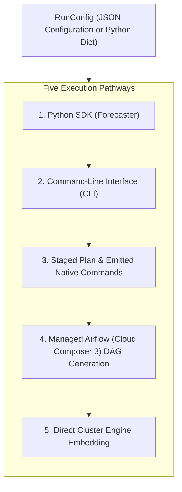
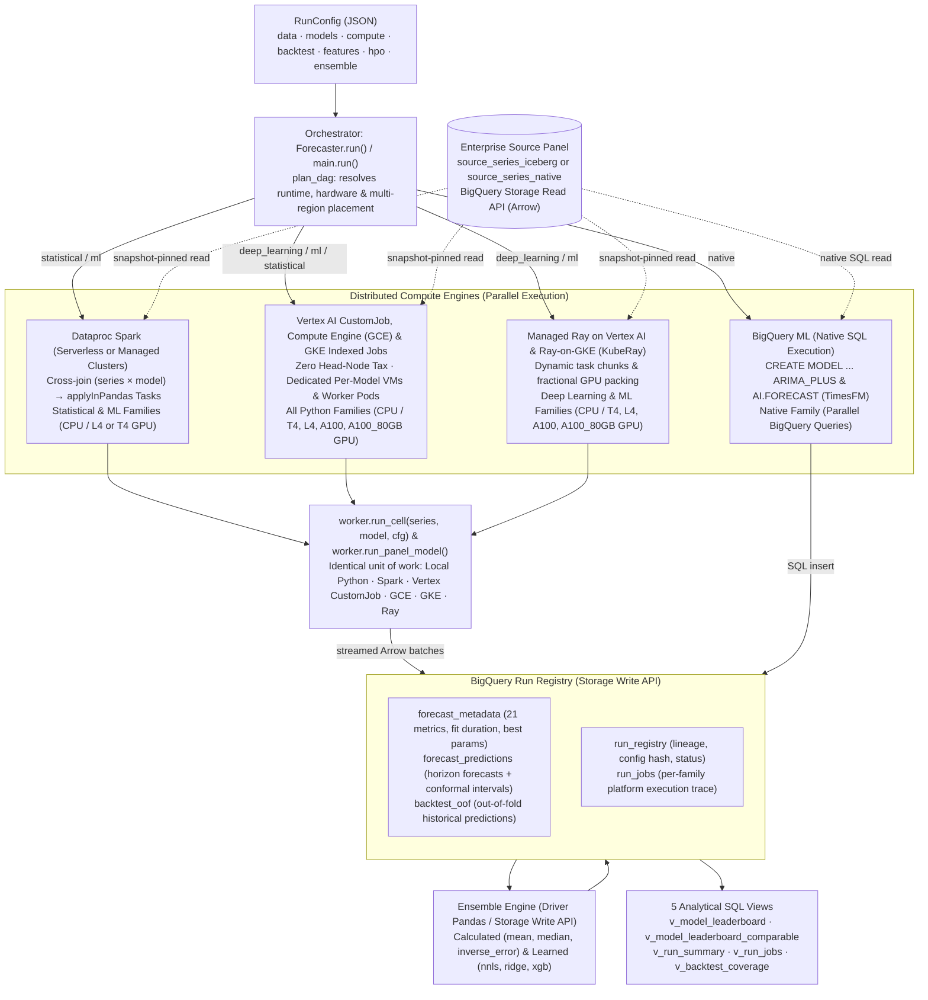
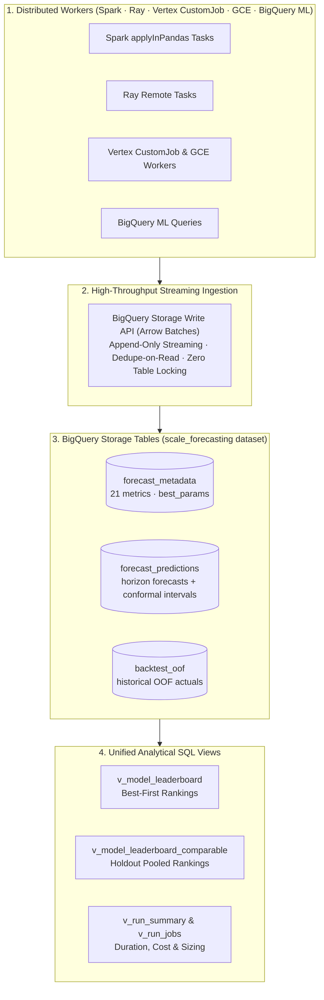
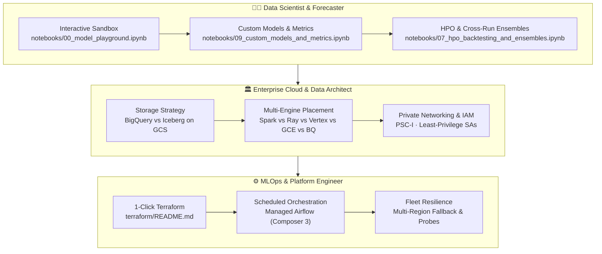
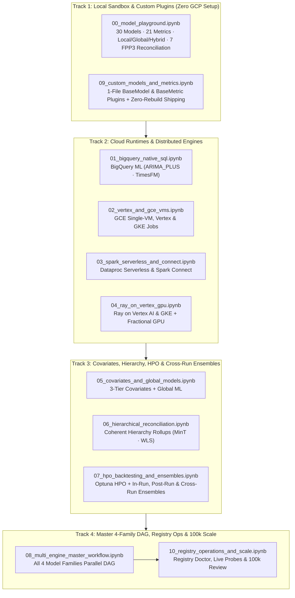
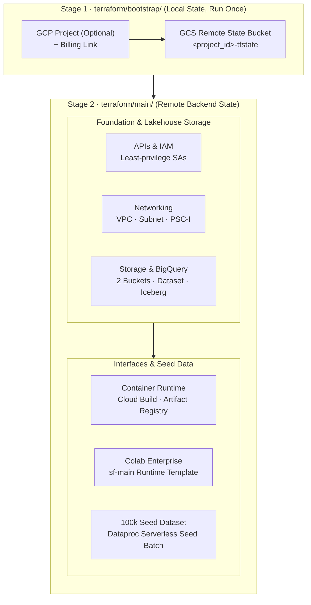

# scale-forecasting

<p align="center">
  <b>Enterprise-Grade, Massively Parallel Time-Series Forecasting on Google Cloud</b><br>
  <i>One declarative JSON configuration. 30 models. 21 evaluation metrics. Hybrid distributed execution across BigQuery ML, Managed Service for Apache Spark (Dataproc), Vertex AI CustomJob (Single-VM & Worker Pools), Compute Engine (Direct Single-VM), Google Kubernetes Engine (GKE Indexed Jobs & Ray-on-GKE), and Gemini Enterprise (Managed Ray on Vertex AI).</i>
</p>

<p align="center">
  <a href="https://console.cloud.google.com/vertex-ai/colab/import/https%3A%2F%2Fraw.githubusercontent.com%2Fstatmike%2Fscale-forecasting%2Fmain%2Fnotebooks%2F00_model_playground.ipynb"></a>
  <a href="https://statmike.github.io/scale-forecasting/"></a>
  <a href="./docs/workshop.md"></a>
  <a href="./terraform/README.md"></a>
</p>

<p align="center">
  <a href="#quickstart-local-in-5-minutes">⚡ Quickstart</a> •
  <a href="#packaged-synthetic-data-generation--scale-seeding">🧬 Synthetic Data</a> •
  <a href="#why-scale-forecasting">💡 Why Scale Forecasting</a> •
  <a href="#the-technology-stack">🛠️ The Stack</a> •
  <a href="#how-runs-work-declarative-json-configurations">⚙️ Configurations</a> •
  <a href="#five-flexible-ways-to-run">🚀 Ways to Run</a> •
  <a href="#hybrid-distributed-execution--the-family-dag">🏛️ Architecture</a> •
  <a href="#model--ensemble-catalog">📊 Models</a> •
  <a href="#evaluation-metrics-catalog">📈 Metrics</a> •
  <a href="#ensemble-stacking-re-ensembling--cross-run-blending">🤝 Ensembles</a> •
  <a href="#the-bigquery-telemetry--collection-system">📡 Telemetry & Views</a> •
  <a href="#operational-lifecycle-diagnostics--surgical-repair">🩺 Operations & Repair</a> •
  <a href="#interactive-notebook-suite">📓 Notebooks</a> •
  <a href="#deploy-on-google-cloud-in-15-minutes">☁️ Deploy on GCP</a>
</p>

---

## What Is `scale-forecasting`?

`scale-forecasting` brings the modeling flexibility of modern time-series ecosystems (Statsmodels, StatsForecast, Prophet, LightGBM, XGBoost, CatBoost, Scikit-learn, SciPy, NeuralProphet, NeuralForecast) to **enterprise Google Cloud scale**. It allows data science and engineering teams to forecast **100,000+ time series** concurrently across `local`, `global`, and `hybrid` panel regimes, leverage three-tier covariates (`static_covariates`, `future_covariates`, `past_covariates`), perform rigorous rolling-origin backtesting across 21 evaluation metrics, reconcile hierarchical forecasts (`bottom_up`, `top_down`, `middle_out`, `ols`, `wls_struct`, `wls_var`, `mint_shrink`), stack models into learned ensembles, and capture complete experiment lineage in BigQuery — all orchestrated from a single JSON configuration.

The entire platform deploys with 1-click Terraform, pre-seeded with a 100,000-series dataset across both native BigQuery and BigLake Apache Iceberg tables on Google Cloud Storage.

---

## Why Scale Forecasting?

Traditional forecasting workflows break down when scaled to hundreds of thousands of series across retail, supply chain, energy, or financial hierarchies:

| Challenge | Traditional Approach | The `scale-forecasting` Solution | Deep Dive |
| :--- | :--- | :--- | :--- |
| **Library Fragmentation** | Separate, incompatible codebases for Statsmodels, StatsForecast, Prophet, PyTorch, and SQL models. | **Unified Model Contract:** Single [`BaseModel`](./src/scale_forecasting/models/base_model.py) interface. 30 models (`local`, `global`, and `hybrid`) run with identical inputs, outputs, and metrics. | [`docs/models_reference.md`](./docs/models_reference.md) |
| **Compute Scaling Limits** | Single-node memory exhaustion (OOMs); slow sequential loops. | **Hybrid Distributed Execution:** Automatic fan-out across Managed Service for Apache Spark (Dataproc Serverless), Vertex AI CustomJob, Compute Engine (`gce`), Google Kubernetes Engine (`gke`), Gemini Enterprise (Managed Ray on Vertex AI), and BigQuery ML. | [`docs/quota_and_scale.md`](./docs/quota_and_scale.md) |
| **Infrastructure Lock-In** | Forced choice between pure Spark or pure SQL. | **Multi-Engine DAG:** Run Spark, Ray, Vertex AI CustomJob, Compute Engine, Google Kubernetes Engine, and BigQuery ML *concurrently under one `run_id`*, bounded by the slowest family rather than their sum. | [`docs/architecture.md`](./docs/architecture.md) |
| **Uncertainty & Calibration** | Gaussian assumptions that fail on real-world skewed distributions. | **Conformal Residual Intervals:** Empirical, distribution-free prediction intervals calibrated against rolling backtest errors. | [`docs/backtesting.md`](./docs/backtesting.md) |
| **Hierarchical Incoherence** | Bottom-level and upper-level forecasts do not add up across regions or categories. | **Coherent Forecast Reconciliation:** Built-in Hyndman FPP3 reconciliation (`bottom_up`, `top_down`, `middle_out`, `ols`, `wls_struct`, `wls_var`, `mint_shrink` with Schäfer-Strimmer shrinkage). | [`docs/api/reconciliation.md`](./docs/api/reconciliation.md) |
| **Operational Opacity** | Disconnected log files and missing evaluation tracking. | **Real-Time BigQuery Registry:** Streaming telemetry via the Storage Write API into analytical SQL views and interactive dashboards. | [`docs/output_schemas.md`](./docs/output_schemas.md) |
| **Brittle Failures** | One failed series fails the entire distributed job. | **Surgical Cell Repair & Probes:** Re-runs only failed cells without recomputing successful ones; reconciles platform state automatically. | [`docs/operations.md`](./docs/operations.md) |

---

## The Technology Stack

`scale-forecasting` integrates best-of-breed open-source forecasting algorithms with Google Cloud's data and AI services:

| Component / Layer | Google Cloud Service & Architecture | Primary Role in Platform | Documentation |
| :--- | :--- | :--- | :--- |
| **Data Warehouse & Lakehouse** | **[BigQuery](https://cloud.google.com/bigquery/docs)** & **[BigLake Apache Iceberg](https://cloud.google.com/bigquery/docs/iceberg-tables)** | Stores input time series, acts as the central run registry (`run_registry`, `forecast_predictions`, `forecast_metadata`), and exposes 5 analytical SQL views. | [BigQuery Overview](https://cloud.google.com/bigquery/docs) |
| **SQL-Native Machine Learning** | **[BigQuery ML](https://cloud.google.com/bigquery/docs/bqml-introduction)** | Executes `ARIMA_PLUS`, `ARIMA_PLUS_XREG`, and zero-shot foundation models via `AI.FORECAST` (`TimesFM`) directly in SQL. | [BigQuery ML Guide](https://cloud.google.com/bigquery/docs/bqml-introduction) |
| **Distributed Big Data Engine** | **[Managed Service for Apache Spark (Dataproc)](https://cloud.google.com/dataproc/docs)** | Executes massively parallel cross-joins and pandas UDFs (`applyInPandas`) on Dataproc Serverless or managed Dataproc clusters (where worker VMs and autoscaling are fully managed by the service). | [Dataproc Serverless Docs](https://cloud.google.com/dataproc-serverless/docs) |
| **Serverless Single-VM & Worker-Pool Compute** | **[Vertex AI Custom Training (`CustomJob`)](https://cloud.google.com/vertex-ai/docs/training/overview)** & **[Compute Engine (`gce`)](https://cloud.google.com/compute/docs)** | Serverless single-VM (`workers=1` or `runtime="gce"`, zero Ray head-node tax) and multi-VM worker pool (`workers>1` + dedicated per-model VMs for `deep_learning` / global models) execution across all Python families (`CPU`, `T4`, `L4`, `A100`, or `A100_80GB` GPU). | [Vertex AI Custom Training](https://cloud.google.com/vertex-ai/docs/training/overview) |
| **Kubernetes Batch & Ray Compute** | **[Google Kubernetes Engine (`GKE`)](https://cloud.google.com/kubernetes-engine/docs)** | Executes Kubernetes `batch/v1` Indexed Jobs (`gke_mode="job"`, zero Ray head-node tax) and multi-node Ray-on-GKE / KubeRay clusters (`gke_mode="ray"` or `ray_mode="gke"`) on standing or ephemeral GKE clusters (`CPU`, `T4`, `L4`, `A100`, `A100_80GB`). | [GKE Overview](https://cloud.google.com/kubernetes-engine/docs) |
| **Distributed AI & Ray Compute** | **[Gemini Enterprise / Vertex AI (Managed Ray)](https://cloud.google.com/vertex-ai/docs/open-source/ray/overview)** | Dynamic autoscaling Ray actor pools with fractional GPU packing (NVIDIA `T4`, `L4`, `A100`, `A100_80GB`) for deep learning models (`NeuralProphet`, `TiDE`, `TFT`, `TSMixer`, `PatchTST`). | [Managed Ray on Vertex AI](https://cloud.google.com/vertex-ai/docs/open-source/ray/overview) |
| **Interactive Analytics** | **[Colab Enterprise](https://cloud.google.com/colab/docs/enterprise-overview)** | Hosted, collaborative Jupyter notebooks pre-wired to the deployment runtime template (`sf-main`) with zero client configuration. | [Colab Enterprise Overview](https://cloud.google.com/colab/docs/enterprise-overview) |
| **Workflow Orchestration** | **[Managed Service for Apache Airflow (Cloud Composer)](https://cloud.google.com/composer/docs)** | Automated end-to-end DAG scheduling, fan-out orchestration across engines, and SLA monitoring. | [Managed Airflow Docs](https://cloud.google.com/composer/docs) |
| **Secure Networking** | **[Virtual Private Cloud (VPC)](https://cloud.google.com/vpc/docs)** & **[Private Service Connect (PSC-I)](https://cloud.google.com/vpc/docs/private-service-connect)** | Private worker subnet, Cloud NAT for outbound dependency resolution, and PSC interface attachments for secure Ray cluster access. | [Private Service Connect](https://cloud.google.com/vpc/docs/private-service-connect) |
| **Infrastructure as Code** | **[Terraform (Google Provider)](https://registry.terraform.io/providers/hashicorp/google/latest/docs)** | 1-click automated deployment of all buckets, datasets, networking, service accounts, and seed datasets. | [Terraform Provider](https://registry.terraform.io/providers/hashicorp/google/latest/docs) |

---

## Quickstart (Local in 5 Minutes)

Experiment locally with zero cloud setup, zero credentials, and zero compute costs.

```bash
# 1. Clone the repository and install dependencies with uv
git clone https://github.com/statmike/scale-forecasting.git && cd scale-forecasting
uv sync

# 2. Explore available models and fit your first forecast
uv run python -m scale_forecasting.playground --list
uv run python -m scale_forecasting.playground --model theta --backtest --horizon 14
```

### Python SDK Quickstart

The high-level [`Forecaster`](./docs/using_the_sdk.md) SDK unifies validation, execution, and review:

```python
import scale_forecasting as sf

# 1. Initialize from a declarative config file or dictionary
forecaster = sf.Forecaster.from_file("configs/ensemble_demo.json")

# 2. Preflight validation & cost sizing (offline, zero GCP calls)
dry_run = forecaster.dry_run()
print(f"Planned Run ID : {dry_run.run_id}")
print(
    f"Total Fits     : {dry_run.fanout.n_series} series × {len(dry_run.python_models) + len(dry_run.bq_models)} models"
)

# 3. Execute locally or across Google Cloud (Spark, Ray, BigQuery ML)
result = forecaster.run()

# 4. Interactive review: leaderboard, quantile distributions, and ensemble lift
review = sf.review_run(result.run_id)
sf.plot_leaderboard(review)
```

---

## Packaged Synthetic Data Generation & Scale Seeding

To make benchmarking, smoke testing, and model development reproducible without external data dependencies, `scale-forecasting` includes **one unified, deterministic synthetic data generator** ([`scale_forecasting.data_gen`](./src/scale_forecasting/data_gen/README.md)) with **dual capability**: it generates clean **univariate** panels by default and seamlessly expands to **three-tier covariates + hierarchical dimensions** when requested.

### Approach & Methodology: Five Archetypes That Stress-Test Every Capability

Every series $i$ (`s_000000` $\dots$ `s_099999`) is synthesized from interpretable components — `baseline + linear drift + sub-annual & annual harmonics + country holiday bumps + AR(1) colored noise (+ optional exogenous drivers)` — and assigned deterministically (`i % 5`) to one of five archetypes so different model families excel on different slices of the fleet:

| Archetype | Signal Profile | What It Stress-Tests Across the Platform |
| :--- | :--- | :--- |
| **`smooth_seasonal`** | High weekly & annual amplitude, low AR(1) noise ($\rho \in [0.1, 0.4]$). | Harmonic & state-space models (`theta`, `auto_theta`, `holtwinters`, `autoets`, `auto_ces`, `tbats`, `fft`). |
| **`intermittent`** | Low baseline with **60% zero-inflation** (`zero_inflation=0.6`). | Intermittent forecasters (`croston`), zero-safe metrics (`wape`, `maape`, `mase`, `rmsse`), and Box-Cox positivity guards. |
| **`trending`** | Strong drift (`+60%` to `+180%`) and **15% structural level-shift probability**. | Trend extrapolators (`naive_drift`, `kalman`, `ucm`) and structural regime indicators (`features.level_shift`). |
| **`promo_spiky`** | Seasonal baseline punctuated by **2.5×–6.0× promotional spikes** and holiday lifts. | Gradient-boosted trees (`xgboost`, `lightgbm`, `catboost`, `random_forest`) and exogenous regressors (`sarimax`, `prophet`, `arima_plus`). |
| **`noisy`** | High AR(1) persistence ($\rho \in [0.5, 0.85]$) and wide innovation variance. | Global & hybrid deep learning (`tide`, `tft`, `tsmixer`, `patchtst`, `neuralprophet`), conformal interval calibration, and stacked ensembles (`nnls`, `ridge`, `xgb`). |

### One Generator, Dual Capability (Univariate Default + 3-Tier Covariates & Hierarchy)

- **Univariate Mode (`with_exog=False, with_hierarchy=False` — Default):**
  Produces the 5-column panel (`ts_id, ds, y, archetype, is_holiday`) stored in `source_series_iceberg` and `source_series_native`.
- **Multivariate + Hierarchy Mode (`with_exog=True, with_hierarchy=True` / `--include-covariates`):**
  Uses the **exact same generator** (drawing weather noise from an isolated child RNG stream `[master_seed, i, 1]` so baseline draws never shift) to emit a 10-column panel stored in `source_series_covariates_iceberg` and `source_series_covariates_native` where **all three covariate tiers inject realistic causal signal into `y`**:
  - **Static covariates & 3-level hierarchy (`static_covariates` / `hierarchy.levels`):** `region` (`NA`, `EMEA`, `APAC`, `LATAM`) and `category` (`enterprise`, `SMB`, `consumer`) $\rightarrow$ `1` total node + `4` regions + `12` `region × category` nodes + $N$ bottom series. Injects region-specific baseline level & seasonal modulation plus category-specific trend drift and promotional elasticity (`consumer` responds $4\times$ stronger to promotions than `enterprise`).
  - **Known-future covariates (`future_covariates`):** `is_holiday` (country calendar bumps), `promo_flag` (deterministic 0/1 promotional calendar lifts), and `price_index` (smooth quarterly price index with elasticity response).
  - **Historical-only covariates (`past_covariates`):** `temperature` (annual cycle + AR(1) weather innovations) with contemporaneous + lag-1 + lag-season carry-over into `y` so lookahead-safe `exog_lags` carry genuine predictive signal into the forecast horizon.

### Partition-Invariant Scale: 3 Series in Memory $\rightarrow$ 100,000+ Series on Spark

Each series is seeded exclusively by `(master_seed, series_index)` via `np.random.default_rng([master_seed, i])`. This guarantees the **partition-union invariant**:
- Generating series `s_000007` alone in a unit test produces the **exact same floating-point values** as generating it across 512 Spark executor partitions in a 100,000-series Dataproc Serverless job.
- Setting `data.series_limit: 100` on a 100,000-series BigQuery table reads the exact same 100 series as `generate_panel(100, ...)`.
- Both **Native BigQuery** and **BigLake Apache Iceberg** tables are populated from a single cached Spark DataFrame pass, guaranteeing byte-identical data across storage formats.

### How to Generate & Seed Data

```python
from scale_forecasting import playground
from scale_forecasting.data_gen.generator import GenConfig, generate_panel

# 1. Local in-memory sample (univariate or with 3-tier covariates + hierarchy)
df_uni = playground.sample_data(n_series=3, history=730)
df_cov = playground.sample_data(n_series=12, history=730, with_exog=True, with_hierarchy=True)

# 2. Direct generator API (any series count, frequency 'D'/'W'/'MS'/'h', or country calendar)
cfg = GenConfig(history=1460, freq="D", holidays=("US",), with_exog=True, with_hierarchy=True)
panel = generate_panel(100, cfg, seed=20260726)
```

```bash
# 3. Fast driver-side seed to BigQuery & Iceberg (e.g. 100-series covariate + hierarchy smoke tables)
uv run python -m scale_forecasting.data_gen.seed_spark \
  --n-series 100 --include-covariates --driver-load

# 4. Distributed PySpark seed (e.g. 100,000 series across Dataproc Serverless executors)
uv run python -m scale_forecasting.data_gen.seed_spark \
  --n-series 100000 --variant both
```

➡️ **Full generator architecture and seeding guide: [`src/scale_forecasting/data_gen/README.md`](./src/scale_forecasting/data_gen/README.md) • API Reference: [`docs/api/data_gen.md`](./docs/api/data_gen.md).**

---

## How Runs Work: Declarative JSON Configurations

In `scale-forecasting`, **a single declarative JSON file defines the entire experiment**. The configuration specifies which data to read, which models to fit, how to route each model family across cloud engines, how to backtest and calibrate prediction intervals, and how to combine forecasts with stacked ensembles.

Every configuration automatically receives a deterministic, content-addressed `<slug>-<12hex>` **`run_id`** calculated from its contents, guaranteeing complete provenance and idempotent re-runs.

### Example Configuration: Hybrid Multi-Engine Forecasting

Here is an example configuration ([`configs/ensemble_demo.json`](./configs/ensemble_demo.json)) that mixes statistical models on Spark with SQL models in BigQuery and trains a stacked ensemble:

```json
{
  "run_name": "hybrid_stacked_ensemble",
  "data": {
    "source_table": "source_series_iceberg",
    "series_limit": 100,
    "horizon": 14
  },
  "models": [
    "theta",
    "holtwinters",
    "xgboost",
    "arima_plus"
  ],
  "compute": {
    "families": {
      "statistical": {"runtime": "spark"},
      "ml": {"runtime": "spark"}
    }
  },
  "backtest": {
    "enabled": true,
    "scheme": "expanding",
    "n_folds": 3,
    "decision_metric": "wape"
  },
  "ensemble": {
    "enabled": true,
    "strategies": ["mean", "inverse_error", "nnls", "xgb"]
  }
}
```

### What Each Section Controls
- **`data`:** Target table (BigLake Iceberg or native BigQuery), series count limit, target column, date column, frequency, and forecast horizon.
- **`models`:** List of model identifiers to run. Models are automatically grouped into execution families (`statistical`, `ml`, `deep_learning`, `native`).
- **`compute`:** Runtime engine selection per family (`spark`, `ray`, `vertex`, `gce`, `gke`, `bigquery`), execution modes (`spark_mode`, `gke_mode`, `ray_mode`), machine types, executor/worker counts, and multi-region fallback options.
- **`backtest`:** Cross-validation scheme (`expanding`, `sliding`), fold counts, evaluation metric selection, and conformal interval calibration.
- **`features`:** Automated country holidays, Fourier seasonality terms, structural level-shift detection, three-tier covariates (`static_covariates`, `future_covariates`, `past_covariates`), and exogenous covariate lags.
- **`hpo`:** Optuna hyperparameter optimization settings (trial counts, search spaces, and fleet-wide vs. per-series tuning).
- **`ensemble`:** Blending strategies (`mean`, `median`, `inverse_error`, `nnls`, `ridge`, `xgb`) and execution trigger (`barrier` or `microbatch`).
- **`hierarchy`:** Bottom-up hierarchical/grouped aggregation (`levels`) and coherent forecast reconciliation (`bottom_up`, `top_down`, `middle_out`, `ols`, `wls_struct`, `wls_var`, `mint_shrink`).

➡️ **Full documentation of every field, rule, and default: [Configuration Reference Guide (`docs/configuration_reference.md`)](./docs/configuration_reference.md).**

---

## Five Flexible Ways to Run

`scale-forecasting` adapts to your development, testing, and production operational environments:


```mermaid
flowchart TD
    cfg["RunConfig (JSON Configuration or Python Dict)"]

    subgraph Entrypoints["Five Execution Pathways"]
        direction TB
        E1["1. Python SDK (Forecaster)"]
        E2["2. Command-Line Interface (CLI)"]
        E3["3. Staged Plan & Emitted Native Commands"]
        E4["4. Managed Airflow (Cloud Composer 3) DAG Generation"]
        E5["5. Direct Cluster Engine Embedding"]
        E1 --> E2 --> E3 --> E4 --> E5
    end

    cfg --> Entrypoints
```

1. **Python SDK (`Forecaster`):** Thin, high-level facade for interactive notebooks (Colab Enterprise) and custom Python applications. Handles dry runs, feasibility checks, live progress monitoring, and post-run evaluation.
2. **Command-Line Interface (CLI):** Full-featured CLI for CI/CD runners, terminal execution, and automation scripts:
   ```bash
   uv run python -m scale_forecasting.main --config configs/ensemble_demo.json
   ```
3. **Staged Plan & Emitted Native Commands (`launch_plan.stage_run`):** Stages application code (`src/`) and configuration to Cloud Storage, files an `EMITTED` registry tracking row, and **prints native copy-pasteable platform CLI commands** (`gcloud dataproc batches submit`, `gcloud ai custom-jobs create`, `gcloud compute instances create`, `kubectl apply -f`, `bq query`, `ray job submit`). Enables zero-dependency launches from bare shells.
4. **Automated Apache Airflow DAG Generation (`--emit-airflow`):** Compiles your JSON config into a production-ready, self-contained Python Apache Airflow DAG file with parallel operators for Dataproc, Vertex AI CustomJob, GKE, Ray, and BigQuery ML, ready to drop into Cloud Composer 3.
5. **Direct Cluster Embedding:** Already running a PySpark or Ray cluster? Embed the exact same model machinery directly into your existing pipelines using `make_group_runner` (for Spark `applyInPandas`) or `make_chunk_runner` (for Ray actor pools).

➡️ **Learn more about execution surfaces: [Using the SDK (`docs/using_the_sdk.md`)](./docs/using_the_sdk.md) and [Running & Reviewing (`docs/running_and_reviewing.md`)](./docs/running_and_reviewing.md).**

---

## Hybrid Distributed Execution & The Family DAG

When a run is submitted, the orchestrator compiles your configuration into an **execution DAG**: models are grouped into up to four distinct families, each dispatched to its optimal compute engine in parallel. Total wall-clock time is bounded by the slowest family, not their sum.


```mermaid
flowchart TB
    cfg["RunConfig (JSON)<br/>data · models · compute · backtest · features · hpo · ensemble"]
    orch["Orchestrator: Forecaster.run() / main.run()<br/>plan_dag: resolves runtime, hardware & multi-region placement"]
    cfg --> orch

    subgraph compute["Distributed Compute Engines (Parallel Execution)"]
        spark["Dataproc Spark (Serverless or Managed Clusters)<br/>Cross-join (series × model) → applyInPandas Tasks<br/>Statistical & ML Families (CPU / L4 or T4 GPU)"]
        vertex["Vertex AI CustomJob, Compute Engine (GCE) & GKE Indexed Jobs<br/>Zero Head-Node Tax · Dedicated Per-Model VMs & Worker Pods<br/>All Python Families (CPU / T4, L4, A100, A100_80GB GPU)"]
        ray["Managed Ray on Vertex AI & Ray-on-GKE (KubeRay)<br/>Dynamic task chunks & fractional GPU packing<br/>Deep Learning & ML Families (CPU / T4, L4, A100, A100_80GB GPU)"]
        bq["BigQuery ML (Native SQL Execution)<br/>CREATE MODEL ... ARIMA_PLUS & AI.FORECAST (TimesFM)<br/>Native Family (Parallel BigQuery Queries)"]
    end

    orch -->|"statistical / ml"| spark
    orch -->|"deep_learning / ml / statistical"| vertex
    orch -->|"deep_learning / ml"| ray
    orch -->|"native"| bq

    unit["worker.run_cell(series, model, cfg) & worker.run_panel_model()<br/>Identical unit of work: Local Python · Spark · Vertex CustomJob · GCE · GKE · Ray"]
    spark --> unit
    vertex --> unit
    ray --> unit

    source[("Enterprise Source Panel<br/>source_series_iceberg or source_series_native<br/>BigQuery Storage Read API (Arrow)")]
    source -.->|snapshot-pinned read| spark
    source -.->|snapshot-pinned read| vertex
    source -.->|snapshot-pinned read| ray
    source -.->|native SQL read| bq

    subgraph registry["BigQuery Run Registry (Storage Write API)"]
        direction TB
        r_meta["forecast_metadata (21 metrics, fit duration, best params)<br/>forecast_predictions (horizon forecasts + conformal intervals)<br/>backtest_oof (out-of-fold historical predictions)"]
        r_trace["run_registry (lineage, config hash, status)<br/>run_jobs (per-family platform execution trace)"]
    end

    unit -->|streamed Arrow batches| registry
    bq -->|SQL insert| registry

    ens["Ensemble Engine (Driver Pandas / Storage Write API)<br/>Calculated (mean, median, inverse_error) & Learned (nnls, ridge, xgb)"]
    registry --> ens
    ens --> registry

    views["5 Analytical SQL Views<br/>v_model_leaderboard · v_model_leaderboard_comparable<br/>v_run_summary · v_run_jobs · v_backtest_coverage"]
    registry --> views
```

### Automated Sizing & Fleet Resource Planning: How It Estimates Your Clusters

`scale-forecasting` includes an automated resource planning engine ([`scale_forecasting.resources`](./docs/api/resources.md)) that analyzes workload requirements and dynamically sizes distributed compute before launching:

- **Estimating Dataproc Spark Executors:**
  - Evaluates total fan-out ($N_{\text{series}} \times M_{\text{models}}$) and empirical per-cell memory footprints.
  - Automatically derives optimal `initialExecutors` and `maxExecutors` (e.g. ramping from baseline up to 20+ executors for 100k series).
  - Derives `spark.executor.cores` and `spark.executor.memory` alongside `spark.executor.memoryOverhead` to avoid Spark executor Out-Of-Memory (OOM) failures while preventing over-provisioning.
  - On GPU runs (Dataproc Serverless L4), dynamically derives fractional GPU shares (`1 / spark.executor.cores`) and automatically releases the RAPIDS SQL memory pool (`pool=NONE`) so PySpark Python worker fits have full access to GPU memory.
- **Estimating Vertex AI CustomJob, Compute Engine (GCE) & GKE Indexed Job Worker Pools:**
  - **Dedicated Per-Model VMs/Pods & Independent GPU Node Scale-Down:** Automatically assigns 1 dedicated VM or GKE Pod per model (`effective_worker_count = max(requested_workers, len(models))`) when multiple `deep_learning` or global/hybrid models run in one job, eliminating cross-model GPU/RAM contention while avoiding Ray head-node overhead. On GKE Indexed Jobs (`gke_mode="job"`), each orchestrated pod exits independently as soon as its assigned model finishes (`_should_use_worker_barrier` skips the rank-0 barrier when `manage_header=False`), allowing the GKE Cluster Autoscaler (`minNodeCount=1, maxNodeCount=workers`) to scale down completed GPU nodes while slower models finish.
  - **Shared `ThreadPoolExecutor`, Contiguous Storage Read Pushdown & LPT Ordering (`statistical` / `ml`):** Derives `UnitShape` (`n2-standard-8`, `g2-standard-*`, `n1-standard-*`, `a2-*`) and `ResourceSlot` from `ComputeProfile` priors or preflight calibration to bound `ThreadPoolExecutor(max_workers=slots_per_unit)` and intra-op thread env vars (`OMP_NUM_THREADS`, `MKL_NUM_THREADS`, `OPENBLAS_NUM_THREADS`). Pushes a contiguous `[ts_lo, ts_hi]` Storage Read API filter down to each worker (`hierarchy.enabled=False`), dispatches cells in **Longest-Processing-Time-First (LPT)** order by `BASELINE_PROFILES` p90 wall-time to prevent tail stragglers, and coordinates multi-worker completion via a GCS barrier (`SF_VERTEX_JOB_ID`).
  - **Triple-Redundant Zero-Orphan GCE & Shared/Ephemeral GKE Lifecycle:** For `runtime="gce"`, enforces GCE hypervisor `maxRunDuration` with `instanceTerminationAction="DELETE"`, guest COS startup script `trap cleanup EXIT` self-deletion via the GCE REST API + `shutdown -h now`, and client-side `try ... finally` deletion. For `runtime="gke"`, provisions a single shared cluster across active families (`shared_clusters.py`) or reuses a standing cluster (`compute.gke_cluster_name` / `SF_GKE_CLUSTER`) with per-family CPU/GPU node pools torn down deterministically in `try ... finally`.
- **Estimating Gemini Enterprise (Managed Ray) & Ray-on-GKE Worker Pools:**
  - Automatically sizes Ray worker pools (`ray_mode="vertex"` or `ray_mode="gke"` / `gke_mode="ray"`): derives `min_nodes` and `max_nodes` based on total task fan-out and per-node packing limits.
  - Derives node packaging density: clamps maximum per-task memory ask to 85% of schedulable node RAM (`_MAX_SLOT_MEMORY_FRACTION`), preventing tasks from starvation against Ray's internal plasma object store.
  - Calibrates fractional GPU packing (`gpu_fraction`): dynamically calculates how many concurrent deep learning fits (`neuralprophet`) can fit onto an NVIDIA L4 or T4 card (~0.125 share per fit), ensuring high GPU saturation without thrashing.
- **Offline Sizing & Feasibility Checks Ahead of Time:**
  - **Dry Run Estimation (`--dry-run`):** Run `uv run python -m scale_forecasting.main --config <file> --dry-run` or `forecaster.dry_run()` to preview the planned execution DAG, deterministic `run_id`, series count, and estimated fit fan-out without touching any cloud resources or incurring costs.
  - **Feasibility & Quota Analysis (`--feasibility`):** Run with `--feasibility` or `forecaster.feasibility()` to query the live BigQuery source panel: computes exact series lengths, cost multipliers, fold-coverage histograms, and verifies that series meet minimum training thresholds.
  - **Quota Preflight & Resilience:** Pre-flight checks regional Compute Engine vCPU and Vertex AI GPU quota limits; if capacity is constrained, the multi-region fallback automatically hops across candidate regions (`us-central1` $\rightarrow$ `us-east4` $\rightarrow$ `us-west1`) without failing the run.

➡️ **Full 6-runtime comparison & 4-tier scaling guide: [Compute Runtimes & Scaling Reference (`docs/runtimes_reference.md`)](./docs/runtimes_reference.md) • Detailed sizing arithmetic and 100k scale benchmarks: [Quota, Sizing & Scale Guide (`docs/quota_and_scale.md`)](./docs/quota_and_scale.md).**

---

## Model & Ensemble Catalog

Every model lives in its own self-contained file under [`src/scale_forecasting/models/`](./src/scale_forecasting/models/README.md) and imports directly from its upstream origin package. **All 30 models support univariate forecasting (`Yes`)**; when covariates are configured in a mixed-model run, models that do not support a requested covariate tier automatically fall back to their supported feature subset (`features.on_unsupported_covariates: "fallback"` by default, or fail fast under `"error"`).

| Model | Family | Runtime | Upstream Package | Univariate | Covariates (`Future` / `Past` / `Static`) | Training Modes | Reconciliation | Capabilities & Methodology |
| :--- | :--- | :--- | :--- | :---: | :---: | :---: | :---: | :--- |
| **`naive_mean`** | `statistical` | Spark / Ray / Vertex / GCE / GKE | [`numpy`](https://numpy.org/) | Yes | No / No / No | `local` | All 7 FPP3 | Historical mean baseline with empirical residual intervals. |
| **`naive_seasonal`** | `statistical` | Spark / Ray / Vertex / GCE / GKE | [`numpy`](https://numpy.org/) | Yes | No / No / No | `local` | All 7 FPP3 | Repeats historical seasonal cycles (weekly/monthly/annual). |
| **`naive_drift`** | `statistical` | Spark / Ray / Vertex / GCE / GKE | [`numpy`](https://numpy.org/) | Yes | No / No / No | `local` | All 7 FPP3 | Linear drift extrapolation between first and last observations. |
| **`naive_moving_average`** | `statistical` | Spark / Ray / Vertex / GCE / GKE | [`numpy`](https://numpy.org/) | Yes | No / No / No | `local` | All 7 FPP3 | Trailing moving average with tunable window lengths. |
| **`croston`** | `statistical` | Spark / Ray / Vertex / GCE / GKE | [`numpy`](https://numpy.org/) | Yes | No / No / No | `local` | All 7 FPP3 | Intermittent-demand forecaster (`classic`, `sba`, `tsb`) for sparse data. |
| **`fft`** | `statistical` | Spark / Ray / Vertex / GCE / GKE | [`scipy`](https://scipy.org/) | Yes | No / No / No | `local` | All 7 FPP3 | Discrete Fourier Transform spectral extrapolation with polynomial detrending. |
| **`theta`** | `statistical` | Spark / Ray / Vertex / GCE / GKE | [`statsmodels`](https://www.statsmodels.org/) | Yes | No / No / No | `local` | All 7 FPP3 | Assimakopoulos-Nikolopoulos Theta decomposition (`ThetaModel`). |
| **`auto_theta`** | `statistical` | Spark / Ray / Vertex / GCE / GKE | [`statsforecast`](https://nixtlaverse.nixtla.io/statsforecast/) | Yes | No / No / No | `local` | All 7 FPP3 | Automated Theta selection across Standard, Optimized (`OTM`), and Dynamic (`DSTM`, `DOTM`) variants. |
| **`holtwinters`** | `statistical` | Spark / Ray / Vertex / GCE / GKE | [`statsmodels`](https://www.statsmodels.org/) | Yes | No / No / No | `local` | All 7 FPP3 | Additive Holt-Winters seasonal exponential smoothing with damped trend option. |
| **`autoets`** | `statistical` | Spark / Ray / Vertex / GCE / GKE | [`statsmodels`](https://www.statsmodels.org/) | Yes | No / No / No | `local` | All 7 FPP3 | Automated Error-Trend-Seasonal state-space model (`ETSModel`) with analytical intervals. |
| **`auto_ces`** | `statistical` | Spark / Ray / Vertex / GCE / GKE | [`statsforecast`](https://nixtlaverse.nixtla.io/statsforecast/) | Yes | No / No / No | `local` | All 7 FPP3 | Automated Complex Exponential Smoothing (`AutoCES`) across `"N"`, `"S"`, `"P"`, and `"F"` seasonality. |
| **`tbats`** | `statistical` | Spark / Ray / Vertex / GCE / GKE | [`statsforecast`](https://nixtlaverse.nixtla.io/statsforecast/) | Yes | No / No / No | `local` | All 7 FPP3 | Trigonometric seasonality, Box-Cox transform, ARMA errors, Trend, and Seasonal components (`AutoTBATS`). |
| **`stl_bagging`** | `statistical` | Spark / Ray / Vertex / GCE / GKE | [`statsmodels`](https://www.statsmodels.org/) | Yes | No / No / No | `local` | All 7 FPP3 | Bergmeir-Hyndman-Benítez STL decomposition with block-bootstrapped bagged ETS ensembles. |
| **`auto_arima`** | `statistical` | Spark / Ray / Vertex / GCE / GKE | [`statsforecast`](https://nixtlaverse.nixtla.io/statsforecast/) | Yes | Yes / Yes / No | `local` | All 7 FPP3 | Hyndman-Khandakar automatic stepwise AICc seasonal ARIMA (`AutoARIMA`) with exogenous covariates. |
| **`sarimax`** | `statistical` | Spark / Ray / Vertex / GCE / GKE | [`statsmodels`](https://www.statsmodels.org/) | Yes | Yes / Yes / No | `local` | All 7 FPP3 | Seasonal ARIMA (`SARIMAX`) with exogenous calendar & economic covariates. |
| **`ucm`** | `statistical` | Spark / Ray / Vertex / GCE / GKE | [`statsmodels`](https://www.statsmodels.org/) | Yes | Yes / Yes / No | `local` | All 7 FPP3 | Structural Unobserved Components state-space model (`UnobservedComponents`) with exogenous covariates. |
| **`kalman`** | `statistical` | Spark / Ray / Vertex / GCE / GKE | [`statsmodels`](https://www.statsmodels.org/) | Yes | Yes / Yes / No | `local` | All 7 FPP3 | Linear Gaussian state-space Kalman filter (`UnobservedComponents`) with seasonal harmonics and AR($p$) state. |
| **`prophet`** | `statistical` | Spark / Ray / Vertex / GCE / GKE | [`prophet`](https://facebook.github.io/prophet/) | Yes | Yes / Yes / No | `local` | All 7 FPP3 | Piecewise trend, multi-period Fourier seasonality, holidays, and exogenous covariates. |
| **`regression_lags`** | `ml` | Spark / Ray / Vertex / GCE / GKE | [`scikit-learn`](https://scikit-learn.org/) | Yes | Yes / Yes / No | `local` | All 7 FPP3 | L2-regularized `Ridge` regression with recursive target lags, calendar features, and `exog`. |
| **`random_forest`** | `ml` | Spark / Ray / Vertex / GCE / GKE | [`scikit-learn`](https://scikit-learn.org/) | Yes | Yes / Yes / No | `local` | All 7 FPP3 | Bagged decision tree ensemble (`RandomForestRegressor`) with recursive multi-step forecasting. |
| **`lightgbm`** | `ml` | Spark / Ray / Vertex / GCE / GKE | [`lightgbm`](https://lightgbm.readthedocs.io/) | Yes | Yes / Yes / No | `local` | All 7 FPP3 | Gradient-boosted decision trees (`LGBMRegressor`) with recursive multi-step forecasting. |
| **`xgboost`** | `ml` | Spark / Ray / Vertex / GCE / GKE | [`xgboost`](https://xgboost.readthedocs.io/) | Yes | Yes / Yes / No | `local` | All 7 FPP3 | Histogram gradient-boosted trees (`XGBRegressor`) on CPU or GPU (`device="cuda"`). |
| **`catboost`** | `ml` | Spark / Ray / Vertex / GCE / GKE | [`catboost`](https://catboost.ai/) | Yes | Yes / Yes / No | `local` | All 7 FPP3 | Oblivious (symmetric) gradient-boosted trees (`CatBoostRegressor`) with recursive multi-step forecasting. |
| **`neuralprophet`** | `deep_learning` | Spark / Ray / Vertex / GCE / GKE | [`neuralprophet`](https://neuralprophet.com/) | Yes | No / No / No | `local`, `global`, `hybrid` | All 7 FPP3 + Global Panel | PyTorch AR-Net (`local`, `global`, or `hybrid` local-trend + global-seasonality mode) with quantile heads. |
| **`tide`** | `deep_learning` | Spark / Ray / Vertex / GCE / GKE | [`neuralforecast`](https://nixtlaverse.nixtla.io/neuralforecast/) | Yes | Yes / Yes / Yes | `local`, `global` | All 7 FPP3 + Global Panel | Google Research Time-series Dense Encoder (`TiDE`) with static, future, and past covariates. |
| **`tft`** | `deep_learning` | Spark / Ray / Vertex / GCE / GKE | [`neuralforecast`](https://nixtlaverse.nixtla.io/neuralforecast/) | Yes | Yes / Yes / Yes | `local`, `global` | All 7 FPP3 + Global Panel | Google Research Temporal Fusion Transformer (`TFT`) with variable selection and multi-head attention. |
| **`tsmixer`** | `deep_learning` | Spark / Ray / Vertex / GCE / GKE | [`neuralforecast`](https://nixtlaverse.nixtla.io/neuralforecast/) | Yes | Yes / Yes / Yes | `local`, `global` | All 7 FPP3 + Global Panel | Google Research All-MLP time- and feature-mixing architecture (`TSMixerx`) with three-tier covariates. |
| **`patchtst`** | `deep_learning` | Spark / Ray / Vertex / GCE / GKE | [`neuralforecast`](https://nixtlaverse.nixtla.io/neuralforecast/) | Yes | No / No / No | `local`, `global` | All 7 FPP3 + Global Panel | Subseries-patched channel-independent Transformer (`PatchTST`) with MultiQuantile loss. |
| **`arima_plus`** | `native` | BigQuery ML | [`bigquery-ml`](https://cloud.google.com/bigquery/docs/bqml-introduction) | Yes | No / No / No | `local` | N/A (SQL) | Pure BigQuery SQL: automated `ARIMA_PLUS` / `ARIMA_PLUS_XREG` pipeline with custom country holiday CTEs. |
| **`timesfm`** | `native` | BigQuery ML | [`bigquery-ml`](https://cloud.google.com/bigquery/docs/bqml-introduction) | Yes | No / No / No | `local` (zero-shot) | N/A (SQL) | Zero-shot foundation-model forecasting via BigQuery `AI.FORECAST` (`TimesFM 2.0`, `TimesFM 2.5` default, or `TimesFM 3.0` + configurable `context_window`). |

### Environment Agility: Omitting Optional Model Packages

All third-party model libraries are imported **lazily inside `fit()`**. If your enterprise environment restricts or omits specific packages (such as `catboost` or `neuralprophet`), the platform still imports cleanly and runs every other model:
- **Granular Installation Extras:** Install everything with `scale-forecasting[models]`, or choose individual family subsets (`scale-forecasting[models-stats]`, `models-trees`, `models-prophet`, `models-dl`).
- **Automatic Filtering:** Inspect installed models via `uv run python -m scale_forecasting.playground --list` or `sf.list_models(available_only=True)`, and pass `--ignore-unavailable-models` to `scale_forecasting.main` to skip any un-installed models in a shared configuration automatically.

### Adding a Custom Model in 1 File (Zero Image Rebuilds)

The platform is designed for rapid extension by data scientists:
- **Zero Container Image Rebuilds:** Third-party dependencies are pre-compiled into the container image (`docker/requirements.txt`). Your Python code in `src/scale_forecasting` is zipped and shipped dynamically at job submission time. Any code edit, new model, or new metric takes effect immediately on the very next run without rebuilding a Docker image!
- **Lightweight Model Contract:** Implement [`BaseModel`](./src/scale_forecasting/models/base_model.py) with `fit(y, X)` and `predict(horizon, X, quantiles)`.
- **1-File Workflow:**
  1. Copy [`docs/model_template.py`](./docs/model_template.py) to `src/scale_forecasting/models/my_custom_model.py`.
  2. Implement your training and forecasting logic using any library (Scikit-learn, StatsForecast, PyTorch, etc.).
  3. Export the class in `src/scale_forecasting/models/__init__.py`.
  4. The model is instantly available in the CLI, Python SDK, interactive notebooks, and JSON configurations on the very next run!

➡️ **Full model & hyperparameter guide: [Models & Ensembles Reference (`docs/models_reference.md`)](./docs/models_reference.md) • Custom models: [Adding a Model Guide (`docs/adding_a_model.md`)](./docs/adding_a_model.md).**

---

## Hierarchical Forecasting & Coherent Reconciliation

When `hierarchy.enabled: true`, the platform constructs a multi-level aggregation tree from `hierarchy.levels` (e.g. `[["region"], ["region", "category"]]` $\rightarrow$ `"__total__"` root + `region=NA` + `region=NA/category=SMB` + bottom `ts_id` leaves), fits models across all nodes, and reconciles base forecasts $\hat{y_h}$ into strictly coherent forecasts $\tilde{y_h} = S G \hat{y_h}$ ([`reconciliation.py`](./src/scale_forecasting/reconciliation.py)) following [Hyndman & Athanasopoulos (*Forecasting: Principles and Practice*, 3rd ed., Ch. 11)](https://otexts.com/fpp3/hierarchical.html) and [Wickramasuriya et al. (2019) *MinT*](https://doi.org/10.1080/01621459.2018.1448825):

| Method (`hierarchy.reconciliation_methods`) | Matrix Projection $G$ / Covariance $W_h$ | How It Works |
| :--- | :--- | :--- |
| **`mint_shrink`** *(default)* | $W_h = \lambda_D W_{1,D} + (1 - \lambda_D) W_1$ | Minimum Trace optimal reconciliation with analytical [Schäfer-Strimmer (2005)](https://doi.org/10.2202/1544-6115.1175) shrinkage covariance of OOF residuals; positive-definite even when $n_{\text{series}} \gg T_{\text{obs}}$. |
| **`wls_var`** | $W_h = \text{diag}(W_1)$ | Weighted least squares scaled by per-node OOF residual error variance. |
| **`wls_struct`** *(default)* | $W_h = \text{diag}(S \mathbf{1})$ | Structural scaling weighted by the number of bottom series summed into each node (requires no residuals). |
| **`ols`** | $W_h = I_n$ | Ordinary least squares geometric projection $G = (S^\top S)^{-1} S^\top$. |
| **`bottom_up`** *(default)* | $G = [0 \mid I_{n_b}]$ | Preserves bottom-level forecasts verbatim and sums upward through $S$. |
| **`top_down`** | $G = [p \mid 0]$ | Disaggregates `"__total__"` downward by historical average proportions $p_j = \frac{1}{T}\sum_t y_{j,t} / y_{\text{Total},t}$. |
| **`middle_out`** | Anchor at `hierarchy.middle_level` | Preserves base forecasts at `middle_level`, sums upward to higher levels, and disaggregates downward by historical proportions. |

- **Post-Hoc Matrix Math vs. Global Panel Models:** All 28 Python models support all 7 post-hoc reconciliation methods. When a `deep_learning` model runs in **`global`** or **`hybrid`** mode (`tide`, `tft`, `tsmixer`, `patchtst`, `neuralprophet`), a single shared network is trained jointly across all bottom and upper-level series (and their `static_covariates`), learning cross-level dynamics implicitly during training — and then applies $\tilde{y_h} = S G \hat{y_h}$ post-hoc so point forecasts and prediction intervals satisfy exact mathematical additivity ($y_{\text{upper}} = \sum y_{\text{bottom}}$).

➡️ **Full mathematical formulation and configuration reference: [Models & Ensembles Reference (`docs/models_reference.md#hierarchical-forecasting--coherent-reconciliation`)](./docs/models_reference.md#hierarchical-forecasting--coherent-reconciliation).**

---

## Evaluation Metrics Catalog

`scale-forecasting` scores models across a comprehensive **21-metric evaluation panel** covering both point-forecast accuracy and prediction-interval quality. Every metric is **100% model- and runtime-agnostic** — computed per series per fold in Python (`metrics.compute_metrics`) from `(y_true, yhat, y_train, yhat_lower, yhat_upper)` across all four model families, reconciled hierarchy nodes, and ensembles, and stored in `forecast_metadata`:

| Metric | Category | `direction` | Inputs Required | Methodology & Formula | Interpretation |
| :--- | :--- | :---: | :---: | :--- | :--- |
| **`wape`** | Relative / % | `lower` | Point (`y_true, yhat`) | $\sum \|y - \hat{y}\| / \sum \|y\|$ | Scale-independent; safe when individual steps are zero. Default `decision_metric` & hierarchy volume metric. |
| **`smape`** | Relative / % | `lower` | Point (`y_true, yhat`) | $\frac{1}{H}\sum \frac{2\|y - \hat{y}\|}{\|y\| + \|\hat{y}\|}$ | Symmetric percentage error bounded in $[0, 2]$. |
| **`mape`** | Relative / % | `lower` | Point (`y_true, yhat`) | $\frac{1}{H}\sum \|(y - \hat{y}) / y\|$ | Standard percentage error (`NaN` if any $y_t = 0$). |
| **`maape`** | Relative / % | `lower` | Point (`y_true, yhat`) | $\frac{1}{H}\sum \arctan(\|y - \hat{y}\| / \|y\|)$ | Arctangent percentage error bounded in $[0, \pi/2]$; finite even when $y_t = 0$. |
| **`ope`** | Relative / % | `lower` | Point (`y_true, yhat`) | $\|\sum y - \sum \hat{y}\| / \|\sum y\|$ | Overall Percentage Error across cumulative horizon volume. |
| **`mae`** | Scale-Dependent | `lower` | Point (`y_true, yhat`) | $\frac{1}{H}\sum \|y - \hat{y}\|$ | Standard average error magnitude in target units. |
| **`rmse`** | Scale-Dependent | `lower` | Point (`y_true, yhat`) | $\sqrt{\frac{1}{H}\sum (y - \hat{y})^2}$ | Root Mean Squared Error; penalizes large outlier errors heavily. |
| **`mse`** | Scale-Dependent | `lower` | Point (`y_true, yhat`) | $\frac{1}{H}\sum (y - \hat{y})^2$ | Raw quadratic loss. |
| **`rmsle`** | Log-Scale | `lower` | Point (`y_true, yhat`) | $\sqrt{\frac{1}{H}\sum (\ln(1+y) - \ln(1+\hat{y}))^2}$ | Root Mean Squared Logarithmic Error; penalizes relative log ratios. |
| **`bias`** | Signed Diagnostic | `zero` | Point (`y_true, yhat`) | $\frac{1}{H}\sum (\hat{y} - y)$ | Directional over-forecasting ($>0$) or under-forecasting ($<0$). |
| **`mase`** | Scaled (`m=1`) | `lower` | Point + `y_train` | $\text{MAE} / \text{MAE}_{\text{naive-1}}$ | Compares accuracy against an in-sample one-step random walk ($<1$ beats naive). |
| **`mase_seasonal`** | Scaled (`m=P`) | `lower` | Point + `y_train` | $\text{MAE} / \text{MAE}_{\text{naive-}m}$ | Compares accuracy against an in-sample seasonal naive baseline ($m$ from `data.freq`). |
| **`rmsse`** | Scaled (`m=1`) | `lower` | Point + `y_train` | $\text{RMSE} / \text{RMSE}_{\text{naive-1}}$ | M5 competition Root Mean Squared Scaled Error (ideal across multi-level hierarchies). |
| **`msse`** | Scaled (`m=1`) | `lower` | Point + `y_train` | $\text{MSE} / \text{MSE}_{\text{naive-1}}$ | Mean Squared Scaled Error ($\text{RMSSE}^2$). |
| **`r2`** | Goodness-of-Fit | `higher` | Point (`y_true, yhat`) | $1 - \sum(y - \hat{y})^2 / \sum(y - \bar{y})^2$ | Coefficient of determination ($1.0$ is perfect; $<0$ is worse than predicting $\bar{y}$). |
| **`cv`** | Dispersion | `lower` | Point (`y_true, yhat`) | $\text{RMSE} / \bar{y}$ | Coefficient of Variation of RMSE normalized by evaluation window mean. |
| **`coverage`** | Interval (`80%` PI) | `higher` | Intervals (`lower, upper`) | Fraction of $y_t \in [\hat{y}^{\text{lower}}, \hat{y}^{\text{upper}}]$ | Empirical coverage against the nominal $(0.1, 0.9)$ quantile band. |
| **`pinball`** | Interval (Quantile) | `lower` | Intervals (`lower, upper`) | Mean pinball loss at $q_{0.10}$ and $q_{0.90}$ | Evaluates quantile regression sharpness and calibration. |
| **`interval_score`** | Interval (Proper) | `lower` | Intervals (`lower, upper`) | Winkler score ($\alpha = 0.20$) | Proper scoring rule balancing interval sharpness against coverage misses. |
| **`interval_width`** | Interval (`80%` PI) | `lower` | Intervals (`lower, upper`) | $\frac{1}{H}\sum (\hat{y}^{\text{upper}} - \hat{y}^{\text{lower}})$ | Average prediction interval width in target units. |
| **`msis`** | Interval (Scaled) | `lower` | `y_train` + Intervals | $\text{Winkler} / \text{seasonal naive MAE}$ | M4 competition Mean Scaled Interval Score (scaled `interval_score`). |

- **Model & Reconciliation Behaviour:** All 30 models emit `y_train` and 80% prediction intervals, so all 21 metrics populate for every model. Ensemble rows blend point forecasts only (`coverage`, `pinball`, `interval_score`, `interval_width`, `msis` are `NaN` on ensembles). When **hierarchical reconciliation** is enabled (`hierarchy.enabled: true`), all 21 metrics are recomputed on the post-reconciliation forecasts across every bottom and upper-level node (`__total__`, `region=NA`, etc.) using each node's bottom-up aggregated training history `y_train` (so scale-free metrics like `mase`, `rmsse`, and `msis` compare upper-level aggregates and bottom-level series on a level playing field).

### Adding a Custom Metric in 1 File

Need a domain-specific loss function (such as asymmetric financial penalties or custom inventory holding costs)?
1. Copy [`docs/metric_template.py`](./docs/metric_template.py) to `src/scale_forecasting/metrics/my_custom_metric.py`.
2. Implement `compute(ctx)` using standard NumPy / SciPy operations.
3. Add the metric name to `METRIC_NAMES` in `src/scale_forecasting/metrics/__init__.py`.
4. The platform automatically handles BigQuery schema migrations (`ADD COLUMN IF NOT EXISTS`), Storage Write API protobuf serialization, and analytical SQL view aggregations!

➡️ **Full mathematical & calibration guide: [Evaluation Metrics Reference (`docs/metrics_reference.md`)](./docs/metrics_reference.md) • Custom metrics: [Adding a Metric Guide (`docs/adding_a_metric.md`)](./docs/adding_a_metric.md).**

---

## Ensemble Stacking, Re-Ensembling & Cross-Run Blending

Combining individual forecasts consistently beats even the best single model. `scale-forecasting` includes a powerful ensembling engine with both fast heuristic consensus rules and machine-learned stacking meta-learners.

### Ensembling Strategies
- **Calculated (Fast, Backtest-Free):**
  - `mean`: Simple arithmetic average across all member models.
  - `median`: Robust median consensus (resistant to single-model divergence).
  - `inverse_error`: Weighted inversely by each model's historical backtest validation loss ($\propto 1 / \text{error}$).
- **Learned Stacking (Trained on Out-of-Fold Predictions):**
  - `nnls`: Non-Negative Least Squares linear regression (weights sum to 1, non-negative coefficients).
  - `ridge`: L2-regularized linear meta-learner.
  - `xgb`: Non-linear gradient-boosted tree meta-learner (`XGBoost`).

### Re-Ensembling & Cross-Run Combinations Without Re-Fitting
Ensembles are keyed by `ensemble_id = make_ensemble_id(cfg.ensemble)` in BigQuery, making ensembling **independent of model fitting**:
- **Post-Run Re-Ensembling:** Test new ensemble strategies on an already-completed run without re-fitting base models:
  ```bash
  uv run python -m scale_forecasting.ensemble_run --run-id <run_id> --config configs/ensemble_demo.json
  ```
- **Multiple Coexisting Ensembles:** Multiple ensemble configurations can run against the same base models; each receives a distinct `ensemble_id` and appears side-by-side in `v_model_leaderboard`.
- **Ensemble Lift:** The platform computes `ensemble_lift` (percentage error reduction over the best single base model), allowing you to verify whether combining models improved performance.

➡️ **Deep dive on ensembling methodology: [Backtesting & Ensembling (`docs/backtesting.md`)](./docs/backtesting.md).**

---

## The BigQuery Telemetry & Collection System

The platform uses Google Cloud's **BigQuery Storage Write API** to stream real-time telemetry from thousands of remote executors directly into BigQuery.


```mermaid
flowchart TD
    subgraph Workers["1. Distributed Workers (Spark · Ray · Vertex CustomJob · GCE · BigQuery ML)"]
        direction LR
        W1["Spark applyInPandas Tasks"]
        W2["Ray Remote Tasks"]
        W3["Vertex CustomJob & GCE Workers"]
        W4["BigQuery ML Queries"]
    end

    subgraph Ingest["2. High-Throughput Streaming Ingestion"]
        direction LR
        Stream["BigQuery Storage Write API (Arrow Batches)<br/>Append-Only Streaming · Dedupe-on-Read · Zero Table Locking"]
    end

    subgraph Tables["3. BigQuery Storage Tables (scale_forecasting dataset)"]
        direction LR
        T1[("forecast_metadata<br/>21 metrics · best_params")]
        T2[("forecast_predictions<br/>horizon forecasts + conformal intervals")]
        T3[("backtest_oof<br/>historical OOF actuals")]
    end

    subgraph Views["4. Unified Analytical SQL Views"]
        direction LR
        V1["v_model_leaderboard<br/>Best-First Rankings"]
        V2["v_model_leaderboard_comparable<br/>Holdout Pooled Rankings"]
        V3["v_run_summary & v_run_jobs<br/>Duration, Cost & Sizing"]
    end

    Workers --> Ingest --> Tables --> Views
```

### Live Progress Monitoring & Probe Escalation
While a 100k run is executing, [`Forecaster.monitor()`](./docs/using_the_sdk.md) renders a real-time, in-place progress bar tracking cell accumulation:
- **Low-Overhead Heartbeat:** Standard polling queries BigQuery metadata counts with zero load on compute clusters.
- **Automated Probe Escalation:** If an engine produces no writes for >300 seconds, the monitor automatically queries platform APIs (Dataproc Batch API, Vertex Ray dashboard, Vertex CustomJob, GCE Instance API) to verify executor health and diagnose potential issues.

### 5 Analytical SQL Views
Data analysts and business stakeholders query clean SQL views without knowing which compute engine generated the forecast:
- `v_model_leaderboard`: Ranks every base model and ensemble across all 21 evaluation metrics.
- `v_model_leaderboard_comparable`: Holdout-fold pooled error ranking so models are compared on identical series and fold windows.
- `v_backtest_coverage`: Achieved fold counts and backtest coverage status (`full`, `reduced`, `unscored`, `failed`) per model.
- `v_run_summary`: Roll-up of run status, duration, compute efficiency, and total fits.
- `v_run_jobs`: Execution breakdown per family (runtime, hardware, machine type, platform job ID).

➡️ **Full schema reference and query cookbook: [Output Schemas & Views Guide (`docs/output_schemas.md`)](./docs/output_schemas.md).**

---

## Operational Lifecycle, Diagnostics & Surgical Repair

Enterprise batch jobs must be manageable, debuggable, and recoverable when unexpected failures occur.

### Complete 8-Verb Operator CLI & `Registry` SDK
Manage your deployment using `python -m scale_forecasting.registry.ops` or the `sf.Registry` Python SDK:

| Operation | Command / Method | Purpose |
| :--- | :--- | :--- |
| **Diagnostic Health Check** | `doctor` / `Registry.doctor()` | Inspects deployment health: BigQuery tables, GCS buckets, BigLake connections, service accounts, and regional quotas. |
| **Reconcile Stale Runs** | `close-runs` / `Registry.close_runs()` | Queries cloud platform APIs to reconcile non-terminal runs and mark dead jobs `FAILED`. |
| **Surgical Run Repair** | `retry_run` / `Forecaster.retry()` | Analyzes a failed run and re-executes **only failed cells**, merging them into the existing `run_id` without re-fitting successful ones. |
| **Drop Run Across Tiers** | `drop-run <run_id>` / `Registry.drop_run()` | Cascades deletion of a run across all BigQuery tables and Cloud Storage artifact directories. |
| **Sweep Staging Orphans** | `sweep-orphans` / `Registry.sweep_orphans()` | Cleans up orphaned staged application code packages from Cloud Storage. |
| **Reap Leaked Clusters** | `reap-clusters` / `Registry.reap_clusters()` | Reclaims orphaned Ray-on-Vertex clusters whose parent processes were abruptly terminated. |
| **Point-in-Time Snapshot** | `snapshot <run_id>` | Creates an immutable point-in-time snapshot table of run forecasts. |
| **Data Export** | `export <run_id>` | Exports predictions and evaluation metrics to external Parquet or CSV files. |

➡️ **Operational runbooks and troubleshooting: [Operations Guide (`docs/operations.md`)](./docs/operations.md).**

---

## Three Persona Journeys

Whether you are building models, architecting cloud platforms, or managing production operations, `scale-forecasting` provides a tailored path:


```mermaid
flowchart TD
    subgraph DataScientist["🧑‍🔬 Data Scientist & Forecaster"]
        direction LR
        DS1["Interactive Sandbox<br/>notebooks/00_model_playground.ipynb"] --> DS2["Custom Models & Metrics<br/>notebooks/09_custom_models_and_metrics.ipynb"] --> DS3["HPO & Cross-Run Ensembles<br/>notebooks/07_hpo_backtesting_and_ensembles.ipynb"]
    end

    subgraph Architect["🏛️ Enterprise Cloud & Data Architect"]
        direction LR
        AR1["Storage Strategy<br/>BigQuery vs Iceberg on GCS"] --> AR2["Multi-Engine Placement<br/>Spark vs Ray vs Vertex vs GCE vs BQ"] --> AR3["Private Networking & IAM<br/>PSC-I · Least-Privilege SAs"]
    end

    subgraph MLOps["⚙️ MLOps & Platform Engineer"]
        direction LR
        OP1["1-Click Terraform<br/>terraform/README.md"] --> OP2["Scheduled Orchestration<br/>Managed Airflow (Composer 3)"] --> OP3["Fleet Resilience<br/>Multi-Region Fallback & Probes"]
    end

    DataScientist --> Architect --> MLOps
```

---

## Interactive Notebook Suite

The [`notebooks/`](./notebooks/README.md) directory provides an 11-notebook curriculum (`00`–`10`) across four tracks with direct **Run in Colab Enterprise** integrations:


```mermaid
flowchart TD
    subgraph Track1["Track 1: Local Sandbox & Custom Plugins (Zero GCP Setup)"]
        NB00["00_model_playground.ipynb<br/>30 Models · 21 Metrics · Local/Global/Hybrid · 7 FPP3 Reconciliation"]
        NB09["09_custom_models_and_metrics.ipynb<br/>1-File BaseModel & BaseMetric Plugins + Zero-Rebuild Shipping"]
    end

    subgraph Track2["Track 2: Cloud Runtimes & Distributed Engines"]
        direction LR
        NB01["01_bigquery_native_sql.ipynb<br/>BigQuery ML (ARIMA_PLUS · TimesFM)"]
        NB02["02_vertex_and_gce_vms.ipynb<br/>GCE Single-VM, Vertex & GKE Jobs"]
        NB03["03_spark_serverless_and_connect.ipynb<br/>Dataproc Serverless & Spark Connect"]
        NB04["04_ray_on_vertex_gpu.ipynb<br/>Ray on Vertex AI & GKE + Fractional GPU"]
    end

    subgraph Track3["Track 3: Covariates, Hierarchy, HPO & Cross-Run Ensembles"]
        direction LR
        NB05["05_covariates_and_global_models.ipynb<br/>3-Tier Covariates + Global ML"]
        NB06["06_hierarchical_reconciliation.ipynb<br/>Coherent Hierarchy Rollups (MinT · WLS)"]
        NB07["07_hpo_backtesting_and_ensembles.ipynb<br/>Optuna HPO + In-Run, Post-Run & Cross-Run Ensembles"]
    end

    subgraph Track4["Track 4: Master 4-Family DAG, Registry Ops & 100k Scale"]
        direction LR
        NB08["08_multi_engine_master_workflow.ipynb<br/>All 4 Model Families Parallel DAG"] --> NB10["10_registry_operations_and_scale.ipynb<br/>Registry Doctor, Live Probes & 100k Review"]
    end

    Track1 --> Track2 --> Track3 --> Track4
```

| Notebook | Focus Area | Runtime Environment | What You Will Learn |
| :--- | :--- | :--- | :--- |
| [`00_model_playground.ipynb`](./notebooks/00_model_playground.ipynb) | Local Sandbox | Local Python (In-Memory) | Explore all 30 models, 21 metrics, `local`/`global`/`hybrid` regimes, 3-tier covariates, and all 7 FPP3 reconciliation methods offline. |
| [`01_bigquery_native_sql.ipynb`](./notebooks/01_bigquery_native_sql.ipynb) | Cloud SQL | BigQuery ML (`ARIMA_PLUS`, `TimesFM`) | Execute SQL-native forecasting with zero cluster provisioning, blend into ensembles, and audit the 21-metric panel. |
| [`02_vertex_and_gce_vms.ipynb`](./notebooks/02_vertex_and_gce_vms.ipynb) | VMs & K8s Pods | GCE Single-VM, Vertex AI `CustomJob` & GKE Indexed Jobs | Compare single-VM GCE execution (triple-redundant auto-delete), multi-worker Vertex AI sharding, and GKE Indexed Job pods (`gke_mode="job"`) with per-model GPU scale-down. |
| [`03_spark_serverless_and_connect.ipynb`](./notebooks/03_spark_serverless_and_connect.ipynb) | Distributed Spark | Dataproc Serverless, Cluster & Connect | Run Arrow-backed `applyInPandas` fan-out on Dataproc Serverless $\parallel$ BigQuery SQL, plus interactive Spark Connect. |
| [`04_ray_on_vertex_gpu.ipynb`](./notebooks/04_ray_on_vertex_gpu.ipynb) | Distributed Ray | Ray on Vertex AI & Ray on GKE (CPU & GPU) | Provision ephemeral Ray clusters (`ray_mode="vertex"` or `ray_mode="gke"` / `gke_mode="ray"`), pack GPUs fractionally (`gpu_fraction=0.25`), and compare DL training regimes. |
| [`05_covariates_and_global_models.ipynb`](./notebooks/05_covariates_and_global_models.ipynb) | Exogenous Features | Vertex AI / Spark + Covariates Table | Configure `static_covariates`, `future_covariates`, and lag-shifted `past_covariates` with global cross-series ML models. |
| [`06_hierarchical_reconciliation.ipynb`](./notebooks/06_hierarchical_reconciliation.ipynb) | Hierarchy Coherence | Vertex AI / Spark + Hierarchy | Reconcile multi-level business hierarchies (`region` $\rightarrow$ `category` $\rightarrow$ `ts_id`) with `bottom_up`, `wls_struct`, and `mint_shrink`. |
| [`07_hpo_backtesting_and_ensembles.ipynb`](./notebooks/07_hpo_backtesting_and_ensembles.ipynb) | HPO & Ensembling | BigQuery + Vertex AI | Tune hyperparameters with Optuna (`best_params_df`), run post-run `reensemble()`, and combine separate runs via `ensemble_runs()`. |
| [`08_multi_engine_master_workflow.ipynb`](./notebooks/08_multi_engine_master_workflow.ipynb) | 4-Family Master DAG | Spark $\parallel$ Vertex / GKE $\parallel$ BigQuery | Dispatch active model families concurrently across optimal runtimes (`explain()`, `run_live()`), ensemble, and run a 5-panel review. |
| [`09_custom_models_and_metrics.ipynb`](./notebooks/09_custom_models_and_metrics.ipynb) | Extensibility | Local Python (In-Memory) | Author custom 1-file `BaseModel` and `BaseMetric` plugins (`@register`), test in `bakeoff()`, and inspect dynamic `src.zip` shipping. |
| [`10_registry_operations_and_scale.ipynb`](./notebooks/10_registry_operations_and_scale.ipynb) | Operations & Scale | BigQuery Registry & Ops | Run `Registry.doctor()`, live job probes (`reg.probe()`), Cloud Composer 3 DAG generation (`emit_airflow()`), and 100k benchmark analysis. |

---

## Deploy on Google Cloud in 15 Minutes

Deploy the entire platform into your Google Cloud project using Terraform.

### 1-Click Deployment Architecture


```mermaid
flowchart TD
    subgraph Stage1["Stage 1 · terraform/bootstrap/ (Local State, Run Once)"]
        direction LR
        B1["GCP Project (Optional)<br/>+ Billing Link"] --> B2["GCS Remote State Bucket<br/>&lt;project_id&gt;-tfstate"]
    end

    subgraph Stage2["Stage 2 · terraform/main/ (Remote Backend State)"]
        direction TB
        subgraph Found["Foundation & Lakehouse Storage"]
            direction LR
            M1["APIs & IAM<br/>Least-privilege SAs"]
            M2["Networking<br/>VPC · Subnet · PSC-I"]
            M3["Storage & BigQuery<br/>2 Buckets · Dataset · Iceberg"]
        end
        subgraph Runtimes["Interfaces & Seed Data"]
            direction LR
            M4["Container Runtime<br/>Cloud Build · Artifact Registry"]
            M5["Colab Enterprise<br/>sf-main Runtime Template"]
            M6["100k Seed Dataset<br/>Dataproc Serverless Seed Batch"]
        end
        Found --> Runtimes
    end

    Stage1 --> Stage2
```

### Cost Transparency
- **Free at Rest:** Empty GCS buckets, BigQuery datasets, service accounts, and VPC networks have **zero idle cost**.
- **One-Time Provisioning:** The runtime container image build and 100,000-series data seed execute once during initial deployment (~8.5 minutes, **~\$0.15** total).
- **Pay-as-You-Go Compute:** Dataproc Serverless batches and Vertex AI Ray clusters bill strictly for the duration of your forecast run.
- **Optional Services:** Managed Service for Apache Airflow (Cloud Composer 3) is disabled by default (`create_composer = false`).

### Quick Deployment Steps (from Cloud Shell)

```bash
# 1. Clone repository in Google Cloud Shell
cd ~ && git clone https://github.com/statmike/scale-forecasting.git && cd scale-forecasting

# 2. Stage 1: Bootstrap project and remote state bucket
cd terraform/bootstrap
terraform init
terraform apply -var="project_id=YOUR_PROJECT_ID" -var="billing_account=YOUR_BILLING_ID"

# 3. Stage 2: Provision platform, build image, and seed 100,000 series
cd ../main
terraform init
terraform apply -var="project_id=YOUR_PROJECT_ID"
```

For enterprise VPC integration, custom service accounts, and security controls, see [`terraform/README.md`](./terraform/README.md) and [`docs/deploying_on_gcp.md`](./docs/deploying_on_gcp.md).

---

## Hands-On Workshop

Planning to run a proof-of-concept, team hackathon, or training workshop?

Follow our step-by-step **[Hands-On Workshop Guide](./docs/workshop.md)**. It walks through pre-workshop project setup, permissions for attendee Google Groups, and 6 guided lab exercises from initial local modeling to 100,000-series cross-platform benchmarking.

---

## Repository Documentation Map

- **System Architecture & Design:** [`docs/architecture.md`](./docs/architecture.md)
- **Compute Runtimes & Scaling Reference:** [`docs/runtimes_reference.md`](./docs/runtimes_reference.md)
- **Comprehensive Configuration Reference:** [`docs/configuration_reference.md`](./docs/configuration_reference.md)
- **Models & Ensembles Reference:** [`docs/models_reference.md`](./docs/models_reference.md)
- **Evaluation Metrics Reference:** [`docs/metrics_reference.md`](./docs/metrics_reference.md)
- **Synthetic Data Generation & Seeding:** [`src/scale_forecasting/data_gen/README.md`](./src/scale_forecasting/data_gen/README.md) & [`docs/api/data_gen.md`](./docs/api/data_gen.md)
- **Hands-On Workshop:** [`docs/workshop.md`](./docs/workshop.md)
- **Python SDK & Developer Guide:** [`docs/using_the_sdk.md`](./docs/using_the_sdk.md)
- **Running, Monitoring & Reviewing:** [`docs/running_and_reviewing.md`](./docs/running_and_reviewing.md)
- **GCP Deployment & IAM Architecture:** [`docs/deploying_on_gcp.md`](./docs/deploying_on_gcp.md) & [`terraform/README.md`](./terraform/README.md)
- **Backtesting & Conformal Calibration:** [`docs/backtesting.md`](./docs/backtesting.md)
- **Quota, Sizing & 100k Scale Guide:** [`docs/quota_and_scale.md`](./docs/quota_and_scale.md)
- **BigQuery Registry & View Schemas:** [`docs/output_schemas.md`](./docs/output_schemas.md)
- **Extending the Platform:** [`docs/adding_a_model.md`](./docs/adding_a_model.md) & [`docs/adding_a_metric.md`](./docs/adding_a_metric.md)
- **Operations & Production Runbook:** [`docs/operations.md`](./docs/operations.md)
- **System Validation Ledger:** [`docs/validation.md`](./docs/validation.md) & [`docs/smoke_testing.md`](./docs/smoke_testing.md)
- **Auto-Generated API Reference:** [`docs/api/index.md`](./docs/api/index.md)
- **Troubleshooting:** [`docs/troubleshooting.md`](./docs/troubleshooting.md)

---

## License

Apache-2.0 — see [`LICENSE`](./LICENSE).
