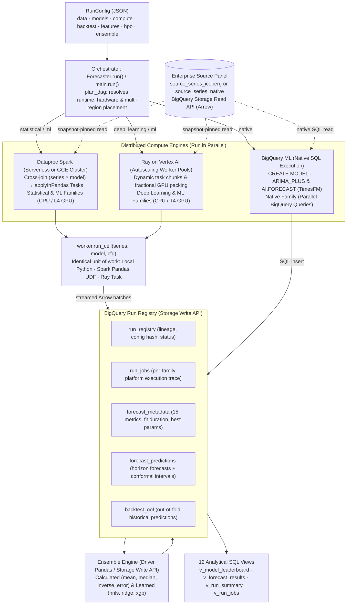
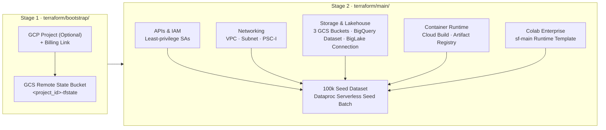

# scale-forecasting

<p align="center">
  <b>Enterprise-Grade, Massively Parallel Time-Series Forecasting on Google Cloud</b><br>
  <i>One declarative configuration. 18 models. Hybrid distributed execution across BigQuery ML, Dataproc Spark, and Vertex AI Ray.</i>
</p>

<p align="center">
  <a href="https://console.cloud.google.com/vertex-ai/colab/import/https%3A%2F%2Fraw.githubusercontent.com%2Fstatmike%2Fscale-forecasting%2Fmain%2Fnotebooks%2Fmodel_playground.ipynb"></a>
  <a href="https://statmike.github.io/scale-forecasting/"></a>
  <a href="./docs/workshop.md"></a>
  <a href="./terraform/README.md"></a>
</p>

<p align="center">
  <a href="#quickstart-local-in-5-minutes">⚡ 5-Minute Quickstart</a> •
  <a href="#why-scale-forecasting">💡 Why Scale Forecasting</a> •
  <a href="#three-persona-journeys">👥 Persona Tracks</a> •
  <a href="#architecture-overview">🏛️ Architecture</a> •
  <a href="#interactive-notebook-suite">📓 Notebooks</a> •
  <a href="#deploy-on-google-cloud-in-15-minutes">☁️ Deploy on GCP</a>
</p>

---

## What Is `scale-forecasting`?

`scale-forecasting` brings the modeling flexibility of modern time-series ecosystems (Prophet, Statsmodels, LightGBM, XGBoost, NeuralProphet) to **enterprise Google Cloud scale**. It allows data science and engineering teams to forecast **100,000+ time series** concurrently, perform rigorous rolling-origin backtesting, stack models into learned ensembles, and capture complete experiment lineage in BigQuery — all orchestrated from a single JSON configuration.

The entire platform deploys with 1-click Terraform, pre-seeded with a 100,000-series dataset across both native BigQuery and BigLake Apache Iceberg tables.

---

## Why Scale Forecasting?

Traditional forecasting workflows break down when scaled to hundreds of thousands of series across retail, supply chain, energy, or financial hierarchies:

| Challenge | Traditional Approach | The `scale-forecasting` Solution |
| :--- | :--- | :--- |
| **Library Fragmentation** | Separate, incompatible codebases for Statsmodels, Prophet, PyTorch, and SQL models. | **Unified Model Contract:** Single [`BaseModel`](./src/scale_forecasting/models/base_model.py) interface. 18 models run with identical inputs, outputs, and metrics. |
| **Compute Scaling Limits** | Single-node memory exhaustion (OOMs); slow sequential loops. | **Hybrid Distributed Execution:** Automatic fan-out across Dataproc Spark (`applyInPandas`), Vertex AI Ray actor pools, and BigQuery ML. |
| **Infrastructure Lock-In** | Forced choice between pure Spark or pure SQL. | **Multi-Engine DAG:** Run Spark, Ray, and BigQuery ML *concurrently under one `run_id`*, bounded by the slowest family rather than their sum. |
| **Uncertainty & Calibration** | Gaussian assumptions that fail on real-world skewed distributions. | **Conformal Residual Intervals:** Empirical, distribution-free prediction intervals calibrated against rolling backtest errors. |
| **Operational Opacity** | Disconnected log files and missing evaluation tracking. | **Real-Time BigQuery Registry:** Streaming telemetry via the Storage Write API into 12 analytical SQL views and interactive dashboards. |

---

## Quickstart (Local in 5 Minutes)

Experiment locally with zero cloud setup, zero credentials, and zero compute costs.

```bash
# 1. Clone the repository and install dependencies with uv
git clone https://github.com/statmike/scale-forecasting.git && cd scale-forecasting
uv sync

# 2. Explore available models and fit your first forecast
uv run python -m scale_forecasting.playground --list
uv run python -m scale_forecasting.playground --model theta --backtest --horizon 14
```

### Python SDK Quickstart

The high-level [`Forecaster`](./docs/using_the_sdk.md) SDK unifies validation, execution, and review:

```python
import scale_forecasting as sf

# 1. Initialize from a declarative config file or dictionary
forecaster = sf.Forecaster.from_file("configs/quickstart_100.json")

# 2. Preflight validation & cost sizing (offline, zero GCP calls)
dry_run = forecaster.dry_run()
print(f"Planned Run ID : {dry_run.run_id}")
print(f"Total Fits     : {dry_run.fanout.n_series} series × {len(dry_run.python_models) + len(dry_run.bq_models)} models")

# 3. Execute locally or across Google Cloud (Spark, Ray, BigQuery ML)
result = forecaster.run()

# 4. Interactive review: leaderboard, quantile distributions, and ensemble lift
review = sf.review_run(result.run_id)
sf.plot_leaderboard(review)
```

---

## Three Persona Journeys

Whether you are building models, architecting cloud platforms, or managing production operations, `scale-forecasting` provides a tailored path:


```mermaid
flowchart TD
    subgraph DataScientist["🧑‍🔬 Data Scientist & Forecaster"]
        DS1["Interactive Sandbox<br/>notebooks/model_playground.ipynb"]
        DS2["Custom Model & Metric Development<br/>docs/adding_a_model.md · docs/adding_a_metric.md"]
        DS3["Hyperparameter Tuning & Ensembling<br/>Optuna HPO · Stacking (NNLS, Ridge, XGBoost)"]
        DS1 --> DS2 --> DS3
    end

    subgraph Architect["🏛️ Enterprise Cloud & Data Architect"]
        AR1["Storage & Lakehouse Strategy<br/>Native BigQuery vs BigLake Apache Iceberg on GCS"]
        AR2["Multi-Engine Evaluation<br/>Dataproc Spark vs Vertex AI Ray vs BigQuery ML"]
        AR3["Security & Private Networking<br/>Private Service Connect (PSC-I) · Least-Privilege IAM"]
        AR1 --> AR2 --> AR3
    end

    subgraph MLOps["⚙️ MLOps & Platform Engineer"]
        OP1["1-Click Terraform Infrastructure<br/>terraform/README.md (Bootstrap + Main)"]
        OP2["Scheduled Orchestration<br/>Cloud Composer 3 / Airflow DAG Generation"]
        OP3["Fleet Resilience & Quota Preflight<br/>Automatic Multi-Region Fallback · Ray Orphan Reaper"]
        OP1 --> OP2 --> OP3
    end
```

---

## Architecture Overview

A run begins with a declarative [`RunConfig`](./src/scale_forecasting/config.py). The orchestrator resolves the experiment into an execution DAG: each model family runs as an independent parallel job, streaming results into BigQuery.


```mermaid
flowchart TB
    cfg["RunConfig (JSON)<br/>data · models · compute · backtest · features · hpo · ensemble"]
    orch["Orchestrator: Forecaster.run() / main.run()<br/>plan_dag: resolves runtime, hardware & multi-region placement"]
    cfg --> orch

    subgraph compute["Distributed Compute Engines (Run in Parallel)"]
        spark["Dataproc Spark (Serverless or GCE Cluster)<br/>Cross-join (series × model) → applyInPandas Tasks<br/>Statistical & ML Families (CPU / L4 GPU)"]
        ray["Ray on Vertex AI (Autoscaling Worker Pools)<br/>Dynamic task chunks & fractional GPU packing<br/>Deep Learning & ML Families (CPU / T4 GPU)"]
        bq["BigQuery ML (Native SQL Execution)<br/>CREATE MODEL ... ARIMA_PLUS & AI.FORECAST (TimesFM)<br/>Native Family (Parallel BigQuery Queries)"]
    end

    orch -->|"statistical / ml"| spark
    orch -->|"deep_learning / ml"| ray
    orch -->|"native"| bq

    unit["worker.run_cell(series, model, cfg)<br/>Identical unit of work: Local Python · Spark Pandas UDF · Ray Task"]
    spark --> unit
    ray --> unit

    source[("Enterprise Source Panel<br/>source_series_iceberg or source_series_native<br/>BigQuery Storage Read API (Arrow)")]
    source -.->|snapshot-pinned read| spark
    source -.->|snapshot-pinned read| ray
    source -.->|native SQL read| bq

    subgraph registry["BigQuery Run Registry (Storage Write API)"]
        r_head["run_registry (lineage, config hash, status)"]
        r_jobs["run_jobs (per-family platform execution trace)"]
        r_meta["forecast_metadata (15 metrics, fit duration, best params)"]
        r_pred["forecast_predictions (horizon forecasts + conformal intervals)"]
        r_oof["backtest_oof (out-of-fold historical predictions)"]
    end

    unit -->|streamed Arrow batches| registry
    bq -->|SQL insert| registry

    ens["Ensemble Engine (Driver Pandas / Storage Write API)<br/>Calculated (mean, median, inverse_error) & Learned (nnls, ridge, xgb)"]
    registry --> ens
    ens --> registry

    views["12 Analytical SQL Views<br/>v_model_leaderboard · v_forecast_results · v_run_summary · v_run_jobs"]
    registry --> views
```

---

## Model & Ensemble Catalog

Every model lives in its own self-contained file under [`src/scale_forecasting/models/`](./src/scale_forecasting/models/README.md).

| Model | Family | Runtime Engine | Capabilities & Methodology |
| :--- | :--- | :--- | :--- |
| **`naive_mean`** | `statistical` | Spark / Ray | Historical mean baseline with analytical Gaussian intervals. |
| **`naive_seasonal`** | `statistical` | Spark / Ray | Repeats historical seasonal cycles (weekly/monthly/annual). |
| **`naive_drift`** | `statistical` | Spark / Ray | Linear drift extrapolation between first and last observations. |
| **`naive_moving_average`** | `statistical` | Spark / Ray | Trailing moving average with tunable window lengths. |
| **`theta`** | `statistical` | Spark / Ray | Assimakopoulos-Nikolopoulos decomposition method (`statsmodels`). |
| **`holtwinters`** | `statistical` | Spark / Ray | Additive and multiplicative Holt-Winters seasonal exponential smoothing. |
| **`autoets`** | `statistical` | Spark / Ray | Automated Error-Trend-Seasonal state-space model. |
| **`croston`** | `statistical` | Spark / Ray | Intermittent-demand forecaster (Croston / SBA / TSB) for sparse data. |
| **`sarimax`** | `statistical` | Spark / Ray | Seasonal ARIMA with exogenous calendar & economic covariates. |
| **`ucm`** | `statistical` | Spark / Ray | Unobserved Components state-space model with cycle/trend decomposition. |
| **`stl_bagging`** | `statistical` | Spark / Ray | STL decomposition with block-bootstrapped bagged ETS ensembles. |
| **`prophet`** | `statistical` | Spark / Ray | Piecewise trend, multi-period Fourier seasonality, and holiday events. |
| **`regression_lags`** | `ml` | Spark / Ray | Regularized Ridge regression with autoregressive target and covariate lags. |
| **`lightgbm`** | `ml` | Spark / Ray | Gradient boosted decision trees (`LightGBM`) with recursive multi-step forecasting. |
| **`xgboost`** | `ml` | Spark / Ray | Gradient boosted decision trees (`XGBoost`) on CPU or GPU (`device="cuda"`). |
| **`neuralprophet`** | `deep_learning` | Spark / Ray | PyTorch AR-Net; supports fractional GPU allocation on Ray worker pools. |
| **`arima_plus`** | `native` | BigQuery ML | Pure BigQuery SQL: automated pipeline with anomaly detection & holiday modeling. |
| **`arima_plus_xreg`** | `native` | BigQuery ML | BigQuery ML ARIMA with user-supplied exogenous feature tables. |
| **`timesfm`** | `native` | BigQuery ML | Zero-shot foundation model forecasting via BigQuery `AI.FORECAST`. |

### Ensembling Strategies (`ensemble.strategies`)
- **Calculated (Fast, Backtest-Free):** `mean` (uniform average), `median` (robust consensus), `inverse_error` (weighted inversely by backtest validation loss).
- **Learned (Stacking on Out-of-Fold Predictions):** `nnls` (non-negative constrained weights), `ridge` (L2-regularized linear blend), `xgb` (gradient-boosted meta-learner).

---

## Interactive Notebook Suite

The [`notebooks/`](./notebooks/README.md) directory provides a structured learning curriculum with direct **Run in Colab Enterprise** integrations:


```mermaid
flowchart LR
    subgraph Track1["Track 1: Foundations"]
        NB0["model_playground.ipynb<br/>Local modeling sandbox<br/>(Zero GCP setup)"]
    end
    subgraph Track2["Track 2: Cloud Runtimes & Distributed Engines"]
        NB1["01_spark_via_connect.ipynb<br/>Dataproc Spark Connect & Serverless"]
        NB2["02_bigquery_native.ipynb<br/>Serverless BigQuery ML (Pure SQL)"]
        NB3["03_combo_and_ensemble.ipynb<br/>Hybrid Spark ∥ BQ + Stacking Ensembles"]
        NB4["04_ray_on_vertex.ipynb<br/>Autoscaling Ray on Vertex AI (CPU/GPU)"]
    end
    subgraph Track3["Track 3: Operations & Scale Benchmarking"]
        NB8["08_run_and_monitor.ipynb<br/>Background Launch & Live Progress Bar"]
        NB9["09_review_run.ipynb<br/>Post-Run Leaderboards & Ensemble Lift"]
        NB7["07_scale_review.ipynb<br/>100k-Series Cross-Platform Benchmark"]
    end
    Track1 --> Track2 --> Track3
```

| Notebook | Focus Area | Runtime Environment | What You Will Learn |
| :--- | :--- | :--- | :--- |
| [`model_playground.ipynb`](./notebooks/model_playground.ipynb) | Foundations | Local Python (In-Memory) | Fit, score, and plot any of the 16 Python models on synthetic data with zero cloud credentials. |
| [`01_spark_via_connect.ipynb`](./notebooks/01_spark_via_connect.ipynb) | Distributed Spark | Dataproc Spark Connect / Batch | Drive distributed Spark fan-out interactively, compare with serverless batch execution, and inspect write speed. |
| [`02_bigquery_native.ipynb`](./notebooks/02_bigquery_native.ipynb) | Cloud SQL | BigQuery ML (`ARIMA_PLUS`, `TimesFM`) | Execute SQL-native forecasting over native and Iceberg tables without provisioning any compute clusters. |
| [`03_combo_and_ensemble.ipynb`](./notebooks/03_combo_and_ensemble.ipynb) | Multi-Engine Hybrid | Spark Serverless $\parallel$ BigQuery ML | Run Spark and BigQuery concurrently under one `run_id`, blend models with stacking ensembles, and evaluate lift. |
| [`04_ray_on_vertex.ipynb`](./notebooks/04_ray_on_vertex.ipynb) | Distributed Ray | Ray on Vertex AI (CPU & T4 GPU) | Provision an ephemeral Ray-on-Vertex cluster via Private Service Connect, pack GPUs fractionally, and observe auto-teardown. |
| [`08_run_and_monitor.ipynb`](./notebooks/08_run_and_monitor.ipynb) | Operations & Telemetry | Background Thread + BigQuery | Launch a cloud job and monitor real-time cell completion via `Forecaster.monitor()` with automated probe escalation. |
| [`09_review_run.ipynb`](./notebooks/09_review_run.ipynb) | Post-Run Evaluation | BigQuery Registry Views | Generate the model leaderboard, inspect per-series error quantiles (`p10`/`p50`/`p90`), and trace the job timeline. |
| [`07_scale_review.ipynb`](./notebooks/07_scale_review.ipynb) | Enterprise Benchmark | BigQuery Registry (100k Runs) | Compare 100,000-series runs across Spark, Ray, and BigQuery: wall-clock time, cluster overhead, and numerical parity. |

---

## Deploy on Google Cloud in 15 Minutes

Deploy the entire platform into your Google Cloud project using Terraform.

### 1-Click Deployment Architecture


```mermaid
flowchart LR
    subgraph Stage1["Stage 1 · terraform/bootstrap/"]
        B1["GCP Project (Optional)<br/>+ Billing Link"]
        B2["GCS Remote State Bucket<br/>&lt;project_id&gt;-tfstate"]
        B1 --> B2
    end
    subgraph Stage2["Stage 2 · terraform/main/"]
        M1["APIs & IAM<br/>Least-privilege SAs"]
        M2["Networking<br/>VPC · Subnet · PSC-I"]
        M3["Storage & Lakehouse<br/>3 GCS Buckets · BigQuery Dataset · BigLake Connection"]
        M4["Container Runtime<br/>Cloud Build · Artifact Registry"]
        M5["Colab Enterprise<br/>sf-main Runtime Template"]
        M6["100k Seed Dataset<br/>Dataproc Serverless Seed Batch"]
        M1 & M2 & M3 & M4 & M5 --> M6
    end
    Stage1 --> Stage2
```

### Cost Transparency

- **Free at Rest:** Empty GCS buckets, BigQuery datasets, service accounts, and VPC networks have **zero idle cost**.
- **One-Time Provisioning:** The runtime container image build and 100,000-series data seed execute once during initial deployment (~8.5 minutes, **~\$0.15** total).
- **Pay-as-You-Go Compute:** Dataproc Serverless batches and Vertex AI Ray clusters bill strictly for the duration of your forecast run.
- **Optional Services:** Cloud Composer 3 is disabled by default (`create_composer = false`).

### Quick Deployment Steps (from Cloud Shell)

```bash
# 1. Clone repository in Google Cloud Shell
cd ~ && git clone https://github.com/statmike/scale-forecasting.git && cd scale-forecasting

# 2. Stage 1: Bootstrap project and remote state bucket
cd terraform/bootstrap
terraform init
terraform apply -var="project_id=YOUR_PROJECT_ID" -var="billing_account=YOUR_BILLING_ID"

# 3. Stage 2: Provision platform, build image, and seed 100,000 series
cd ../main
terraform init
terraform apply -var="project_id=YOUR_PROJECT_ID"
```

For enterprise VPC integration, custom service accounts, and security controls, see [`terraform/README.md`](./terraform/README.md) and [`docs/deploying_on_gcp.md`](./docs/deploying_on_gcp.md).

---

## Hands-On Customer Workshop

Planning to run a proof-of-concept, team hackathon, or training workshop?

Follow our step-by-step **[Hands-On Workshop Guide](./docs/workshop.md)**. It walks through pre-workshop project setup, permissions for attendee Google Groups, and 6 guided lab exercises from initial local modeling to 100,000-series cross-platform benchmarking.

---

## Repository Documentation Map

- **System Architecture & Design:** [`docs/architecture.md`](./docs/architecture.md)
- **Comprehensive Configuration Reference:** [`docs/configuration_reference.md`](./docs/configuration_reference.md)
- **Hands-On Customer Workshop:** [`docs/workshop.md`](./docs/workshop.md)
- **Python SDK & Developer Guide:** [`docs/using_the_sdk.md`](./docs/using_the_sdk.md)
- **Running, Monitoring & Reviewing:** [`docs/running_and_reviewing.md`](./docs/running_and_reviewing.md)
- **GCP Deployment & IAM Architecture:** [`docs/deploying_on_gcp.md`](./docs/deploying_on_gcp.md) & [`terraform/README.md`](./terraform/README.md)
- **Backtesting & Conformal Calibration:** [`docs/backtesting.md`](./docs/backtesting.md)
- **Quota, Sizing & 100k Scale Guide:** [`docs/quota_and_scale.md`](./docs/quota_and_scale.md)
- **BigQuery Registry & View Schemas:** [`docs/output_schemas.md`](./docs/output_schemas.md)
- **Extending the Platform:** [`docs/adding_a_model.md`](./docs/adding_a_model.md) & [`docs/adding_a_metric.md`](./docs/adding_a_metric.md)
- **Operations & Production Runbook:** [`docs/operations.md`](./docs/operations.md)
- **System Validation Ledger:** [`docs/validation.md`](./docs/validation.md) & [`docs/smoke_testing.md`](./docs/smoke_testing.md)
- **Auto-Generated API Reference:** [`docs/api/index.md`](./docs/api/index.md)
- **Troubleshooting:** [`docs/troubleshooting.md`](./docs/troubleshooting.md)

---

## License

Apache-2.0 — see [`LICENSE`](./LICENSE).
