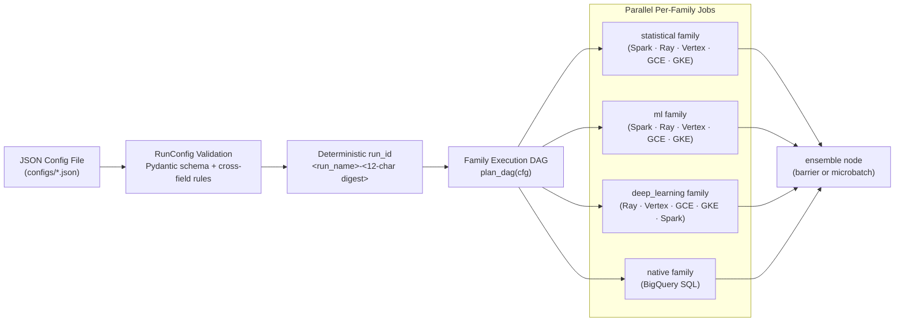

# Run Configurations (`configs/`)

In `scale-forecasting`, **a single JSON file is the complete experiment record**. It declares which source table to read, which models to fit, how to route each model family across compute runtimes, how to backtest and calibrate prediction intervals, and how to blend base forecasts into ensembles.

When you load a config via [`RunConfig`](./../src/scale_forecasting/config.py), the platform computes a deterministic, content-addressed `<slug>-<12hex>` **`run_id`** from the authored configuration and stores the verbatim JSON in `run_registry.raw_config`.



---

## Quick Usage

### From the CLI

```bash
# 1. Preview the resolved execution DAG, run_id, and per-family launch commands (offline, no spend)
uv run python -m scale_forecasting.main --config configs/per_family_runtimes_demo.json --dry-run

# 2. Run a preflight feasibility check against the live source table and regional quotas
uv run python -m scale_forecasting.main --config configs/explode_100k.json --feasibility

# 3. Execute the run end-to-end
uv run python -m scale_forecasting.main --config configs/mixed_demo.json
```

### From Python (`Forecaster` SDK)

```python
import scale_forecasting as sf

# 1. Load from file
fc = sf.Forecaster.from_file("configs/ensemble_demo.json")

# 2. Inspect the planned execution DAG and deterministic run_id
dry_run = fc.dry_run()
print(f"Planned Run ID : {dry_run.run_id}")
print(
    f"Total Fits     : {dry_run.fanout.n_series} series × {len(dry_run.python_models) + len(dry_run.bq_models)} models"
)

# 3. Launch and wait for completion
result = fc.run()

# 4. Inspect leaderboard, metric distributions, and ensemble lift
review = sf.review_run(result.run_id)
sf.plot_leaderboard(review)
```

---

## Recommended Recipes (Where Do I Start?)

If you are evaluating `scale-forecasting` for production workloads, start with these curated recipes:

| Recipe | Config File | Scale | Runtimes | What It Proves |
| :--- | :--- | :--- | :--- | :--- |
| **1. Quickstart Evaluation** | [`configs/ensemble_demo.json`](./ensemble_demo.json) | 10 series | Spark $\parallel$ BigQuery ML | Fast multi-engine run testing Spark Python models, BigQuery SQL models, and stacked ensembling in under 2 minutes. |
| **2. Multi-Family Hybrid** | [`configs/per_family_runtimes_demo.json`](./per_family_runtimes_demo.json) | 50 series | Spark + Ray GPU + BigQuery | Routes statistical models to Spark, deep learning to Ray GPU, and native models to BigQuery SQL under one `run_id`. |
| **3. High-Throughput 100k Benchmark** | [`configs/explode_100k.json`](./explode_100k.json) | 100,000 series | Dataproc Spark Serverless | Full enterprise benchmark: 100,000 series across 4 models (400,000 cells) with dynamic executor autoscaling. |
| **4. Cloud Engine Parity Benchmark** | [`configs/ray_100k.json`](./ray_100k.json) | 100,000 series | Ray on Vertex AI | Full 100,000-series Ray counterpart to `explode_100k.json` to benchmark wall-clock throughput and numerical parity. |
| **5. Fractional GPU Deep Learning** | [`configs/ray_gpu_demo.json`](./ray_gpu_demo.json) | 6 series | Ray on Vertex AI (T4 GPU) | Proves fractional GPU packing (`gpu_fraction: "auto"`) for `NeuralProphet` without dedicated GPUs per series. |

### 1. Interactive & Demo Configs

Small, fast configurations used by the [interactive notebooks](../notebooks/README.md) and quickstart guides to demonstrate specific runtimes and features:

| File | Series | Models | Runtimes Exercised | Purpose |
| :--- | ---: | :--- | :--- | :--- |
| [`explode_demo.json`](./explode_demo.json) | 10 | `theta`, `holtwinters`, `sarimax`, `xgboost` | Spark Serverless (CPU) | Fast Spark cross-join/explode demo with model persistence (`persist_models: true`). |
| [`bq_native_demo.json`](./bq_native_demo.json) | 100 | `arima_plus`, `timesfm` | BigQuery SQL | Pure SQL-native forecasting with zero Python compute provisioning. |
| [`mixed_demo.json`](./mixed_demo.json) | 10 | `theta`, `arima_plus`, `timesfm` | Spark $\parallel$ BigQuery | Minimal multi-engine run pairing a Python model with BigQuery native models. |
| [`ensemble_demo.json`](./ensemble_demo.json) | 10 | `theta`, `arima_plus`, `timesfm` | Spark $\parallel$ BigQuery + Ensemble | End-to-end multi-engine run with calculated (`mean`, `median`, `inverse_error`) and learned (`nnls`) ensembles. |
| [`ray_cpu_demo.json`](./ray_cpu_demo.json) | 6 | `theta`, `holtwinters`, `arima_plus`, `timesfm` | Ray CPU $\parallel$ BigQuery | Quick Ray-on-Vertex CPU run alongside BigQuery native models. |
| [`ray_gpu_demo.json`](./ray_gpu_demo.json) | 6 | `neuralprophet`, `theta`, `arima_plus`, `timesfm` | Ray GPU + CPU $\parallel$ BigQuery | Demonstrates fractional-GPU packing (`gpu_fraction: "auto"`) for `neuralprophet` on Vertex AI T4s. |
| [`gke_demo.json`](./gke_demo.json) | 6 | `theta`, `holtwinters`, `arima_plus`, `timesfm` | GKE Indexed Job $\parallel$ BigQuery | Quick Google Kubernetes Engine (`gke_mode: "job"`) CPU run alongside BigQuery native models. |
| [`per_family_runtimes_demo.json`](./per_family_runtimes_demo.json) | 50 | `theta`, `holtwinters`, `xgboost`, `neuralprophet`, `arima_plus` | Spark CPU + Ray GPU + BigQuery | Routes `statistical` and `ml` to Spark Serverless, `deep_learning` to Ray GPU, and `native` to BigQuery in one run. |
| [`per_family_runtimes_cpu_demo.json`](./per_family_runtimes_cpu_demo.json) | 50 | `theta`, `holtwinters`, `xgboost`, `neuralprophet`, `arima_plus` | Spark CPU + Ray CPU + BigQuery | Quota-free CPU twin of `per_family_runtimes_demo.json` (runs `neuralprophet` on Ray CPU workers). |
| [`repair_demo.json`](./repair_demo.json) | 3,000 | `theta`, `holtwinters`, `xgboost` | Spark Serverless (CPU) | Medium-scale multi-family run used to demonstrate run inspection, cancellation, and cell-level repair (`--retry`). |
| [`repair_retry_demo.json`](./repair_retry_demo.json) | 300 | `theta`, `holtwinters`, `xgboost` | Spark Serverless (CPU) | Compact 300-series target for testing automated `--with-retry` / `Forecaster.retry()` workflows. |

### 2. Scale Benchmarks (10k – 100k Series)

Configurations designed for fleet-scale execution and reviewed in [`notebooks/10_registry_operations_and_scale.ipynb`](../notebooks/10_registry_operations_and_scale.ipynb) and [`docs/quota_and_scale.md`](../docs/quota_and_scale.md):

| File | Series | Models | Runtimes Exercised | Purpose |
| :--- | ---: | :--- | :--- | :--- |
| [`ray_autoscale_demo.json`](./ray_autoscale_demo.json) | 10,000 | `theta`, `holtwinters`, `sarimax` | Ray CPU (Autoscaling 1–8 nodes) | 10k-series statistical run on an autoscaling Ray-on-Vertex cluster with multi-region fallback. |
| [`all_families_10k.json`](./all_families_10k.json) | 10,000 | `theta`, `holtwinters`, `sarimax`, `xgboost`, `neuralprophet`, `arima_plus`, `timesfm` | Ray (CPU + T4 GPU) $\parallel$ BigQuery | Four model families (`statistical`, `ml`, `deep_learning`, `native`) at 10k scale with `gpu_fraction: "auto"` calibration and learned + calculated ensembles. |
| [`all_families_10k_full.json`](./all_families_10k_full.json) | 10,000 | `theta`, `holtwinters`, `sarimax`, `xgboost`, `neuralprophet`, `arima_plus`, `timesfm` | Ray (CPU + T4 GPU) $\parallel$ BigQuery | Full-featured 10k run adding `features.holidays: "US"`, `transform: "log1p"`, `persist_models: true`, and `xgb` ensembling. |
| [`explode_100k.json`](./explode_100k.json) | 100,000 | `theta`, `holtwinters`, `sarimax`, `xgboost` | Spark Serverless (CPU) | Full 100k-series benchmark across `statistical` and `ml` families on Dataproc Serverless (`max_executors: 20`). |
| [`ray_100k.json`](./ray_100k.json) | 100,000 | `theta`, `holtwinters`, `sarimax`, `xgboost` | Ray CPU (Autoscaling 1–20 nodes) | Full 100k-series Ray counterpart to `explode_100k.json` for cross-engine accuracy and throughput comparison. |

### 3. Controlled CPU vs. GPU A/B Comparisons

Paired configurations that hold data, seeds, and hyperparameters constant while varying only the hardware target (`cpu` vs. `gpu`):

| File Pair | Series | Surface | Purpose |
| :--- | ---: | :--- | :--- |
| [`neuralprophet_ab_cpu.json`](./neuralprophet_ab_cpu.json) & [`neuralprophet_ab_gpu.json`](./neuralprophet_ab_gpu.json) | 10,000 | Ray on Vertex AI | Compares `neuralprophet` throughput, cost, and accuracy on 12 CPU workers vs. 12 T4 GPU workers (`gpu_fraction: 0.125`). |
| [`neuralprophet_ab_cluster_cpu.json`](./neuralprophet_ab_cluster_cpu.json) & [`neuralprophet_ab_cluster_gpu.json`](./neuralprophet_ab_cluster_gpu.json) | 3,000 | Dataproc GCE Cluster | Compares `neuralprophet` on an ephemeral 4-worker CPU Dataproc cluster vs. a 4-worker T4 GPU Dataproc cluster. |

### 4. Infrastructure Fallback Policy (`compute_fallback.json`)

- **[`compute_fallback.json`](./compute_fallback.json)** is **not** a `RunConfig` file — it is the regional and machine-type fallback table consumed by [`compute_fallback.py`](../src/scale_forecasting/compute_fallback.py) when you pass `--compute-fallback configs/compute_fallback.json` to the CLI. It defines ordered regional/zone and accelerator fallbacks when a primary region encounters a stockout or quota limit.

---

## Smoke Configuration Suite (`configs/smokes/`)

The **[`configs/smokes/`](./smokes/README.md)** subdirectory contains 42 numbered configurations (`01` through `42`) that systematically exercise every runtime (`spark`, `ray`, `vertex`, `gce`, `gke`, `vertex_automl`, and `bigquery`), hardware mode, backtest scheme, HPO granularity, feature transform, covariate tier, hierarchical reconciliation method, and ensemble strategy in the platform. See **[`configs/smokes/README.md`](./smokes/README.md)** for the full index.

---

## Reference Links

- **Every configuration field, type, and default:** [`docs/configuration_reference.md`](../docs/configuration_reference.md)
- **Pydantic schema source:** [`src/scale_forecasting/config.py`](../src/scale_forecasting/config.py)
- **Live validation results for every shipped config:** [`docs/validation.md`](../docs/validation.md)
