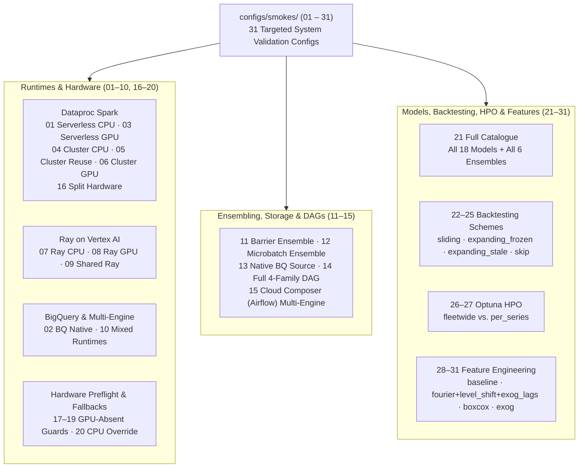

# System Validation Smoke Configurations (`configs/smokes/`)

This directory holds **31 numbered smoke configurations** (`01` through `31`). Each file is a small, self-contained [`RunConfig`](../../src/scale_forecasting/config.py) designed to prove a specific axis of the platform — a compute surface, hardware fallback, storage format, orchestration mode, model/ensemble catalogue, backtesting scheme, hyperparameter optimization mode, or feature-engineering pipeline.

Every configuration in this folder is guarded by two automated unit-test tripwires in [`tests/unit/`](../../tests/README.md):
1. **[`test_validation_ledger.py`](../../tests/unit/test_validation_ledger.py)** verifies that every file in `configs/smokes/` has a corresponding row in [`docs/validation.md`](../../docs/validation.md) with an up-to-date `run_id` and architecture-axis proof.
2. **[`test_config_coverage.py`](../../tests/unit/test_config_coverage.py)** joins the effective values produced by these configurations against every enumerable field on `RunConfig` so no configuration option goes untested.



---

## Running a Smoke Configuration

You can run any smoke configuration directly with `main`, or through the automated smoke verification harness ([`tests/smokes/smoke_harness.py`](../../tests/smokes/smoke_harness.py)), which executes the run, queries the BigQuery registry tables, and verifies row counts, job statuses, and cluster teardown:

```bash
# Preview the execution plan and deterministic run_id offline
uv run python -m scale_forecasting.main --config configs/smokes/14_full_dag.json --dry-run

# Run a single smoke configuration through the end-to-end verification harness
uv run python -m tests.smokes.smoke_harness --only 01_serverless_cpu

# Run the Cloud Composer / Airflow end-to-end smoke
uv run python -m tests.smokes.airflow_smoke --config configs/smokes/15_airflow_multi_engine.json
```

---

## Complete Index of Smoke Configurations

### 1. Compute Runtimes & Hardware Routing (`01`–`10`, `16`–`20`)

| # | File | Series | Surface & Focus |
| :--- | :--- | ---: | :--- |
| `01` | [`01_serverless_cpu.json`](./01_serverless_cpu.json) | 100 | Dataproc Serverless CPU across `statistical` (`theta`, `holtwinters`) and `ml` (`xgboost`) families. |
| `02` | [`02_bq_native.json`](./02_bq_native.json) | 100 | BigQuery SQL-native engine (`arima_plus` and `timesfm`) over BigLake Apache Iceberg. |
| `03` | [`03_serverless_gpu.json`](./03_serverless_gpu.json) | 100 | Dataproc Serverless with L4 GPU executors running `neuralprophet`. |
| `04` | [`04_cluster_cpu.json`](./04_cluster_cpu.json) | 100 | Ephemeral Dataproc GCE CPU cluster (`spark_mode: "cluster"`) with automatic creation and teardown. |
| `05` | [`05_cluster_reuse.json`](./05_cluster_reuse.json) | 100 | Shared ephemeral Dataproc GCE cluster bracket reused across both `statistical` and `ml` families. |
| `06` | [`06_cluster_gpu.json`](./06_cluster_gpu.json) | 100 | Ephemeral Dataproc GCE GPU cluster (`n1-standard-8` + T4) with pre-baked/init-action CUDA driver setup. |
| `07` | [`07_ray_cpu.json`](./07_ray_cpu.json) | 100 | Autoscaling Ray on Vertex AI CPU cluster across `statistical` and `ml` families. |
| `08` | [`08_ray_gpu.json`](./08_ray_gpu.json) | 100 | Ray on Vertex AI with T4 GPU worker pool and automatic fractional-GPU calibration (`gpu_fraction: "auto"`). |
| `09` | [`09_shared_ray.json`](./09_shared_ray.json) | 100 | Shared Ray on Vertex AI cluster hosting three families (`statistical`, `ml`, `deep_learning`) across CPU and GPU pools. |
| `10` | [`10_mixed_runtimes.json`](./10_mixed_runtimes.json) | 100 | Three-runtime fan-out in one run: Spark (`statistical`, `ml`) $\parallel$ Ray GPU (`deep_learning`) $\parallel$ BigQuery (`native`). |
| `16` | [`16_cluster_split_hardware.json`](./16_cluster_split_hardware.json) | 100 | Concurrent ephemeral Dataproc GCE clusters with distinct hardware (`statistical` on CPU cluster $\parallel$ `deep_learning` on GPU cluster). |
| `17` | [`17_gpu_absent_serverless.json`](./17_gpu_absent_serverless.json) | 6 | Per-family `hardware: "gpu"` (`L4`) on Dataproc Serverless when top-level `compute.use_gpu` is omitted. |
| `18` | [`18_gpu_absent_cluster.json`](./18_gpu_absent_cluster.json) | 6 | Per-family `hardware: "gpu"` (`T4`) on Dataproc GCE Cluster when top-level `compute.use_gpu` is omitted. |
| `19` | [`19_gpu_absent_ray.json`](./19_gpu_absent_ray.json) | 6 | Per-family `hardware: "gpu"` (`T4`) on Ray on Vertex AI when top-level `compute.use_gpu` is omitted. |
| `20` | [`20_gpu_intent_cpu_family.json`](./20_gpu_intent_cpu_family.json) | 100 | Explicit per-family `hardware: "cpu"` override on `deep_learning` when top-level `use_gpu: true` is set. |

### 2. Ensembling, Storage Formats & Orchestration (`11`–`15`)

| # | File | Series | Surface & Focus |
| :--- | :--- | ---: | :--- |
| `11` | [`11_ensemble_barrier.json`](./11_ensemble_barrier.json) | 100 | Multi-engine run (`theta`, `holtwinters`, `arima_plus`, `timesfm`) with `trigger: "barrier"` ensembling (`mean`, `inverse_error`, `nnls`). |
| `12` | [`12_ensemble_microbatch.json`](./12_ensemble_microbatch.json) | 100 | Incremental `trigger: "microbatch"` ensembling that re-blends as each model family lands. |
| `13` | [`13_native_format.json`](./13_native_format.json) | 100 | Reads from native BigQuery (`source_series_native`) instead of Iceberg (`source_series_iceberg`) across Spark and BigQuery ML. |
| `14` | [`14_full_dag.json`](./14_full_dag.json) | 100 | Full 4-family DAG (`statistical`, `ml`, `deep_learning`, `native`) + `microbatch` ensemble across Spark, Ray GPU, and BigQuery. |
| `15` | [`15_airflow_multi_engine.json`](./15_airflow_multi_engine.json) | 200 | End-to-end Cloud Composer 3 / Airflow DAG execution across Spark, Ray GPU, BigQuery, and `microbatch` ensembling. |

### 3. Full Model Catalogue, Backtesting, HPO & Feature Engineering (`21`–`31`)

| # | File | Series | Surface & Focus |
| :--- | :--- | ---: | :--- |
| `21` | [`21_full_catalogue.json`](./21_full_catalogue.json) | 50 | Exercises **all 18 registered models** and **all 6 ensemble strategies** (`mean`, `median`, `inverse_error`, `nnls`, `ridge`, `xgb`) in a single run. |
| `22` | [`22_backtest_sliding_overlap.json`](./22_backtest_sliding_overlap.json) | 20 | Tests `backtest.scheme: "sliding"` with a fixed `window`, `gap` (embargo), and `short_series: "overlap"`. |
| `23` | [`23_backtest_frozen_shrink.json`](./23_backtest_frozen_shrink.json) | 20 | Tests `backtest.scheme: "expanding_frozen"` (hyperparameters/structure fixed on fold 0, parameters refit) and `short_series: "shrink_train"`. |
| `24` | [`24_backtest_stale.json`](./24_backtest_stale.json) | 20 | Tests `backtest.scheme: "expanding_stale"` (fit once on fold 0, score subsequent folds without refitting) and `short_series: "drop_folds"`. |
| `25` | [`25_backtest_skip.json`](./25_backtest_skip.json) | 20 | Tests `backtest.short_series: "skip"` — short series bypass backtest scoring while still producing horizon forecasts. |
| `26` | [`26_hpo_fleetwide.json`](./26_hpo_fleetwide.json) | 50 | Optuna HPO with `granularity: "fleetwide"` — tunes one shared parameter set per model across a stratified series sample. |
| `27` | [`27_hpo_per_series.json`](./27_hpo_per_series.json) | 50 | Optuna HPO with `granularity: "per_series"` — runs an independent Optuna study inside every `(series, model)` cell. |
| `28` | [`28_features_off.json`](./28_features_off.json) | 50 | Control baseline for feature engineering across the 6 feature-consuming models (`prophet`, `sarimax`, `ucm`, `regression_lags`, `lightgbm`, `xgboost`). |
| `29` | [`29_features_on.json`](./29_features_on.json) | 50 | Enables `fourier: true`, `level_shift: true`, `exog: ["is_holiday"]`, and `exog_lags: {"is_holiday": [1, 7]}` against the `28` baseline. |
| `30` | [`30_features_boxcox.json`](./30_features_boxcox.json) | 50 | Tests `features.transform: "boxcox"` against the `28` baseline, verifying per-cell positivity validation (`CONFIG_REPAIRABLE` on non-positive series). |
| `31` | [`31_features_exog.json`](./31_features_exog.json) | 50 | Tests unlagged exogenous covariates (`features.exog: ["is_holiday"]`) across all 6 covariate-aware models. |

---

## Reference Links

- **Smoke harness runbook:** [`docs/smoke_testing.md`](../../docs/smoke_testing.md)
- **System validation ledger:** [`docs/validation.md`](../../docs/validation.md)
- **Offline smoke config tests:** [`tests/smokes/test_smoke_configs.py`](../../tests/smokes/test_smoke_configs.py)
