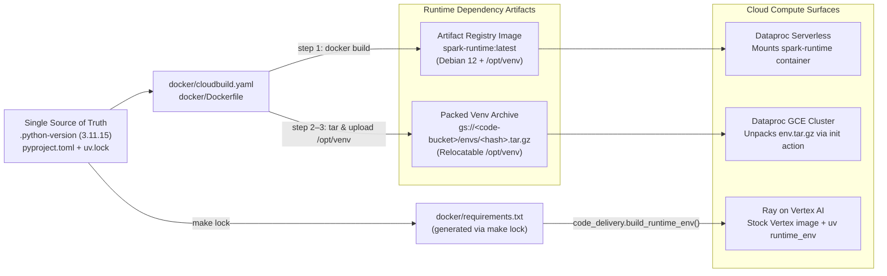

# Container & Runtime Dependency Delivery (`docker/`)

`scale-forecasting` enforces a strict architectural separation between **dependencies** and **application code**:

- **Dependencies change slowly** and are locked once in [`uv.lock`](../uv.lock), exported to [`requirements.txt`](./requirements.txt), and baked into the runtime container and packed virtualenv archive.
- **Application code (`src/scale_forecasting/`) changes frequently** and is **never** baked into the container image (`uv sync --frozen --no-install-project`). Instead, it is zipped and delivered at job-submission time (`python_file_uris` on Spark, `runtime_env.working_dir` on Ray).

Because of this design, you can edit a model, add a metric, or adjust orchestration logic and immediately submit a new cloud run **without rebuilding a container image**. This invariant is enforced in CI by [`tests/unit/test_code_delivery.py`](../tests/unit/test_code_delivery.py).



---

## Files in This Directory

| File | Purpose |
| :--- | :--- |
| [`Dockerfile`](./Dockerfile) | Builds the Dataproc Serverless custom container (`debian:12-slim` + `uv`-managed Python `3.11.15` + locked `core`, `models`, and `ray` dependencies in a self-contained, relocatable `/opt/venv`). Configures `procps`, `tini`, `libjemalloc2`, `libgomp1`, NVIDIA driver paths (`/usr/local/nvidia`), and UID/GID `1099` (`spark`). |
| [`cloudbuild.yaml`](./cloudbuild.yaml) | Three-step Cloud Build pipeline triggered automatically by Terraform (`module.container`): (1) builds and pushes the `Dockerfile` image to Artifact Registry, (2) tars the self-contained `/opt/venv` tree, and (3) uploads `gs://<code-bucket>/envs/<hash>.tar.gz` for Dataproc GCE clusters. |
| [`requirements.txt`](./requirements.txt) | Derived, human-readable export of `uv.lock` (`make lock`). Consumed at runtime by `code_delivery.build_runtime_env()` to install the exact locked dependency set into Ray-on-Vertex jobs via Ray's `uv` runtime plugin, and by the Colab Enterprise notebook bootstrap cells. |
| [`cloudbuild-gpu-image.yaml`](./cloudbuild-gpu-image.yaml) | Optional Cloud Build pipeline that uses `GoogleCloudDataproc/custom-images` to pre-bake the NVIDIA kernel driver onto a Dataproc `2.2-debian12` GCE VM image (`sf-dataproc-gpu-<hash>`), avoiding per-cluster driver compilation when launching GPU Dataproc clusters. |
| [`gpu_image_customize.sh`](./gpu_image_customize.sh) | Customization script executed on the temporary builder VM by `cloudbuild-gpu-image.yaml` to run the stock Dataproc GPU driver initialization action at image-build time. |

---

## Common Workflows

### 1. Updating Python Dependencies

Whenever you add or update a dependency in [`pyproject.toml`](../pyproject.toml), regenerate both `uv.lock` and `docker/requirements.txt` together:

```bash
make lock          # runs `uv lock` + `uv export ... -o docker/requirements.txt`
make lock-check    # verifies uv.lock and docker/requirements.txt are in sync (also run by CI)
```

### 2. Rebuilding the Runtime Image & Packed Venv Archive

If `Dockerfile`, `uv.lock`, or `docker/requirements.txt` changed, re-running `terraform apply` in `terraform/main` automatically detects the content hash change and triggers Cloud Build. You can also trigger the build manually from the repository root:

```bash
gcloud builds submit --config docker/cloudbuild.yaml \
  --substitutions=_REGION=us-central1,_REPO=scale-forecasting,_IMAGE=spark-runtime,_TAG=latest,_CODE_BUCKET=<CODE_BUCKET>,_VENV_HASH=<HASH> \
  --project <PROJECT_ID>
```

---

## Reference Links

- **Why three dependency delivery mechanisms exist:** [`docs/runtime_dependencies.md`](../docs/runtime_dependencies.md)
- **How application code ships at submit time without rebuilding:** [`docs/editing_code_without_rebuilding.md`](../docs/editing_code_without_rebuilding.md)
- **Python & framework version matrix:** [`docs/version_matrix.md`](../docs/version_matrix.md)
