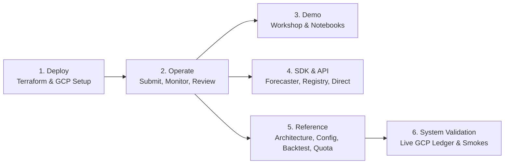

# Documentation

The one-screen map to `scale-forecasting`. Find your task below and follow the pointer. These guides,
the notebook tour, and the full **API reference** are also published as a searchable site — built from
this repo on every push to `main`: **https://statmike.github.io/scale-forecasting/**.

## Deploy
Stand the platform up in a Google Cloud project.
- [deploying_on_gcp.md](./deploying_on_gcp.md) — a reviewer's guide to the Terraform: what gets
  created and why.
- [terraform/README.md](https://github.com/statmike/scale-forecasting/blob/main/terraform/README.md) — the two-stage apply runbook.

## Operate
Run forecasts, review results, and keep a deployment healthy.
- [running_and_reviewing.md](./running_and_reviewing.md) — **the run loop**: submit (Spark / Ray / Vertex / GCE / GKE / Vertex AI AutoML /
  BigQuery), watch it land, review the leaderboard and feature attributions, re-ensemble. Home of the `SF_*` identity setup.
- [operations.md](./operations.md) — rework/reset, disk hygiene, and long-running jobs on a
  persistent VM.

## Demo
Show the system end to end.
- [workshop.md](./workshop.md) — the guided walkthrough and notebook tour.

## Reference
How it works and every knob.
- [architecture.md](./architecture.md) — the module-calling-module call tree; start here to read the
  codebase.
- [configuration_reference.md](./configuration_reference.md) — every config field, type, default,
  constraint.
- [models_reference.md](./models_reference.md) — all 34 built-in models, 6 ensemble strategies,
  Two-Tier Explainability (`attributions_df`, `plot_attributions`), upstream package provenance, hyperparameter search spaces, and optional dependency extras.
- [metrics_reference.md](./metrics_reference.md) — all 21 evaluation metrics, mathematical
  definitions, direction/calibration flags, and edge-case rules.
- [backtesting.md](./backtesting.md) — the method: how folds are laid out, why the newest fold fits
  nothing, what happens to short series, and what each of the four schemes actually measures.
- [quota_and_scale.md](./quota_and_scale.md) — measured node throughput, vCPU and GPU quota planning,
  and `--quota` preflight.
- [reading_source_data.md](./reading_source_data.md) — how each runtime reads the source panel
  (Storage Read API + Arrow, snapshot pinning, the `read_max_streams` parallelism cap).
- [writing_results.md](./writing_results.md) — the single Storage Write API path for both table
  formats, append-only + dedupe-on-read, and why the framework-native sinks are avoided.
- [output_schemas.md](./output_schemas.md) — the output tables and the analyst views over them.
- [adding_a_model.md](./adding_a_model.md) + [model_template.py](https://github.com/statmike/scale-forecasting/blob/main/docs/model_template.py) — add a model
  in one file.
- [adding_a_metric.md](./adding_a_metric.md) + [metric_template.py](https://github.com/statmike/scale-forecasting/blob/main/docs/metric_template.py) — add a
  metric in one file; its table column and migration are generated.
- [editing_code_without_rebuilding.md](./editing_code_without_rebuilding.md) — why a code edit ships
  on the next run with no image rebuild.
- [version_matrix.md](./version_matrix.md) — the Python/Spark/Ray version of every surface, and why
  the whole system is pinned to Python 3.11.
- [runtime_dependencies.md](./runtime_dependencies.md) — package matrix across the shared container,
  packed venv, and Colab templates.
- [notebook_runtimes.md](./notebook_runtimes.md) — which Python version each notebook needs and how
  it behaves locally and on Colab.

## SDK
Use it from Python.
- [using_the_sdk.md](./using_the_sdk.md) — the `Forecaster` easy path, the `Registry` management
  surface, and how to drive Spark/Ray directly while reusing the same model machinery.

## API Reference
Every public module, class, and function — generated directly from the source docstrings, so it
always matches the code.
- [API reference](https://statmike.github.io/scale-forecasting/api/) — browse the generated docs on
  the site. Start at the [overview](https://statmike.github.io/scale-forecasting/api/) (the three
  doors: the `Forecaster` easy path, the `run` orchestration entrypoint, and the direct cell path).

## System Validation
End-to-end platform verification across Dataproc Serverless, Dataproc GCE clusters, Vertex AI Ray,
Vertex AI CustomJob, GCE Single-VM, GKE, Vertex AI AutoML Tabular Workflows, and BigQuery (distinct from forecast backtesting).
- [validation.md](./validation.md) — **System Validation Ledger**: the CI-enforced matrix of
  architecture axes, 42 smoke configs, 20 demonstration configs, 11 notebooks, and 19 capabilities
  proven on live GCP.
- [smoke_testing.md](./smoke_testing.md) — **Smoke Testing Guide**: how to run the 42-smoke suite
  (`smoke_harness.py`) to verify a deployment or infrastructure change.

## Troubleshooting
- [troubleshooting.md](./troubleshooting.md) — known issues, each symptom → cause → fix.
