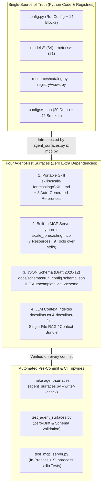

# AI Agents, Portable Skills & Built-in MCP Server

`scale-forecasting` is engineered as an **agent-first repository**. Whether you use **Gemini CLI**, **Claude Code**, **Antigravity / Jetski**, **Cursor**, **VS Code GitHub Copilot**, or an LLM ingestion pipeline, the platform exposes its entire configuration contract (`RunConfig`), all **34 models**, **21 metrics**, **7 compute runtimes**, **5 execution paths**, and **live BigQuery registry operations** as structured, environment-aware tools and drift-locked reference surfaces.



---

## 1. Quickstart by AI Agent Client

Every agent surface works out of the box on a base `pip install scale-forecasting` (or `pip install -e .`) installation — **zero extra MCP or web-server dependencies are required**.

### Gemini CLI

The repository root includes [`gemini-extension.json`](https://github.com/statmike/scale-forecasting/blob/main/gemini-extension.json), which registers both [`skills/scale-forecasting/SKILL.md`](https://github.com/statmike/scale-forecasting/blob/main/skills/scale-forecasting/SKILL.md) and the `scale-forecasting` MCP server automatically. You can also register the MCP server explicitly:

```bash
# Read-only + planning + offline playground (cloud launches safety-locked):
gemini mcp add scale-forecasting -- python -m scale_forecasting.mcp

# Unlock cloud job submission and surgical registry repair:
gemini mcp add scale-forecasting -- python -m scale_forecasting.mcp --allow-launch
```

### Claude Code

Register the built-in `stdio` MCP server and point Claude Code at the portable skill in [`skills/scale-forecasting/SKILL.md`](https://github.com/statmike/scale-forecasting/blob/main/skills/scale-forecasting/SKILL.md):

```bash
claude mcp add scale-forecasting -- python -m scale_forecasting.mcp
```

### Cursor / VS Code Copilot / Antigravity / Windsurf

Add the server to your workspace `.mcp.json` (or `.cursor/mcp.json` / `.vscode/mcp.json`):

```json
{
  "mcpServers": {
    "scale-forecasting": {
      "command": "python",
      "args": ["-m", "scale_forecasting.mcp"]
    }
  }
}
```

### Example Prompts to Try With Your Agent

- *"Probe my environment, tell me which model families are installed locally, and run a 14-day backtest of `holtwinters` in the offline playground."*
- *"Build a validated `RunConfig` for daily retail sales in `my_project.retail.sales` with `promo_flag` as a future covariate, comparing `auto_arima`, `lightgbm`, and `tft` with an `nnls` stacked ensemble, routing `deep_learning` to an `L4` GPU on Vertex AI CustomJob."*
- *"Dry-run `configs/ensemble_demo.json`, show me the per-family DAG and deterministic `run_id`, and emit a Cloud Composer 3 Airflow DAG with surgical retry enabled."*
- *"Inspect the live BigQuery registry with `doctor`, review the latest completed run's leaderboard and interval coverage calibration, and preview a surgical `--retry` plan for any failed cells."*

---

## 2. Environment-Aware Design (`probe_environment`)

A common failure mode of AI coding assistants is guessing what packages, credentials, or environment variables exist on the user's machine. Both the portable skill ([`SKILL.md`](https://github.com/statmike/scale-forecasting/blob/main/skills/scale-forecasting/SKILL.md)) and the MCP server begin with **Step 0: Environment Probing**:

```bash
python -m scale_forecasting.agent_surfaces --probe-env
```

Or in Python:

```python
from scale_forecasting.agent_surfaces import probe_environment

report = probe_environment()
```

`probe_environment()` performs pure local inspection (zero network calls, zero heavy imports) and reports:

| Inspection Dimension | What It Checks | How Agents Use It |
| :--- | :--- | :--- |
| **`extras` (12 extras)** | Calls `is_importable()` on the probe modules for `gcp`, `notebook`, `spark`, `ray`, `submit`, `models-stats`, `models-trees`, `models-prophet`, `models-dl`, `models-automl`, `models`, and `all`. | Recommends the exact `pip install "scale-forecasting[<extra>]"` command or filters to installed models (`--ignore-unavailable-models`). |
| **`models` (34 models)** | Calls `cls.is_available()` on all 34 registered models and groups them into `available` (14 core models on a bare install) vs. `missing` (with `extra` and `install_command`). | Ensures `run_playground` only executes locally installed models while allowing `validate_and_dry_run` to plan cloud runs for all 34 models. |
| **`settings_env` (`SF_*`)** | Checks `SF_PROJECT_ID`, `SF_CONNECTION`, `SF_WAREHOUSE_URI`, `SF_DATASET_ID`, `SF_REGISTRY_DATASET_ID`, `SF_REGION`, `SF_SERVICE_ACCOUNT`, `SF_CONTAINER_IMAGE`, `SF_GKE_CLUSTER`, `SF_SUBNET`, `SF_LOG_LEVEL`, plus `.env.infra` presence on disk. | Tells the agent whether to run `set -a && source .env.infra && set +a` before invoking live BigQuery/cloud tools. |
| **`adc_configured`** | Checks `GOOGLE_APPLICATION_CREDENTIALS`, `~/.config/gcloud/application_default_credentials.json`, and GCE/Cloud Run metadata environment variables. | Detects missing local authentication before attempting cloud API calls. |
| **`execution_paths_ready`** | Booleans for all 5 execution paths (`path_1_offline_playground_and_dry_run` and `path_5_airflow_dag_emission` are always `True`; paths 2–4 require `[gcp]` + `SF_*`). | Routes the agent to offline dry-run/playground vs. live cloud preflight/execution. |

---

## 3. Portable Agent Skill (`skills/scale-forecasting/`)

The [`skills/scale-forecasting/`](https://github.com/statmike/scale-forecasting/tree/main/skills/scale-forecasting) directory follows the open [Agent Skills (`SKILL.md`) specification](https://agentskills.io) with **Progressive Disclosure** so agents keep a small baseline context and load deep reference tables only when needed:

| File | Role | Source of Truth |
| :--- | :--- | :--- |
| [`skills/scale-forecasting/SKILL.md`](https://github.com/statmike/scale-forecasting/blob/main/skills/scale-forecasting/SKILL.md) | YAML frontmatter (`name`, `description`) + 4-step operational workflow (Probe → Author & Validate `RunConfig` → Pre-Flight & Execute across 5 paths → Review & Surgically Repair). | Hand-authored workflow guide |
| [`skills/scale-forecasting/references/config_reference.md`](https://github.com/statmike/scale-forecasting/blob/main/skills/scale-forecasting/references/config_reference.md) | Every field, type, default, and constraint across `RunConfig` and all 14 nested Pydantic config classes, 7 cross-field normalization rules, GPU-to-VM shape matrix, and `run_id` digest exclusions. | Auto-generated from [`config.py`](./api/config.md) |
| [`skills/scale-forecasting/references/catalog_reference.md`](https://github.com/statmike/scale-forecasting/blob/main/skills/scale-forecasting/references/catalog_reference.md) | Complete tables for all **34 models**, **21 metrics**, **7 runtimes**, **12 extras**, **4 source / 5 registry / 5 view schemas**, and **62 shipped configs** (`20` root demos + `42` smoke configs). | Auto-generated from [`models/`](./api/models.md), [`metrics/`](./api/metrics.md), [`registry/`](./api/registry_views.md), and [`configs/`](https://github.com/statmike/scale-forecasting/blob/main/configs/README.md) |
| [`skills/scale-forecasting/references/execution_paths_and_ops.md`](https://github.com/statmike/scale-forecasting/blob/main/skills/scale-forecasting/references/execution_paths_and_ops.md) | Exact CLI commands and Python SDK snippets for `SF_*` environment variables, all 5 execution paths, monitoring/calibration/review, surgical cell repair (`retry_run`), and registry operations (`registry.ops`). | Auto-generated from [`agent_surfaces.py`](./api/agent_surfaces.md) |

---

## 4. Built-In MCP Server (`scale_forecasting.mcp`)

[`scale_forecasting.mcp`](./api/mcp.md) implements a self-contained JSON-RPC 2.0 Model Context Protocol server over `stdio` supporting both newline-delimited JSON and `Content-Length` framed streams. Package logs are routed strictly to `stderr` so `stdout` carries only clean JSON-RPC frames.

### 7 Read-Only MCP Resources (`resources/list` & `resources/read`)

| Resource URI | MIME Type | Contents |
| :--- | :--- | :--- |
| `forecast://environment` | `application/json` | Live `probe_environment()` report (extras, models, `SF_*` env vars, ADC, path readiness). |
| `forecast://schema/run-config` | `application/schema+json` | Full Draft 2020-12 JSON Schema for `RunConfig` and all nested blocks. |
| `forecast://catalog/models` | `application/json` | All 34 models with family, runtime, package, extra, covariate flags, explainability, and local availability. |
| `forecast://catalog/metrics` | `application/json` | All 21 evaluation metrics (16 point + 5 interval) with direction and requirements. |
| `forecast://catalog/runtimes` | `application/json` | All 7 compute runtimes and 4 GPU types (`T4`, `L4`, `A100`, `A100_80GB`). |
| `forecast://catalog/configs` | `application/json` | All 62 shipped configs (20 root demo configs + 42 smoke configs) with `run_id`, runtime, and models. |
| `forecast://catalog/views` | `application/json` | The 4 source tables, 5 registry tables, and 5 analytical SQL views. |

### 9 MCP Tools (`tools/list` & `tools/call`)

| Tool Name | Requires `[gcp]`? | Requires `--allow-launch`? | Purpose |
| :--- | :---: | :---: | :--- |
| `probe_environment` | No | No | Inspect installed extras, available models, `SF_*` variables, `.env.infra`, ADC, and 5-path readiness. |
| `list_catalog` | No | No | Query models (with optional `family` and `available_only` filters), metrics, runtimes, GPUs, extras, views, or shipped configs. |
| `inspect_config_schema` | No | No | Inspect the top-level `RunConfig` overview or drill into a specific section/class (`compute`, `backtest`, `FamilyCompute`, etc.). |
| `validate_and_dry_run` | No | No | Validate a `RunConfig` (dict, JSON string, or file path), compute deterministic `run_id`, estimate workload, resolve per-family DAG nodes, and check local model extras. |
| `run_playground` | No | No | Run a real Python model on deterministic synthetic panel data via `worker.run_cell` with optional 3-fold backtesting, returning metrics and sample predictions. |
| `plan_execution` | Mode-dependent | Only `stage_only` | Plan or emit execution artifacts: `dry_run`, `emit_airflow` (with `--with-retry`), `feasibility` (live BQ), `quota` (live GCP quotas), or `stage_only` (uploads to GCS). |
| `inspect_registry` | Yes | No | Read-only live BigQuery registry inspection: `doctor`, `recent_runs` (`v_run_summary`), `probe_run` (live runtime reconciliation), or `retry_preview` (surgical cell repair table). |
| `review_run` | Yes | No | Full data-science evaluation of a `run_id` (`review_run` + `calibration_report`): champion models, ensemble lift, leaderboard, arm comparison, and interval coverage. |
| `launch_or_repair_run` | Yes | **Yes** | Safety-gated execution and repair: `run` (launch multi-family DAG), `retry` (submit surgical repair), `settle` (repair stale job rows), `cancel` (stop cloud jobs), or `close_runs`. |

### Safety-By-Default (`--allow-launch`)

By default, starting `python -m scale_forecasting.mcp` runs in **safe read/plan/playground mode**:
- All offline validation, DAG planning, Airflow emission, model playground runs, and read-only BigQuery registry queries (`inspect_registry`, `review_run`, `plan_execution` with `dry_run`/`emit_airflow`/`feasibility`/`quota`) are enabled.
- Any call to `launch_or_repair_run` or `plan_execution(mode="stage_only")` returns `"allowed": false` with the exact CLI command or `--allow-launch` instruction, preventing an agent from spending cloud quota or mutating the registry without explicit opt-in.

---

## 5. IDE JSON Schema Autocomplete (`$schema`) & `llms.txt`

### Authoring `RunConfig` JSON With Editor Autocomplete

[`docs/schemas/run_config.schema.json`](./schemas/run_config.schema.json) is published with the documentation site at:

```text
https://statmike.github.io/scale-forecasting/schemas/run_config.schema.json
```

Add `"$schema"` to any config JSON file to get instant field autocomplete, hover descriptions, and enum validation in VS Code, Cursor, PyCharm, and JetBrains IDEs:

```json
{
  "$schema": "https://statmike.github.io/scale-forecasting/schemas/run_config.schema.json",
  "run_name": "schema-validated-demo",
  "python_runtime": "vertex",
  "data": {
    "source_table": "source_series",
    "freq": "D",
    "horizon": 14
  },
  "models": ["holtwinters", "theta", "xgboost"],
  "backtest": {
    "enabled": true,
    "n_folds": 3,
    "horizon": 14,
    "decision_metric": "wape"
  },
  "ensemble": {
    "enabled": true,
    "strategies": ["inverse_error", "nnls"]
  },
  "compute": {
    "families": {
      "statistical": {"runtime": "gce", "machine_type": "n2-standard-8"}
    }
  }
}
```

> **`run_id` Invariance Guarantee:** [`RunConfig._strip_json_schema_key`](./api/config.md) validates that `"$schema"` (when present) is a non-empty string and strips it before Pydantic model construction. Adding `"$schema"` to a config file produces the **exact same `model_dump()` and `<slug>-<12hex>` `run_id`** as omitting it.

### `llms.txt` and `llms-full.txt`

For LLM web crawlers, documentation indexers, and notebook/chat context attachment, two standard files are generated in `docs/` and published at the root of the documentation site:
- **[`llms.txt`](./llms.txt):** Concise markdown index of the platform's architecture, agent surfaces, positioning guides, and reference pages.
- **[`llms-full.txt`](./llms-full.txt):** Single-file context bundle concatenating `llms.txt` with the complete `RunConfig` schema reference, all 34 models / 21 metrics / 7 runtimes / 12 extras / 62 configs, and all 5 execution paths.

---

## 6. How We Built a Drift-Free Agent-First Repository

Hand-written agent prompts and JSON schemas rot the moment a new model is registered, a `RunConfig` field is added, or a CLI flag changes. We engineered `scale-forecasting` so that **agent surfaces are compiled from code and enforced by pre-commit tripwires**:

1. **Introspection Over Duplication ([`scale_forecasting.agent_surfaces`](./api/agent_surfaces.md)):**
   - `build_run_config_json_schema()` calls `RunConfig.model_json_schema()` and injects the optional `"$schema"` property and `$id` URI.
   - `render_skill_config_reference()` walks `_CONFIG_MODELS` (`RunConfig` + all 14 nested Pydantic models) and formats every field's type annotation, default value, and numeric/length constraints directly from `model_cls.model_fields`.
   - `render_skill_catalog_reference()` iterates over `list_models()`, `METRIC_NAMES`, `RUNTIME_CATALOG`, `ALL_EXTRA_MODULES`, `SOURCE_TABLE_NAMES`, `REGISTRY_TABLE_NAMES`, `VIEW_NAMES`, and all 62 JSON files under `configs/` and `configs/smokes/`.
2. **One-Command Regeneration (`make agent-surfaces`):**
   ```bash
   make agent-surfaces
   # Runs: python -m scale_forecasting.agent_surfaces --write
   ```
3. **Automated Pre-Commit & CI Gate ([`tests/unit/test_agent_surfaces.py`](https://github.com/statmike/scale-forecasting/blob/main/tests/unit/test_agent_surfaces.py) & [`tests/unit/test_mcp_server.py`](https://github.com/statmike/scale-forecasting/blob/main/tests/unit/test_mcp_server.py)):**
   - `test_agent_surfaces_zero_drift` calls `check_agent_surfaces()` in `.githooks/pre-commit` and CI. If any of the 6 generated files on disk differs by a single byte from what current code produces, the commit is blocked with instructions to run `make agent-surfaces`.
   - `test_all_shipped_configs_validate_with_schema_key_and_preserve_run_id` validates all 62 shipped configs (plus `"$schema"` round-trip and `run_id` invariance) against `docs/schemas/run_config.schema.json`.
   - `test_mcp_server.py` exercises all 7 MCP resources and 9 MCP tools both in-process and over a real `python -m scale_forecasting.mcp` subprocess `stdio` pipe using both newline-delimited and `Content-Length` JSON-RPC framing.
