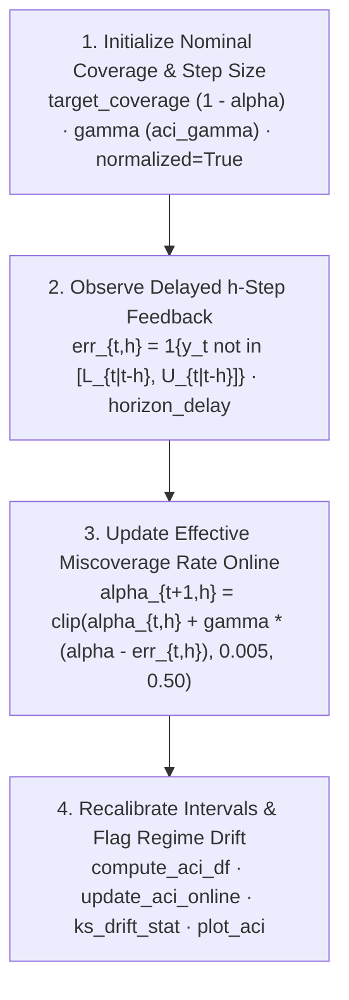

# Online Adaptive Conformal Inference (ACI) & Regime-Shift Tracking

```mermaid
flowchart TD
    A1["1. Initialize Nominal Coverage & Step Size<br/>target_coverage (1 - alpha) · gamma (aci_gamma) · normalized=True"] --> A2["2. Observe Delayed h-Step Feedback<br/>err_{t,h} = 1{y_t not in [L_{t|t-h}, U_{t|t-h}]} · horizon_delay"]
    A2 --> A3["3. Update Effective Miscoverage Rate Online<br/>alpha_{t+1,h} = clip(alpha_{t,h} + gamma * (alpha - err_{t,h}), 0.005, 0.50)"]
    A3 --> A4["4. Recalibrate Intervals & Flag Regime Drift<br/>compute_aci_df · update_aci_online · ks_drift_stat · plot_aci"]
```

::: scale_forecasting.aci
