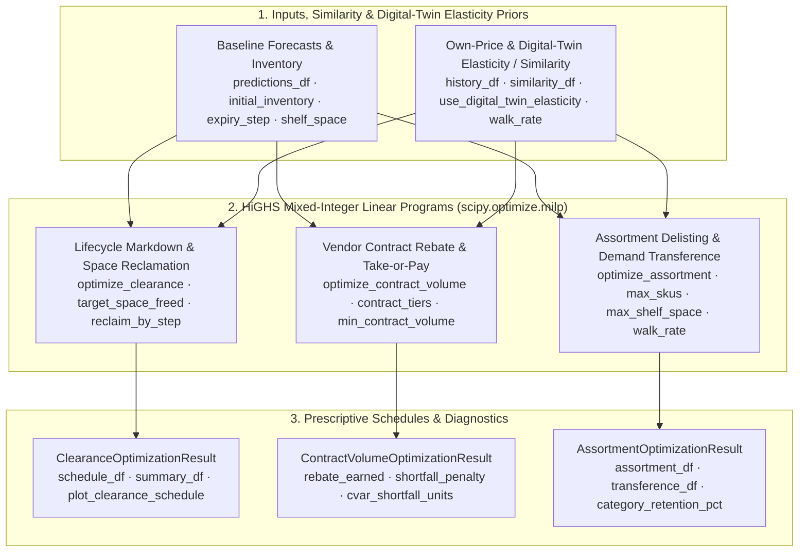

# Lifecycle Markdown, Shelf-Space Reclamation, Vendor Contract Volume & Assortment Transference Optimizer

```mermaid
flowchart TD
    subgraph Inputs["1. Inputs, Similarity & Digital-Twin Elasticity Priors"]
        direction TB
        C1["Baseline Forecasts & Inventory<br/>predictions_df · initial_inventory · expiry_step · shelf_space"]
        C2["Own-Price & Digital-Twin Elasticity / Similarity<br/>history_df · similarity_df · use_digital_twin_elasticity · walk_rate"]
    end
    subgraph Solvers["2. HiGHS Mixed-Integer Linear Programs (scipy.optimize.milp)"]
        direction TB
        S1["Lifecycle Markdown & Space Reclamation<br/>optimize_clearance · target_space_freed · reclaim_by_step"]
        S2["Vendor Contract Rebate & Take-or-Pay<br/>optimize_contract_volume · contract_tiers · min_contract_volume"]
        S3["Assortment Delisting & Demand Transference<br/>optimize_assortment · max_skus · max_shelf_space · walk_rate"]
    end
    subgraph Outputs["3. Prescriptive Schedules & Diagnostics"]
        direction TB
        O1["ClearanceOptimizationResult<br/>schedule_df · summary_df · plot_clearance_schedule"]
        O2["ContractVolumeOptimizationResult<br/>rebate_earned · shortfall_penalty · cvar_shortfall_units"]
        O3["AssortmentOptimizationResult<br/>assortment_df · transference_df · category_retention_pct"]
    end
    C1 & C2 --> S1 & S2 & S3
    S1 --> O1
    S2 --> O2
    S3 --> O3
```

::: scale_forecasting.clearance_optimizer
