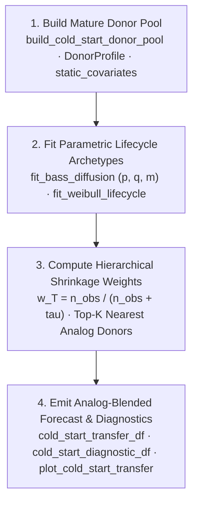

# Cold-Start & New-Product Introduction (NPI) Analog Transfer

```mermaid
flowchart TD
    C1["1. Build Mature Donor Pool<br/>build_cold_start_donor_pool · DonorProfile · static_covariates"] --> C2["2. Fit Parametric Lifecycle Archetypes<br/>fit_bass_diffusion (p, q, m) · fit_weibull_lifecycle"]
    C2 --> C3["3. Compute Hierarchical Shrinkage Weights<br/>w_T = n_obs / (n_obs + tau) · Top-K Nearest Analog Donors"]
    C3 --> C4["4. Emit Analog-Blended Forecast & Diagnostics<br/>cold_start_transfer_df · cold_start_diagnostic_df · plot_cold_start_transfer"]
```

::: scale_forecasting.cold_start
