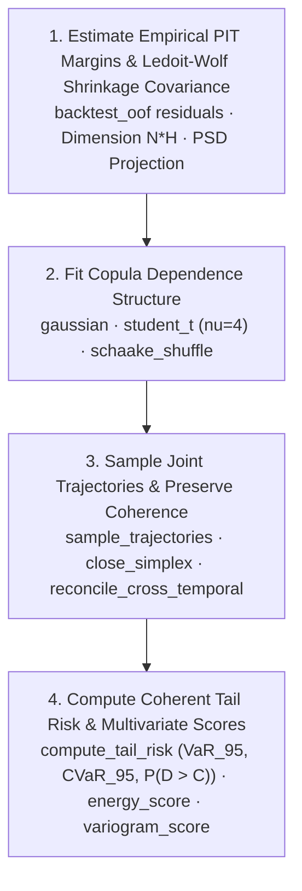

# Joint Multi-Horizon & Cross-Series Trajectory Copulas

```mermaid
flowchart TD
    T1["1. Estimate Empirical PIT Margins & Ledoit-Wolf Shrinkage Covariance<br/>backtest_oof residuals · Dimension N*H · PSD Projection"] --> T2["2. Fit Copula Dependence Structure<br/>gaussian · student_t (nu=4) · schaake_shuffle"]
    T2 --> T3["3. Sample Joint Trajectories & Preserve Coherence<br/>sample_trajectories · close_simplex · reconcile_cross_temporal"]
    T3 --> T4["4. Compute Coherent Tail Risk & Multivariate Scores<br/>compute_tail_risk (VaR_95, CVaR_95, P(D > C)) · energy_score · variogram_score"]
```

::: scale_forecasting.copula
