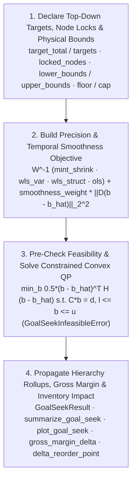

# Top-Down Goal-Seek & Constrained Target Allocation

```mermaid
flowchart TD
    G1["1. Declare Top-Down Targets, Node Locks & Physical Bounds<br/>target_total / targets · locked_nodes · lower_bounds / upper_bounds · floor / cap"] --> G2["2. Build Precision & Temporal Smoothness Objective<br/>W^-1 (mint_shrink · wls_var · wls_struct · ols) + smoothness_weight * ||D(b - b_hat)||_2^2"]
    G2 --> G3["3. Pre-Check Feasibility & Solve Constrained Convex QP<br/>min_b 0.5*(b - b_hat)^T H (b - b_hat) s.t. C*b = d, l <= b <= u (GoalSeekInfeasibleError)"]
    G3 --> G4["4. Propagate Hierarchy Rollups, Gross Margin & Inventory Impact<br/>GoalSeekResult · summarize_goal_seek · plot_goal_seek · gross_margin_delta · delta_reorder_point"]
```

::: scale_forecasting.goal_seek

