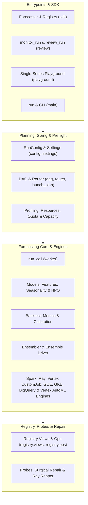

# API Reference

This reference is generated directly from the source docstrings via `mkdocstrings`, so it always matches the code.

`scale_forecasting` exposes three doors onto the same forecasting core, plus a full operational and registry management surface:

- **The easy path** — [`Forecaster`](sdk.md), [`review`](review.md), and [`playground`](playground.md): point at a config, call `dry_run()` / `run()` / `review()`, monitor live progress with `monitor_run()`, or inspect single-series fits in a notebook.
- **The orchestration & planning path** — [`run`](main.md), [`dag`](dag.md), [`router`](router.md), [`launch_plan`](launch_plan.md), [`vertex_submit`](vertex_submit.md), [`gce_submit`](gce_submit.md), [`gke_submit`](gke_submit.md), [`automl_submit`](automl_submit.md), and [`staging`](staging.md): plan the family-to-job DAG, run quota preflight, stage artifacts to GCS, and launch across Local, Dataproc Serverless, Dataproc Cluster, Vertex AI Ray, Vertex AI CustomJob, Compute Engine (`gce`), Google Kubernetes Engine (`gke`), BigQuery, and Vertex AI AutoML / Tabular Workflows (`vertex_automl`).
- **The direct path** — the cell primitives ([`run_cell`](worker.md) and the group/chunk runners in [Spark core](engines_spark_io.md), [Ray core](engines_ray_io.md), [Vertex AI CustomJob, GCE & GKE engine](engines_vertex_engine.md), [BigQuery-native engine](engines_bigquery_engine.md), and [Vertex AI AutoML & Tabular Workflows engine](engines_automl_engine.md)) for embedding the model machinery in your own pipelines.
- **The manage & repair path** — [`registry.ops`](registry_ops.md), [`registry.views`](registry_views.md), [`probes`](probes.md), [`retry_run`](retry_run.md), and [`ray_reaper`](ray_reaper.md): inspect registry health, reconcile live platform state, surgically repair errored cells, reap orphaned clusters, or snapshot/export runs.

Supporting surfaces: [configuration](config.md), [settings](settings.md), [errors](errors.md), the [model factory](models.md) and [`BaseModel`](models_base_model.md) contract, [features](features.md), [seasonality](seasonality.md), [HPO](hpo.md), [ensembler](ensembler.md) and [ensemble driver](ensemble_run.md), [hierarchical reconciliation](reconciliation.md), [metrics](metrics.md) and [`BaseMetric`](metrics_base_metric.md), [backtesting](backtest.md), [calibration](calibration.md), [compute profiling](profiling.md), [resource planning](resources.md), [quota preflight](quota.md), [capacity fallback](capacity.md), and the [synthetic data generator](data_gen.md).

The package front door lazy-loads the heavy names via `__getattr__`, so `import scale_forecasting` stays fast; each page below documents the concrete module a name resolves to.
