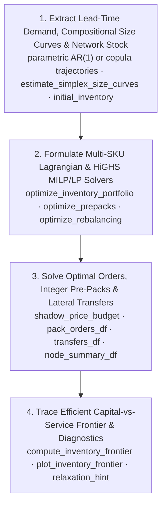

# Multi-Item Constrained Portfolio Inventory, Simplex Pre-Pack & Lateral Rebalancing Optimizer

```mermaid
flowchart TD
    I1["1. Extract Lead-Time Demand, Compositional Size Curves & Network Stock<br/>parametric AR(1) or copula trajectories · estimate_simplex_size_curves · initial_inventory"] --> I2["2. Formulate Multi-SKU Lagrangian & HiGHS MILP/LP Solvers<br/>optimize_inventory_portfolio · optimize_prepacks · optimize_rebalancing"]
    I2 --> I3["3. Solve Optimal Orders, Integer Pre-Packs & Lateral Transfers<br/>shadow_price_budget · pack_orders_df · transfers_df · node_summary_df"]
    I3 --> I4["4. Trace Efficient Capital-vs-Service Frontier & Diagnostics<br/>compute_inventory_frontier · plot_inventory_frontier · relaxation_hint"]
```

::: scale_forecasting.inventory_optimizer
