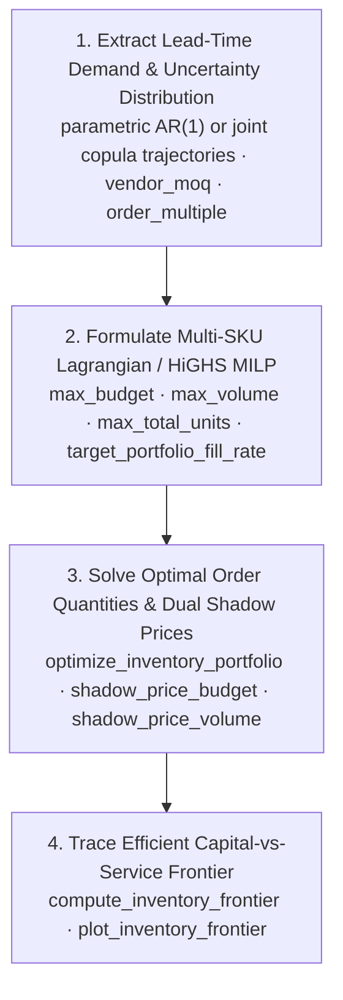

# Multi-Item Constrained Portfolio Inventory & Safety-Stock Optimizer

```mermaid
flowchart TD
    I1["1. Extract Lead-Time Demand & Uncertainty Distribution<br/>parametric AR(1) or joint copula trajectories · vendor_moq · order_multiple"] --> I2["2. Formulate Multi-SKU Lagrangian / HiGHS MILP<br/>max_budget · max_volume · max_total_units · target_portfolio_fill_rate"]
    I2 --> I3["3. Solve Optimal Order Quantities & Dual Shadow Prices<br/>optimize_inventory_portfolio · shadow_price_budget · shadow_price_volume"]
    I3 --> I4["4. Trace Efficient Capital-vs-Service Frontier<br/>compute_inventory_frontier · plot_inventory_frontier"]
```

::: scale_forecasting.inventory_optimizer
