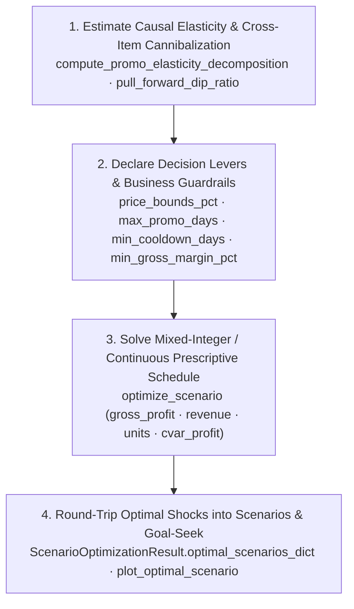

# Prescriptive Counterfactual Scenario & Promotional Calendar Optimizer

```mermaid
flowchart TD
    S1["1. Estimate Causal Elasticity & Cross-Item Cannibalization<br/>compute_promo_elasticity_decomposition · pull_forward_dip_ratio"] --> S2["2. Declare Decision Levers & Business Guardrails<br/>price_bounds_pct · max_promo_days · min_cooldown_days · min_gross_margin_pct"]
    S2 --> S3["3. Solve Mixed-Integer / Continuous Prescriptive Schedule<br/>optimize_scenario (gross_profit · revenue · units · cvar_profit)"]
    S3 --> S4["4. Round-Trip Optimal Shocks into Scenarios & Goal-Seek<br/>ScenarioOptimizationResult.optimal_scenarios_dict · plot_optimal_scenario"]
```

::: scale_forecasting.scenario_optimizer
