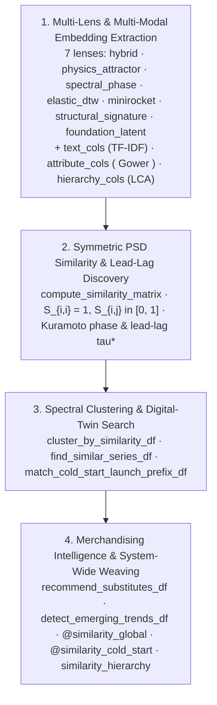

# Time-Series Similarity, Physics Attractors & Analog Clustering (`scale_forecasting.similarity`)

```mermaid
flowchart TD
    S1["1. Multi-Lens & Multi-Modal Embedding Extraction<br/>7 lenses: hybrid · physics_attractor · spectral_phase · elastic_dtw · minirocket · structural_signature · foundation_latent<br/>+ text_cols (TF-IDF) · attribute_cols ( Gower ) · hierarchy_cols (LCA)"] --> S2["2. Symmetric PSD Similarity & Lead-Lag Discovery<br/>compute_similarity_matrix · S_{i,i} = 1, S_{i,j} in [0, 1] · Kuramoto phase & lead-lag tau*"]
    S2 --> S3["3. Spectral Clustering & Digital-Twin Search<br/>cluster_by_similarity_df · find_similar_series_df · match_cold_start_launch_prefix_df"]
    S3 --> S4["4. Merchandising Intelligence & System-Wide Weaving<br/>recommend_substitutes_df · detect_emerging_trends_df · @similarity_global · @similarity_cold_start · similarity_hierarchy"]
```

::: scale_forecasting.similarity
