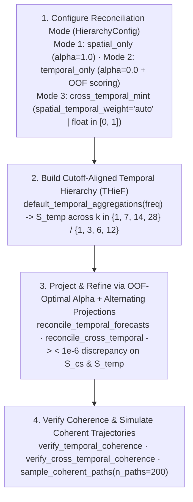

# Temporal Hierarchy Reconciliation (THieF) & Coherent Sample Paths

```mermaid
flowchart TD
    T1["1. Configure Reconciliation Mode (HierarchyConfig)<br/>Mode 1: spatial_only (alpha=1.0) · Mode 2: temporal_only (alpha=0.0 + OOF scoring)<br/>Mode 3: cross_temporal_mint (spatial_temporal_weight='auto' | float in [0, 1])"] --> T2["2. Build Cutoff-Aligned Temporal Hierarchy (THieF)<br/>default_temporal_aggregations(freq) -> S_temp across k in {1, 7, 14, 28} / {1, 3, 6, 12}"]
    T2 --> T3["3. Project & Refine via OOF-Optimal Alpha + Alternating Projections<br/>reconcile_temporal_forecasts · reconcile_cross_temporal -> < 1e-6 discrepancy on S_cs & S_temp"]
    T3 --> T4["4. Verify Coherence & Simulate Coherent Trajectories<br/>verify_temporal_coherence · verify_cross_temporal_coherence · sample_coherent_paths(n_paths=200)"]
```

::: scale_forecasting.temporal_reconciliation

