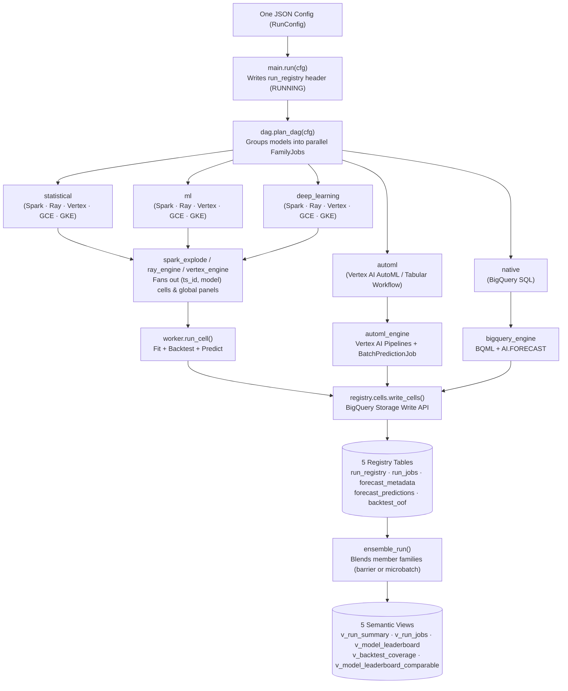
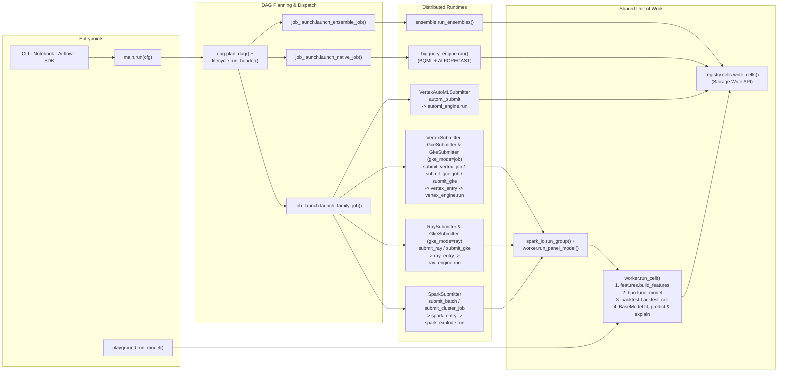

# Software architecture — how the system works

This is a code-reading guide for data scientists: how a run flows through the system, how the modules
call each other, how a model file gets discovered and executed, and how each runtime fans the work
out. Every module link points at the file you'd open next; the spine is small enough to read in an
afternoon.

The design bet is **one capability per file** and **one unit of work everywhere**. A single function —
[`worker.run_cell`](https://github.com/statmike/scale-forecasting/blob/main/src/scale_forecasting/worker.py) — fits, backtests, and predicts one
`(series, model)` cell, and it runs *identically* on your laptop, inside a Spark task, and inside a
Ray task. Everything else is plumbing that decides *which* cells run where and *where the results go*.

For the *what/why* of each config knob see
[configuration_reference.md](./configuration_reference.md); for the *tables* a run writes see
[output_schemas.md](./output_schemas.md). This doc is the *how*.

---

## The one-paragraph mental model

A run is **one JSON config**. [`main.run(cfg)`](https://github.com/statmike/scale-forecasting/blob/main/src/scale_forecasting/main.py) computes a
deterministic `run_id`, then resolves the config into an **execution DAG**: one **job per model
family** present in the config — `statistical`, `ml`, `deep_learning`, `automl`, `native` — plus a downstream
`ensemble` node. Each Python family runs on **its own resolved runtime** (Spark *xor* Ray *xor* Vertex AI `CustomJob` *xor* Compute Engine `gce` *xor* Google Kubernetes Engine `gke` *xor* Vertex AI AutoML `vertex_automl`, chosen
*per family*); the `native` family runs as SQL in BigQuery. All the family jobs launch **in parallel
under one run header**, so a run's wall-clock is the *slowest* family, not the sum. Whichever runtime
a family lands on, it fans out that family's cells and calls the **same** `worker.run_cell` for each,
then writes results to BigQuery via the Storage Write API. When every family job has landed its base
predictions, the `ensemble` node blends them. Five analyst views read the tables back. That's the
whole system.

---

## Layer 1 — entrypoints (who starts a run)

There are three ways a run begins, all converging on the same engines.

| Entrypoint | File | What it is |
|-----------|------|------------|
| `main.run(cfg)` | [`main.py`](https://github.com/statmike/scale-forecasting/blob/main/src/scale_forecasting/main.py) | **The spine.** In-process orchestrator — owns the `run_id` and the header, plans the DAG, launches every family job in parallel, then runs the ensemble node. |
| `job_launch` | [`job_launch.py`](https://github.com/statmike/scale-forecasting/blob/main/src/scale_forecasting/job_launch.py) | **One DAG node, launched.** `launch_family_job` / `launch_native_job` / `launch_ensemble_job` — three variants of one recipe: resolve the attempt, derive the deterministic job identity, open the node's own `run_jobs` row, dispatch in contributor mode. Both drivers call these — `main.run` in-process, and an emitted Airflow DAG's task callables under Composer — which is where "same code local ↔ Composer" is literally true. |
| `shared_clusters` | [`shared_clusters.py`](https://github.com/statmike/scale-forecasting/blob/main/src/scale_forecasting/shared_clusters.py) | **One cluster for a whole run, not one per family.** Two symmetric pairs — a pure predicate ("do ≥2 families resolve to an ephemeral Ray / Dataproc cluster, and how big must the one cluster be") and the context manager that provisions it, hands every eligible family its `(name, region)` as a reuse target, and tears it down once. `airflow_emit` calls the same predicates at emit time to decide whether to emit the `create_*`/`delete_*` task bracket, so Composer brackets a run exactly as `main.run` does. |
| `launch_plan` | [`launch_plan.py`](https://github.com/statmike/scale-forecasting/blob/main/src/scale_forecasting/launch_plan.py) | **Everything before anything launches.** `plan_run` resolves a config into the `run_id` a live run would use, the per-runtime model split, the fanout, an exists-vs-new verdict against the registry, and the two-tier launch commands — touching no GCP. `stage_run` goes one step further and uploads what a remote launch needs. `lock_profile_source` pins `profile.source: "auto"` to a concrete run, so a staged config reproduces its original fleet; that resolved pointer is excluded from the digest, so a re-run sized from newer evidence still lands on the same id. |
| `submit` | [`submit.py`](https://github.com/statmike/scale-forecasting/blob/main/src/scale_forecasting/submit.py) | Submit-side launcher for a **Spark** family: zip the code, stage the config to GCS, build + submit a Dataproc Serverless batch. |
| `batch_infra` | [`batch_infra.py`](https://github.com/statmike/scale-forecasting/blob/main/src/scale_forecasting/batch_infra.py) | The resolved Dataproc deployment envelope (`BatchInfra`) — code bucket, image, SA, subnet, and which of the two dependency envelopes delivers the locked environment. Read by the serverless *and* cluster paths, the command emitter and the fallback check, most of which never submit a batch. |
| `batch_telemetry` | [`batch_telemetry.py`](https://github.com/statmike/scale-forecasting/blob/main/src/scale_forecasting/batch_telemetry.py) | Reach a batch and read what it says — the regional client, the pure wall/DCU/sizing extraction, and the merge onto the run header. Used by `submit` at finish and by `probes.runtimes` mid-flight. |
| `dataproc_cluster` | [`dataproc_cluster.py`](https://github.com/statmike/scale-forecasting/blob/main/src/scale_forecasting/dataproc_cluster.py) | The cluster **as a resource** — its name, its shape (masters, workers, GPUs), the executor sizing derived from the machine it picked, and its lifetime (create with region fallback, delete, or hold open and share across families). Submits nothing. |
| `cluster_deps` | [`cluster_deps.py`](https://github.com/statmike/scale-forecasting/blob/main/src/scale_forecasting/cluster_deps.py) | How the locked Python environment reaches a cluster: resolve the venv archive URI, render the init action that unpacks it, and the Spark properties that point the job at the unpacked interpreter. The one place the create side and the submit side must agree on a path. |
| `cluster_submit` | [`cluster_submit.py`](https://github.com/statmike/scale-forecasting/blob/main/src/scale_forecasting/cluster_submit.py) | Put a family's job on a cluster: build the PySpark job spec, submit it, poll to terminal — and, for an ephemeral cluster, create and tear one down around the job. |
| `cluster_telemetry` | [`cluster_telemetry.py`](https://github.com/statmike/scale-forecasting/blob/main/src/scale_forecasting/cluster_telemetry.py) | Reach a cluster job and read or stop it — the regional job client, the fetch, the cancel, and the merge onto the run header. Used by `cluster_submit` at finish and by `probes.runtimes` mid-flight. |
| `ray_infra` | [`ray_infra.py`](https://github.com/statmike/scale-forecasting/blob/main/src/scale_forecasting/ray_infra.py) | The resolved Vertex-Ray deployment envelope (`RayInfra`) — compute SA, code bucket, and which of the three connectivity modes attaches the cluster to the network. Also the supported Ray/Python version defaults, which are a property of the deployment, not of a run. The Ray sibling of `batch_infra`. |
| `ray_cluster` | [`ray_cluster.py`](https://github.com/statmike/scale-forecasting/blob/main/src/scale_forecasting/ray_cluster.py) | The Vertex Ray cluster **as a resource** — turn a pool plan into the SDK's shape, create it walking the configured regions until one has capacity *and* quota, read it, delete it, or hold one open and share it across families. Submits no job. The Ray sibling of `dataproc_cluster`. |
| `ray_jobs` | [`ray_jobs.py`](https://github.com/statmike/scale-forecasting/blob/main/src/scale_forecasting/ray_jobs.py) | The Ray Jobs client — connect through the managed dashboard proxy past its warm-up race, submit the driver, poll to terminal, and fetch a failed job's log tail. Owns the 60-minute-bearer-token refresh that lets a long GPU run poll to completion. Used by `ray_submit` and by `probes.runtimes` mid-flight. |
| `ray_telemetry` | [`ray_telemetry.py`](https://github.com/statmike/scale-forecasting/blob/main/src/scale_forecasting/ray_telemetry.py) | Flatten a Ray run's pool plan and cluster into the header's `job_telemetry` JSON, and merge it on. The Ray sibling of `batch_telemetry` and `cluster_telemetry`. |
| `ray_submit` | [`ray_submit.py`](https://github.com/statmike/scale-forecasting/blob/main/src/scale_forecasting/ray_submit.py) | Submit-side launcher for a **Ray** family — the *ordering* of the five steps and nothing else: size the cluster, stage the config, provision (or target) it, submit the Ray job, poll and stamp. Each step's machinery is one of the four modules above. |
| `vertex_submit` | [`vertex_submit.py`](https://github.com/statmike/scale-forecasting/blob/main/src/scale_forecasting/vertex_submit.py) | Submit-side launcher for a **Vertex AI `CustomJob`** family (`runtime="vertex"`): zip `src/`, upload `scale_forecasting.zip` + `vertex_entry.py` + `config.json` to GCS, build `worker_pool_specs` (1 dedicated VM per model for `deep_learning` / global models, or `workers` VMs for local `statistical` / `ml` families), submit with regional quota/capacity fallback, poll to terminal state, and merge `$.sizing` / `$.sizing_executed` telemetry onto the run header. |
| `gce_submit` | [`gce_submit.py`](https://github.com/statmike/scale-forecasting/blob/main/src/scale_forecasting/gce_submit.py) | Submit-side launcher for a **Compute Engine Single-VM** family (`runtime="gce"`): stages `scale_forecasting.zip` + `vertex_entry.py` + `config.json` to GCS, provisions a single Container-Optimized OS (`cos-stable`) VM with triple-redundant zero-orphan lifecycle guarantees (`maxRunDuration` + `instanceTerminationAction="DELETE"`, guest `trap cleanup EXIT` REST self-delete + `shutdown -h now`, and client `try ... finally` `delete_instance`), polls GCS status markers and instance state, and merges sizing telemetry onto the run header. |
| `gke_submit` | [`gke_submit.py`](https://github.com/statmike/scale-forecasting/blob/main/src/scale_forecasting/gke_submit.py) | Submit-side launcher for a **Google Kubernetes Engine (`GKE`)** family (`runtime="gke"` or `ray_mode="gke"`): stages `scale_forecasting.zip` + `config.json` to GCS, targets a standing GKE cluster (`compute.gke_cluster_name` / `SF_GKE_CLUSTER`) or provisions an ephemeral regional/zonal GKE cluster with quota preflight and `try ... finally` teardown, submits a Kubernetes `batch/v1` Indexed Job (`gke_mode="job"` running `vertex_engine.py` with `JOB_COMPLETION_INDEX`) or a Ray-on-GKE workload (`gke_mode="ray"` running `ray_engine.py` with a Headless `Service` + Worker `Deployment` + Head `Job`, plus `build_kuberay_cluster_manifest`), polls the Kubernetes API to terminal state, and merges `$.sizing` / `$.sizing_executed` telemetry onto the run header. |
| `automl_submit` | [`automl_submit.py`](https://github.com/statmike/scale-forecasting/blob/main/src/scale_forecasting/automl_submit.py) | Submit-side launcher for a **Vertex AI AutoML / Tabular Workflow** family (`runtime="vertex_automl"`): executes `automl_engine.run` to submit glass-box Kubeflow Pipelines (`automl_mode="tabular_workflow"`, default) or managed `AutoMLForecastingTrainingJob`s (`automl_mode="training_job"`), extracts `stage_1_tuning_result_artifact_uri` and `vertex_model_resource_name`, runs `BatchPredictionJob` with `generate_explanation=True`, and writes `CellResult`s and sizing telemetry to BigQuery. |
| `playground` | [`playground.py`](https://github.com/statmike/scale-forecasting/blob/main/src/scale_forecasting/playground.py) | Local single-cell path — one `run_cell` on the driver, no cluster, no registry. The fastest way to see a model run. |

`main.run` orchestrates the DAG ([`main.py`](https://github.com/statmike/scale-forecasting/blob/main/src/scale_forecasting/main.py)):

1. **Plan the DAG** — `dag.plan_dag(cfg)` computes the `run_id` via
   [`registry.ids.make_run_id`](https://github.com/statmike/scale-forecasting/blob/main/src/scale_forecasting/registry/ids.py) and resolves the config into
   one `FamilyJob` per present family (each with its resolved per-family compute), plus whether the
   ensemble node runs.
2. **Write the header** once — `lifecycle.run_header(..., manage=True)` writes one RUNNING row
   ([`registry/`](https://github.com/statmike/scale-forecasting/tree/main/src/scale_forecasting/registry)) and finalizes it once at the end.
3. **Fan out in parallel** — a `ThreadPoolExecutor` launches each Python family job
   (`job_launch.launch_family_job`) on its own thread while the BigQuery-native family runs inline on the main
   thread (`job_launch.launch_native_job`). Every family job runs `manage_header=False` so **exactly one**
   header row exists per `run_id`, and each opens **its own** `run_jobs` row (contributor mode).
4. **Ensemble node** (if enabled, and only if every family job succeeded) —
   `job_launch.launch_ensemble_job(...)`, the run's final DAG node.
5. **Finalize** — `hdr.finalize(...)` writes the combined terminal status + wall-clock.

Each Python family's runtime dispatch lives in `launch_family_job`
([`job_launch.py`](https://github.com/statmike/scale-forecasting/blob/main/src/scale_forecasting/job_launch.py)): it looks up the family's **resolved**
runtime (`job.compute.runtime` — Spark *xor* Ray *xor* Vertex *xor* GCE *xor* GKE *xor* Vertex AutoML, chosen per family) and calls
`get_submitter(runtime).launch(...)` (Layer 1½). An injected Spark session (e.g. notebook 01's Spark
Connect) makes a Spark family run **in-process** against that session instead of a remote batch,
using the identical engine code.

### Layer 1½ — the submitter seam

[`submitters.py`](https://github.com/statmike/scale-forecasting/blob/main/src/scale_forecasting/submitters.py) captures "how do I launch a Python family on
its runtime" as a `RuntimeSubmitter` protocol with one implementation per runtime — `SparkSubmitter`
(→ `submit.submit_batch`, a Dataproc batch), `RaySubmitter` (→ `ray_submit.submit_ray` on Vertex AI or `gke_submit.submit_gke` when `ray_mode="gke"`), `VertexSubmitter` (→ `vertex_submit.submit_vertex_job`, a Vertex AI `CustomJob`), `GceSubmitter` (→ `gce_submit.submit_gce_job`, a single-VM Compute Engine instance), `GkeSubmitter` (→ `gke_submit.submit_gke`, a Kubernetes `batch/v1` Indexed Job or Ray-on-GKE workload), and `VertexAutoMLSubmitter` (→ `automl_submit.submit_automl_job`, a Vertex AI Tabular Workflow pipeline or `AutoMLForecastingTrainingJob`). `get_submitter(runtime)` returns the right one, so `launch_family_job` is a single dispatch
line — the family doesn't know how its runtime is provisioned.

---

## Layer 2 — the DAG planner (families → jobs)

[`dag.py`](https://github.com/statmike/scale-forecasting/blob/main/src/scale_forecasting/dag.py) is the pure, offline planner — no GCP, no clocks, so
the same config always plans the same DAG.

- `group_models_by_family(cfg)` walks `cfg.models`, asks each model `get_model(name).family`, and
  groups them into `statistical` / `ml` / `deep_learning` / `automl` / `native` (config order preserved within a
  family). This is where the model list becomes a family map.
- `plan_dag(cfg)` turns that map into a `RunDag`: one `FamilyJob` per present family — each Python or AutoML
  family carrying its **resolved** compute (`RunConfig.resolve_family_compute`), `native` carrying
  none (it always runs in BigQuery) — plus the shared `run_id` and the `ensemble_enabled` flag.
- `dag_nodes(run_dag)` resolves the DAG into its **nodes**: one `DagNode` per family job carrying its
  deterministic `job_key` (`registry.ids.make_job_key`, attempt 1) and resolved placement, plus — when
  ensembling is on — a downstream `ensemble` node that `depends_on` every family job. This is the
  offline "given a config, which jobs will run, under what ids, in what order" surface: the same
  `job_key`s the executor later stamps onto each platform job and its `run_jobs` row. The SDK's
  [`Forecaster.dag()`](./using_the_sdk.md) and the plan/stage manifest both expose it.

A model's **runtime** and its **family** are independent: `native` models declare
`runtime="bigquery"` and go to BigQuery; `automl` models default to `runtime="vertex_automl"` (`automl_engine`); every other family runs its declared per-family runtime.
[`router.split_by_runtime`](https://github.com/statmike/scale-forecasting/blob/main/src/scale_forecasting/router.py) is the small helper that separates
Python/AutoML models from BigQuery-native models (it keys off each model's own `.runtime`), used where a
plain Python-vs-native split is all that's needed.

---

## Layer 2½ — compute sizing (how big a fleet, and why)

Layer 2 decides *which* jobs run. This decides **how big each one is** — and it is the one concern
that cuts across both halves of the stack, because the same arithmetic has to come out as four
different vocabularies: Spark properties on Dataproc Serverless, Spark properties plus a worker count
on a Dataproc cluster, `@ray.remote` resource requests on Vertex Ray / Ray-on-GKE, and VM / Pod worker-pool / thread-pool shapes on Vertex `CustomJob`, Compute Engine (`gce`), and GKE Indexed Jobs (`gke`).

**One model, four translations.**
The [`resources`](https://github.com/statmike/scale-forecasting/tree/main/src/scale_forecasting/resources)
package holds the shared model: a `ResourceSlot` (what one unit of work needs) and a `UnitShape`
(what one billable unit provides), turned into a fleet by dividing cells by slots. Four pure
translators render it:

| Service | Translator | What it emits | When it is fixed |
|---|---|---|---|
| Dataproc Serverless | `translate_serverless` | `spark.executor.cores` / `memoryOverhead`, the `dynamicAllocation` min/initial/max band, `executorAllocationRatio`, thread pins — all snapped to Serverless's legal value tables | **at submit** |
| Dataproc cluster | `translate_cluster` | one executor per worker minus an ApplicationMaster reserve, `spark.task.cpus` as the density lever, a derived worker count clamped to a spend ceiling | **at create** |
| Ray on Vertex & Ray-on-GKE | `ray_io.plan_pool` / `plan_cluster` | per-pool node counts and per-task `num_cpus` / `num_gpus` | pool **at create**, task resources **in-run** |
| Vertex `CustomJob`, GCE & GKE Indexed Jobs | `vertex_engine.plan_vertex_pool` | `UnitShape` (`n2-standard-8`, `g2-standard-*`, `n1-standard-*`, `a2-*`), `effective_worker_count` (dedicated per-model VMs/Pods for `deep_learning` / global models), `slots_per_unit` (`ThreadPoolExecutor` cap), and `intraop_env_vars` | worker pool / Indexed Job **at submit**, thread slots **in-run** |

**How measurements feed back into fleet sizing.** Every execution cell automatically records its CPU seconds, process RSS high-water mark, peak GPU bytes, thread cap, and observation count (`n_obs`) into `forecast_metadata`. At submit time, `profiling.source.resolve_profile_source` resolves `compute.profile.source` (`"auto"` by default) through a four-step precedence chain:

1. **Named run (`<run_id>`)**: Harvests actual cell telemetry from a specific prior run in `forecast_metadata`.
2. **Auto-discovered run (`"auto"`)**: Finds the best-matching recent run in `forecast_metadata` ranked by runtime comparability, scale proximity, and recency.
3. **Shipped baseline (`"baseline"`)**: Uses the empirically harvested baseline constants in `profiling/baseline.py`.
4. **Static fallback (`"none"`)**: Uses static model family resource estimates when `compute.profile.mode = "off"`.

**What to reach for when you want explicit bounds.** Setting `compute.profile.mode = "off"` disables the derived overlay and returns to platform defaults. Individual overrides (`max_workers`, `ray_max_nodes`, `max_executors`, `bucket_target_cells`, and per-family `hardware`) always take precedence. Use `max_workers` (or `max_executors`) when your fan-out exceeds your project's regional vCPU quota ceiling. See [`compute.profile`](./configuration_reference.md) for every field and the [System Validation Ledger](./validation.md) for live benchmark records.

---

## Layer 3 — engines (fanning out the cells)

Every engine reads the same source panel, fans out cells its own way, and calls the **same** unit of
work. The Spark and Ray engines even share the *exact same* per-cell driver — `spark_io.run_group` —
and the same writer — `cells.write_cells`. The only genuinely Ray-specific code is GPU/CPU routing,
cluster sizing, and chunking.

### Spark — the CPU workhorse

One on-cluster engine, sharing
[`spark_io.py`](https://github.com/statmike/scale-forecasting/blob/main/src/scale_forecasting/engines/spark_io.py):

| Engine | File | Fan-out unit |
|--------|------|-------------|
| `explode` | [`spark_explode.py`](https://github.com/statmike/scale-forecasting/blob/main/src/scale_forecasting/engines/spark_explode.py) | One Spark task per **`(series, model)` cell** — series are cross-joined with the model list, then bucketed on `[ts_id, model]`. A slow deep-learning cell occupies its own bucket while the series' fast cells run concurrently. The hero scale path. |

The common Spark shape (see `spark_explode.run`,
[`spark_explode.py`](https://github.com/statmike/scale-forecasting/blob/main/src/scale_forecasting/engines/spark_explode.py)):
`read_source_series` → `resolve_fleetwide_hpo` → `cross_join_models` → `add_bucket` →
`groupBy(bucket).applyInPandas(group_runner, …)` → `aggregate_status` → `update_header`. The
`group_runner` closure ([`spark_io.py`](https://github.com/statmike/scale-forecasting/blob/main/src/scale_forecasting/engines/spark_io.py)) is what each
Spark task actually executes: it calls `run_group` (which loops `run_cell` over the cells in the
bucket) and then `cells.write_cells` to persist them.

### Ray — the fractional-GPU path

[`ray_engine.py`](https://github.com/statmike/scale-forecasting/blob/main/src/scale_forecasting/engines/ray_engine.py) is the structural twin of
`spark_explode`, and it **re-exports** `spark_io.run_group` and `aggregate_status` verbatim
([`ray_io.py`](https://github.com/statmike/scale-forecasting/blob/main/src/scale_forecasting/engines/ray_io.py)) — the cell logic is identical; only the
fan-out mechanism differs. `run()` reads the panel to the driver → splits models into a **GPU pool**
(the `deep_learning` family: `neuralprophet`, `tide`, `tft`, `tsmixer`, `patchtst`) and a **CPU pool** (everything else) → calibrates the GPU `gpu_fraction` → chunks
cells → fans one `@ray.remote` task per chunk (`num_gpus=fraction` for GPU cells, `num_cpus=1`
otherwise) → `ray.get` → aggregate → update header. Each worker pool **autoscales** by default
between an independent `[min, max]` ([`ray_io.plan_cluster`](https://github.com/statmike/scale-forecasting/blob/main/src/scale_forecasting/engines/ray_io.py)
reserves the bounds; `ray_submit` attaches a Vertex `AutoscalingSpec` per pool) — so the CPU pool
grows to work through the queue and the expensive GPU pool shrinks when idle. Determinism is preserved
a level up: the *initial* size is a pure function of the fan-out (clamped into the bounds) and the
whole spec is hashed into `run_id` and stamped to telemetry. `ray_autoscale=false` restores the
fixed-size path.

When more than one family resolves to Ray in the same run, the orchestrator provisions **one shared
Ray cluster** for the launch block (`shared_clusters.shared_ray_cluster`) and each Ray family submits its job
to it, instead of each family self-provisioning. When `ray_mode="gke"` (or `runtime="gke"` with `gke_mode="ray"`), `gke_submit.py` executes the exact same `ray_engine.py` entrypoint on GKE (`RAY_GKE_BOOTSTRAP_CODE`).

### Vertex AI CustomJob, Compute Engine (GCE) & GKE Indexed Jobs — the single-VM & worker-pool path

[`vertex_engine.py`](https://github.com/statmike/scale-forecasting/blob/main/src/scale_forecasting/engines/vertex_engine.py) executes any Python model family (`statistical`, `ml`, `deep_learning`) inside a serverless **Vertex AI `CustomJob`** (`runtime="vertex"`), a direct **Compute Engine Single-VM** (`runtime="gce"`), or a **Google Kubernetes Engine `batch/v1` Indexed Job** (`runtime="gke"`, `gke_mode="job"`). All three runtimes share the same container image (`SF_CONTAINER_IMAGE`), GCS code-zip delivery (`scale_forecasting.zip` + `vertex_entry.py` + `config.json`), and `plan_vertex_pool` sizing translator — paying **zero Ray head-node tax** (`n1-standard-16`) and zero Spark driver overhead.

How `vertex_engine` allocates VMs/Pods and shards work across families:

- **Dedicated Per-Model VMs/Pods for Global & Deep-Learning Models:** When a family contains `deep_learning` or global/hybrid panel models (`tide`, `tft`, `tsmixer`, `patchtst`, `neuralprophet`) on `runtime="vertex"` or `runtime="gke"` (`gke_mode="job"`), `effective_worker_count` automatically expands `requested_workers=1` to `len(models)` so **each model gets its own dedicated VM or Pod (and dedicated GPU)**, eliminating cross-model VRAM/RAM contention (`partition_models_for_worker(models, rank=rank, world_size=world_size)`).
- **Shared `ThreadPoolExecutor`, LPT Cell Ordering & Contiguous Storage Read Pushdown for Local Models (`statistical` / `ml`):** Local per-series models share a VM or Pod via `ThreadPoolExecutor(max_workers=exec_plan.slots_per_unit)` with intra-op threads pinned by `intraop_env_vars`, dispatching cells in **Longest Processing Time first (LPT)** order (`model_cost_weights`) to eliminate end-of-job straggler tails. When `workers > 1` and `hierarchy.enabled=False`, each worker rank (`CLUSTER_SPEC` on Vertex or `JOB_COMPLETION_INDEX` on GKE Indexed Jobs) computes its contiguous sorted `ts_id` block (`shard_series_for_worker`) and pushes `ts_id >= '<min>' AND ts_id <= '<max>'` (plus the fleetwide HPO sample union when `hpo.enabled=True`) directly into BigQuery Storage Read API `row_restriction` (`_read_source_panel`), reading only its assigned slice rather than the full table. When `hierarchy.enabled=True`, models are sharded across workers via `partition_models_for_worker` so each worker holds the full series panel needed to reconcile its assigned models in-memory.
- **GCS Worker-Pool Completion Barrier:** Because Vertex AI `CustomJob` immediately terminates secondary worker pools (`worker_pool_specs[1]`) as soon as `worker_pool_specs[0]` (rank 0) exits, every worker writes a completion marker to `gs://<code_bucket>/runs/<run_id>/vertex_barriers/<job_id>/rank_<rank>.json` (`_write_worker_barrier_marker`) and rank 0 waits at `_wait_for_worker_pool_barrier` until all `0 .. world_size - 1` ranks have finished writing their cells to BigQuery.
- **Triple-Redundant Zero-Orphan GCE & Ephemeral GKE Lifecycle:** [`gce_submit.py`](https://github.com/statmike/scale-forecasting/blob/main/src/scale_forecasting/gce_submit.py) enforces three independent layers so a single-VM Compute Engine job can never leave an orphaned VM running: (1) GCE hypervisor hard TTL (`scheduling.maxRunDuration` + `scheduling.instanceTerminationAction = "DELETE"` + `automaticRestart = False`), (2) guest Container-Optimized OS startup script `trap cleanup EXIT` that writes `gs://<code_bucket>/runs/gce-status/<instance>.json`, calls `DELETE` on its own instance metadata URL via the GCE REST API, and runs `shutdown -h now || poweroff`, and (3) client-side `try ... finally` `delete_instance` in `gce_submit.py` plus `GceProbe.cancel()`. [`gke_submit.py`](https://github.com/statmike/scale-forecasting/blob/main/src/scale_forecasting/gke_submit.py) cleans up completed Kubernetes `Job`/`Deployment`/`Service` manifests and tears down any ephemeral GKE cluster in `try ... finally`.

### Vertex AI AutoML & Tabular Workflows — the managed global architecture path

[`automl_engine.py`](https://github.com/statmike/scale-forecasting/blob/main/src/scale_forecasting/engines/automl_engine.py) and [`automl_submit.py`](https://github.com/statmike/scale-forecasting/blob/main/src/scale_forecasting/automl_submit.py) execute the 4 global neural architectures in the `automl` family (`vertex_l2l`, `vertex_tide`, `vertex_tft`, `vertex_seq2seq`) on `runtime="vertex_automl"`. Two managed execution modes are supported:

- **`automl_mode="tabular_workflow"` (default):** Compiles and submits the official Google Cloud Kubeflow Pipeline (`google_cloud_pipeline_components.v1.automl.training_job.<model>_forecasting_pipeline` via `aiplatform.PipelineJob`), supporting explicit hardware selection (`feature_transform_engine_machine_type`, `trainer_machine_type`, `trainer_accelerator_type`, `max_num_trials`) and **Stage-1 Architecture Tuning Warm-Start (`stage_1_tuning_result_artifact_uri`)** so backtest folds or repeat runs skip neural architecture search and train the winning trial directly.
- **`automl_mode="training_job"`:** Uses the classic managed `aiplatform.AutoMLForecastingTrainingJob` SDK (`optimization_objective`, `budget_milli_node_hours`).

After training, `automl_engine.py` invokes `model.batch_predict(..., generate_explanation=True)` against a BigQuery horizon prediction table, parses the output predictions, quantiles, and Shapley/Integrated Gradients explanations back into `CellResult` objects, and streams them into BigQuery through the exact same `cells.write_cells` Storage Write API path as the Python and BigQuery-native engines.

### BigQuery-native — SQL only

[`bigquery_engine.py`](https://github.com/statmike/scale-forecasting/blob/main/src/scale_forecasting/engines/bigquery_engine.py) runs `arima_plus` (`ARIMA_PLUS` / `ARIMA_PLUS_XREG`) and `timesfm` (`AI.FORECAST`) entirely inside BigQuery as BQML SQL — no Python compute — and writes
its metrics and predictions through the **same** Storage Write API path as the Python cells (it
reuses `write_api._proto_for` / `_encode_rows` / `_append_via_write_api`). It honors holidays (for BQML
parity via `features.holiday_frame`) but not the Python target transform. It is the `native` family
job, running in parallel with the Python and AutoML family jobs under the same `run_id`.

The SQL itself is not written there. [`bigquery_sql.py`](https://github.com/statmike/scale-forecasting/blob/main/src/scale_forecasting/engines/bigquery_sql.py)
holds every statement builder as a pure string function — snapshot-testable with no BigQuery — and
[`bigquery_names.py`](https://github.com/statmike/scale-forecasting/blob/main/src/scale_forecasting/engines/bigquery_names.py) holds the naming rule
for a run's model objects. That last one is split out because it has a consumer outside the engine:
per-run teardown (`registry.ops.drop_run`) finds a run's BQML objects **by name**, since nothing in
the registry records them, so the namer and its inverse matcher must live together and never drift.

### The pure / I-O split

`spark_io.py`, `ray_io.py`, and `vertex_engine.py` are deliberately structured so the *interesting* logic is
offline-testable without a cluster:

- **Pure** (no Spark, no Ray, no GCP): `run_group` (the per-cell loop), `aggregate_status` (COMPLETED
  / PARTIAL / FAILED roll-up), `bucket_target` / `plan_cluster` / `chunk_cells` / `calibrate_gpu_fraction` /
  `resolve_worker_topology` / `partition_cells_for_worker` sizing and sharding math.
- **I-O**: reading the source table, cross-join, bucketing, and the group-runner closure that writes
  cells.

---

## Layer 4 — the unit of work (the heart)

[`worker.run_cell(series, model_name, cfg, params=None)`](https://github.com/statmike/scale-forecasting/blob/main/src/scale_forecasting/worker.py) is the
one function every engine calls, and the one to read first. It **never raises** — a failure becomes an
error `CellResult`, so one bad series can't sink a 100k run. Its steps
([`worker.py`](https://github.com/statmike/scale-forecasting/blob/main/src/scale_forecasting/worker.py)):

1. **Identity** — `make_run_id(cfg)` + `make_model_hash(...)` from
   [`registry/ids.py`](https://github.com/statmike/scale-forecasting/blob/main/src/scale_forecasting/registry/ids.py).
2. **Look up the model** — `get_model(model_name)` from
   [`models/`](https://github.com/statmike/scale-forecasting/blob/main/src/scale_forecasting/models/__init__.py) (see Layer 5).
3. **Resolve the transform** — `features.fit_transform_lambda` (fits per-series boxcox λ if asked),
   build a `ModelContext`.
4. **Resolve hyperparameters** — `_resolve_params`, which may call
   [`hpo.tune_model`](https://github.com/statmike/scale-forecasting/blob/main/src/scale_forecasting/hpo.py) for per-series HPO.
5. **Backtest** (if `cfg.backtest.enabled`) — `backtest.backtest_cell(...)` lays out the folds and
   fits a *fresh* model per fold ([`backtest.py`](https://github.com/statmike/scale-forecasting/blob/main/src/scale_forecasting/backtest.py)), scoring each
   with [`metrics.compute_metrics`](https://github.com/statmike/scale-forecasting/blob/main/src/scale_forecasting/metrics/__init__.py).
6. **Fit + predict + explain** — `features.build_features` → `model.fit(y, X)` → `model.predict(horizon, …)` → `model.diagnostics()` (including Tier 1 `feature_attributions()`) and `model.explain(horizon, X)` (attaching Tier 2 per-step `explanations` JSON to `preds`).
7. **Persist** (if `cfg.compute.persist_models`) — `model.serialize()` to a GCS artifact.

It returns a `CellResult` ([`worker.py`](https://github.com/statmike/scale-forecasting/blob/main/src/scale_forecasting/worker.py)) carrying the
predictions (with optional `explanations`), OOF rows, metrics, best params, fit diagnostics, and fit time — the raw material the registry writes.

Its pure downstream helpers, each a single-capability file:
[`backtest.py`](https://github.com/statmike/scale-forecasting/blob/main/src/scale_forecasting/backtest.py) (fold layout),
[`features.py`](https://github.com/statmike/scale-forecasting/blob/main/src/scale_forecasting/features.py) (transform + feature matrix),
[`metrics/`](https://github.com/statmike/scale-forecasting/tree/main/src/scale_forecasting/metrics) (the metric panel, one file per
metric, shared by worker, backtest, the ensemble scorer *and* the BigQuery engine).

---

## Layer 5 — the model system (add one file, it appears)

This is the part most data scientists will extend, so it's worth understanding precisely. See
[adding_a_model.md](./adding_a_model.md) for the how-to; this is the mechanism.

**The contract** — every model subclasses `BaseModel`
([`models/base_model.py`](https://github.com/statmike/scale-forecasting/blob/main/src/scale_forecasting/models/base_model.py)) and sets a few ClassVars
(`name`, `runtime`, `family`, `supports_exog`, `supports_explainability`, …) and implements two methods:

- `fit(y, X)` — fit on the (transformed) target and optional feature frame.
- `predict(horizon, X, quantiles)` — return the forecast frame with intervals.
- *(optional)* `feature_attributions()` and `explain(horizon, X)` — emit Tier 1 global feature importance (`dict[str, float]`) and Tier 2 per-horizon-step local attributions (`list[dict]`), automatically setting `supports_explainability = True`.
- *(optional)* `search_space(trial)` — declare the HPO space; `serialize()` — override the default
  pickle.

**The registry** — a module-level dict `_REGISTRY` and a `register(model_cls)` function
([`base_model.py`](https://github.com/statmike/scale-forecasting/blob/main/src/scale_forecasting/models/base_model.py)). Each model file ends by calling
`register(MyModel)`, which stores it by its `name` (rejecting duplicates).

**Discovery** — [`models/__init__.py`](https://github.com/statmike/scale-forecasting/blob/main/src/scale_forecasting/models/__init__.py) imports every
model module for its `register()` **side effect**, then exposes `get_model(name)` and `list_models()`.
So dropping a new `models/foo.py` with one import line in `__init__.py` makes `foo` show up everywhere:
`playground --list`, the DAG planner's family grouping, the leaderboard — no other wiring.

**Who reads what** off a model class:

- `dag.group_models_by_family` and `router.split_by_runtime` read `.family` and `.runtime` to decide
  which family job a model lands in and whether that job runs in Python, Vertex AI AutoML, or BigQuery.
- `ray_io.split_gpu_cpu_models` reads `.family` (`deep_learning` → the GPU pool).
- `worker.run_cell` instantiates it and calls `fit`/`predict`/`explain`.

**BigQuery-native and Vertex AI AutoML models are metadata shims** —
[`bigquery_native.py`](https://github.com/statmike/scale-forecasting/blob/main/src/scale_forecasting/models/bigquery_native.py) registers `arima_plus` (`ARIMA_PLUS` / `ARIMA_PLUS_XREG`) and `timesfm` (`AI.FORECAST`) as `BaseModel` subclasses with `runtime="bigquery"` and `family="native"`, while [`_vertex_automl_base.py`](https://github.com/statmike/scale-forecasting/blob/main/src/scale_forecasting/models/_vertex_automl_base.py) registers `vertex_l2l`, `vertex_tide`, `vertex_tft`, and `vertex_seq2seq` with `runtime="vertex_automl"` and `family="automl"`. In cloud runs, their registration lets the DAG planner route them to `bigquery_engine` and `automl_engine`; in local offline mode (`worker.run_cell` / `run_panel_model`), `VertexAutoMLBaseModel` also provides a deterministic seasonal-ridge fallback with exact linear feature attributions so unit tests and `00_model_playground.ipynb` can exercise all 4 `vertex_*` models without cloud calls.

---

## Layer 6 — the registry (where results land)

[`registry/`](https://github.com/statmike/scale-forecasting/tree/main/src/scale_forecasting/registry) is the persistence boundary — pure row assemblers
plus Storage Write API appends. Five native-BigQuery tables, written idempotently (append +
dedupe-on-read):

| Table | Tier | Written by |
|-------|------|-----------|
| `run_registry` | the header — config + telemetry | `lifecycle.run_header` / `update_header` (once per run) |
| `run_jobs` | per-family-job row — runtime, hardware, system job id, status, telemetry | `lifecycle.run_job` (once per family job + the ensemble) |
| `forecast_metadata` | per-cell metrics, artifact links, and `fit_diagnostics` (incl. Tier 1 `feature_attributions`) | `cells.write_cells` (executor-side) |
| `forecast_predictions` | the forecast values, `quantiles`, and Tier 2 per-step `explanations` | `cells.write_cells` |
| `backtest_oof` | out-of-fold rows for learned ensembling | `cells.write_cells` |

The files:

- [`registry/`](https://github.com/statmike/scale-forecasting/tree/main/src/scale_forecasting/registry) — the write path: pure `assemble_*_rows` (`rows.py`)
  functions, the Storage Write API encoder (`_proto_for` / `_encode_rows` / `_append_via_write_api`),
  and the header, `run_job`, and `write_cells` lifecycles. **The reusable seam**: `write_cells` is
  called executor-side by *both* the Spark group-runner and the Ray chunk-runner (as well as `vertex_engine`, `automl_engine`, and `bigquery_engine`), so results stream to
  BigQuery in bulk from the workers — parallelism is bounded by compute, not a tracking server's QPS.
- [`ddl.py`](https://github.com/statmike/scale-forecasting/blob/main/src/scale_forecasting/registry/ddl.py) — the table definitions (single source of truth
  for the schema), rendered and executed by `tables.ensure_tables` at run time. Terraform owns the
  *containers*; the app owns the *tables*.
- [`ids.py`](https://github.com/statmike/scale-forecasting/blob/main/src/scale_forecasting/registry/ids.py) — `make_run_id(cfg)` = `<run-name-slug>-<12-hex
  digest of the canonical config>` and `make_job_key(run_id, family, attempt)` = the canonical
  per-family job id. Deterministic: the same config always yields the same `run_id`, so re-runs and
  multi-family runs collide by design (idempotency).
- [`artifacts.py`](https://github.com/statmike/scale-forecasting/blob/main/src/scale_forecasting/registry/artifacts.py) — the GCS artifact layout
  `<artifact_root>/<run_id>/<basename>`, in both directions: upload for serialized models (lineage),
  and reading the layout back — which run owns a blob, which prefixes the registry has no row for,
  and deleting them. `registry/ops.py`'s destructive verbs run on that second half.
- [`views.py`](https://github.com/statmike/scale-forecasting/blob/main/src/scale_forecasting/registry/views.py) — the five analyst views: `v_run_summary`
  (per-run scaling and efficiency — a time ledger rolled up from the run's job rows, plus the
  Serverless telemetry unpacked from the header), `v_run_jobs` (the per-family-job trace —
  latest attempt per family, its runtime/hardware/system job id/status/bracket/telemetry),
  `v_model_leaderboard` (per-model roll-up: cell counts, fit time, mean `wape` / `mae`),
  `v_model_leaderboard_comparable` (the same ranking restricted to the holdout fold and pooled over
  the panel, so rows are comparable), and `v_backtest_coverage` (the achieved-fold histogram per
  run and model). The first three are what notebook 07
  reads.

---

## Layer 7 — per-job identity (one run, many systems)

A run fans across several platforms — Dataproc, Vertex Ray, Vertex AI CustomJob, Compute Engine (GCE), Google Kubernetes Engine (GKE), Vertex AI AutoML & Tabular Workflows, BigQuery — but every family job keeps one
identity that ties its platform job, its `run_jobs` row, and its offline plan together:

- **The canonical key** — `registry.ids.make_job_key(run_id, family, attempt)` →
  `sf-<run_id>-<family>-a<n>`. This is the one name the DAG plans (`dag_nodes`), the executor stamps,
  and a trace keys on. It lands in `run_jobs.job_id`.
- **The system id** — `job_launch._system_job_id(job_key, runtime)` maps the canonical key to each
  platform's legal charset/length: `dataproc_job_id` (Spark), `ray_submission_id` (Ray),
  `vertex_display_name` (Vertex CustomJob), `gce_instance_name` (GCE Single-VM), `gke_job_id` (GKE Indexed Job & Ray-on-GKE), `automl_job_id` (Vertex AI AutoML / Pipelines), and `bigquery_job_id` (native / ensemble). It lands in `run_jobs.system_job_id`, so you can jump from a
  run's trace straight to the platform console.
- **Attempts** — `jobs.next_job_attempt(run_id, family, force=…)` bumps the attempt so a `--force`
  re-run is a fresh, distinctly-keyed job under the same `run_id`; `v_run_jobs` surfaces the latest
  attempt per family.

The offline `dag_nodes` and the executed `run_jobs`/`v_run_jobs` are two views of the *same* map: what
*will* run (from the config alone) and what *did* run (from BigQuery). The SDK exposes both —
[`Forecaster.dag()`](./using_the_sdk.md) (planned nodes) and `Forecaster.jobs()` (executed
`JobTrace`s).

---

## Layer 8 — the identity seam (same code, everywhere)

The "same code local ↔ cluster" guarantee rests on three small files:

- [`settings.py`](https://github.com/statmike/scale-forecasting/blob/main/src/scale_forecasting/settings.py) — `Settings.resolve()` reads the `SF_*` env
  (`SF_PROJECT_ID`, `SF_CONNECTION`, `SF_WAREHOUSE_URI`, …) into one frozen object. Every engine and
  the registry resolve identity the same way, whether on your laptop (ADC) or on a cluster.
- [`config.py`](https://github.com/statmike/scale-forecasting/blob/main/src/scale_forecasting/config.py) — loads, validates (strict, `extra="forbid"`), and
  freezes the `RunConfig`, and resolves each family's compute (`resolve_family_compute`). The
  normalized config is logged verbatim to `run_registry.raw_config`, so the config *is* the experiment
  record.
- [`_infra_args.py`](https://github.com/statmike/scale-forecasting/blob/main/src/scale_forecasting/_infra_args.py) — carries the `Settings` across the
  process boundary as `--sf-*` CLI args (Dataproc/Ray reject driver env), then re-exports them to env
  on the cluster *before* `Settings.resolve`. `infra_args_from(settings)` builds them submit-side;
  `export_infra_env(ns)` reads them on-cluster.

On-cluster, the batch/job driver lands in a thin entrypoint —
[`spark_entry.py`](https://github.com/statmike/scale-forecasting/blob/main/src/scale_forecasting/spark_entry.py),
[`ray_entry.py`](https://github.com/statmike/scale-forecasting/blob/main/src/scale_forecasting/ray_entry.py),
[`vertex_entry.py`](https://github.com/statmike/scale-forecasting/blob/main/src/scale_forecasting/vertex_entry.py), or
[`automl_submit.py`](https://github.com/statmike/scale-forecasting/blob/main/src/scale_forecasting/automl_submit.py) — which exports the infra env, loads the config
from its GCS URI, and dispatches to the named engine's `run()`. That's the whole boundary: the same
`run()` you can call in a notebook is what the cluster calls.

---

## The full call tree

**The reuse seams to notice:** `spark_io.run_group`, `cells.write_cells`, and `aggregate_status` are
shared **verbatim** by Spark, Ray, Vertex CustomJob, GCE, and GKE (`ray_io` and `vertex_engine` reuse them directly; `automl_engine` and `bigquery_engine` also write through `cells.write_cells`), and the `manage=True` header opened
by `main.run` threads `manage_header=False` into every family job so exactly one header row exists per
`run_id` while each family keeps its own `run_jobs` row. Those facts are what make "same code
everywhere, one job per family, one run" real.

---

## Where to start reading

1. [`config.py`](https://github.com/statmike/scale-forecasting/blob/main/src/scale_forecasting/config.py) — the run contract (what a run *is*).
2. [`worker.py`](https://github.com/statmike/scale-forecasting/blob/main/src/scale_forecasting/worker.py) — the unit of work (what actually runs per cell).
3. [`models/base_model.py`](https://github.com/statmike/scale-forecasting/blob/main/src/scale_forecasting/models/base_model.py) — the model interface + registry.
4. [`dag.py`](https://github.com/statmike/scale-forecasting/blob/main/src/scale_forecasting/dag.py) — how a config becomes a set of parallel family jobs.
5. [`main.py`](https://github.com/statmike/scale-forecasting/blob/main/src/scale_forecasting/main.py) — how it's all orchestrated.
6. Then one engine — [`spark_explode.py`](https://github.com/statmike/scale-forecasting/blob/main/src/scale_forecasting/engines/spark_explode.py) — to see
   the fan-out, and [`registry/`](https://github.com/statmike/scale-forecasting/tree/main/src/scale_forecasting/registry) to see the write path.

## See also

- [configuration_reference.md](./configuration_reference.md) — every config field and option value.
- [adding_a_model.md](./adding_a_model.md) — add a model in one file (the Layer 5 how-to).
- [adding_a_metric.md](./adding_a_metric.md) — add a metric in one file; the same factory pattern,
  and the table column, its migration and the leaderboard projection come with it.
- [output_schemas.md](./output_schemas.md) — the registry tables' column-by-column layout.
- [running_and_reviewing.md](./running_and_reviewing.md) — submit, watch, and review a run.
- [editing_code_without_rebuilding.md](./editing_code_without_rebuilding.md) — why a code edit ships on
  the next run with no image rebuild (the runtime code-delivery seam).
- [runtime_dependencies.md](./runtime_dependencies.md) — how each service gets its software and stays
  aligned across three layers (substrate, Python runtime, GPU driver).
