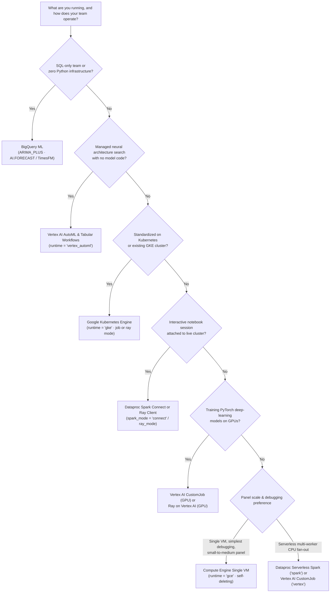

# Choosing a runtime

All seven Google Cloud runtimes in `scale-forecasting` execute the same declarative [`RunConfig`](./configuration_reference.md), apply the same rolling-origin backtests and 21 evaluation metrics, and write to the same five BigQuery registry tables and five analytical views.

This page helps you choose which runtime (or combination of runtimes) fits your team, model families, and operational constraints. Cost is covered separately in **[Cost estimates & controls](./cost_estimates.md)** and is never treated as a ranking criterion here.

---

## 1. Decision flow



---

## 2. Runtime fit matrix

| Runtime (`compute.runtime`) | Modes | Model Families Supported | GPU Support | Multi-Node / Multi-Worker Sharding | Interactive Session Mode | What Remains After Run Completion |
| :--- | :--- | :--- | :--- | :--- | :--- | :--- |
| **`bigquery`** *(automatic for `native`)* | In-warehouse SQL (`ML.FORECAST`, `AI.FORECAST`) | `native` (`bigquery_arima_plus`, `bigquery_ai_forecast`) | Managed by BigQuery (`AI.FORECAST`) | Managed inside BigQuery slots | BigQuery Studio / SQL client | Fitted BQML model object for `ARIMA_PLUS`; zero compute |
| **`spark`** | `serverless` *(default)* · `cluster` · `connect` | `statistical`, `ml`, `deep_learning` *(CPU)* | No (CPU-only on Dataproc Serverless) | Yes — Spark RDD/DataFrame partitioning across executors | Yes (`spark_mode = "connect"`) | `serverless`: zero compute. `cluster`: ephemeral cluster deleted unless pointing to a user-managed cluster |
| **`vertex`** | Serverless `CustomJob` (`workers = 1..N`) | `statistical`, `ml`, `deep_learning` | Yes (`T4`, `L4`, `A100`, `A100_80GB`) | Yes — per-worker BigQuery Storage Read API `[start_id, end_id]` ranges + LPT ordering | No (batch job submission) | Zero compute |
| **`gce`** | Single-VM container on Container-Optimized OS (`workers = 1`) | `statistical`, `ml`, `deep_learning` | Yes (`T4`, `L4`, `A100`, `A100_80GB`) | Single-VM multi-core / multi-GPU only (`workers` must be `1`) | SSH via IAP during execution if needed | Zero compute (3-way self-deletion: `maxRunDuration`, guest `trap`, launcher `finally`) |
| **`ray`** | `ray_mode = "vertex"` *(default)* · `ray_mode = "gke"` | `statistical`, `ml`, `deep_learning` | Yes (`T4`, `L4`, `A100`, `A100_80GB`) | Yes — distributed Ray tasks across cluster CPU/GPU actors | Yes (Ray Client / Job submission API) | Zero compute when ephemeral cluster tears down (`reap-clusters` cleans up interrupted runs) |
| **`gke`** | `gke_mode = "job"` *(Indexed Job)* · `gke_mode = "ray"` *(KubeRay)* | `statistical`, `ml`, `deep_learning` | Yes (`T4`, `L4`, `A100`, `A100_80GB`) | Yes — Indexed Job pod index sharding (`job`) or Ray tasks (`ray`) | Yes (in `ray` mode) | Ephemeral cluster: zero compute. Standing cluster (`create_gke = true`): cluster control plane remains while node pools scale to `0` |
| **`vertex_automl`** *(automatic for `automl`)* | `automl_mode = "tabular_workflow"` *(default)* · `automl_mode = "training_job"` | `automl` (`vertex_automl`, `vertex_tide`, `vertex_tft`, `vertex_seq2seq`, `vertex_wavenet`) | Managed inside Vertex AI Pipelines / Training | Managed Dataflow + Vertex AI distributed training & batch prediction | No (managed pipeline / job) | Trained model artifact in Vertex AI Model Registry + staging table cleanup |

---

## 3. Where each runtime has a clear structural advantage

- **BigQuery ML (`native` family):** Zero data movement outside BigQuery and no container runtime to provision. Ideal when your analysts work in SQL or when you want a zero-shot foundation baseline (`bigquery_ai_forecast` / TimesFM 2.0) and an automated seasonal ARIMA baseline (`bigquery_arima_plus`) alongside Python models.
- **Dataproc Serverless Spark (`runtime = "spark"`):** Purpose-built for wide horizontal CPU fan-out (tens of thousands of series across `statistical` and `ml` models) without managing a cluster or pre-allocating node pools.
- **Vertex AI CustomJob (`runtime = "vertex"`):** Runs the exact same container on CPU or GPU (`T4`, `L4`, `A100`, `A100_80GB`) with zero cluster management. When `workers > 1`, each worker streams its own contiguous `ts_id` slice directly from the BigQuery Storage Read API (`build_worker_series_range`), avoiding driver-side shuffle bottlenecks.
- **Compute Engine Single VM (`runtime = "gce"`):** Launches a single Container-Optimized OS VM with direct Compute Engine quota and triple-redundant self-deletion. Ideal when you want single-machine simplicity, fast startup, or GPU access using standard Compute Engine quota.
- **Ray on Vertex AI (`runtime = "ray"`, `ray_mode = "vertex"`):** Fine-grained task scheduling across heterogeneous CPU and GPU worker pools, with built-in cluster-level object sharing and interactive notebook job submission.
- **Google Kubernetes Engine (`runtime = "gke"`):** Fits organizations standardized on Kubernetes networking, workload identity, and cluster governance. Supports both lightweight Kubernetes Indexed Jobs (`gke_mode = "job"`) and KubeRay (`gke_mode = "ray"`).
- **Vertex AI AutoML & Tabular Workflows (`runtime = "vertex_automl"`):** Managed feature engineering, neural architecture search (`vertex_automl`, `vertex_tide`, `vertex_tft`, `vertex_seq2seq`, `vertex_wavenet`), and batch prediction orchestrated on Vertex AI Pipelines (`tabular_workflow`) or the Vertex AI Python SDK (`training_job`).

---

## 4. Mixing runtimes in a single `RunConfig`

In practice, you rarely need to pick a single runtime for every model family. Because the DAG router ([`dag.py`](https://github.com/statmike/scale-forecasting/blob/main/src/scale_forecasting/dag.py)) dispatches one independent job per active model family in parallel, you can set a default `compute.runtime` and override individual families under `compute.families.<family>`:

```json
{
  "run_name": "per_family_routing_example",
  "python_runtime": "spark",
  "data": {
    "source_table": "source_series_iceberg",
    "horizon": 14,
    "series_limit": 100
  },
  "models": ["timesfm", "auto_arima", "theta", "lightgbm", "tide"],
  "compute": {
    "families": {
      "ml": {
        "runtime": "vertex",
        "machine_type": "n2-standard-8",
        "workers": 2
      },
      "deep_learning": {
        "runtime": "gce",
        "machine_type": "g2-standard-8",
        "hardware": "gpu",
        "gpu_type": "L4",
        "accelerator_count": 1
      }
    }
  },
  "backtest": {
    "enabled": true,
    "n_folds": 2,
    "horizon": 14,
    "step": 7
  }
}
```

In this configuration:
1. **`native` (`timesfm`)** runs inside BigQuery ML.
2. **`statistical` (`auto_arima`, `theta`)** fans out on Dataproc Serverless Spark (`python_runtime = "spark"`).
3. **`ml` (`lightgbm`)** shards across 2 serverless Vertex AI `CustomJob` CPU workers (`runtime = "vertex"`).
4. **`deep_learning` (`tide`)** trains on an `L4` GPU on a self-deleting Compute Engine VM (`runtime = "gce"`).

Each family starts at the same time and tears down its own compute as soon as its models finish.

---

## Where next

- **[Runtimes & scaling reference](./runtimes_reference.md)** — deep dive into 3-tier dynamic resource sizing, worker barriers, LPT chunk scheduling, and per-engine architecture.
- **[Cost estimates & controls](./cost_estimates.md)** — understand what services each runtime bills and which optional components have ongoing costs.
- **[Validation ledger](./validation.md)** — inspect live execution proofs across all 7 runtimes (`configs/smokes/01`–`42`).
