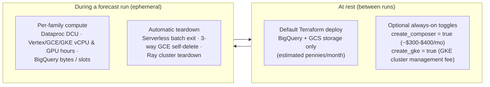

# Cost estimates & controls

Every cost figure in `scale-forecasting` is an **order-of-magnitude estimate** observed during live validation runs in `us-central1`. Cloud pricing varies by region, SKU tier, commitment discounts, and over time — always check the [Google Cloud Pricing Calculator](https://cloud.google.com/products/calculator) for current rates in your target region.

---

## 1. How to read cost statements in this repository

Whenever documentation or notebooks mention cost, they follow three rules:
1. **Labeled as an estimate:** Every figure is explicitly marked as an estimated range (`~\$X–\$Y USD`) rather than a fixed quote.
2. **Services named:** Every estimate lists the specific Google Cloud services billed (for example: Dataproc Serverless DCU-hours, Vertex AI vCPU/GPU-hours, BigQuery bytes processed, Cloud Build minutes, or Cloud Storage GB-months).
3. **Ongoing costs disclosed at the point of creation:** Any optional resource that continues billing when no forecast run is active is called out alongside the exact Terraform variable or CLI command that turns it off.

---

## 2. Services billed per runtime

| Runtime (`compute.runtime`) | Google Cloud Services Billed | Primary Cost Driver | Zero Compute Cost When Idle? |
| :--- | :--- | :--- | :--- |
| **Local / Playground** (`python -m scale_forecasting.playground`) | None (runs entirely on your local CPU) | None (`\$0` Google Cloud spend) | **Yes** |
| **`bigquery`** (`native` family: `bigquery_arima_plus`, `bigquery_ai_forecast`) | BigQuery (query bytes processed or BigQuery Editions slot-hours) + BigQuery ML model storage | Bytes scanned / slot-seconds during `CREATE MODEL`, `ML.FORECAST`, and `AI.FORECAST` | **Yes** (only standard BigQuery table/model storage remains) |
| **`spark`** (`serverless` default) | Dataproc Serverless for Spark (DCU-hours + shuffle storage) + BigQuery Storage Read/Write API | Executor vCPU/RAM duration (`total_dcu_H` in `run_registry.extra_json`) | **Yes** (`spark_mode = "serverless"`); if using `spark_mode = "cluster"` or `"connect"` against a user-managed cluster, delete the cluster when finished |
| **`vertex`** (Vertex AI `CustomJob`) | Vertex AI Training (vCPU-hours, RAM GB-hours, and optional GPU-hours) + BigQuery Storage Read/Write API | Worker machine shape × `workers` × wall-clock minutes | **Yes** |
| **`gce`** (Compute Engine single VM) | Compute Engine (vCPU-hours, RAM GB-hours, boot disk, and optional GPU-hours) + BigQuery Storage Read/Write API | Single VM machine shape × wall-clock minutes | **Yes** — enforces triple-redundant self-deletion (`scheduling.maxRunDuration`, guest COS `trap` REST self-delete, and launcher `finally`) |
| **`ray`** (`ray_mode = "vertex"` or `"gke"`) | Vertex AI PersistentResource (or GKE node pools) vCPU/GPU-hours + BigQuery Storage Read/Write API | Head + worker node shapes × cluster lifetime (including ~5–10 min cluster provisioning) | **Yes** when launched per run (ephemeral cluster is deleted in `finally`; run `python -m scale_forecasting.registry.ops reap-clusters` if a driver was force-killed) |
| **`gke`** (`gke_mode = "job"` or `"ray"`) | Google Kubernetes Engine (cluster management fee + Autopilot pod resources or Standard node pool Compute Engine vCPU/GPU-hours) | Node pool vCPU/GPU-hours during job execution + GKE cluster management fee | **Ephemeral per-run cluster:** Yes. **Standing cluster (`create_gke = true`):** Node pools scale to `0` at rest, but the GKE cluster management fee (~`\$0.10/hr` beyond the free tier) applies while the cluster exists |
| **`vertex_automl`** (`tabular_workflow` or `training_job`) | Vertex AI Pipelines, Dataflow (`feature_transform_engine`), Vertex AI AutoML Training (`train_budget_milli_node_hours`), Vertex AI Batch Prediction, BigQuery staging | `train_budget_milli_node_hours` (minimum 1,000 milli-node-hours = 1 node-hour) + Dataflow transform + Batch Prediction | **Yes** after the pipeline and batch prediction complete |

---

## 3. Always-on and ongoing costs (and how to turn them off)

By default (`create_composer = false`, `create_gke = false`), a deployed `scale-forecasting` environment has **no standing compute**. Only the optional resources below incur continuous charges while idle:

| Resource | Default State | Estimated Ongoing Cost While Active | How to Turn It Off & Clean Up |
| :--- | :--- | :--- | :--- |
| **Cloud Composer 3 Environment** (`create_composer`) | **Off** (`false`) | Estimated `~\$300–\$400/month` continuous billing while the environment exists (Cloud Composer 3 minimum environment footprint + Cloud SQL / worker compute). | Set `create_composer = false` in `terraform/main/terraform.tfvars` and run `terraform apply`. **Important leftover bucket note:** deleting a Cloud Composer environment does **not** automatically delete the Composer-managed Cloud Storage bucket (`<region>-<env-name>-<hash>-bucket`), which continues to bill for stored objects until you delete that bucket with `gcloud storage rm -r gs://<composer-bucket>`. |
| **Standing GKE Cluster** (`create_gke`) | **Off** (`false`) | CPU and GPU node pools autoscale to `0` nodes at rest (`\$0` node compute when idle), but GKE charges a cluster management fee (`~\$0.10/hr`, or `~\$73/month` if not covered by your billing account's GKE free tier credit). | Set `create_gke = false` in `terraform/main/terraform.tfvars` and run `terraform apply` (or leave `create_gke = false` and let `gke_submit` create and destroy an ephemeral cluster per run). |
| **Persistent Runner VM** (`sf-runner` in `operations.md` §4) | **Not created** unless you run the `gcloud compute instances create sf-runner` command for multi-hour detached runs | Estimated `~\$0.10–\$0.15/hr` (`e2-standard-4` + 50 GB disk) while the VM exists. | Delete immediately after your multi-hour run finishes: `gcloud compute instances delete sf-runner --project "$PROJECT" --zone "$ZONE" --quiet`. |
| **Orphaned Vertex Ray Clusters** (if a launcher was `SIGKILL`ed mid-run) | Cleaned up automatically on normal exit | Head + worker vCPU/GPU-hours until deleted (Vertex `PersistentResource` has no automatic idle timeout). | Preview and delete any orphaned Ray clusters with `uv run python -m scale_forecasting.registry.ops reap-clusters --yes`. |
| **BigQuery Tables, Cloud Storage & Artifact Registry** | **On** (holds the 100k synthetic seed, container image, and run registry) | Estimated pennies to a few dollars per month (`~1.5 GB` BigQuery storage + `~2 GB` Cloud Storage + `~4 GB` container image in Artifact Registry). | Prune old runs with `python -m scale_forecasting.registry.ops drop-run <RUN_ID> --yes` and `sweep-orphans --yes`, or tear down the entire stage-2 deployment with `terraform destroy`. |

---

## 4. Order-of-magnitude run bands

The table below gives estimated cost bands for common operations in `us-central1` based on live runs recorded in the **[Validation ledger](./validation.md)**:

| Workload | Typical Configuration | Services Billed | Wall-Clock Time | Estimated Cost Band (USD) |
| :--- | :--- | :--- | :--- | :--- |
| **Local Playground** (`3–10` series, offline) | `python -m scale_forecasting.playground` or [`notebooks/00_model_playground.ipynb`](./notebooks/00_model_playground.ipynb) | None (local CPU) | `~5–20 sec` | **`\$0.00`** (no cloud project required) |
| **One-Time Terraform Bootstrap & 100k Seed** | `terraform apply` (`build_image = true`, `run_seed = true` at 100,000 series) | Cloud Build (`linux/amd64` image build), Dataproc Serverless Spark (~8.5 min seed batch), BigQuery Storage Write API, Cloud Storage | `~12–15 min` | **Estimated `~\$0.25–\$1.00`** (one-time; content-addressed so subsequent applies do not rebuild or reseed) |
| **100-Series Smoke Run** (single CPU/SQL/GPU family) | `configs/smokes/01_*.json`–`42_*.json` (`max_series = 50..100`) | Selected runtime (`spark`, `vertex`, `gce`, `ray`, `gke`, or `bigquery`) + BigQuery read/write | `~1–8 min` | **Estimated `~\$0.05–\$0.50`** per smoke run (excluding AutoML, below) |
| **Vertex AI AutoML / Tabular Workflow Run** | `configs/smokes/28_*.json`–`30_*.json`, `38`–`42` (`train_budget_milli_node_hours = 1000`) | Vertex AI Pipelines, Dataflow, Vertex AI AutoML Training (1 node-hour minimum), Vertex AI Batch Prediction, BigQuery | `~45–90 min` | **Estimated `~\$3–\$22`** per run (dominated by Vertex AI AutoML training and batch prediction node-hours) |
| **10,000-Series Multi-Family Benchmark** | [`configs/all_families_10k_full.json`](https://github.com/statmike/scale-forecasting/blob/main/configs/all_families_10k_full.json) (`statistical` + `ml` + `deep_learning` + `native`, 2 backtest folds) | Dataproc Serverless / Ray / Vertex AI CPU & GPU worker-hours + BigQuery Storage API | `~20–60 min` | **Estimated `~\$2–\$10`** (depends on number of deep-learning models and backtest folds) |
| **100,000-Series Full-Scale Production Run** | [`configs/explode_100k.json`](https://github.com/statmike/scale-forecasting/blob/main/configs/explode_100k.json) / [`configs/ray_100k.json`](https://github.com/statmike/scale-forecasting/blob/main/configs/ray_100k.json) | Dataproc Serverless DCU-hours, Vertex AI / GKE / Ray multi-worker CPU & GPU hours, BigQuery Storage Read/Write API | `~25–90 min` | **Estimated `~\$5–\$35`** (varies with active model families, backtest windows, and GPU selection) |

---

## 5. Built-in cost controls

`scale-forecasting` enforces five automated safeguards so runs do not over-provision or leave compute running:

1. **Monthly Cloud Billing Budget (`terraform/main/modules/budget`):** Provisioned automatically during `terraform apply` with 50 %, 90 %, and 100 % email alert thresholds (note: Google Cloud budgets send alerts; they do not hard-cap API spend).
2. **Per-Family Zero-Idle DAG Teardown (`dag.py`):** Each model family (`statistical`, `ml`, `deep_learning`, `automl`, `native`) launches as an independent job and releases its compute as soon as that family completes.
3. **3-Tier Dynamic Sizing & Live Quota Preflight (`resources/sizing.py`, `probes/`):** Right-sizes `machine_type` and `workers` to the actual series count (`max_series`) and live regional quota so a 100-series smoke test never provisions a 32-worker cluster.
4. **Triple-Redundant GCE Self-Deletion (`engines/vertex_engine.py`):** Every single-VM Compute Engine run sets `scheduling.maxRunDuration` + `instanceTerminationAction = "DELETE"`, a guest Container-Optimized OS `trap cleanup EXIT` self-delete call, and a launcher `try ... finally` delete call.
5. **Deterministic Content-Addressed `run_id` & Resume (`--resume`):** Re-running or resuming a configuration reuses completed family jobs instead of recomputing families that already succeeded.

---

## Where next

- **[Choosing a runtime](./choosing_a_runtime.md)** — compare the 7 runtimes by workload fit, sharding, and operational model.
- **[Quota, sizing & scale proof](./quota_and_scale.md)** — inspect the 3-tier sizing formulas and 100k-series telemetry.
- **[Operations runbook](./operations.md)** — manage the registry, prune old runs (`drop-run`, `sweep-orphans`), and reap interrupted clusters (`reap-clusters`).
