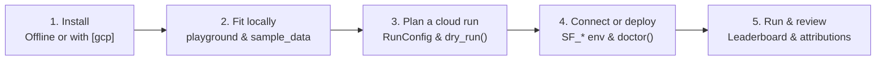

# Getting started

This guide takes you from a fresh Python environment to your first local forecast in five minutes, and from there to your first distributed forecast run on Google Cloud.



---

## 1. Choose your starting point and install

`scale-forecasting` separates its pure offline forecasting layer from Google Cloud clients and optional third-party model libraries so you can install only what you need (requires **Python 3.11**):

| Goal | Install command (`uv` or `pip`) | What you get |
| :--- | :--- | :--- |
| **Try locally (no Google Cloud account needed)** | `pip install scale-forecasting` | 15 built-in models (NumPy, SciPy, statsmodels, scikit-learn), all 21 evaluation metrics, rolling-origin backtesting, conformal calibration, 7 FPP3 reconciliation methods, ensembling, synthetic data, and `RunConfig` dry-run planning. |
| **Try locally with all open-source models + plots** | `pip install "scale-forecasting[models-stats,models-trees,models-prophet,models-dl,notebook]"` | Adds StatsForecast, LightGBM, XGBoost, CatBoost, Prophet, NeuralProphet, NeuralForecast (`TiDE`, `TFT`, `TSMixer`, `PatchTST`), and matplotlib plotting helpers. |
| **Submit and review runs on Google Cloud** | `pip install "scale-forecasting[gcp,notebook]"` | Adds the Google Cloud clients (BigQuery, Storage, Dataproc, Vertex AI) plus plotting helpers for reviewing runs from a laptop or notebook. |
| **Full contributor / workstation checkout** | `git clone https://github.com/statmike/scale-forecasting.git && cd scale-forecasting && uv sync --all-extras` | Locked environment with every runtime client (`spark`, `ray`, `gcp`), every model family, and notebook tooling. |

Full extra-by-extra breakdown: [Runtime dependencies](./runtime_dependencies.md#dependency-extras).

---

## 2. Fit your first forecast locally (no cloud, no credentials)

Run the built-in playground from your terminal to list available models, fit a single model with rolling-origin backtesting, or compare multiple models head-to-head on synthetic series:

```bash
# List all 34 registered models and which ones are installed in your environment
python -m scale_forecasting.playground --list

# Fit Theta on a synthetic daily series with a 3-fold expanding backtest and 14-day horizon
python -m scale_forecasting.playground --model theta --backtest --horizon 14

# Run an in-memory bakeoff across multiple models and print the WAPE leaderboard
python -m scale_forecasting.playground --bakeoff theta,holtwinters,naive_seasonal --horizon 14
```

Or run the same worker contract directly from Python:

```python
import scale_forecasting as sf
from scale_forecasting import playground

# Generate a deterministic 3-series daily panel in memory (same generator used at 100k scale)
panel = playground.sample_data(n_series=3, history=730)

# Fit and backtest a model on one series using the local playground helper
result = playground.run_one(model="theta", horizon=14, backtest=True)
print(f"Status: {result.status} | Backtest WAPE: {result.metrics['wape']:.4f}")
```

Want a guided interactive walkthrough with plots, covariates, feature attributions, and hierarchical reconciliation? Open [`00_model_playground.ipynb`](./notebooks/00_model_playground.ipynb).

---

## 3. Author a `RunConfig` and run an offline preflight

Every cloud or local experiment is defined by a declarative [`RunConfig`](./configuration_reference.md) JSON file (or Python dictionary). The configuration hashes to a deterministic `<slug>-<12hex>` `run_id` and can be validated and sized completely offline before touching Google Cloud:

```json
{
  "run_name": "getting_started_demo",
  "data": {
    "source_table": "source_series_iceberg",
    "series_limit": 100,
    "horizon": 14
  },
  "models": ["theta", "holtwinters", "xgboost", "arima_plus"],
  "compute": {
    "families": {
      "statistical": {"runtime": "spark"},
      "ml": {"runtime": "vertex"}
    }
  },
  "backtest": {
    "enabled": true,
    "scheme": "expanding",
    "n_folds": 3,
    "decision_metric": "wape"
  },
  "ensemble": {
    "enabled": true,
    "strategies": ["mean", "inverse_error", "nnls"]
  }
}
```

Preview the execution DAG, family routing, and total model fits offline with `--dry-run` or `Forecaster.dry_run()`:

```bash
python -m scale_forecasting.main --config configs/ensemble_demo.json --dry-run
```

```python
import scale_forecasting as sf

forecaster = sf.Forecaster.from_file("configs/ensemble_demo.json")
plan = forecaster.dry_run()
print(f"Run ID   : {plan.run_id}")
print(f"Families : {[job.family for job in plan.dag.python_jobs]} + native={plan.dag.native_job is not None}")
print(f"Fan-out  : {plan.fanout.n_series} series × {len(plan.python_models) + len(plan.bq_models)} models")
```

---

## 4. Connect to (or deploy) your Google Cloud project

### Option A: Deploy a new environment with Terraform (~15 minutes)

If your Google Cloud project does not have the `scale-forecasting` dataset, buckets, service accounts, container image, and 100,000-series seed tables yet, apply the two-stage Terraform in [`terraform/README.md`](https://github.com/statmike/scale-forecasting/blob/main/terraform/README.md):

```bash
# Stage 1: bootstrap the project APIs and remote state bucket
cd terraform/bootstrap
terraform init
terraform apply -var="project_id=YOUR_PROJECT_ID" -var="billing_account=YOUR_BILLING_ID"

# Stage 2: provision BigQuery, buckets, VPC, service accounts, container image, and 100k seed data
cd ../main
terraform init
terraform apply -var="project_id=YOUR_PROJECT_ID"
```

> **Estimated deployment cost:** The one-time container build (Cloud Build + Artifact Registry) and 100,000-series seed batch (Dataproc Serverless) typically cost an estimated **~\$0.15–\$0.50**. At rest, the provisioned BigQuery dataset, Cloud Storage buckets, VPC network, and service accounts have no running compute cost (only standard storage rates for stored bytes). Optional Cloud Composer 3 (`create_composer = false` by default) bills continuously while provisioned. Full walkthrough: [Deploying on GCP](./deploying_on_gcp.md).

### Option B: Point your shell or notebook at an existing deployment

Export the deployment's identity environment variables (printed by `terraform output` in Stage 2, and pre-set automatically inside the `sf-main` Colab Enterprise runtime template):

```bash
export SF_PROJECT_ID="your-project-id"
export SF_REGION="us-central1"
export SF_DATASET_ID="scale_forecasting"
export SF_CONNECTION="your-project-id.us-central1.biglake-iceberg"
export SF_WAREHOUSE_URI="gs://your-project-id-sf-iceberg/warehouse"
```

Run the read-only health check to confirm your credentials, dataset, buckets, and quotas are ready:

```bash
python -m scale_forecasting.registry.ops doctor
```

---

## 5. Launch your first cloud run and review the leaderboard

Submit the run from the CLI or Python SDK:

```bash
python -m scale_forecasting.main --config configs/ensemble_demo.json
```

```python
import scale_forecasting as sf

forecaster = sf.Forecaster.from_file("configs/ensemble_demo.json")

# Check live series lengths and fold coverage before launching
print(forecaster.feasibility())

# Submit the per-family DAG and stream live progress until completion
result = forecaster.run_live()

# Inspect the holdout leaderboard, per-horizon forecasts, and feature attributions
print(forecaster.leaderboard_df(comparable=True))
print(forecaster.predictions_df().head())
print(forecaster.attributions_df().head())

# Plot the leaderboard and a single series' forecast + prediction interval
review = sf.review_run(result.run_id)
sf.plot_leaderboard(review)
```

Or query the curated BigQuery views directly from SQL or Looker:

```sql
-- Comparable holdout-fold leaderboard (pooled WAPE and MAE across identical series)
SELECT model_type, ensemble_id, n_series, pooled_wape, pooled_mae
FROM `YOUR_PROJECT_ID.scale_forecasting.v_model_leaderboard_comparable`
WHERE run_id = 'YOUR_RUN_ID'
ORDER BY pooled_wape ASC;

-- Run-level time ledger and resource sizing summary
SELECT run_id, status, n_series, n_models, n_jobs, longest_job_seconds, jobs_span_seconds, overhead_seconds
FROM `YOUR_PROJECT_ID.scale_forecasting.v_run_summary`
WHERE run_id = 'YOUR_RUN_ID';
```

---

## Where to go next

- **[Platform overview](./overview.md):** Conceptual tour of the 7 runtimes, 34 models, 21 metrics, and 5 analytical SQL views.
- **[Running and reviewing](./running_and_reviewing.md):** Full operator loop — feasibility checks, quota preflight, live monitoring, and re-ensembling.
- **[Notebook tour](./notebooks/README.md):** 11 end-to-end notebooks (`00`–`10`) across local sandbox, cloud runtimes, covariates/hierarchy/HPO, and operations.
- **[Compute runtimes reference](./runtimes_reference.md):** Detailed guide to `spark`, `ray`, `vertex`, `gce`, `gke`, `vertex_automl`, and `bigquery`.
- **[Configuration reference](./configuration_reference.md):** Every `RunConfig` section, field, default, and validation rule.
