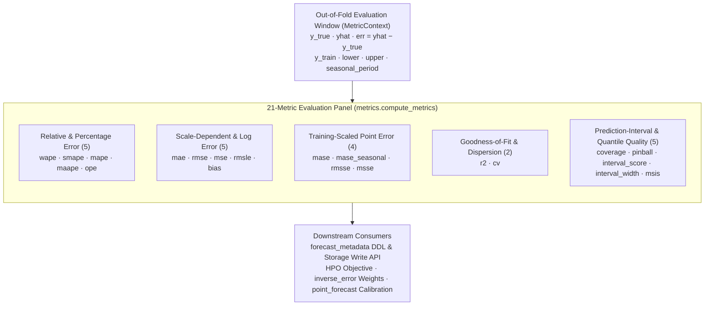

# Evaluation metrics reference

`scale-forecasting` computes **21 built-in evaluation metrics** for every `(series, model)` cell during rolling-origin backtesting. Every metric subclasses [`BaseMetric`](https://github.com/statmike/scale-forecasting/blob/main/src/scale_forecasting/metrics/base_metric.py) in its own module under [`src/scale_forecasting/metrics/`](https://github.com/statmike/scale-forecasting/tree/main/src/scale_forecasting/metrics) and is listed in `METRIC_NAMES` in [`src/scale_forecasting/metrics/__init__.py`](https://github.com/statmike/scale-forecasting/blob/main/src/scale_forecasting/metrics/__init__.py).

All four model families (`statistical`, `ml`, `deep_learning`, and `native`) and all six ensemble strategies are scored through the exact same Python function (`metrics.compute_metrics`), guaranteeing that a metric column in `forecast_metadata` has an identical mathematical definition regardless of which compute engine produced the forecast.

---

## Complete 21-metric catalog

Every metric in `METRIC_NAMES` is computed on each backtest fold and averaged across folds onto the cell's summary row in `forecast_metadata`. Any registered metric can be selected as `backtest.decision_metric`.

| Metric | Category | `direction` | `mean_optimal` | Needs `y_train` | Needs Intervals | Formula & Summary |
| :--- | :--- | :---: | :---: | :---: | :---: | :--- |
| **`wape`** | Relative / % | `lower` | `False` | No | No | $\sum \|y_t - \hat{y}_t\| / \sum \|y_t\|$. Default `decision_metric`; scale-independent and safe when individual observations are zero. |
| **`smape`** | Relative / % | `lower` | `False` | No | No | $\frac{1}{H}\sum \frac{2\|y_t - \hat{y}_t\|}{\|y_t\| + \|\hat{y}_t\|}$. Symmetric MAPE bounded in $[0, 2]$ ($0/0 \mapsto 0$). |
| **`mape`** | Relative / % | `lower` | `False` | No | No | $\frac{1}{H}\sum \|(y_t - \hat{y}_t) / y_t\|$. Returns `NaN` if any $y_t = 0$. |
| **`maape`** | Relative / % | `lower` | `False` | No | No | $\frac{1}{H}\sum \arctan(\|y_t - \hat{y}_t\| / \|y_t\|)$. Bounded in $[0, \pi/2]$; finite even when $y_t = 0$. |
| **`ope`** | Relative / % | `lower` | `False` | No | No | $\|\sum y_t - \sum \hat{y}_t\| / \|\sum y_t\|$. Overall Percentage Error over cumulative horizon volume. |
| **`mae`** | Scale-Dependent | `lower` | `False` | No | No | $\frac{1}{H}\sum \|y_t - \hat{y}_t\|$. Mean Absolute Error in native target units. |
| **`rmse`** | Scale-Dependent | `lower` | `True` | No | No | $\sqrt{\frac{1}{H}\sum (y_t - \hat{y}_t)^2}$. Root Mean Squared Error in native target units. |
| **`mse`** | Scale-Dependent | `lower` | `True` | No | No | $\frac{1}{H}\sum (y_t - \hat{y}_t)^2$. Mean Squared Error. |
| **`rmsle`** | Log-Scale | `lower` | `False` | No | No | $\sqrt{\frac{1}{H}\sum (\ln(1 + y_t) - \ln(1 + \hat{y}_t))^2}$. Penalizes relative ratios; returns `NaN` if any $y_t < 0$ or $\hat{y}_t < 0$. |
| **`bias`** | Signed Diagnostic | `zero` | `True` | No | No | $\frac{1}{H}\sum (\hat{y}_t - y_t)$. Positive = over-forecasting; negative = under-forecasting. Ranked by $\|\text{bias}\|$. |
| **`mase`** | Scaled (`m=1`) | `lower` | `False` | Yes | No | $\text{MAE} / \frac{1}{T-1}\sum_{t=2}^T \|y_t^{\text{train}} - y_{t-1}^{\text{train}}\|$. Values $< 1.0$ beat a one-step naive walk. |
| **`mase_seasonal`** | Scaled (`m=P`) | `lower` | `False` | Yes | No | $\text{MAE} / \frac{1}{T-m}\sum_{t=m+1}^T \|y_t^{\text{train}} - y_{t-m}^{\text{train}}\|$. Scaled by seasonal naive error ($m$ from `data.freq`). |
| **`rmsse`** | Scaled (`m=1`) | `lower` | `True` | Yes | No | $\text{RMSE} / \sqrt{\frac{1}{T-1}\sum_{t=2}^T (y_t^{\text{train}} - y_{t-1}^{\text{train}})^2}$. M5 competition root mean squared scaled error. |
| **`msse`** | Scaled (`m=1`) | `lower` | `True` | Yes | No | $\text{MSE} / \frac{1}{T-1}\sum_{t=2}^T (y_t^{\text{train}} - y_{t-1}^{\text{train}})^2$. Mean Squared Scaled Error ($\text{RMSSE}^2$). |
| **`r2`** | Goodness-of-Fit | `higher` | `True` | No | No | $1 - \sum (y_t - \hat{y}_t)^2 / \sum (y_t - \bar{y})^2$. Coefficient of determination ($1.0$ is perfect; $< 0$ is worse than predicting $\bar{y}$). |
| **`cv`** | Dispersion | `lower` | `True` | No | No | $\text{RMSE} / \bar{y}$. Coefficient of Variation of RMSE normalized by the evaluation window mean. |
| **`coverage`** | Interval (`80%` PI) | `higher` | `False` | No | Yes | Fraction of $y_t \in [\hat{y}^{\text{lower}}, \hat{y}^{\text{upper}}]$. Empirical coverage fraction against the $(0.1, 0.9)$ band. |
| **`pinball`** | Interval (Quantile) | `lower` | `False` | No | Yes | Mean quantile pinball loss averaged across the $q_{0.10}$ and $q_{0.90}$ bounds ($\frac{\alpha}{2} \times \text{Winkler}$). |
| **`interval_score`** | Interval (Proper) | `lower` | `False` | No | Yes | Winkler / Gneiting-Raftery score ($\alpha = 0.20$): width plus $\frac{2}{\alpha}$ penalty for out-of-band actuals. |
| **`interval_width`** | Interval (`80%` PI) | `lower` | `False` | No | Yes | $\frac{1}{H}\sum (\hat{y}^{\text{upper}} - \hat{y}^{\text{lower}})$. Sharpness of the prediction interval in target units. |
| **`msis`** | Interval (Scaled) | `lower` | `False` | Yes | Yes | $\text{Winkler} / \text{seasonal naive MAE}$. M4 competition Mean Scaled Interval Score. |

---

## Mathematical definitions & edge-case behavior

Every metric implementation guards all divisors and domain boundaries, returning `float("nan")` rather than raising when a quantity is undefined for a specific series or fold.

### 1. Relative & percentage point metrics

Let $y_1, \dots, y_H$ denote the validation actuals and $\hat{y}_1, \dots, \hat{y}_H$ denote the point forecasts, with error $e_t = \hat{y}_t - y_t$:

- **`wape` (Weighted Absolute Percentage Error):**
  $$\text{WAPE} = \frac{\sum_{t=1}^H |e_t|}{\sum_{t=1}^H |y_t|}$$
  Returns `NaN` only if $\sum_{t=1}^H |y_t| = 0$. Because it weights errors by volume and survives individual zero actuals, `wape` is the default `backtest.decision_metric`.
- **`smape` (Symmetric Mean Absolute Percentage Error):**
  $$\text{sMAPE} = \frac{1}{H}\sum_{t=1}^H \frac{2|e_t|}{|y_t| + |\hat{y}_t|}$$
  Pairs where $y_t = \hat{y}_t = 0$ contribute $0.0$. Bounded in $[0, 2]$.
- **`mape` (Mean Absolute Percentage Error):**
  $$\text{MAPE} = \frac{1}{H}\sum_{t=1}^H \left|\frac{e_t}{y_t}\right|$$
  Returns `NaN` if any $y_t = 0$ in the evaluation window.
- **`maape` (Mean Arctangent Absolute Percentage Error):**
  $$\text{MAAPE} = \frac{1}{H}\sum_{t=1}^H \arctan\left(\left|\frac{e_t}{y_t}\right|\right)$$
  Kim & Kim (2016). Where $y_t = 0$ and $\hat{y}_t \ne 0$, the ratio is $\infty$ and $\arctan(\infty) = \pi/2$; where $y_t = \hat{y}_t = 0$, the term contributes $0.0$. Never returns `NaN`.
- **`ope` (Overall Percentage Error):**
  $$\text{OPE} = \frac{\left|\sum_{t=1}^H y_t - \sum_{t=1}^H \hat{y}_t\right|}{\left|\sum_{t=1}^H y_t\right|}$$
  Measures total cumulative horizon error relative to cumulative actual volume (allowing positive and negative step errors to offset across the horizon). Returns `NaN` if $\sum_{t=1}^H y_t = 0$.

---

### 2. Scale-dependent & log-scale point metrics

- **`mae` (Mean Absolute Error):** $\frac{1}{H}\sum_{t=1}^H |e_t|$.
- **`mse` (Mean Squared Error):** $\frac{1}{H}\sum_{t=1}^H e_t^2$.
- **`rmse` (Root Mean Squared Error):** $\sqrt{\text{MSE}}$.
- **`rmsle` (Root Mean Squared Logarithmic Error):**
  $$\text{RMSLE} = \sqrt{\frac{1}{H}\sum_{t=1}^H \left(\ln(1 + y_t) - \ln(1 + \hat{y}_t)\right)^2}$$
  Penalizes under-forecasts and over-forecasts symmetrically in log-ratio space. Returns `NaN` if any $y_t < 0$ or $\hat{y}_t < 0$.
- **`bias` (Signed Mean Error):**
  $$\text{Bias} = \frac{1}{H}\sum_{t=1}^H (\hat{y}_t - y_t)$$
  Positive values indicate systematic over-forecasting; negative values indicate under-forecasting.

---

### 3. Training-scaled point metrics

Training-scaled metrics normalize out-of-fold error by the in-sample variation of the fold's own training window $y_1^{\text{train}}, \dots, y_T^{\text{train}}$ (observations at or before the fold's `cutoff_date`):

- **`mase` (Mean Absolute Scaled Error, $m = 1$):**
  $$\text{MASE} = \frac{\text{MAE}}{\frac{1}{T - 1}\sum_{t=2}^T |y_t^{\text{train}} - y_{t-1}^{\text{train}}|}$$
  Returns `NaN` if $T < 2$ or if the training series is constant.
- **`mase_seasonal` (Seasonal MASE, $m = P$):**
  $$\text{MASE}_{\text{seasonal}} = \frac{\text{MAE}}{\frac{1}{T - m}\sum_{t=m+1}^T |y_t^{\text{train}} - y_{t-m}^{\text{train}}|}$$
  Uses the seasonal cycle $m$ corresponding to `data.freq` (`7` for `D`, `52` for `W`, `12` for `MS`/`ME`, `24` for `h`). Returns `NaN` if $T \le m$ or if all seasonal differences are zero.
- **`rmsse` (Root Mean Squared Scaled Error, $m = 1$):**
  $$\text{RMSSE} = \frac{\text{RMSE}}{\sqrt{\frac{1}{T - 1}\sum_{t=2}^T (y_t^{\text{train}} - y_{t-1}^{\text{train}})^2}}$$
- **`msse` (Mean Squared Scaled Error, $m = 1$):**
  $$\text{MSSE} = \frac{\text{MSE}}{\frac{1}{T - 1}\sum_{t=2}^T (y_t^{\text{train}} - y_{t-1}^{\text{train}})^2} = \text{RMSSE}^2$$

---

### 4. Goodness-of-fit & dispersion metrics

- **`r2` (Coefficient of Determination, $R^2$):**
  $$R^2 = 1 - \frac{\sum_{t=1}^H (y_t - \hat{y}_t)^2}{\sum_{t=1}^H (y_t - \bar{y})^2}$$
  where $\bar{y} = \frac{1}{H}\sum_{t=1}^H y_t$. Equals $1.0$ for a perfect forecast, $0.0$ for a constant forecast equal to $\bar{y}$, and $< 0$ when the forecast has higher squared error than $\bar{y}$. Returns `NaN` if $y_t$ is constant over the evaluation window ($\sum (y_t - \bar{y})^2 = 0$).
- **`cv` (Coefficient of Variation of RMSE):**
  $$\text{CV} = \frac{\text{RMSE}}{\bar{y}}$$
  Expresses root mean squared error as a fraction of the mean actual $\bar{y}$. Returns `NaN` if $\bar{y} = 0$.

---

### 5. Prediction-interval & quantile quality metrics

Prediction intervals $[\hat{y}_t^{\text{lower}}, \hat{y}_t^{\text{upper}}]$ are evaluated at the nominal $(q_{\text{low}}, q_{\text{high}}) = (0.10, 0.90)$ quantile pair ($1 - \alpha = 0.80$, $\alpha = 0.20$). Ensemble rows do not emit prediction intervals, so all five interval metrics evaluate to `NaN` on ensembles.

- **`coverage` (Empirical Coverage):**
  $$\text{Coverage} = \frac{1}{H}\sum_{t=1}^H \mathbb{I}\left(\hat{y}_t^{\text{lower}} \le y_t \le \hat{y}_t^{\text{upper}}\right)$$
- **`interval_width` (Mean Interval Width):**
  $$\text{Width} = \frac{1}{H}\sum_{t=1}^H \left(\hat{y}_t^{\text{upper}} - \hat{y}_t^{\text{lower}}\right)$$
- **`interval_score` (Winkler / Gneiting-Raftery Proper Interval Score):**
  $$\text{IS}_\alpha = \frac{1}{H}\sum_{t=1}^H \left[ (\hat{y}_t^{\text{upper}} - \hat{y}_t^{\text{lower}}) + \frac{2}{\alpha}(\hat{y}_t^{\text{lower}} - y_t)\mathbb{I}(y_t < \hat{y}_t^{\text{lower}}) + \frac{2}{\alpha}(y_t - \hat{y}_t^{\text{upper}})\mathbb{I}(y_t > \hat{y}_t^{\text{upper}}) \right]$$
- **`pinball` (Mean Quantile Pinball Loss):**
  Average of the pinball loss at $q = 0.10$ and $q = 0.90$. By algebraic identity, $\text{Pinball} = \frac{\alpha}{4}\text{IS}_\alpha = 0.05 \times \text{IS}_{0.20}$ averaged per bound (or $\frac{\alpha}{2} = 0.10$ of the total interval score).
- **`msis` (Mean Scaled Interval Score):**
  $$\text{MSIS} = \frac{\text{IS}_\alpha}{\frac{1}{T - m}\sum_{t=m+1}^T |y_t^{\text{train}} - y_{t-m}^{\text{train}}|}$$
  M4 competition metric: normalizes `interval_score` by the in-sample seasonal naive error ($m$ derived from `data.freq`, falling back to $m = 1$ when no `seasonal_period` is supplied). Returns `NaN` if the training series has fewer than $m + 1$ observations or zero seasonal variation.

---

## How `direction` and `mean_optimal` drive the pipeline

Each metric class declares two behavioral flags that integrate it with HPO, ensembling, and point-forecast calibration:

1. **`direction` (`"lower"`, `"higher"`, or `"zero"`):**
   `metrics.loss_of(name, value)` converts any metric into a scalar loss where smaller is always better:
   - `"lower"` (18 metrics): $\text{loss} = \text{value}$
   - `"higher"` (`coverage`, `r2`): $\text{loss} = 1.0 - \text{value}$
   - `"zero"` (`bias`): $\text{loss} = |\text{value}|$
   - Non-finite (`NaN`): $\text{loss} = +\infty$
   This single transformation drives Optuna trial ranking (`hpo.py`), `inverse_error` ensemble weights (`ensembler.py`), and `ensemble.prune_threshold`.

2. **`mean_optimal` (`True` or `False`):**
   Used by [`calibration.py`](https://github.com/statmike/scale-forecasting/blob/main/src/scale_forecasting/calibration.py) and `config.corrected_arm_for()` to pair each metric with the statistically optimal residual shift under `output.point_forecast: "auto"`:
   - **`mean_optimal = True`** (`rmse`, `mse`, `rmsse`, `msse`, `r2`, `cv`, `bias`): Squared-error and variance-based metrics are optimized by shifting the raw forecast by the **mean** out-of-fold residual (`"mean"` arm).
   - **`mean_optimal = False`** (all absolute-error, percentage-error, log-error, and interval metrics): Minimized by shifting by the **median** residual (`"median"` arm).

---

## Adding a custom metric

Adding a new metric requires **one file** in `src/scale_forecasting/metrics/` and **one entry in `METRIC_NAMES`** in `src/scale_forecasting/metrics/__init__.py`:

1. Copy [`docs/metric_template.py`](https://github.com/statmike/scale-forecasting/blob/main/docs/metric_template.py) to `src/scale_forecasting/metrics/my_metric.py`.
2. Set `name`, `direction`, any `needs_*` flags, `mean_optimal`, and implement `compute(ctx)`.
3. Import `my_metric` and append `"my_metric"` to `METRIC_NAMES` in `src/scale_forecasting/metrics/__init__.py`.

The BigQuery table column (`forecast_metadata.my_metric`), `ADD COLUMN IF NOT EXISTS` migration for existing deployments, Storage Write API protobuf descriptor, and `review_run` summary projections (`mean_my_metric`, `p10_`, `p50_`, `p90_`) are all generated automatically from `METRIC_NAMES`.

See **[Adding a metric (`docs/adding_a_metric.md`)](./adding_a_metric.md)** for the full contract and step-by-step walkthrough.
