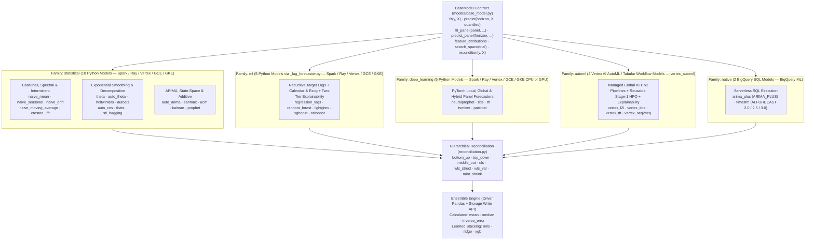
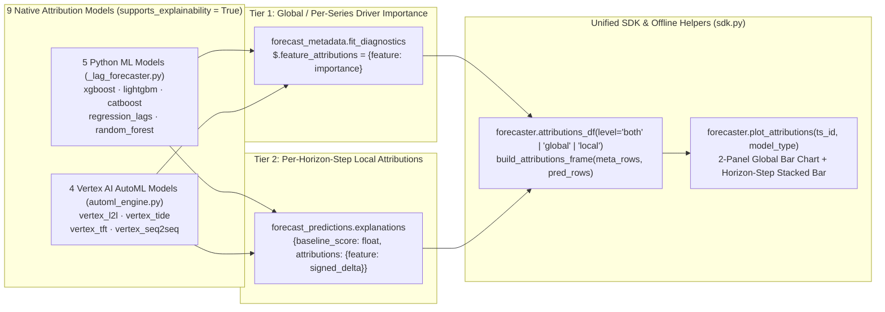

# Models & ensembles reference

`scale-forecasting` ships **34 built-in forecasting models** (28 Python models, 4 Vertex AI AutoML models, and 2 BigQuery-native SQL models) alongside **6 ensemble blending and stacking strategies** and **7 hierarchical forecast reconciliation methods**. Every model implements the [`BaseModel`](https://github.com/statmike/scale-forecasting/blob/main/src/scale_forecasting/models/base_model.py) contract in its own module under [`src/scale_forecasting/models/`](https://github.com/statmike/scale-forecasting/tree/main/src/scale_forecasting/models) and registers itself at import time.

When a run is submitted, the orchestrator groups the requested models by **`family`** (`statistical`, `ml`, `deep_learning`, `automl`, and `native`) and routes each family to its designated compute runtime in parallel.



---

## Complete model catalog

Every model declares its upstream open-source package (`package` and `package_url` on [`BaseModel`](./api/models_base_model.md)), execution family, univariate & three-tier covariate support (`supports_future_covariates`, `supports_past_covariates`, `supports_static_covariates`), two-tier feature attribution support (`supports_explainability`), supported training modes (`local`, `global`, `hybrid`), hierarchical reconciliation support, and fast state updates (`expanding_frozen` backtesting via `supports_recondition`).

| Model | Family | Runtime | Upstream Package | Univariate | Covariates (`Future` / `Past` / `Static`) | Explainability (`attributions_df`) | Training Modes | Reconciliation | Native Intervals | Frozen Origin (`recondition`) | Methodology & Summary |
| :--- | :--- | :--- | :--- | :---: | :---: | :---: | :---: | :---: | :---: | :---: | :--- |
| **`naive_mean`** | `statistical` | Python | [`numpy`](https://numpy.org/) | Yes | No / No / No | Structural | `local` | All 7 FPP3 | No | No | Constant forecast equal to the training sample mean with empirical residual intervals. |
| **`naive_seasonal`** | `statistical` | Python | [`numpy`](https://numpy.org/) | Yes | No / No / No | Structural | `local` | All 7 FPP3 | No | Yes | Repeats the final observed seasonal cycle (`m` derived from `data.freq`). |
| **`naive_drift`** | `statistical` | Python | [`numpy`](https://numpy.org/) | Yes | No / No / No | Structural | `local` | All 7 FPP3 | No | Yes | Linear trend extrapolation between the first and last training observations. |
| **`naive_moving_average`** | `statistical` | Python | [`numpy`](https://numpy.org/) | Yes | No / No / No | Structural | `local` | All 7 FPP3 | No | Yes | Flat forecast equal to the mean of the trailing `window` observations. |
| **`croston`** | `statistical` | Python | [`numpy`](https://numpy.org/) | Yes | No / No / No | Structural | `local` | All 7 FPP3 | No | Yes | Intermittent-demand decomposition (`classic`, `sba`, or `tsb` variant) for zero-heavy series. |
| **`fft`** | `statistical` | Python | [`scipy`](https://scipy.org/) | Yes | No / No / No | Structural | `local` | All 7 FPP3 | No | No | Discrete Fourier Transform spectral extrapolation with polynomial trend detrending (`scipy.fft.rfft`). |
| **`theta`** | `statistical` | Python | [`statsmodels`](https://www.statsmodels.org/) | Yes | No / No / No | Structural | `local` | All 7 FPP3 | Yes | No | Assimakopoulos-Nikolopoulos Theta decomposition (`statsmodels.tsa.forecasting.theta.ThetaModel`). |
| **`auto_theta`** | `statistical` | Python | [`statsforecast`](https://nixtlaverse.nixtla.io/statsforecast/) | Yes | No / No / No | Structural | `local` | All 7 FPP3 | Yes | No | Automated Theta selection across Standard, Optimized (`OTM`), Dynamic (`DSTM`, `DOTM`) variants (`AutoTheta`). |
| **`holtwinters`** | `statistical` | Python | [`statsmodels`](https://www.statsmodels.org/) | Yes | No / No / No | Structural | `local` | All 7 FPP3 | No | Yes | Additive Holt-Winters seasonal exponential smoothing (`ExponentialSmoothing`). |
| **`autoets`** | `statistical` | Python | [`statsmodels`](https://www.statsmodels.org/) | Yes | No / No / No | Structural | `local` | All 7 FPP3 | Yes | Yes | State-space Error-Trend-Seasonal model (`ETSModel`) with analytical prediction intervals. |
| **`auto_ces`** | `statistical` | Python | [`statsforecast`](https://nixtlaverse.nixtla.io/statsforecast/) | Yes | No / No / No | Structural | `local` | All 7 FPP3 | Yes | No | Automated Complex Exponential Smoothing (`AutoCES`) across `"N"`, `"S"`, `"P"`, and `"F"` seasonality. |
| **`tbats`** | `statistical` | Python | [`statsforecast`](https://nixtlaverse.nixtla.io/statsforecast/) | Yes | No / No / No | Structural | `local` | All 7 FPP3 | Yes | No | Trigonometric seasonality, Box-Cox transform, ARMA errors, Trend, and Seasonal components (`AutoTBATS`). |
| **`stl_bagging`** | `statistical` | Python | [`statsmodels`](https://www.statsmodels.org/) | Yes | No / No / No | Structural | `local` | All 7 FPP3 | Yes | No | Bergmeir-Hyndman-Benítez STL decomposition with moving-block-bootstrapped ETS ensembles. |
| **`auto_arima`** | `statistical` | Python | [`statsforecast`](https://nixtlaverse.nixtla.io/statsforecast/) | Yes | Yes / Yes / No | Structural | `local` | All 7 FPP3 | Yes | No | Hyndman-Khandakar stepwise AICc seasonal ARIMA order search (`AutoARIMA`) with exogenous regressors. |
| **`sarimax`** | `statistical` | Python | [`statsmodels`](https://www.statsmodels.org/) | Yes | Yes / Yes / No | Structural | `local` | All 7 FPP3 | Yes | Yes | Seasonal ARIMA with exogenous regressors (`SARIMAX`) and analytical state-space intervals. |
| **`ucm`** | `statistical` | Python | [`statsmodels`](https://www.statsmodels.org/) | Yes | Yes / Yes / No | Structural | `local` | All 7 FPP3 | Yes | Yes | Structural Unobserved Components state-space model (`UnobservedComponents`) with local linear trend. |
| **`kalman`** | `statistical` | Python | [`statsmodels`](https://www.statsmodels.org/) | Yes | Yes / Yes / No | Structural | `local` | All 7 FPP3 | Yes | Yes | Linear Gaussian state-space Kalman filter (`UnobservedComponents`) with trigonometric seasonal harmonics. |
| **`prophet`** | `statistical` | Python | [`prophet`](https://facebook.github.io/prophet/) | Yes | Yes / Yes / No | Structural | `local` | All 7 FPP3 | Yes | No | Piecewise linear/logistic trend, multi-period Fourier seasonality, holidays, and exogenous regressors. |
| **`regression_lags`** | `ml` | Python | [`scikit-learn`](https://scikit-learn.org/) | Yes | Yes / Yes / No | **Tier 1 + Tier 2** *(Linear)* | `local` | All 7 FPP3 | No | Yes | L2-regularized `Ridge` regression over recursive target lags (`1, 2, 3, 7, 14, 28`), calendar features, `exog`, and exact linear attributions. |
| **`random_forest`** | `ml` | Python | [`scikit-learn`](https://scikit-learn.org/) | Yes | Yes / Yes / No | **Tier 1 + Tier 2** *(Deviation)* | `local` | All 7 FPP3 | No | Yes | Bagged decision tree ensemble (`RandomForestRegressor`) over recursive target lags, calendar features, and `exog`. |
| **`lightgbm`** | `ml` | Python | [`lightgbm`](https://lightgbm.readthedocs.io/) | Yes | Yes / Yes / No | **Tier 1 + Tier 2** *(TreeSHAP)* | `local` | All 7 FPP3 | No | Yes | Gradient-boosted decision trees (`LGBMRegressor`) over recursive target lags, calendar features, and `exog` with TreeSHAP attributions. |
| **`xgboost`** | `ml` | Python | [`xgboost`](https://xgboost.readthedocs.io/) | Yes | Yes / Yes / No | **Tier 1 + Tier 2** *(TreeSHAP)* | `local` | All 7 FPP3 | No | Yes | Histogram-based gradient-boosted trees (`XGBRegressor`) over recursive target lags, calendar features, and `exog` with TreeSHAP attributions. |
| **`catboost`** | `ml` | Python | [`catboost`](https://catboost.ai/) | Yes | Yes / Yes / No | **Tier 1 + Tier 2** *(ShapValues)* | `local` | All 7 FPP3 | No | Yes | Symmetric (oblivious) gradient-boosted trees (`CatBoostRegressor`) over recursive target lags, calendar, and `exog` with `ShapValues`. |
| **`neuralprophet`** | `deep_learning` | Python | [`neuralprophet`](https://neuralprophet.com/) | Yes | No / No / No | Structural | `local`, `global`, `hybrid` | All 7 FPP3 + Global Panel | Yes | No | PyTorch AR-Net with piecewise trend, Fourier seasonality, and quantile heads (`0.1, 0.5, 0.9`). |
| **`tide`** | `deep_learning` | Python | [`neuralforecast`](https://nixtlaverse.nixtla.io/neuralforecast/) | Yes | Yes / Yes / Yes | Structural | `local`, `global` | All 7 FPP3 + Global Panel | Yes | No | Time-series Dense Encoder (`TiDE`, Das et al. 2023) with future, past, and static covariates and `MQLoss` quantiles. |
| **`tft`** | `deep_learning` | Python | [`neuralforecast`](https://nixtlaverse.nixtla.io/neuralforecast/) | Yes | Yes / Yes / Yes | Structural | `local`, `global` | All 7 FPP3 + Global Panel | Yes | No | Temporal Fusion Transformer (`TFT`, Lim et al. 2021) with variable selection networks and interpretable multi-head attention. |
| **`tsmixer`** | `deep_learning` | Python | [`neuralforecast`](https://nixtlaverse.nixtla.io/neuralforecast/) | Yes | Yes / Yes / Yes | Structural | `local`, `global` | All 7 FPP3 + Global Panel | Yes | No | All-MLP time- and feature-mixing network (`TSMixerx`, Chen et al. 2023) with future, past, and static covariates. |
| **`patchtst`** | `deep_learning` | Python | [`neuralforecast`](https://nixtlaverse.nixtla.io/neuralforecast/) | Yes | No / No / No | Structural | `local`, `global` | All 7 FPP3 + Global Panel | Yes | No | Channel-independent subseries-patch Transformer (`PatchTST`, Nie et al. 2023) with `MQLoss` quantile heads. |
| **`vertex_l2l`** | `automl` | Vertex AutoML | [`google-cloud-pipeline-components`](https://docs.cloud.google.com/gemini-enterprise-agent-platform/machine-learning/tabular-data/tabular-workflows/forecasting) | Yes | Yes / Yes / Yes | **Tier 1 + Tier 2** *(Vertex Baseline)* | `global` | All 7 FPP3 + Global Panel | Yes | No | Managed Vertex AI AutoML / Learn-to-Learn neural architecture search & ensemble with reusable Stage-1 HPO and explainability. |
| **`vertex_tide`** | `automl` | Vertex AutoML | [`google-cloud-pipeline-components`](https://docs.cloud.google.com/gemini-enterprise-agent-platform/machine-learning/tabular-data/tabular-workflows/forecasting) | Yes | Yes / Yes / Yes | **Tier 1 + Tier 2** *(Vertex Baseline)* | `global` | All 7 FPP3 + Global Panel | Yes | No | Managed Vertex AI Time-series Dense Encoder (`TiDE`) Tabular Workflow with reusable Stage-1 HPO and explainability. |
| **`vertex_tft`** | `automl` | Vertex AutoML | [`google-cloud-pipeline-components`](https://docs.cloud.google.com/gemini-enterprise-agent-platform/machine-learning/tabular-data/tabular-workflows/forecasting) | Yes | Yes / Yes / Yes | **Tier 1 + Tier 2** *(Vertex Baseline)* | `global` | All 7 FPP3 + Global Panel | Yes | No | Managed Vertex AI Temporal Fusion Transformer (`TFT`) Tabular Workflow with attention & baseline attributions. |
| **`vertex_seq2seq`** | `automl` | Vertex AutoML | [`google-cloud-pipeline-components`](https://docs.cloud.google.com/gemini-enterprise-agent-platform/machine-learning/tabular-data/tabular-workflows/forecasting) | Yes | Yes / Yes / Yes | **Tier 1 + Tier 2** *(Vertex Baseline)* | `global` | All 7 FPP3 + Global Panel | Yes | No | Managed Vertex AI Sequence-to-Sequence (`Seq2Seq+`) encoder-decoder Tabular Workflow with two-tier explainability. |
| **`arima_plus`** | `native` | BigQuery | [`bigquery-ml`](https://cloud.google.com/bigquery/docs/bqml-introduction) | Yes | No / No / No | Structural | `local` | N/A (SQL) | Yes | No | BigQuery ML `ARIMA_PLUS` with custom country holiday CTEs (`build_custom_holiday_cte`). |
| **`timesfm`** | `native` | BigQuery | [`bigquery-ml`](https://cloud.google.com/bigquery/docs/bqml-introduction) | Yes | No / No / No | Structural | `local` (zero-shot) | N/A (SQL) | Yes | No | Zero-shot foundation-model forecasting via BigQuery `AI.FORECAST` (`TimesFM 2.0`, `TimesFM 2.5` default, or `TimesFM 3.0`). |

### Covariate tiers & mixed-model fallback policy

- **Univariate-only runs** require no `features` covariate fields (`future_covariates: []`, `past_covariates: []`, `static_covariates: []`, `exog: []`). All 34 models support univariate forecasting.
- **Three covariate tiers** when configured under `features`:
  - **`future_covariates`** (`exog` alias): known across both history and the forecast horizon (e.g. promotions, scheduled prices, calendar events). Supported by 17 models (`auto_arima`, `sarimax`, `ucm`, `kalman`, `prophet`, all 5 `ml` models, `tide`, `tft`, `tsmixer`, and all 4 `automl` models).
  - **`past_covariates`**: observed historically up to `cutoff_date` and masked in validation/future windows during rolling-origin backtesting and HPO so future actuals never leak. Supported by the same 17 dynamic-covariate models (natively as historical encoders in `tide`, `tft`, `tsmixer`, and `automl` models, or via `exog_lags` / cutoff carry-forward in `ml` and `statistical` models).
  - **`static_covariates`**: time-invariant per-series metadata (`region`, `category`). Consumed by the cross-series `neuralforecast` architectures (`tide`, `tft`, `tsmixer`) and all 4 `automl` models (`vertex_l2l`, `vertex_tide`, `vertex_tft`, `vertex_seq2seq`).
- **Mixed univariate + covariate runs (`features.on_unsupported_covariates`):**
  - **`"fallback"` (default):** A multi-model run mixing covariate-capable and univariate models (e.g. `["theta", "xgboost", "tide"]` with all three covariate tiers) logs a clear preflight warning per model and strips unsupported tiers (and their `exog_lags`) for that model across fit, backtesting, and HPO—so univariate models run on their full, un-truncated target history.
  - **`"error"` (override):** Fails fast at `dag.check_model_params` with a `ConfigError` naming every model and the covariate tier(s) it does not support.

---

## Model families & hyperparameter reference

Per-model hyperparameters can be authored statically under `model_params.<model_name>` in the run configuration or tuned automatically with Optuna when `hpo.enabled: true`.

### 1. Statistical family (`statistical`)

Models in the `statistical` family fit per-series time-series equations on CPU workers (Spark, Ray, Vertex CustomJob, or GCE).

#### Baselines, intermittent demand & spectral models

| Model | Upstream Package | Authored `model_params` & Defaults | Optuna `search_space` | Notes |
| :--- | :--- | :--- | :--- | :--- |
| `naive_mean` | [`numpy`](https://numpy.org/) | — | — | Predicts the arithmetic mean of training observations. |
| `naive_seasonal` | [`numpy`](https://numpy.org/) | — | — | Tiles the last $m$ observations forward ($m = 7$ daily, $52$ weekly, $12$ monthly, $24$ hourly). |
| `naive_drift` | [`numpy`](https://numpy.org/) | — | — | Extrapolates the average step change $(y_T - y_1) / (T - 1)$. |
| `naive_moving_average` | [`numpy`](https://numpy.org/) | `window: 7` (`int >= 1`) | `window` $\in [2, 56]$ | Predicts the trailing `window`-step mean; clamps to series length on short series. |
| `croston` | [`numpy`](https://numpy.org/) | `alpha: 0.1`, `variant: "sba"` (`"classic"` \| `"sba"` \| `"tsb"`), `beta: 0.1` | `alpha` $\in [0.02, 0.5]$, `variant` $\in \{\text{classic}, \text{sba}, \text{tsb}\}$, `beta` $\in [0.02, 0.5]$ | Decomposes intermittent demand into non-zero demand size and inter-arrival interval (Syntetos-Boylan or Teunter-Syntetos-Babai). |
| `fft` | [`scipy`](https://scipy.org/) | `K: 10` (top frequencies), `trend_poly_degree: 1` (`0..3`) | `K` $\in [2, 30]$, `trend_poly_degree` $\in [0, 2]$ | Detrends with a polynomial of degree `trend_poly_degree`, filters to the `K` highest-amplitude `rfft` harmonics, and projects forward analytically. |

#### Exponential smoothing, Theta & decomposition models

| Model | Upstream Package | Authored `model_params` & Defaults | Optuna `search_space` | Notes |
| :--- | :--- | :--- | :--- | :--- |
| `theta` | [`statsmodels`](https://www.statsmodels.org/) | `theta: 2.0` (`float > 1.0`) | `theta` $\in [1.1, 4.0]$ | Deseasonalizes when the series spans at least $2m$ observations and passes an ACF seasonal test. |
| `auto_theta` | [`statsforecast`](https://nixtlaverse.nixtla.io/statsforecast/) | `decomposition_type: "additive"` (`"additive"` \| `"multiplicative"`), `model: None` (`"STM"` \| `"OTM"` \| `"DSTM"` \| `"DOTM"`) | `decomposition_type` $\in \{\text{additive}, \text{multiplicative}\}$ | Evaluates standard, optimized, and dynamic Theta specifications via `statsforecast.models.AutoTheta`. |
| `holtwinters` | [`statsmodels`](https://www.statsmodels.org/) | `damped_trend: False` | `damped_trend` $\in \{\text{True}, \text{False}\}$ | Fits additive trend and seasonality; falls back to trend-only if the series has fewer than $2m$ observations. |
| `autoets` | [`statsmodels`](https://www.statsmodels.org/) | `damped_trend: True` | `damped_trend` $\in \{\text{True}, \text{False}\}$ | State-space `ETSModel` with L-BFGS maximum likelihood estimation and analytical state-space intervals. |
| `auto_ces` | [`statsforecast`](https://nixtlaverse.nixtla.io/statsforecast/) | `model: "Z"` (`"Z"` \| `"N"` \| `"S"` \| `"P"` \| `"F"`) | `model` $\in \{\text{Z}, \text{N}, \text{S}, \text{P}\}$ | Complex Exponential Smoothing (`statsforecast.models.AutoCES`); `"Z"` selects information-criterion optimal seasonality. |
| `tbats` | [`statsforecast`](https://nixtlaverse.nixtla.io/statsforecast/) | `use_boxcox: None`, `use_trend: None`, `use_damped_trend: None`, `use_arma_errors: True` | `use_trend` $\in \{\text{True}, \text{False}, \text{None}\}$, `use_damped_trend` $\in \{\text{True}, \text{False}, \text{None}\}$, `use_arma_errors` $\in \{\text{True}, \text{False}\}$ | Trigonometric seasonal representation (`AutoTBATS`) capable of modeling complex and non-integer seasonal cycles. |
| `stl_bagging` | [`statsmodels`](https://www.statsmodels.org/) | `n_bags: 10`, `block_size: None` (defaults to $2m$) | `n_bags` $\in [5, 20]$ | Decomposes series via `STL`, applies moving-block bootstrap to the remainder, fits an `ETSModel` per bag, and takes empirical quantiles across the bag ensemble. |

#### ARIMA, state-space & structural additive models

| Model | Upstream Package | Authored `model_params` & Defaults | Optuna `search_space` | Notes |
| :--- | :--- | :--- | :--- | :--- |
| `auto_arima` | [`statsforecast`](https://nixtlaverse.nixtla.io/statsforecast/) | `max_p: 3`, `max_q: 3`, `max_P: 1`, `max_Q: 1`, `max_d: 2`, `max_D: 1`, `stepwise: True`, `seasonal: True` | `max_p` $\in [1, 5]$, `max_q` $\in [1, 5]$, `seasonal` $\in \{\text{True}, \text{False}\}$ | Hyndman-Khandakar automatic seasonal ARIMA order selection (`AutoARIMA`) with native exogenous regressor support. |
| `sarimax` | [`statsmodels`](https://www.statsmodels.org/) | `order: (1, 1, 1)` | `p` $\in [0, 2]$, `d` $\in [0, 1]$, `q` $\in [0, 2]$ | Fixed-order `SARIMAX` with seasonal order $(1, 0, 1, m)$ when length $\ge 3m$, plus exogenous regressors. |
| `ucm` | [`statsmodels`](https://www.statsmodels.org/) | `level: "local linear trend"`, `freq_seasonal_harmonics: 2` | `level` $\in \{\text{local level}, \text{local linear trend}, \text{smooth trend}\}$, `freq_seasonal_harmonics` $\in [1, 4]$ | Structural state-space decomposition (`UnobservedComponents`) with frequency-domain seasonal harmonics and `exog`. |
| `kalman` | [`statsmodels`](https://www.statsmodels.org/) | `level: "local linear trend"`, `harmonics: 3`, `autoregressive: 0` (`0..3`) | `level` $\in \{\text{local level}, \text{local linear trend}, \text{random walk with drift}\}$, `harmonics` $\in [1, 5]$, `autoregressive` $\in [0, 2]$ | State-space Kalman filter (`UnobservedComponents`) combining stochastic state transitions, seasonal harmonics, optional AR($p$) innovations, and `exog`. |
| `prophet` | [`prophet`](https://facebook.github.io/prophet/) | `changepoint_prior_scale: 0.05`, `seasonality_prior_scale: 10.0`, `seasonality_mode: "additive"` | `changepoint_prior_scale` $\in [10^{-3}, 0.5]$, `seasonality_prior_scale` $\in [0.01, 10.0]$, `seasonality_mode` $\in \{\text{additive}, \text{multiplicative}\}$ | Piecewise trend + Fourier seasonality + exogenous covariates via `cmdstanpy` L-BFGS optimization. |

---

### 2. Tabular machine learning family (`ml`)

All five models in the `ml` family share the autoregressive lag engine in [`_lag_forecaster.py`](https://github.com/statmike/scale-forecasting/blob/main/src/scale_forecasting/models/_lag_forecaster.py):

- **Feature matrix construction:** Automatically constructs target lags `(1, 2, 3, 7, 14, 28)` (dropping any lag $\ge \lfloor T/2 \rfloor$ on short series), four deterministic calendar features (`dow`, `dom`, `month`, `doy`), and any configured dynamic `features` columns (`holidays`, `fourier`, `level_shift`, `exog`, `future_covariates`, `past_covariates`, `exog_lags`).
- **Recursive multi-step roll-forward:** At prediction time, each step $h \in \{1, \dots, H\}$ predicts $\hat{y}_{T+h}$ and appends it to the target history buffer so subsequent steps read honest recursive lags. Historical-only `past_covariates` are carried forward from the last observed cutoff value without lookahead into the validation window.
- **Two-tier feature attributions (`supports_explainability = True`):** Computes exact per-horizon-step local attributions (`forecast_predictions.explanations`) and series-level driver importance (`forecast_metadata.fit_diagnostics["feature_attributions"]`) using native C++ TreeSHAP (`xgboost`, `lightgbm`, `catboost`), closed-form linear weights (`regression_lags`), or importance-weighted feature deviations (`random_forest`).
- **Fast state updates (`expanding_frozen`):** Appends newly observed actuals to the lag history buffer without re-fitting tree or regression weights (`supports_recondition = True`).

| Model | Upstream Package | Authored `model_params` & Defaults | Optuna `search_space` | Notes |
| :--- | :--- | :--- | :--- | :--- |
| `regression_lags` | [`scikit-learn`](https://scikit-learn.org/) | `alpha: 1.0` | `alpha` $\in [10^{-2}, 10^{2}]$ (log scale) | L2-regularized `Ridge` linear regressor over the lag + calendar + `exog` design matrix. |
| `random_forest` | [`scikit-learn`](https://scikit-learn.org/) | `n_estimators: 100`, `max_depth: 10`, `min_samples_leaf: 2`, `max_features: 1.0` | `n_estimators` $\in [50, 250]$, `max_depth` $\in [4, 16]$, `min_samples_leaf` $\in [1, 10]$, `max_features` $\in \{1.0, \text{sqrt}\}$ | Bootstrap-aggregated `RandomForestRegressor` (`n_jobs=1` per worker to prevent executor oversubscription). |
| `lightgbm` | [`lightgbm`](https://lightgbm.readthedocs.io/) | `n_estimators: 200`, `learning_rate: 0.05`, `num_leaves: 31` | `n_estimators` $\in [50, 400]$, `learning_rate` $\in [0.01, 0.2]$, `num_leaves` $\in [15, 63]$ | Leaf-wise `LGBMRegressor` (`n_jobs=1` per worker). |
| `xgboost` | [`xgboost`](https://xgboost.readthedocs.io/) | `n_estimators: 200`, `max_depth: 4`, `learning_rate: 0.05`, `subsample: 0.8` | `n_estimators` $\in [50, 400]$, `max_depth` $\in [3, 8]$, `learning_rate` $\in [0.01, 0.2]$, `subsample` $\in [0.6, 1.0]$ | Histogram-based `XGBRegressor` (`tree_method="hist"`). Supports optional CUDA placement, though CPU is recommended for per-series tabular fits (`gpu_usefulness = "suboptimal"`). |
| `catboost` | [`catboost`](https://catboost.ai/) | `iterations: 200`, `depth: 6`, `learning_rate: 0.05`, `l2_leaf_reg: 3.0` | `iterations` $\in [50, 400]$, `depth` $\in [4, 8]$, `learning_rate` $\in [0.01, 0.2]$, `l2_leaf_reg` $\in [1.0, 10.0]$ | Oblivious (symmetric) decision trees via `CatBoostRegressor` (`thread_count=1`, `allow_writing_files=False`). |

---

### 3. Deep learning family (`deep_learning`)

Models in the `deep_learning` family support GPU acceleration (`gpu_usefulness = "beneficial"`) and configurable **`training_mode`** (`model_params.<model>.training_mode`):

- **`"local"` (default):** Fits one independent neural network per `(ts_id, model)` cell across Spark, Ray, Vertex CustomJob, GCE, or GKE workers.
- **`"global"`:** Fits a single shared cross-series model across the entire panel (`worker.run_panel_model`) using shared weights across all `unique_id`s. Supported by all five `deep_learning` models (`neuralprophet`, `tide`, `tft`, `tsmixer`, `patchtst`).
- **`"hybrid"`:** Supported by `neuralprophet`, combining global shared AR-Net / seasonality weights with per-series local trend (`trend_global_local="local"`, `season_global_local="global"`).

| Model | Upstream Package | Authored `model_params` & Defaults | Optuna `search_space` | Covariate Tiers & Notes |
| :--- | :--- | :--- | :--- | :--- |
| `neuralprophet` | [`neuralprophet`](https://neuralprophet.com/) | `training_mode: "local"` (`"local"` \| `"global"` \| `"hybrid"`), `epochs: 50`, `learning_rate: 0.01`, `n_lags: 0`, `n_forecasts: 1`, `batch_size: None` | `epochs` $\in [20, 200]$, `learning_rate` $\in [10^{-3}, 10^{-1}]$ | PyTorch AR-Net + piecewise trend + Fourier seasonality with quantile heads (`[0.1, 0.5, 0.9]`). Univariate local, global, or hybrid panel forecaster (`supports_exog = False`). |
| `tide` | [`neuralforecast`](https://nixtlaverse.nixtla.io/neuralforecast/) | `training_mode: "local"` (`"local"` \| `"global"`), `max_steps: 50`, `input_size: None` (auto $2H$), `hidden_size: 128`, `num_encoder_layers: 2`, `num_decoder_layers: 2`, `dropout: 0.1`, `learning_rate: 1e-3`, `batch_size: 32`, `scaler_type: "standard"` | `max_steps` $\in [25, 100]$, `hidden_size` $\in \{64, 128, 256\}$, `num_encoder_layers` $\in [1, 3]$, `num_decoder_layers` $\in [1, 3]$, `dropout` $\in [0.0, 0.3]$, `learning_rate` $\in [10^{-4}, 10^{-2}]$ | Time-series Dense Encoder (`TiDE`, Das et al. 2023). Consumes all three covariate tiers (`future_covariates`, `past_covariates`, `static_covariates`) with native `MQLoss` quantile heads. |
| `tft` | [`neuralforecast`](https://nixtlaverse.nixtla.io/neuralforecast/) | `training_mode: "local"` (`"local"` \| `"global"`), `max_steps: 50`, `input_size: None` (auto $2H$), `hidden_size: 64`, `n_head: 4`, `dropout: 0.1`, `learning_rate: 1e-3`, `batch_size: 32`, `scaler_type: "robust"` | `max_steps` $\in [25, 100]$, `hidden_size` $\in \{32, 64, 128\}$, `n_head` $\in \{2, 4, 8\}$, `dropout` $\in [0.0, 0.3]$, `learning_rate` $\in [10^{-4}, 10^{-2}]$ | Temporal Fusion Transformer (`TFT`, Lim et al. 2021). Consumes all three covariate tiers (`future_covariates`, `past_covariates`, `static_covariates`) via gated variable selection networks and multi-head attention. |
| `tsmixer` | [`neuralforecast`](https://nixtlaverse.nixtla.io/neuralforecast/) | `training_mode: "local"` (`"local"` \| `"global"`), `max_steps: 50`, `input_size: None` (auto $2H$), `n_block: 2`, `ff_dim: 64`, `dropout: 0.1`, `learning_rate: 1e-3`, `batch_size: 32`, `scaler_type: "standard"` | `max_steps` $\in [25, 100]$, `n_block` $\in [1, 4]$, `ff_dim` $\in \{32, 64, 128\}$, `dropout` $\in [0.0, 0.3]$, `learning_rate` $\in [10^{-4}, 10^{-2}]$ | All-MLP time- and feature-mixing network (`TSMixerx`, Chen et al. 2023). Consumes all three covariate tiers (`future_covariates`, `past_covariates`, `static_covariates`). |
| `patchtst` | [`neuralforecast`](https://nixtlaverse.nixtla.io/neuralforecast/) | `training_mode: "local"` (`"local"` \| `"global"`), `max_steps: 50`, `input_size: None` (auto $2H$), `hidden_size: 64`, `n_heads: 4`, `encoder_layers: 2`, `patch_len: 16`, `stride: 8`, `dropout: 0.1`, `learning_rate: 1e-3`, `batch_size: 32`, `scaler_type: "standard"` | `max_steps` $\in [25, 100]$, `hidden_size` $\in \{32, 64, 128\}$, `n_heads` $\in \{2, 4, 8\}$, `patch_len` $\in \{8, 16, 24\}$, `dropout` $\in [0.0, 0.3]$, `learning_rate` $\in [10^{-4}, 10^{-2}]$ | Channel-independent subseries-patch Transformer (`PatchTST`, Nie et al. 2023) for univariate local or cross-series global forecasting (`supports_exog = False`). |

---

### 4. Vertex AI AutoML & Tabular Workflows family (`automl`)

Models in the `automl` family execute as global cross-series models on **`runtime = "vertex_automl"`** via [`engines/automl_engine.py`](./api/engines_automl_engine.md). By default (`automl_mode = "tabular_workflow"`), each model compiles and runs a managed Kubeflow Pipelines v2 DAG (`google-cloud-pipeline-components`) that exports its Stage-1 hyperparameter tuning artifact (`stage_1_tuning_result_artifact_uri`) to GCS (`forecast_metadata.model_artifact`) so subsequent runs can warm-start (`reuse_tuning_from_run_id`) without re-running architecture search. Batch predictions automatically request `generate_explanation = True`, populating both Tier-1 (`forecast_metadata.fit_diagnostics["feature_attributions"]`) and Tier-2 (`forecast_predictions.explanations`) attributions.

| Model | Upstream Package | Pipeline Builder / Training Mode | Authored `model_params` & Defaults | Notes |
| :--- | :--- | :--- | :--- | :--- |
| `vertex_l2l` | [`google-cloud-pipeline-components`](https://docs.cloud.google.com/gemini-enterprise-agent-platform/machine-learning/tabular-data/tabular-workflows/forecasting) | `get_learn_to_learn_forecasting_pipeline_and_parameters` (`tabular_workflow`) or `AutoMLForecastingTrainingJob` (`training_job`) | `context_window`: auto ($2H$), `train_budget_milli_node_hours: 1000`, `optimization_objective: "minimize-wape-mae"`, `stage_1_num_parallel_trials: 8`, `stage_2_num_selected_trials: 3`, `reuse_tuning_from_run_id: None` | Vertex AI AutoML / Learn-to-Learn neural architecture search & trial ensembling across all three covariate tiers. |
| `vertex_tide` | [`google-cloud-pipeline-components`](https://docs.cloud.google.com/gemini-enterprise-agent-platform/machine-learning/tabular-data/tabular-workflows/forecasting) | `get_time_series_dense_encoder_forecasting_pipeline_and_parameters` | `context_window`: auto ($2H$), `train_budget_milli_node_hours: 1000`, `optimization_objective: "minimize-wape-mae"`, `stage_1_num_parallel_trials: 8`, `stage_2_num_selected_trials: 3`, `reuse_tuning_from_run_id: None` | Managed Vertex AI Time-series Dense Encoder (`TiDE`, [Das et al. 2023](https://arxiv.org/abs/2304.08424)) Tabular Workflow with reusable Stage-1 HPO and baseline attributions. |
| `vertex_tft` | [`google-cloud-pipeline-components`](https://docs.cloud.google.com/gemini-enterprise-agent-platform/machine-learning/tabular-data/tabular-workflows/forecasting) | `get_temporal_fusion_transformer_forecasting_pipeline_and_parameters` | `context_window`: auto ($2H$), `train_budget_milli_node_hours: 1000`, `optimization_objective: "minimize-wape-mae"`, `stage_1_num_parallel_trials: 8`, `stage_2_num_selected_trials: 3`, `reuse_tuning_from_run_id: None` | Managed Vertex AI Temporal Fusion Transformer (`TFT`, [Lim et al. 2021](https://arxiv.org/abs/1912.09363)) Tabular Workflow with multi-head attention and baseline attributions. |
| `vertex_seq2seq` | [`google-cloud-pipeline-components`](https://docs.cloud.google.com/gemini-enterprise-agent-platform/machine-learning/tabular-data/tabular-workflows/forecasting) | `get_sequence_to_sequence_forecasting_pipeline_and_parameters` | `context_window`: auto ($2H$), `train_budget_milli_node_hours: 1000`, `optimization_objective: "minimize-wape-mae"`, `stage_1_num_parallel_trials: 8`, `stage_2_num_selected_trials: 3`, `reuse_tuning_from_run_id: None` | Managed Vertex AI Sequence-to-Sequence (`Seq2Seq+`) encoder-decoder Tabular Workflow across all three covariate tiers. |

---

### 5. BigQuery-native SQL family (`native`)

Models in the `native` family execute directly inside BigQuery via [`engines/bigquery_engine.py`](https://github.com/statmike/scale-forecasting/blob/main/src/scale_forecasting/engines/bigquery_engine.py) in parallel with any Spark, Ray, Vertex CustomJob, GCE, GKE, or Vertex AutoML families. Although both models submit the entire panel in a single SQL statement (`time_series_id_col = 'ts_id'` for `arima_plus` and `id_cols => ['ts_id']` for `timesfm`), BigQuery partitions by `ts_id` and forecasts each series independently in isolation (**`local`**): `arima_plus` fits an independent seasonal ARIMA pipeline per `ts_id`, while `timesfm` runs zero-shot univariate inference per `ts_id` over only that series' own trailing `context_window`. Once each fold's SQL query completes, out-of-fold predictions are scored through the exact same Python [`metrics.compute_metrics`](./metrics_reference.md) pipeline as the Python models.

| Model | Upstream Package | Underlying BigQuery SQL Construct | Authored `model_params` & Defaults | Notes |
| :--- | :--- | :--- | :--- | :--- |
| `arima_plus` | [`bigquery-ml`](https://cloud.google.com/bigquery/docs/bqml-introduction) | `CREATE MODEL ... OPTIONS(model_type='ARIMA_PLUS')` + `ML.FORECAST` | — | Automated per-series seasonal ARIMA pipeline with custom country holiday CTEs (`build_custom_holiday_cte`), spike/dip cleanup, and step-change adjustment. |
| `timesfm` | [`bigquery-ml`](https://cloud.google.com/bigquery/docs/bqml-introduction) | [`AI.FORECAST(...)`](https://cloud.google.com/bigquery/docs/reference/standard-sql/bigqueryml-syntax-ai-forecast) | `version` / `model`: `"TimesFM 2.0"`, `"TimesFM 2.5"` (BigQuery default), or `"TimesFM 3.0"` (shorthand `"2.0"`, `"2.5"`, `"3.0"`); `context_window`: `{64..15360}` for 2.0/2.5 or `32n` in `[64, 2048]` for 3.0 | Zero-shot foundation-model inference per `ts_id` in SQL with no `CREATE MODEL` training step. Validated at plan time (`max_horizon <= 10000` for 2.0/2.5; `max_horizon <= 1024` for 3.0). |

---

<a id="two-tier-explainability-and-attribution-mechanics"></a>
## Two-tier explainability & model-level attribution mechanics

`scale-forecasting` provides two complementary explainability surfaces so forecasters can inspect both **feature-level causal attributions** (`attributions_df` / `plot_attributions`) and **structural time-series decomposition** (`explain_forecast` / `plot_forecast_explanation`):



### Model-level attribution mechanics (`supports_explainability = True`)

All **9 models** in the `ml` and `automl` families populate both Tier-1 (`forecast_metadata.fit_diagnostics["feature_attributions"]`) and Tier-2 (`forecast_predictions.explanations`) attributions automatically on every run:

| Model(s) | Family | Tier 1 (Series / Global Importance) | Tier 2 (Per-Horizon-Step Local Attribution) | Additivity & Baseline Contract |
| :--- | :--- | :--- | :--- | :--- |
| **`xgboost`** | `ml` | Normalized mean $\|\phi_{t,j}\|$ across training / horizon (`feature_importances_` fallback) | Exact C++ TreeSHAP via `Booster.predict(DMatrix, pred_contribs=True)` at each recursive step $h \in \{1,\dots,H\}$ | Exact: $\hat{y}_{T+h}^{\text{raw}} = \text{baseline\_score} + \sum_j \phi_{h,j}$ (transformed scale) |
| **`lightgbm`** | `ml` | Normalized mean $\|\phi_{t,j}\|$ across horizon (`feature_importances_` fallback) | Exact C++ TreeSHAP via `LGBMRegressor.predict(x_step, pred_contrib=True)` at each recursive step $h$ | Exact: $\hat{y}_{T+h}^{\text{raw}} = \text{baseline\_score} + \sum_j \phi_{h,j}$ |
| **`catboost`** | `ml` | Normalized mean $\|\phi_{t,j}\|$ across horizon (`get_feature_importance()` fallback) | Exact C++ TreeSHAP via `CatBoostRegressor.get_feature_importance(Pool, type="ShapValues")` | Exact: $\hat{y}_{T+h}^{\text{raw}} = \text{baseline\_score} + \sum_j \phi_{h,j}$ |
| **`regression_lags`** | `ml` | Normalized $\|w_j\| \cdot \sigma_{X_j}$ standardized linear weight share | Closed-form linear attribution $\phi_{h,j} = w_j (x_{h,j} - \bar{x}_j)$ around $\text{baseline\_score} = \bar{y}_{\text{train}}$ | Exact: $\hat{y}_{T+h}^{\text{raw}} = \bar{y}_{\text{train}} + \sum_j w_j (x_{h,j} - \bar{x}_j)$ |
| **`random_forest`** | `ml` | Impurity importance `feature_importances_` normalized to sum to $1$ | Importance-weighted directional deviation allocated across active features at step $h$ around $\bar{y}_{\text{train}}$ | Additive: $\hat{y}_{T+h}^{\text{raw}} = \bar{y}_{\text{train}} + \sum_j \phi_{h,j}$ |
| **`vertex_l2l`**, **`vertex_tide`**, **`vertex_tft`**, **`vertex_seq2seq`** | `automl` | Mean $\|\text{attribution}\|$ per feature aggregated across each series' horizon steps (or Vertex `ModelEvaluation` feature attributions) | Vertex AI Explainable AI (`BatchPredictionJob(generate_explanation=True)` `explanation.attributions` `baseline_score` + `feature_attributions`) | Managed Vertex AI baseline-anchored Shapley / Integrated Gradients attribution per `(ts_id, forecast_date)` |
| **All 34 Models** *(including `statistical`, `deep_learning`, `native`)* | All 5 families | Post-hoc structural decomposition (`explain_forecast_frame` / `forecaster.explain_forecast`) | Decomposes any series' trajectory into **Trend**, **Regime Level Shift**, **Seasonal Cycle**, **Exogenous Covariate Alignment**, and **Conformal Uncertainty Width** | Model-agnostic: works identically across univariate statistical, neural, AutoML, and BigQuery SQL models |

---

<a id="hierarchical-forecasting-coherent-reconciliation"></a>
## Hierarchical forecasting & coherent reconciliation

When `hierarchy.enabled: true`, the platform aggregates the bottom-level series across `hierarchy.levels` (including `"__total__"` at the root), fits base models across all hierarchy nodes, and reconciles base forecasts into coherent hierarchy-wide forecasts $\tilde{y_h} = S G \hat{y_h}$ ([`reconciliation.py`](https://github.com/statmike/scale-forecasting/blob/main/src/scale_forecasting/reconciliation.py)) following [Hyndman & Athanasopoulos (*Forecasting: Principles and Practice*, 3rd ed., Ch. 11)](https://otexts.com/fpp3/hierarchical.html) and [Wickramasuriya et al. (2019) *MinT*](https://doi.org/10.1080/01621459.2018.1448825):

| Reconciliation Method | Matrix $G$ / Weighting $W_h$ | Methodology |
| :--- | :--- | :--- |
| **`bottom_up`** | $G = [0 \mid I_{n_b}]$ | Preserves bottom-level forecasts verbatim and sums them upward via the summing matrix $S$. |
| **`top_down`** | $G = [p \mid 0]$ | Disaggregates the top-level (`"__total__"`) forecast downward using average historical proportions $p_j = \frac{1}{T}\sum_t y_{j,t} / y_{\text{Total},t}$. |
| **`middle_out`** | Disaggregate from `middle_level`, sum upward | Preserves base forecasts at `hierarchy.middle_level`, sums upward to higher levels, and disaggregates downward to bottom series by historical proportions. |
| **`ols`** | $W_h = I_n$ | Ordinary least squares MinT projection $G = (S^\top S)^{-1} S^\top$. |
| **`wls_struct`** | $W_h = \text{diag}(S \mathbf{1})$ | Structural scaling weighted least squares; requires only the hierarchy structure $S$. |
| **`wls_var`** | $W_h = \text{diag}(W_1)$ | Variance scaling weighted least squares using 1-step/OOF residual variances per node. |
| **`mint_shrink`** | $W_h = \lambda_D W_{1,D} + (1 - \lambda_D) W_1$ | [Wickramasuriya et al. (2019)](https://doi.org/10.1080/01621459.2018.1448825) Minimum Trace optimal reconciliation with analytical [Schäfer-Strimmer (2005)](https://doi.org/10.2202/1544-6115.1175) shrinkage covariance of residuals; guaranteed positive-definite even when $n_{\text{series}} \gg T_{\text{obs}}$. |

### Post-hoc matrix reconciliation vs. cross-series global models

- **All 32 Python and Vertex AI AutoML models** (`statistical`, `ml`, `deep_learning`, `automl`) support all **7 post-hoc reconciliation methods** above.
- **Local per-series models (`training_mode: "local"`):** Fit each bottom and aggregated upper-level node (`"__total__"`, `"region=NA"`, `"region=NA/category=SMB"`, `"s_000000"`, $\dots$) independently, then apply the linear projection $\tilde{y_h} = S G \hat{y_h}$ across both backtest OOF folds and the final horizon forecast.
- **Global & hybrid panel models (`training_mode: "global"` or `"hybrid"`):** Models like `tide`, `tft`, `tsmixer`, `patchtst`, `neuralprophet`, `vertex_l2l`, `vertex_tide`, `vertex_tft`, and `vertex_seq2seq` fit a single shared network simultaneously across all hierarchy levels (and any homogeneous `static_covariates` inherited by upper-level nodes), learning cross-level interactions inside the network weights during training. Because shared neural weights alone do not enforce strict linear additivity ($y_{\text{upper}} = \sum y_{\text{bottom}}$), the platform still applies the configured post-hoc reconciliation projection ($\tilde{y_h} = S G \hat{y_h}$) to both point forecasts and prediction intervals (`yhat_lower`, `yhat_upper`), guaranteeing exact coherence across the entire tree.
- **BigQuery-native models (`arima_plus`, `timesfm`):** Execute directly in BigQuery SQL on the source table without driver-side hierarchy rollups (`hierarchy.enabled: true` is rejected at preflight for `native` models with a clear `ConfigError`).

---

## Ensemble blending & stacking strategies

When `ensemble.enabled: true`, the driver combines base-model forecasts into one or more `ensemble_<strategy>` pseudo-models and writes them to `forecast_predictions`, `backtest_oof`, and `forecast_metadata` alongside the base models:

| Strategy | Type | Requires Backtest | Upstream Package | Methodology |
| :--- | :--- | :---: | :--- | :--- |
| **`mean`** | Calculated | No | [`numpy`](https://numpy.org/) | Unweighted arithmetic average across all available base models per `(ts_id, forecast_date)`. |
| **`median`** | Calculated | No | [`numpy`](https://numpy.org/) | Row-wise median across base models; robust to single-model divergence. |
| **`inverse_error`** | Calculated | Recommended | [`numpy`](https://numpy.org/) | Weighted average with weights $w_m \propto 1 / \text{loss}_m$ under `backtest.decision_metric`, normalized to sum to $1$. |
| **`nnls`** | Learned Stacking | Yes | [`scipy`](https://scipy.org/) | Non-Negative Least Squares (`scipy.optimize.nnls`) fit on out-of-fold predictions (`w_m >= 0`, normalized to sum to $1$). |
| **`ridge`** | Learned Stacking | Yes | [`numpy`](https://numpy.org/) | Closed-form L2-regularized linear meta-learner ($\alpha = 1.0$) fit on the out-of-fold matrix; allows negative corrective weights. |
| **`xgb`** | Learned Stacking | Yes | [`xgboost`](https://xgboost.readthedocs.io/) | Non-linear gradient-boosted tree meta-learner (`XGBRegressor`) trained on out-of-fold predictions. |

---

## Environment agility & optional package management

All third-party model libraries are imported **lazily inside `fit()`** rather than at module import time. This design ensures that:

1. **Every model registers unconditionally** in `scale_forecasting.models` with zero heavy imports at startup.
2. **Restricted or air-gapped environments** that omit specific packages (for example, omitting `catboost` or `neuralprophet`) can still import `scale_forecasting` and run every other model whose upstream package is installed.

### Granular installation extras

In addition to `scale-forecasting[models]` (which installs all model families), `pyproject.toml` provides family-scoped extras so you can install only the packages approved for your environment:

| Extra | Installed Upstream Packages | Models Enabled |
| :--- | :--- | :--- |
| *(Core dependencies)* | `numpy`, `scipy`, `pandas` | `naive_mean`, `naive_seasonal`, `naive_drift`, `naive_moving_average`, `croston`, `fft`, `arima_plus`, `timesfm` |
| `scale-forecasting[models-stats]` | `statsmodels>=0.14`, `statsforecast>=2.0` | Adds `theta`, `auto_theta`, `holtwinters`, `autoets`, `auto_ces`, `tbats`, `stl_bagging`, `auto_arima`, `sarimax`, `ucm`, `kalman` |
| `scale-forecasting[models-trees]` | `scikit-learn>=1.4`, `lightgbm>=4.3`, `xgboost>=2.0`, `catboost>=1.2` | Adds `regression_lags`, `random_forest`, `lightgbm`, `xgboost`, `catboost` |
| `scale-forecasting[models-prophet]` | `prophet>=1.1.5` | Adds `prophet` |
| `scale-forecasting[models-dl]` | `torch>=2.2`, `neuralprophet>=0.8`, `neuralforecast>=1.7` | Adds `neuralprophet`, `tide`, `tft`, `tsmixer`, `patchtst` |
| `scale-forecasting[models-automl]` | `google-cloud-pipeline-components>=2.17`, `kfp>=2.7`, `google-cloud-aiplatform>=1.60` | Adds `vertex_l2l`, `vertex_tide`, `vertex_tft`, `vertex_seq2seq` |
| `scale-forecasting[models]` | All of the above | All 34 built-in models |

### Inspecting and filtering available models

You can inspect package availability from the CLI or Python SDK, and optionally skip unavailable models when running a shared configuration in a restricted environment:

```bash
# List all registered models alongside their upstream package and installation status
uv run python -m scale_forecasting.playground --list

# Run a shared config while automatically skipping any models whose optional package is not installed
uv run python -m scale_forecasting.main --config configs/ensemble_demo.json --ignore-unavailable-models
```

From Python:

```python
from scale_forecasting.models import filter_available_models, get_model, list_models
from scale_forecasting.playground import model_catalog

# Return only models whose upstream package is importable in the current Python environment
installed = list_models(available_only=True)

# Inspect the full model catalog DataFrame (includes package, package_url, and available columns)
df_catalog = model_catalog()

# Check a single model class directly
cls = get_model("catboost")
print(cls.package, cls.package_url, cls.is_available())
```

---

## Adding a custom model

Adding a new model requires **one file** in `src/scale_forecasting/models/` and **one import line** in `src/scale_forecasting/models/__init__.py`:

1. Copy [`docs/model_template.py`](https://github.com/statmike/scale-forecasting/blob/main/docs/model_template.py) to `src/scale_forecasting/models/my_model.py`.
2. Set `name`, `family`, `package`, `package_url`, and implement `fit(y, X)` and `predict(horizon, X, quantiles)`.
3. End the file with `register(MyModel)` and import `my_model` in `src/scale_forecasting/models/__init__.py`.

Because `src/scale_forecasting` is zipped and shipped dynamically on every job submission, your custom model runs on Dataproc Serverless, Dataproc clusters, and Vertex AI Ray immediately with **zero container image rebuilds**.

See **[Adding a model (`docs/adding_a_model.md`)](./adding_a_model.md)** for the full contract and step-by-step walkthrough.
