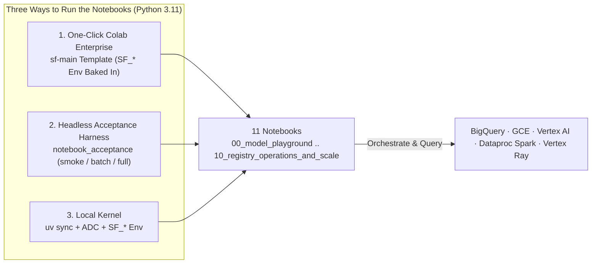

# Notebook runtimes — Python versions, locally and on Colab

The notebooks are first-class run drivers: two run fully local, the rest **orchestrate** the
Dataproc / Ray / BigQuery work over ADC. This page maps **which Python version and extra each
notebook needs** — both locally and on **Colab Enterprise** — and documents the runtime template
Terraform ships.

## The one load-bearing fact: the project targets Python 3.11 everywhere

`pyproject.toml` pins `requires-python = ">=3.11,<3.12"` — **3.11 is the single tested, supported
version on every surface**: the `uv` kernel, the runtime image, every cluster, and every Colab
template. For *why* 3.11 (Vertex Ray client↔cluster parity and the Dataproc packed-venv), see
[version_matrix.md](./version_matrix.md) — the single source of truth for the version of each
surface. The two notebooks that touch a live client↔cluster boundary (`04_ray_on_vertex_gpu` and
`03_spark_serverless_and_connect`) are where that pin earns its keep; the [per-notebook mapping](#per-notebook-mapping)
below spells out each.



## Running locally

Every notebook except `00_model_playground` and `09_custom_models_and_metrics` needs **ADC** and the `SF_*` identity. Both `00_model_playground` and `09_custom_models_and_metrics`
need neither — they run the model and metric suites on in-memory sample data with no cloud calls.

```bash
gcloud auth application-default login          # ADC — required for 01..08 and 10
uv sync                                        # core deps incl. ipykernel + matplotlib
uv run python -m ipykernel install --user --name scale-forecasting --display-name "scale-forecasting (uv)"
```

Then select the **scale-forecasting (uv)** kernel. Full kernel guidance lives in
[running_and_reviewing.md](./running_and_reviewing.md#notebooks-and-kernels) — this page is the
per-notebook mapping.

### The `SF_*` identity (read by `Settings.resolve()`)

The five `SF_*` variables (and how to populate them from `terraform output`) are documented once, in
[running_and_reviewing.md](./running_and_reviewing.md#prerequisites). Notebooks read the identical
identity via `Settings.resolve()` — either export them before launching, or set them in a first cell.
Colab Enterprise templates can bake them in, so no environment cell is needed (see
[One-click open](#one-click-open--run-no-environment-cell) below).

## Per-notebook mapping

| Notebook | Cloud compute | Python | Notes | Extra | Colab template |
|----------|---------------|--------|-------|-------|----------------|
| `00_model_playground` | none (fully local) | 3.11 | pure local sandbox across 30 models, 21 metrics, covariates & 7 FPP3 reconciliation methods | none | `sf-main` |
| `01_bigquery_native_sql` | BigQuery | 3.11 | pure SQL (`ARIMA_PLUS`, `TimesFM`) + ensembling | none | `sf-main` |
| `02_vertex_and_gce_vms` | GCE Single-VM & Vertex `CustomJob` | 3.11 | compares `gce` single-VM and `vertex` multi-worker sharding | none | `sf-main` |
| `03_spark_serverless_and_connect` | Dataproc Spark (`serverless` / `cluster` / `connect`) | 3.11 | Serverless Spark batch $\parallel$ BQ + interactive Spark Connect on runtime **2.3** | `[spark]` | `sf-main` |
| `04_ray_on_vertex_gpu` | Ray on Vertex AI (CPU & GPU) | 3.11 | client↔cluster Ray parity (2.47) + fractional GPU (`gpu_fraction=0.25`) | `[ray]` | `sf-main` |
| `05_covariates_and_global_models` | Vertex AI / Spark + BigQuery | 3.11 | 3-tier covariates (`static`, `future`, `past`) + global cross-series ML | none | `sf-main` |
| `06_hierarchical_reconciliation` | Vertex AI / Spark + BigQuery | 3.11 | multi-level hierarchy rollups + `bottom_up`, `wls_struct`, `mint_shrink` | none | `sf-main` |
| `07_hpo_backtesting_and_ensembles` | BigQuery + Vertex AI | 3.11 | Optuna HPO + in-run, post-run (`reensemble`), and cross-run (`ensemble_runs`) ensembling | none | `sf-main` |
| `08_multi_engine_master_workflow` | Spark $\parallel$ Vertex $\parallel$ BigQuery | 3.11 | 4-family parallel DAG + `run_live()` monitoring + 5-panel review | none | `sf-main` |
| `09_custom_models_and_metrics` | none (fully local) | 3.11 | author custom 1-file `BaseModel` & `BaseMetric` plugins offline | none | `sf-main` |
| `10_registry_operations_and_scale` | BigQuery (read-only + ops) | 3.11 | `Registry.doctor()`, live probes, Composer DAG emitter & 100k scale review | none | `sf-main` |

Every notebook runs on the single `sf-main` (py3.11) template. Most are *orchestration* — they submit
work to Dataproc / Ray / Vertex / GCE / BigQuery, which runs on-cluster Python, so the kernel minor doesn't change
the result. The two that touch a live client↔cluster boundary both hold parity on 3.11:

- **`04_ray_on_vertex_gpu`.** The *Ray package* version must match the cluster's (2.47); on 3.11 the
  client resolves to a Vertex-supported Ray that matches, so the `JobSubmissionClient` handshake
  succeeds. An unsupported client Ray hangs the handshake (HTTP 524).
- **`03_spark_serverless_and_connect`.** The interactive Connect session runs on **Dataproc runtime 2.3** (the
  Spark Connect floor), whose workers are **Python 3.11** — the same minor as the `sf-main` kernel, so
  `applyInPandas` fan-out satisfies the driver↔worker parity Connect enforces (`PYTHON_VERSION_MISMATCH`
  otherwise). `03`'s bootstrap installs the `[spark]` extra so `dataproc-spark-connect` is present on
  `sf-main`.

- **The interactive Connect path ships code + deps + identity to its workers explicitly.** The
  `applyInPandas` fan-out pickles the group-runner closure on the notebook kernel and runs it on the
  session's executors, so those workers need (1) the third-party deps (`holidays`, `statsmodels`, …),
  (2) the `scale_forecasting` package on their path, and (3) a runtime identity with the Dataproc-worker
  permissions the session needs. `03` sets all three on the `Session`: it pins the session's
  **container image** to `SF_CONTAINER_IMAGE` (the project image, which carries the deps), calls
  `spark.addArtifacts(zip, pyfile=True)` with the **same** package zip the batch delivers via
  `python_file_uris` (both built by `scale_forecasting.code_delivery`, so Connect and batch workers run
  byte-identical source), and runs the session runtime **as the compute SA** (`SF_COMPUTE_SA`,
  which carries `dataprocrm.nodes.mintOAuthToken` via `roles/dataproc.worker`; the runner impersonates
  it). The remote-batch path needs none of this wiring on the kernel — it runs on the custom
  container that already carries the deps, as the compute SA.

## On Colab Enterprise

Terraform ships **one runtime template** (a template is a blueprint for the VM a runtime runs on).
It is **free at rest** — a template costs nothing until you start a runtime from it, and runtimes
idle-shutdown — so it is created **on by default** (`create_colab_templates = true`).

| Template | Python | Extra | Use it for |
|----------|--------|-------|------------|
| `sf-main` | **3.11** | `.[ray,spark]` | **all 11** notebooks (`00`–`10`) |

After `terraform apply`, the template resource name is surfaced as an output
(`colab_main_runtime_template_id`).

### One-click open + run (no environment cell)

Each notebook carries a header with a **Run in Colab Enterprise** badge. The click-path is:

1. Click the badge — it imports the notebook straight into Colab Enterprise.
2. Create/pick a runtime from the `sf-main` template (all notebooks use it).
3. **Run all.**

There is **no `SF_*` environment cell to fill in**. Terraform bakes the full run identity
(`SF_PROJECT_ID`, `SF_CONNECTION`, `SF_WAREHOUSE_URI`, `SF_DATASET_ID`, `SF_REGION`, plus the batch /
Ray infra vars) into each template's `software_config.env`, so a freshly-started runtime already
resolves `Settings.resolve()` — the same identity a headless execution gets (below). Running locally
still uses ADC + the `SF_*` vars from `terraform output` as [above](#running-locally); only the Colab
path is env-baked.

### Headless acceptance (verify every notebook runs green)

`scale_forecasting.notebook_acceptance` runs the notebooks **headless** on their templates via the
Vertex AI `NotebookExecutionJob` API (serviceAccount mode — no browser consent), downloads each
executed notebook from GCS, and asserts no cell errored. It's both the acceptance test for a fresh
deploy and the regression guard when a notebook changes. Because the templates carry the same baked
env, a headless run validates exactly what a human gets on open.

Tiers escalate cost (each runs its tier plus the cheaper ones), gated like the other billed smokes:

| Tier | Adds | Gate |
|------|------|------|
| `smoke` (default) | `00`, `01`, `09`, `10` (BQ-only / local) | `@gcp` (`SF_PROJECT_ID` + ADC) |
| `batch` | `02`, `03`, `05`, `06`, `07`, `08` (Vertex / GCE / Dataproc batch) | `SF_ENABLE_NB_BATCH` |
| `full` | `04_ray_on_vertex_gpu` (live Ray cluster) | `SF_ENABLE_NB_FULL` |

```bash
# pytest wrapper (reads template ids + runner SA from `terraform output`):
uv run --active pytest -m gcp tests/integration/test_notebook_acceptance.py            # smoke
SF_ENABLE_NB_BATCH=1 uv run --active pytest -m gcp tests/integration/test_notebook_acceptance.py
SF_ENABLE_NB_FULL=1  uv run --active pytest -m gcp tests/integration/test_notebook_acceptance.py

# or the CLI directly:
uv run --active python -m scale_forecasting.notebook_acceptance --tier smoke \
  --project "$(terraform -chdir=terraform/main output -raw project_id)" \
  --main-template  "$(terraform -chdir=terraform/main output -raw colab_main_runtime_template_id)" \
  --service-account "$(terraform -chdir=terraform/main output -raw runner_sa)" \
  --gcs-output "gs://$(terraform -chdir=terraform/main output -raw code_bucket)"
```

**Packages.** By default each notebook's **bootstrap cell** installs the package on first cell-run —
correct, just a little slower on a cold runtime. The install goes through **`uv` against the checked-in
`uv.lock`** (Colab Enterprise ships `uv`; the cell installs it if missing): it exports the frozen lock
to a requirements file and installs *exactly* those versions, then editable-installs the package with
`--no-deps`. That's the same locked set the runtime container and the Dataproc packed-venv are built
from, so a notebook kernel runs byte-identical dependencies to the cluster — no fresh resolve, no
drift. To pre-install at runtime-creation time instead (faster cold start), set
`install_via_post_startup = true` on the module (off by default: the post-startup-script field is
deprecated and some orgs block it on new templates); it runs the same `uv`-from-lock install.

**Network.** Templates attach the project VPC by default (`colab_attach_network = true`): the
greenfield stack builds a *custom* VPC and has no `default` network, so a public runtime would 404
looking for one. Attached runtimes get egress with **no external IP** via the Cloud NAT + Private
Google Access from `modules/network` (also compatible with a `compute.vmExternalIpAccess = DENY` org
policy). Set `colab_attach_network = false` only in a brownfield project that has a usable `default`
network and permits external IPs.

### Maintenance note — the py311 pin

The Terraform provider can't set a template's Python version (issue
[hashicorp/terraform-provider-google#25217](https://github.com/hashicorp/terraform-provider-google/issues/25217)),
so the `sf-main` template is pinned to `py311` via a tolerant REST PATCH inside the module. It is
pinned *explicitly* even though `py311` may not be Colab's Latest: left on Latest it would silently
drift to a newer minor when Colab advances, breaking Ray client↔cluster parity (2.47 is a 3.11 build)
and NB01 interactive Connect (Dataproc 2.3 workers run 3.11). When a Python version reaches
**end-of-availability**, Colab auto-upgrades templates to Latest; bump `colab_main_release_name` and
re-apply **before** that date to keep the pin. Track the supported versions in the
[Colab Enterprise runtime docs](https://cloud.google.com/colab/docs/runtimes).

---

See also: [running_and_reviewing.md](./running_and_reviewing.md) (the operator loop + kernel setup) ·
[configuration_reference.md](./configuration_reference.md) (every config field) ·
[deploying_on_gcp.md](./deploying_on_gcp.md) (the Terraform).
