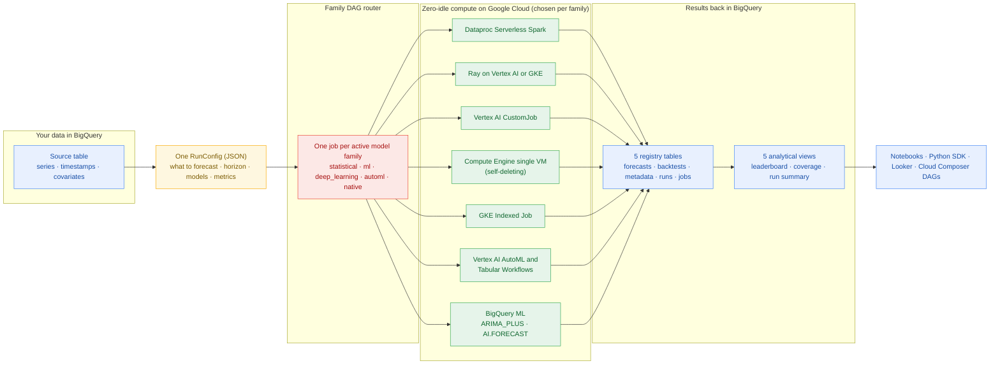
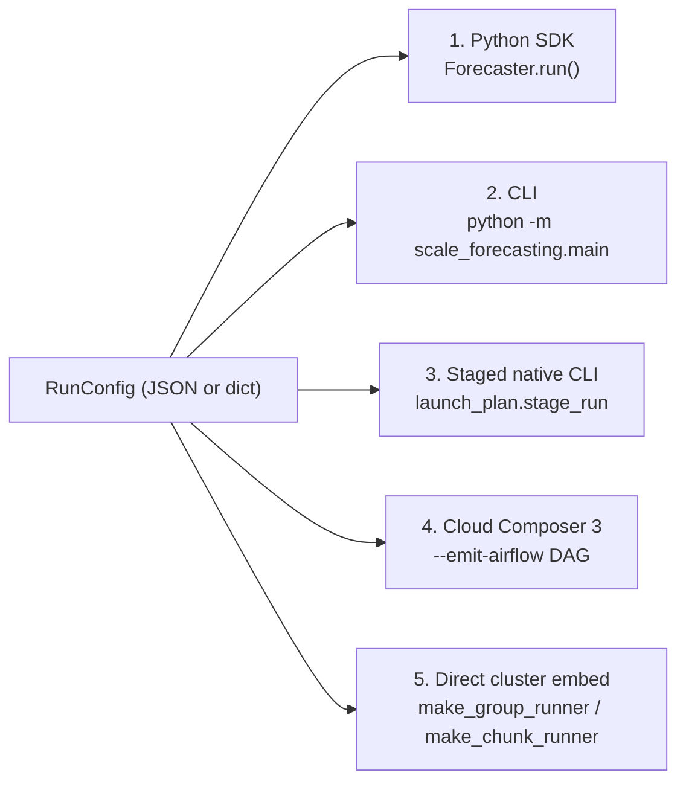
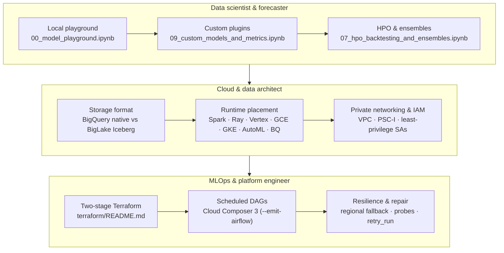

# Platform overview

`scale-forecasting` is a declarative, multi-engine time-series forecasting platform for Google Cloud. You describe *what* to forecast in one JSON configuration — the BigQuery source table, the horizon, the models, the evaluation metrics, and the ensemble strategies — and the platform compiles that declaration into a per-family execution DAG across **7 Google Cloud runtimes**, evaluates **34 models** across **21 evaluation metrics**, extracts two-tier feature attributions, reconciles hierarchies, and streams results into BigQuery tables and **5 Analytical SQL Views**.



New to the project? Start with [Getting started](./getting_started.md) for a 5-minute local forecast and your first cloud run.

---

## Why `scale-forecasting`?

Traditional forecasting workflows break down when scaled to tens or hundreds of thousands of series across retail, supply chain, energy, or financial hierarchies:

| Challenge | Traditional approach | The `scale-forecasting` solution | Deep dive |
| :--- | :--- | :--- | :--- |
| **Library fragmentation** | Separate, incompatible codebases for Statsmodels, StatsForecast, Prophet, PyTorch, Vertex AI AutoML, and SQL models. | **Unified model contract:** Single [`BaseModel`](https://github.com/statmike/scale-forecasting/blob/main/src/scale_forecasting/models/base_model.py) interface. All 34 models (`local`, `global`, and `hybrid`) run with identical inputs, outputs, and metrics. | [models_reference.md](./models_reference.md) |
| **Compute scaling limits** | Single-node memory exhaustion; slow sequential loops. | **Per-family distributed execution:** Automatic fan-out across Dataproc Serverless, Vertex AI CustomJob, Compute Engine (`gce`), Google Kubernetes Engine (`gke`), Ray on Vertex AI or GKE, Vertex AI AutoML, and BigQuery ML. | [runtimes_reference.md](./runtimes_reference.md) |
| **Infrastructure lock-in** | Forced choice between pure Spark, pure Ray, or pure SQL. | **Multi-engine DAG:** Run Spark, Ray, Vertex AI CustomJob, Compute Engine, GKE, Vertex AI AutoML, and BigQuery ML concurrently under one `run_id`, bounded by the slowest family rather than their sum. | [architecture.md](./architecture.md) |
| **Uncertainty calibration** | Gaussian assumptions that fail on skewed real-world distributions. | **Conformal residual intervals:** Empirical, distribution-free prediction intervals calibrated against rolling out-of-fold backtest errors. | [backtesting.md](./backtesting.md) |
| **Hierarchical incoherence** | Bottom-level and upper-level forecasts do not add up across regions or categories. | **Coherent forecast reconciliation:** Built-in Hyndman FPP3 reconciliation (`bottom_up`, `top_down`, `middle_out`, `ols`, `wls_struct`, `wls_var`, `mint_shrink`). | [api/reconciliation.md](./api/reconciliation.md) |
| **Operational opacity** | Disconnected log files and ad-hoc evaluation tables. | **BigQuery registry & explainability:** Streaming ingestion via the Storage Write API, two-tier feature attributions (`attributions_df` / `plot_attributions`), and 5 analytical SQL views. | [output_schemas.md](./output_schemas.md) |
| **Brittle batch failures** | One failed series aborts an entire multi-hour distributed job. | **Surgical cell repair & live probes:** Re-runs only failed cells without recomputing successful ones and reconciles platform job state automatically. | [operations.md](./operations.md) |

---

## Technology stack on Google Cloud

Every capability maps cleanly to managed Google Cloud data and AI services:

| Layer | Google Cloud service | Role in `scale-forecasting` | Reference |
| :--- | :--- | :--- | :--- |
| **Data warehouse & lakehouse** | BigQuery & BigLake Apache Iceberg | Stores source panels (`source_series_native`, `source_series_iceberg`), the 5 registry tables, and the 5 analytical SQL views. | [reading_source_data.md](./reading_source_data.md) · [output_schemas.md](./output_schemas.md) |
| **SQL-native forecasting** | BigQuery ML | Executes `ARIMA_PLUS`, `ARIMA_PLUS_XREG`, and zero-shot foundation models via `AI.FORECAST` (`TimesFM`) directly in SQL. | [runtimes_reference.md](./runtimes_reference.md) |
| **Managed AutoML & pipelines** | Vertex AI AutoML & Tabular Workflows (`vertex_automl`) | Runs managed Tabular Workflow pipelines and AutoML training jobs (`vertex_l2l`, `vertex_tide`, `vertex_tft`, `vertex_seq2seq`) with Stage-1 HPO reuse and baseline attributions. | [models_reference.md](./models_reference.md) |
| **Serverless & cluster Spark** | Dataproc Serverless & Dataproc on GCE (`spark`) | Runs Arrow-backed `applyInPandas` fan-out across serverless batches, managed clusters, or interactive Spark Connect sessions. | [runtimes_reference.md](./runtimes_reference.md) |
| **Single-VM & worker-pool jobs** | Vertex AI Custom Training (`vertex`) & Compute Engine (`gce`) | Runs serverless single-VM (`workers=1` or `runtime="gce"` with triple-redundant self-deletion) and multi-VM worker pools (`CPU`, `T4`, `L4`, `A100`, `A100_80GB`) with Storage Read API row-range pushdown. | [runtimes_reference.md](./runtimes_reference.md) |
| **Kubernetes batch & Ray** | Google Kubernetes Engine (`gke`) & Vertex AI Ray (`ray`) | Runs Kubernetes `batch/v1` Indexed Jobs (`gke_mode="job"`) and autoscaling Ray pools (`ray_mode="vertex"` or `"gke"`) with fractional GPU packing. | [runtimes_reference.md](./runtimes_reference.md) · [quota_and_scale.md](./quota_and_scale.md) |
| **Notebooks & orchestration** | Colab Enterprise & Cloud Composer 3 | Hosted notebooks pre-wired to the `sf-main` runtime template and optional scheduled Airflow DAGs (`--emit-airflow`). | [notebook_runtimes.md](./notebook_runtimes.md) · [deploying_on_gcp.md](./deploying_on_gcp.md) |

---

## How runs work: declarative JSON configurations

A single JSON file (or Python dictionary validated by `RunConfig`) defines an experiment end to end and hashes to a deterministic `<slug>-<12hex>` `run_id`:

```json
{
  "run_name": "hybrid_stacked_ensemble",
  "data": {
    "source_table": "source_series_iceberg",
    "series_limit": 100,
    "horizon": 14
  },
  "models": ["theta", "holtwinters", "xgboost", "arima_plus"],
  "compute": {
    "families": {
      "statistical": {"runtime": "spark"},
      "ml": {"runtime": "spark"}
    }
  },
  "backtest": {
    "enabled": true,
    "scheme": "expanding",
    "n_folds": 3,
    "decision_metric": "wape"
  },
  "ensemble": {
    "enabled": true,
    "strategies": ["mean", "inverse_error", "nnls", "xgb"]
  }
}
```

| Section | What it controls |
| :--- | :--- |
| `data` | Source table (native BigQuery or BigLake Iceberg), `series_limit`, series/date/target columns, frequency, and `horizon`. |
| `models` | Model identifiers to fit, grouped automatically into `statistical`, `ml`, `deep_learning`, `automl`, and `native` families. |
| `compute` | Default and per-family `runtime`, mode (`spark_mode`, `gke_mode`, `ray_mode`, `automl_mode`), `machine_type`, `workers`, GPUs, and regional fallback. |
| `backtest` | Cross-validation scheme (`expanding`, `sliding`, `expanding_frozen`, `sliding_frozen`), fold count, `decision_metric`, and conformal interval calibration. |
| `features` | Country holidays, Fourier seasonality, level-shift indicators, `static_covariates`, `future_covariates`, `past_covariates`, and `exog_lags`. |
| `hpo` | Optuna trial budget, search spaces, and fleet-wide vs. per-series tuning. |
| `ensemble` | Consensus (`mean`, `median`, `inverse_error`) and learned stackers (`nnls`, `ridge`, `xgb`), plus `barrier` or `microbatch` execution. |
| `hierarchy` | Aggregation levels (`levels`) and coherent reconciliation methods (`reconciliation_methods`). |

Full field-by-field specification: [Configuration reference](./configuration_reference.md).

---

## Five ways to run

The same orchestration path (`main.run`) drives every launch surface:



1. **Python SDK (`Forecaster`):** High-level facade for notebooks and services (`dry_run()`, `feasibility()`, `run()`, `run_live()`, `review_run()`).
2. **Command-line interface (`scale_forecasting.main`):** Direct terminal and CI execution (`python -m scale_forecasting.main --config configs/ensemble_demo.json`).
3. **Staged native commands (`launch_plan.stage_run`):** Stages `src/` and config to Cloud Storage and prints copy-pasteable `gcloud` / `kubectl` / `bq` / `ray` commands.
4. **Cloud Composer 3 DAG generation (`--emit-airflow`):** Compiles a `RunConfig` into a self-contained Apache Airflow DAG with parallel per-family tasks.
5. **Direct cluster embedding:** Embed `make_group_runner` (PySpark `applyInPandas`) or `make_chunk_runner` (Ray) inside an existing pipeline.

**AI coding agents & MCP clients:** Every execution surface above is also exposed through the built-in Model Context Protocol server (`python -m scale_forecasting.mcp`), the portable [`SKILL.md`](https://github.com/statmike/scale-forecasting/blob/main/skills/scale-forecasting/SKILL.md), and the [`RunConfig` JSON Schema](./schemas/run_config.schema.json) — see [AI Agents, Portable Skills & Built-in MCP Server](./agent_and_mcp_guide.md).

Details: [Using the SDK](./using_the_sdk.md) and [Running and reviewing](./running_and_reviewing.md).

---

## Per-family DAG and automated resource sizing

When a run starts, `dag.plan_dag` splits active models into up to five family jobs (`statistical`, `ml`, `deep_learning`, `automl`, `native`) and dispatches them in parallel. Fast CPU families finish and release their machines immediately without waiting for multi-epoch GPU trainers; once the base families complete (or continuously in `microbatch` mode), the `ensemble` node blends their predictions.

Before each family launches, the resource planner ([`scale_forecasting.resources`](./api/resources.md)) combines empirical per-model memory and wall-clock profiles (`ComputeProfile`) with your target wall-clock budget to size executors, worker pools, thread counts, and fractional GPU shares automatically — and records the full sizing decision (`$.sizing.<family>`) on the run header for inspection in `v_run_summary`. Run `--dry-run` for an offline fan-out plan, `--feasibility` for live panel length and fold-coverage checks, or `--quota` to verify regional vCPU and GPU quota ahead of submission.

Deep dives: [Compute runtimes reference](./runtimes_reference.md) and [Quota and scale guide](./quota_and_scale.md).

---

## Models, explainability, reconciliation, and ensembles

### 34 models across 5 families

Every model inherits from [`BaseModel`](https://github.com/statmike/scale-forecasting/blob/main/src/scale_forecasting/models/base_model.py), lives in its own module under [`src/scale_forecasting/models/`](https://github.com/statmike/scale-forecasting/tree/main/src/scale_forecasting/models), and imports its upstream library lazily inside `fit()`:

| Family | Count | Representative models | Training modes | Runtimes |
| :--- | :---: | :--- | :--- | :--- |
| `statistical` | **18** | `theta`, `auto_theta`, `holtwinters`, `autoets`, `auto_arima`, `sarimax`, `tbats`, `auto_ces`, `stl_bagging`, `ucm`, `kalman`, `prophet`, `croston`, `fft`, `naive_*` | `local` | `spark`, `ray`, `vertex`, `gce`, `gke` |
| `ml` | **5** | `lightgbm`, `xgboost`, `catboost`, `random_forest`, `regression_lags` | `local` | `spark`, `ray`, `vertex`, `gce`, `gke` |
| `deep_learning` | **5** | `tide`, `tft`, `tsmixer`, `patchtst`, `neuralprophet` | `local`, `global`, `hybrid` | `spark`, `ray`, `vertex`, `gce`, `gke` |
| `automl` | **4** | `vertex_l2l`, `vertex_tide`, `vertex_tft`, `vertex_seq2seq` | `global` | `vertex_automl` |
| `native` | **2** | `arima_plus`, `timesfm` (`AI.FORECAST`) | `local` (SQL / zero-shot) | `bigquery` |

- **Two-tier explainability:** All 9 feature-attribution models (`ml` + `automl`) record global series-level driver importance in `forecast_metadata.fit_diagnostics["feature_attributions"]` (Tier 1) and per-step signed attributions in `forecast_predictions.explanations` (Tier 2), surfaced via `forecaster.attributions_df()` and `forecaster.plot_attributions()`. All 34 models also support structural trend/seasonality/covariate decomposition via `forecaster.explain_forecast()`.
- **Hierarchical reconciliation:** Setting `hierarchy.enabled: true` builds the aggregation tree from `hierarchy.levels` and reconciles base forecasts with any subset of the 7 Hyndman FPP3 methods (`mint_shrink`, `wls_var`, `wls_struct`, `ols`, `bottom_up`, `top_down`, `middle_out`) so point and interval forecasts sum coherently across levels.
- **Ensembling & re-ensembling:** Blend base models via heuristic rules (`mean`, `median`, `inverse_error`) or out-of-fold stackers (`nnls`, `ridge`, `xgb`). Because ensembles are keyed by `ensemble_id`, you can test new strategies on completed runs (`forecaster.reensemble()`) or across distinct runs (`forecaster.ensemble_runs()`) without refitting base models.
- **Modular installation & 1-file plugins:** A bare `pip install scale-forecasting` installs the pure offline layer (15 models on NumPy/SciPy/statsmodels/scikit-learn, all 21 metrics, playground, `--dry-run`); optional extras (`[gcp]`, `[spark]`, `[ray]`, `[notebook]`, `[models]`, `[all]`) add cloud clients and third-party model libraries. Add a custom model in one file with [Adding a model](./adding_a_model.md) — code ships dynamically via `src.zip` with zero container rebuilds.

Full catalog: [Models and ensembles reference](./models_reference.md) and [Runtime dependencies](./runtime_dependencies.md).

---

## 21 evaluation metrics

Every model, reconciled hierarchy node, and ensemble is scored in Python (`metrics.compute_metrics`) across a uniform **21-metric evaluation panel** stored in `forecast_metadata`:

| Category | Count | Metrics |
| :--- | :---: | :--- |
| **Point forecast accuracy** | **16** | Relative (`wape`, `smape`, `mape`, `maape`, `ope`), scale-dependent (`mae`, `rmse`, `mse`, `rmsle`, `bias`), scaled against naive baselines (`mase`, `mase_seasonal`, `rmsse`, `msse`), goodness-of-fit & dispersion (`r2`, `cv`). |
| **Prediction interval quality** | **5** | Empirical `coverage`, quantile `pinball` loss, Winkler `interval_score`, `interval_width`, and M4 scaled `msis` over the 80% $(q_{0.10}, q_{0.90})$ prediction band. |

Formulas, calibration modes, and custom metrics: [Evaluation metrics reference](./metrics_reference.md) and [Adding a metric](./adding_a_metric.md).

---

## Packaged synthetic data & scale seeding

The deterministic generator ([`scale_forecasting.data_gen`](https://github.com/statmike/scale-forecasting/blob/main/src/scale_forecasting/data_gen/README.md)) synthesizes five archetypes (`smooth_seasonal`, `intermittent`, `trending`, `promo_spiky`, `noisy`) in either a 5-column univariate mode or a 10-column mode with 3-tier covariates (`region`, `category`, `is_holiday`, `promo_flag`, `price_index`, `temperature`) and a 3-level hierarchy. Because each series is seeded solely by `(master_seed, series_index)`, generating 3 series in memory via `playground.sample_data()` produces the exact same values for those series as seeding 100,000 series across Spark executors into `source_series_native` and `source_series_iceberg`. See [data_gen API](./api/data_gen.md).

---

## BigQuery registry, views, and operations

Workers stream Arrow batches through the BigQuery Storage Write API into five append-only tables (`run_registry`, `run_jobs`, `forecast_metadata`, `forecast_predictions`, `backtest_oof`), exposed through **5 Analytical SQL Views**:

- `v_model_leaderboard` — per-run model and ensemble ranking across accuracy, fit duration, and error rate.
- `v_model_leaderboard_comparable` — holdout-fold pooled WAPE and MAE (`SUM(|y - yhat|) / SUM(|y|)`) so models are compared on identical series and fold windows.
- `v_backtest_coverage` — achieved fold histogram and backtest status (`full`, `reduced`, `unscored`, `failed`) per model.
- `v_run_summary` — one row per run with scaling knobs, the job-row time ledger (`n_jobs`, `longest_job_seconds`, `jobs_seconds`, `jobs_span_seconds`, `overhead_seconds`, `overhead_fraction`), and sizing/capacity telemetry.
- `v_run_jobs` — deduplicated per-family execution trace with runtime, hardware, platform job ID, wall-clock bracket, and GPU `device_verdict`.

Day-2 management is built into `python -m scale_forecasting.registry.ops` and `sf.Registry`: `doctor` (health and quota audit), `close-runs` (reconcile stale headers), `retry_run` / `Forecaster.retry()` (surgical cell repair), `drop-run`, `sweep-orphans`, `reap-clusters`, `snapshot`, and `export`. Schemas and runbooks: [Output schemas](./output_schemas.md) and [Operations guide](./operations.md).

---

## Persona journeys, notebooks, and deployment



- **11 interactive notebooks across 4 tracks:** From zero-GCP local exploration (`00`, `09`) to cloud runtimes (`01`–`04`), covariates/hierarchy/HPO/ensembles (`05`–`07`), and the multi-family master DAG & registry operations (`08`, `10`). Browse the [Notebook tour](./notebooks/README.md) or the guided [Hands-on workshop](./workshop.md).
- **Two-stage Terraform deployment (~15 minutes):** Stage 1 (`terraform/bootstrap`) provisions the remote state bucket; Stage 2 (`terraform/main`) provisions the VPC, service accounts, buckets, BigQuery dataset, container image (Cloud Build + Artifact Registry), Colab Enterprise runtime template, and the 100,000-series seed batch on Dataproc Serverless.
- **Estimated deployment and runtime cost:** The one-time image build and 100,000-series seed batch typically cost an estimated **~\$0.25–\$1.00** in Cloud Build, Dataproc Serverless, and BigQuery Storage Write API usage. At rest, buckets, datasets, VPC networks, and service accounts have no compute charge (only standard Cloud Storage and BigQuery storage rates for stored bytes). Forecast runs bill per job for the duration of the batch, VM, pod, or query. **Ongoing cost disclosure:** Cloud Composer 3 (`create_composer = false` by default) and standing GKE clusters (`create_gke = false` by default) run continuously while provisioned and incur ongoing environment/cluster charges until disabled (and deleting a Composer environment leaves behind its Cloud Storage bucket until removed manually). See [Cost estimates & controls](./cost_estimates.md), [Choosing a runtime](./choosing_a_runtime.md), [Why Google Cloud](./why_google_cloud.md), [FAQ](./faq.md), [Glossary](./glossary.md), and [Deploying on GCP](./deploying_on_gcp.md).
