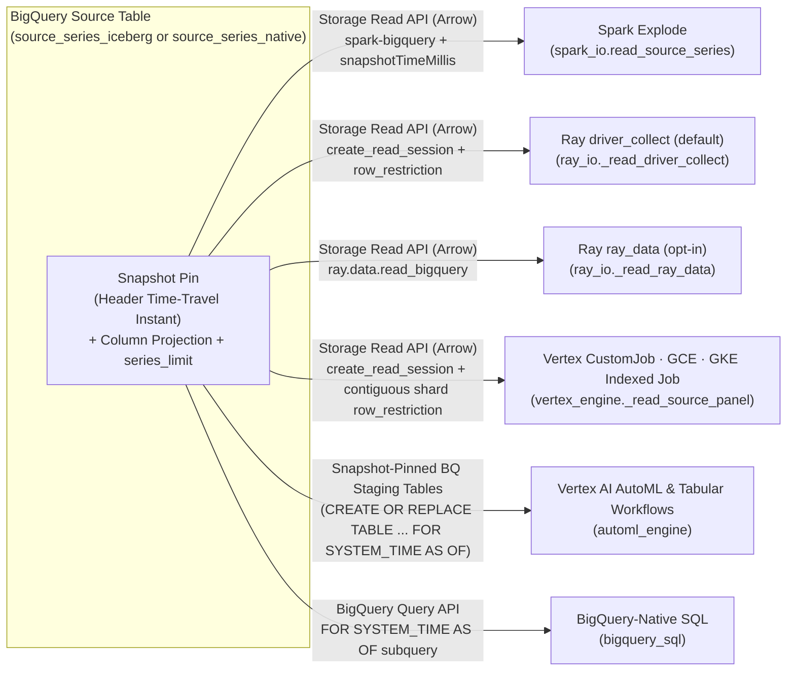

# Reading the source data — how each runtime reads the panel

Every run reads the **same** source: one BigQuery table (native or managed-Iceberg) holding the long
panel of `(series, timestamp, target[, exog])` rows. Each runtime reads it its own way, but they all
agree on four things — **what** columns they read, **which** rows, **as of when**, and **through which
API**. This doc is the reader's-eye view: open it when you want to understand how the panel gets into
a cell, or how to bound the read's parallelism.

For the config knobs mentioned here see [configuration_reference.md](./configuration_reference.md);
for where the *results* go see [output_schemas.md](./output_schemas.md); for the end-to-end flow see
[architecture.md](./architecture.md).

---

## The four invariants (true for every reader)

1. **Column projection.** A cell needs only the id, date, and target columns plus any configured
   `features.exog` / `static_covariates` / `future_covariates` / `past_covariates` (and `hierarchy.levels`), so every reader projects to exactly those columns — never `SELECT *`. Narrow rows
   matter because the Spark fan-out cross-joins each series once per model, so an unused column is
   paid for on every cell (Ray, Vertex, GCE, and GKE shard by series instead, but still pay it on every row). (The projection is order-preserving and de-duplicated.)
2. **Deterministic subset.** With `data.series_limit` set, each reader keeps the *same* first N series
   — distinct ids, ordered, first N — so "10 vs 100 vs 100k series" is a clean apples-to-apples
   runtime comparison rather than a different sample each time. Unset = the whole panel. *Where* the
   subset is applied varies by reader (below); *which* series survive it never does.
3. **Snapshot pinning.** A run records one input snapshot on its header (a BigQuery time-travel
   instant, taken with a small safety margin). Every family job of that run pins its read to that
   instant, so all families read **byte-identical** source data even if the table is written to
   mid-run. A missing snapshot leaves the read unpinned (best-effort). Each reader expresses the pin
   in its own dialect (below).
4. **Storage Read API, Arrow.** The Python runtimes read through the **BigQuery Storage Read API** in
   **Arrow** format — the columnar, zero-copy path into the executor-side pandas frames the cells
   consume. The Storage Read API does **not** consume query slots, so a wide fan-out doesn't compete
   with the analyst queries on the project. (The BigQuery-native and Vertex AI AutoML families are the exceptions — their training pipelines read directly from BigQuery tables; see below.)

---

## Per-runtime read paths

### Spark (`explode`)

`read_source_series` reads through the **spark-bigquery connector**
(`spark.read.format("bigquery")`). It sets `readDataFormat=ARROW` **explicitly** (rather than relying
on a connector default), applies the column projection with `.select(...)`, and enforces
`series_limit` with a deterministic semi-join. The snapshot pin is the connector's
`snapshotTimeMillis` time-travel option.

### Ray (Vertex AI Ray & Ray on GKE) — `driver_collect` (default)

`_read_driver_collect` reads with the `BigQueryReadClient` (`create_read_session`) directly, in
`DataFormat.ARROW`. The snapshot pin is the Storage Read API's native `table_modifiers.snapshot_time`
field. Streams are drained concurrently and reassembled in stream order, so the panel is identical
to a serial read. This is the proven default path.

`series_limit` is pushed **into** the read as a `row_restriction`, so a 100-series run off a
100k-series table transfers 100 series rather than the whole table. Resolving the boundary costs one
extra read session over the id column alone, at the same snapshot; the filter is then a single range
comparison (`ts_id <= '<the Nth id>'`), not an `IN` list — ten thousand ids would be well over a
hundred kilobytes of filter text, which the service will not accept. The range is exact because the
subset rule is already an *ordered* first N, and BigQuery compares `STRING` by UTF-8 bytes in the
same order Python sorts by. The honest cost: the boundary pass reads one column at the table's full
height, so the pushdown wins big when the subset is a small fraction of the table and loses slightly
when it is most of it.

### Ray — `ray_data` (opt-in)

`_read_ray_data` uses the Ray-native `ray.data.read_bigquery` reader, which reads over the **same**
Storage Read API underneath. Because that reader's table-scan form doesn't expose a snapshot option,
a *pinned* read falls back to a `FOR SYSTEM_TIME AS OF TIMESTAMP_MILLIS(...)` query; an unpinned read
stays a pure table scan. For the same reason it takes no `row_restriction`, so `series_limit` is
applied on the driver *after* the read rather than pushed into it — one more reason a subsetting run
is cheaper on the default reader. Select it with `compute.ray_read_mode="ray_data"`.

### Vertex AI `CustomJob` (`vertex`), Compute Engine (`gce`) & GKE Indexed Jobs (`gke`, `gke_mode="job"`)

`vertex_engine._read_source_panel` reads directly through the `BigQueryReadClient` (`create_read_session` in `DataFormat.ARROW`) with the same snapshot pin (`table_modifiers.snapshot_time`), column projection, and multi-stream reader as Ray's `driver_collect` path — and adds **per-worker contiguous shard pushdown** when a local-model family (`statistical` or `ml`) runs across multiple worker VMs or Kubernetes Indexed Job pods (`workers > 1`):

1. An initial lightweight ID scan (`_read_ordered_ts_ids`) reads only `ts_id_col` at the pinned snapshot to resolve the sorted distinct series IDs (bounded to `series_limit`).
2. `shard_series_for_worker(all_ts_ids, rank=rank, world_size=world_size)` assigns each worker rank a **contiguous sorted slice** (`[shard_min, shard_max]`) rather than modulo-interleaved IDs.
3. Because the slice is contiguous in UTF-8 sort order, the worker pushes `(ts_id >= '<shard_min>' AND ts_id <= '<shard_max>')` directly into the BigQuery Storage Read API `row_restriction` — so a 4-worker job transfers only ~1/4 of the table to each worker VM or Pod instead of scanning the full table on every worker.
4. When fleetwide HPO (`hpo.enabled=true` and `granularity="fleetwide"`) is active on a multi-worker job, `sample_series_ids` deterministically selects the `hpo.sample_n` tuning series from the global ID list and unions them into the `row_restriction` (`(...range...) OR ts_id IN (...)`) so every worker derives identical fleetwide HPO hyperparameters before fitting its own shard.

### Vertex AI AutoML & Tabular Workflows (`vertex_l2l`, `vertex_tide`, `vertex_tft`, `vertex_seq2seq`)

The Vertex AI Tabular Workflow pipeline (`automl_mode="tabular_workflow"`) and `AutoMLForecastingTrainingJob` (`automl_mode="training_job"`) require a `bq://project.dataset.table` source URI containing both a `predefined_split_column` (`TRAIN` / `VALIDATE` / `TEST`) and a companion prediction input table covering the historical context window plus future horizon rows (`y = NULL` with populated future covariates). `automl_engine.py` materializes these short-lived staging tables in BigQuery using `FOR SYSTEM_TIME AS OF` snapshot-pinned queries filtered to the exact `series_limit` subset and projected covariate columns, passes their `bq://` URIs to the Vertex AI pipeline and `BatchPredictionJob`, and drops the staging tables in a `finally` block once predictions and explanations have been written to the registry.

### BigQuery-native (`arima_plus`, `timesfm`)

The native family never leaves BigQuery — it reads the source **via the query API** as a subquery
inside its BQML SQL, not through the Storage Read API. Its snapshot pin is a `FOR SYSTEM_TIME AS OF`
clause spliced into that subquery. (This is why `read_max_streams`, below, is inert for native
models.)

---

## The one read that is not a cell read — `plan --feasibility`

The four invariants above describe how a *run* reads the panel. There is one more read, and it
happens before a run exists: `plan --feasibility` measures how long each series actually is, so it
can tell you how many backtest folds your panel can support before you pay for a fleet. It is
described from the operator's side in
[running_and_reviewing.md](./running_and_reviewing.md) and the arithmetic it prints is explained in
[quota_and_scale.md](./quota_and_scale.md#1-the-arithmetic).

It is worth calling out separately because it breaks three of the four invariants, on purpose:

- **It runs on the driver, through the query API.** `launch_plan.read_series_lengths` issues one
  aggregation — `SELECT <ts_id>, COUNT(*) … GROUP BY ts_id ORDER BY ts_id` — with the ordinary
  BigQuery client. No Storage Read API, no Arrow, no executors. Two columns, one shuffle, and it
  consumes query slots, unlike everything above.
- **It projects the id column only.** It never reads the target or the exogenous columns, because
  all it needs is a row count per series.
- **It is unpinned.** Snapshot pinning is a property of a run header, and at feasibility time there
  is no run. The counts are as-of-now, which is the right answer for "can I launch this today?".

It does honour the subset rule: `data.series_limit` is applied the same way the engines apply it, so
the feasibility report describes the series the run would actually forecast. And it is best-effort —
an unreachable environment produces a line saying so rather than an exception, so a plan never fails
because the preflight could not reach BigQuery.

---

## Bounding read parallelism — `read_max_streams`

`compute.read_max_streams` caps the number of Storage Read streams the source read requests, shared
across the engines that read through the Storage Read API:

| Reader | How the cap is applied |
|--------|------------------------|
| Spark connector | the connector's `maxParallelism` option |
| Ray `driver_collect` (Vertex Ray & Ray on GKE) | `create_read_session`'s `max_stream_count` |
| Vertex `CustomJob`, GCE & GKE Indexed Jobs (`vertex_engine`) | `create_read_session`'s `max_stream_count` |

`0` (the default) lets the **server** size the stream count from the table — the known-good default;
leave it there unless you have a reason not to. Set a **positive** value to bound read parallelism —
e.g. to stay inside a slot or quota budget on a shared project. The knob is **inert** for the
`ray_data` path (Ray sizes its own blocks) and for BigQuery-native models (they read via the query
API). Because it's part of the config, changing it yields a new `run_id`.

---

## Why one table, both formats, one read path

The source table can be a **native** BigQuery table or a **managed-Iceberg** table, and every reader
above works against both unchanged — they all go through BigQuery's table interface (the Storage Read
API for the Python runtimes, the query API for native), which reads either format transparently. There
is no per-format read fork to maintain; the same code reads whichever format the deployment provisions.

### Direct Iceberg read — a deliberate non-goal

A managed-Iceberg source could in principle be read **directly** from its Parquet/metadata in object
storage (e.g. via the Iceberg Java reader or a BigLake external path), bypassing the Storage Read API
entirely. We are **not** building that, and the reason is not effort — it is that the second path
costs more than it saves:

- **It would fork the read.** Today one code path reads both formats, so there is no per-format
  branch to keep in sync across four Python runtimes. A direct reader is native-vs-Iceberg forever.
- **It would lose the snapshot semantics the design depends on.** Every source read is pinned to one
  BigQuery time-travel timestamp so a run is reproducible and every family in a multi-runtime DAG
  sees byte-identical input. Object-storage reads would have to re-derive that from Iceberg snapshot
  ids — a second, weaker mechanism for a guarantee we already have for free.
- **The saving is narrow.** It buys read cost on very wide scans. A forecasting run reads the panel
  **once** and then fits `series × models` models on it, so the read is amortized over the
  expensive part by construction.

Revisit only if a measured run shows the source read is a material share of wall-clock or spend —
that would be a change in the facts, not a change of mind. Until then this is closed, not pending.

---

## See also

- [configuration_reference.md](./configuration_reference.md) — `read_max_streams`, `ray_read_mode`,
  `series_limit`, and the rest of the `data`/`compute` knobs.
- [architecture.md](./architecture.md) — how a read feeds the engine fan-out and the unit of work.
- [output_schemas.md](./output_schemas.md) — the tables a run *writes*.
