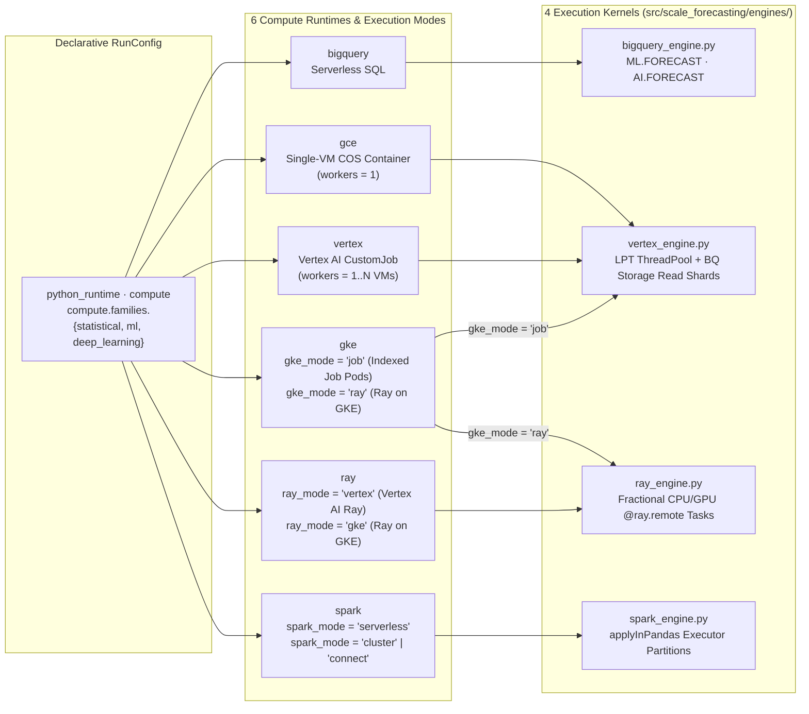
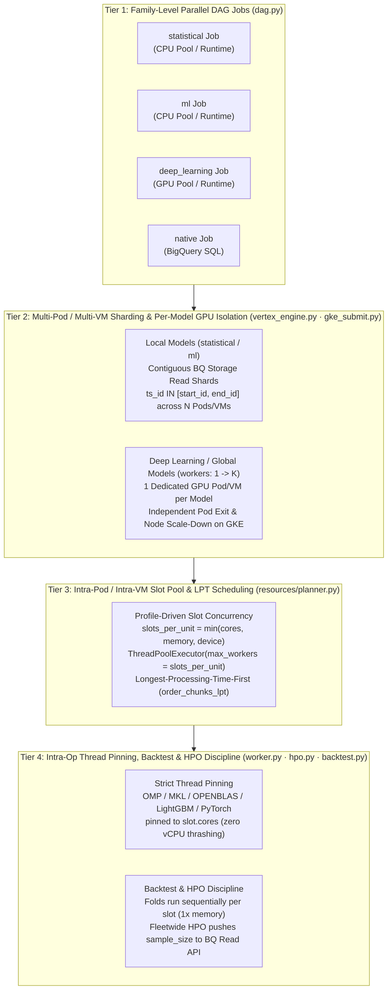

# Compute Runtimes & Scaling Reference

`scale-forecasting` decouples **what** you forecast (`models`, `features`, `backtest`, `hpo`, `hierarchy`, `ensemble`) from **where** it executes (`python_runtime`, `compute`, and `compute.families.<family>`). The same declarative [`RunConfig`](./configuration_reference.md) runs unchanged across **6 cloud compute runtimes** and **4 execution engines**, either uniformly across the entire run or mixed per model family within a single content-addressed `run_id`.

---

## 1. Unified 6-Runtime & Execution Mode Taxonomy



| Runtime (`runtime`) | Mode Selector | Underlying GCP Service | Execution Kernel | Scaling & Sharding Unit | Supported Hardware & GPUs | Provisioning Latency | Best-Fit Workload |
| :--- | :--- | :--- | :--- | :--- | :--- | :--- | :--- |
| **`bigquery`** | *(automatic for `native` family)* | BigQuery ML (`ARIMA_PLUS`) & BigQuery AI (`AI.FORECAST` TimesFM) | [`bigquery_engine.py`](./api/engines_bigquery_engine.md) | BigQuery serverless SQL slots | Serverless (managed by BigQuery) | **~0 s** | Zero-infrastructure SQL baselines (`arima_plus`, `timesfm`) and post-run SQL ensembling (`compute.ensemble.mode = "bigquery"`). |
| **`gce`** | *(none — always Single-VM)* | Compute Engine Container-Optimized OS (COS) VM | [`vertex_engine.py`](./api/engines_vertex_engine.md) | Single VM (`workers = 1`) + intra-VM LPT `ThreadPoolExecutor` | Any CPU shape (`e2`, `n2`, `c2`) or GPU (`T4`, `L4`, `A100`, `A100_80GB`) | **~35–50 s** | Fast, low-latency single-VM CPU or GPU runs without cluster or CustomJob queue overhead; enforces triple-redundant zero-orphan VM self-deletion. |
| **`vertex`** | *(none — always CustomJob)* | Vertex AI Training CustomJob (`workerPoolSpecs`) | [`vertex_engine.py`](./api/engines_vertex_engine.md) | `workers = 1..N` VMs (`replica_count`) + intra-VM LPT `ThreadPoolExecutor` | Any CPU shape (`e2`, `n2`, `c2`) or GPU (`T4`, `L4`, `A100`, `A100_80GB`) | **~60–120 s** | Managed serverless multi-VM sharding (`workers > 1`) and dedicated per-model GPU VMs without managing clusters. |
| **`gke`** | `gke_mode = "job"` *(default)* | Google Kubernetes Engine (`batch/v1` Indexed Job + Node Pool Autoscaler) | [`vertex_engine.py`](./api/engines_vertex_engine.md) | `workers = 1..N` pods (`JOB_COMPLETION_INDEX`) + intra-pod LPT `ThreadPoolExecutor` | Any CPU shape or GPU (`T4`, `L4`, `A100`, `A100_80GB`) via per-family node pools | **~5–15 s** *(warm pool)* / **~60–90 s** *(new node)* | Unified cluster runner for all Python families: fit-for-purpose CPU/GPU node pools per family, fast pod startup, and **independent per-pod GPU exit + node scale-down**. |
| **`gke`** | `gke_mode = "ray"` | Google Kubernetes Engine (Ephemeral Head/Worker Ray Service + Pods) | [`ray_io.py`](./api/engines_ray_io.md) | Autoscaling Ray worker pods (`min_workers`..`max_workers`) + fractional `@ray.remote` tasks | Any CPU shape or GPU (`T4`, `L4`, `A100`, `A100_80GB`) | **~15–30 s** *(warm pool)* / **~60–90 s** *(new node)* | Fine-grained fractional GPU/CPU Ray task scheduling on a GKE cluster without Vertex AI PersistentResource provisioning wait times. |
| **`ray`** | `ray_mode = "vertex"` *(default)* \| `"gke"` | Vertex AI Ray (`PersistentResource`) or Ray on GKE (`ray_mode = "gke"`) | [`ray_io.py`](./api/engines_ray_io.md) | Autoscaling Ray worker nodes/pods (`min_workers`..`max_workers`) + fractional `@ray.remote` tasks | CPU shapes or GPU (`T4`, `L4`, `A100`, `A100_80GB`) | **~20 s** *(warm cluster)* / **~5–8 min** *(ephemeral Vertex Ray)* | Large mixed-model panels and fractional GPU sharing (`num_gpus < 1.0`) across thousands of series cells. |
| **`spark`** | `spark_mode = "serverless"` *(default)* \| `"cluster"` \| `"connect"` | Dataproc Serverless Batches, Dataproc GCE Cluster, or Spark Connect | [`spark_io.py`](./api/engines_spark_io.md) | Spark executors (`min_workers`..`max_workers`) + `groupby(ts_id).applyInPandas` | CPU shapes (`serverless`/`cluster`) or GPU (`L4` on `serverless`; `T4`/`L4`/`A100` on `cluster`) | **~45–75 s** *(Serverless)* / **~5 s** *(Connect)* | Massive horizontal per-series fan-out (10,000–1,000,000+ series) for `statistical` and `ml` families. |

> [!TIP]
> **Two Equivalent Ways to Select Ray on GKE**
> Whether you think in terms of **infrastructure platform** (`runtime = "gke"`) or **distributed compute framework** (`runtime = "ray"`), `scale-forecasting` normalizes both declarations to the exact same execution path and content-addressed `run_id`:
> - `{"python_runtime": "gke", "compute": {"gke_mode": "ray"}}`
> - `{"python_runtime": "ray", "compute": {"ray_mode": "gke"}}`

---

## 2. Four-Level Concurrency & Zero-Idle Scaling Architecture

To achieve the shortest wall-clock time with minimal idle cloud spend, `scale-forecasting` coordinates parallelism across **four hierarchical tiers**—from coarse DAG job isolation down to individual BLAS/OpenMP CPU threads:



### Tier 1: Family-Level Parallel DAG Dispatch & Fit-for-Purpose Hardware (`dag.py`)
`plan_dag(cfg)` partitions `cfg.models` by model family (`statistical`, `ml`, `deep_learning`, `native`) and dispatches **one independent job per active family in parallel**:
- **Zero Cross-Family Waiting:** Fast CPU families (`statistical`, `ml`) finish and tear down their CPU VMs, pods, or executors immediately—never sitting idle while `deep_learning` GPU models finish multi-epoch training.
- **Per-Family Hardware & Runtime Routing (`compute.families.<family>`):** Each family resolves its own `runtime`, `hardware` (`"cpu"` vs `"gpu"`), `gpu_type`, `machine_type`, and `workers` / `min_workers` / `max_workers`.
- **Single-Cluster Shared GKE Mode:** When multiple families target `runtime = "gke"`, `shared_clusters.py` provisions a single shared GKE cluster (`sf-gke-<hash>`) once before parallel family dispatch, attaches dedicated per-family node pools (`np-statistical`, `np-ml`, `np-deep-learning` with GPUs), and tears the cluster down in a `try ... finally` block once all families complete.

### Tier 2: Pod/VM Distribution, Pushdown Sharding & Graceful Per-Model GPU Scale-Down
Inside each family job, work is distributed across `workers` (pods on `gke` Indexed Jobs, VMs on `vertex` CustomJob, or tasks/executors on `ray` and `spark`):
- **BigQuery Storage Read Pushdown Sharding (Local Models):** On `vertex` and `gke` (`gke_mode = "job"`), `build_worker_series_range` queries only distinct `ts_id` boundaries and pushes `ts_id >= start_id AND ts_id <= end_id` directly into the BigQuery Storage Read API `row_restriction`. Each pod or VM streams only its contiguous $1/N$ slice of series—eliminating redundant full-table network scans and cuts per-pod RAM by $N\times$.
- **Automatic Per-Model GPU Pod/VM Expansion (`effective_worker_count`):** When `deep_learning` (or a global panel set) includes $K > 1$ models (e.g., `["tide", "tsmixer", "tft"]`) and `workers` is left at its default `1`, `effective_worker_count` automatically expands `workers` from `1` to $K$. Each worker rank (`idx % world_size == rank`) trains **one model** on the full panel with dedicated GPU memory.
- **Graceful Per-Node Scale-Down on GKE (`_should_use_worker_barrier`):** On GKE Indexed Jobs (`source == "k8s_indexed_job"`) launched by the orchestrator (`manage_header = False`), pods do **not** block on a rank-0 barrier after writing their predictions to BigQuery. If `tide` (Pod 0) finishes in 2 minutes while `tft` (Pod 1) needs 9 minutes, Pod 0 exits `0` immediately at minute 2, releasing its GPU node so the GKE Cluster Autoscaler (`minNodeCount = 1`, `maxNodeCount = K`) can scale down completed GPU nodes while slower models finish.

### Tier 3: Intra-Node Slot Concurrency & Longest-Processing-Time-First (`LPT`) Scheduling
Within each pod or VM, `plan_vertex_pool` sizes the concurrent execution pool from historical telemetry (`forecast_metadata` via `profile.py`) or cold-start heuristics:
- **Tri-Resource Slot Sizing (`resources/planner.py`):** Computes `slots_per_unit = min(cores_fit, memory_fit, device_fit)` after subtracting host OS/container overhead (`schedulable_cores`, `usable_memory_bytes`, `max_slot_memory_bytes`), bounding `ThreadPoolExecutor(max_workers=slots_per_unit)`.
- **LPT Tail-Latency Elimination (`order_chunks_lpt`):** Series chunks are sorted in descending order of row count (`len(df)`) before submission to the thread pool, ensuring the longest histories start first and short series pack into the tail rather than causing single-thread stragglers at the end of a run.

### Tier 4: Intra-Op Thread Pinning, Backtesting & HPO Resource Discipline
To prevent nested multi-threading and memory spikes inside worker slots:
- **Deterministic BLAS / OpenMP / GBDT / PyTorch Thread Pinning (`intraop_env_vars`):** Before running cells, each worker pins `OMP_NUM_THREADS`, `MKL_NUM_THREADS`, `OPENBLAS_NUM_THREADS`, `NUMEXPR_NUM_THREADS`, `VECLIB_MAXIMUM_THREADS`, `LIGHTGBM_NUM_THREADS`, `XGBOOST_NTHREAD`, and PyTorch `torch.set_num_threads` to `slot.cores` (`1` for local per-series slots; `schedulable_cores` for global panel fits). This guarantees `slots_per_unit × slot.cores <= vCPUs` with zero CPU context-switch thrashing.
- **Bounded Backtesting Memory (`backtest.py`):** Rolling or expanding cross-validation folds (`backtest.n_folds`) execute sequentially inside a cell's assigned slot, reusing pre-computed feature matrices and streaming out-of-fold (`backtest_oof`) rows in bounded batches so peak RAM stays at $1\times$ a single fold regardless of `n_folds`.
- **Sample-Pushdown & Single-Threaded HPO (`hpo.py`):**
  - When `hpo.strategy = "fleetwide"` (default when HPO is enabled), `tune_fleetwide_params` pushes `row_restriction` down to the BigQuery Storage Read API so only the `hpo.sample_size` subset of series is read over the network during tuning, and then broadcasts the winning `params_by_model` dictionary to all workers.
  - Inside each tuning trial (`strategy = "fleetwide"` or `"per_series"`), Optuna / random / grid evaluation runs with `n_jobs = 1` per slot while parallelism happens *across* series slots—preventing nested `ThreadPool × Optuna` oversubscription.

---

## 3. Compute Configuration Parameters (`compute` & `compute.families.<family>`)

Every field below can be set at the top level (`cfg.compute.<field>`) as a run-wide default or overridden per family under `cfg.compute.families.<family>.<field>` (`statistical`, `ml`, `deep_learning`):

| Field | Type & Allowed Values | Default | Applies To | Description |
| :--- | :--- | :--- | :--- | :--- |
| `python_runtime` *(top-level)* / `runtime` *(family)* | `"spark"` \| `"ray"` \| `"vertex"` \| `"gce"` \| `"gke"` | `"spark"` | All Python families (`statistical`, `ml`, `deep_learning`) | Selects the cloud execution platform for Python models. (`native` models always execute on `"bigquery"`). |
| `gke_mode` | `"job"` \| `"ray"` | `"job"` | `runtime = "gke"` | Selects Kubernetes Indexed Job pods (`"job"`, running `vertex_engine.py`) or ephemeral Ray-on-GKE head/worker pods (`"ray"`, running `ray_engine.py`). |
| `gke_cluster_name` | `str` \| `null` | `null` | `runtime = "gke"` or `ray_mode = "gke"` | Name of an existing GKE Standard cluster to reuse (creating only a job-scoped node pool if needed). When `null`, an ephemeral cluster (`sf-gke-<hash>`) is auto-created and deleted after the run. |
| `ray_mode` | `"vertex"` \| `"gke"` | `"vertex"` | `runtime = "ray"` | Selects Vertex AI Managed Ray (`"vertex"`) or Ray on GKE (`"gke"`). |
| `ray_cluster_name` | `str` \| `null` | `null` | `runtime = "ray"` | Existing Vertex AI Ray `PersistentResource` ID (when `ray_mode = "vertex"`) or GKE cluster name fallback (when `ray_mode = "gke"`). |
| `spark_mode` | `"serverless"` \| `"cluster"` \| `"connect"` | `"serverless"` | `runtime = "spark"` | Selects Dataproc Serverless Batches (`"serverless"`), Dataproc on GCE Cluster (`"cluster"`), or interactive Spark Connect (`"connect"`). |
| `spark_cluster_name` | `str` \| `null` | `null` | `runtime = "spark"` (`spark_mode = "cluster"`) | Existing Dataproc GCE cluster name; when `null`, an ephemeral cluster is provisioned per run/family. |
| `hardware` *(family)* / `use_gpu` *(top-level)* | `"cpu"` \| `"gpu"` (`bool` for `use_gpu`) | `"cpu"` (`False`) | `deep_learning` family | Enables GPU acceleration for `deep_learning` models (`statistical` and `ml` are enforced CPU-only). |
| `gpu_type` | `"T4"` \| `"L4"` \| `"A100"` \| `"A100_80GB"` | `"T4"` (`"L4"` on Spark Serverless) | `deep_learning` when `hardware = "gpu"` | Selects the NVIDIA GPU accelerator family. Validated against `machine_type` and `accelerator_count` in [`resources/catalog.py`](./api/resources.md). |
| `accelerator_count` | `int` (`1`, `2`, `4`, `8`, `16`) | `1` | `deep_learning` when `hardware = "gpu"` | Number of GPUs attached per VM or pod. Auto-selects the matching `n1-standard-*`, `g2-standard-*`, or `a2-*` machine shape when `machine_type = "auto"`. |
| `machine_type` | `"auto"` or GCE machine type (`"e2-standard-4"`, `"g2-standard-8"`, …) | `"auto"` | `gce`, `vertex`, `gke`, `ray`, `spark` (`cluster`) | VM or GKE node pool machine shape. `"auto"` resolves to `e2-standard-4` on CPU or the canonical GPU host for `(gpu_type, accelerator_count)`. |
| `workers` | `int >= 1` | `1` | `vertex`, `gke` (`gke_mode = "job"`), `gce` (must be `1`), or fixed-size `ray`/`spark` | Number of parallel VMs (`vertex`) or Indexed Job pods (`gke`). Auto-expands `1 -> len(models)` when multiple `deep_learning` / global models run in one `vertex` or `gke` job. |
| `min_workers` / `max_workers` | `int >= 1` \| `null` | `null` | `spark`, `ray`, `gke` (`gke_mode = "ray"`) | Autoscaling worker bounds for Dataproc Serverless/Cluster executors or Ray worker nodes/pods. |

---

## 4. Per-Runtime Guide & Executable `RunConfig` Examples

### 4.1. Google Kubernetes Engine (`runtime = "gke"`)
GKE is the most versatile runtime in `scale-forecasting`: a single GKE cluster can run every Python model family on fit-for-purpose CPU and GPU node pools using either **Kubernetes Indexed Jobs (`gke_mode = "job"`)** or **Ray on GKE (`gke_mode = "ray"`)**.

#### All-in-One Multi-Family GKE Run (Per-Family Node Pools + Per-Model GPU Scale-Down)
When `python_runtime = "gke"` with multiple families, `scale-forecasting` provisions (or reuses) one cluster, creates dedicated CPU node pools for `statistical` and `ml` and an autoscaling GPU node pool (`minNodeCount = 1`, `maxNodeCount = K`) for `deep_learning`, auto-expands `deep_learning` from `workers = 1` to `2` pods (1 pod for `tide`, 1 pod for `tsmixer`), and scales down each GPU node as soon as its pod finishes:

```json
{
  "run_name": "gke-multi-family-production",
  "data": {
    "source_table": "source_series",
    "horizon": 14
  },
  "python_runtime": "gke",
  "models": ["autoets", "mstl", "lightgbm", "tide", "tsmixer", "arima_plus"],
  "compute": {
    "gke_mode": "job",
    "machine_type": "auto",
    "workers": 2,
    "families": {
      "statistical": {
        "runtime": "gke",
        "gke_mode": "job",
        "machine_type": "e2-standard-4",
        "workers": 2
      },
      "ml": {
        "runtime": "gke",
        "gke_mode": "job",
        "machine_type": "n2-standard-8",
        "workers": 2
      },
      "deep_learning": {
        "runtime": "gke",
        "gke_mode": "job",
        "hardware": "gpu",
        "gpu_type": "L4",
        "machine_type": "g2-standard-8",
        "workers": 1
      }
    }
  },
  "backtest": {
    "enabled": true,
    "n_folds": 2,
    "horizon": 14,
    "step": 14
  },
  "ensemble": {
    "enabled": true,
    "strategies": ["mean", "inverse_error", "ridge"]
  }
}
```

#### Ray on GKE (`gke_mode = "ray"` or `ray_mode = "gke"`)
Deploys an ephemeral Ray Head + Deployment of Ray Workers inside your GKE cluster, runs `ray_engine.py` over the Kubernetes service DNS (`<head-svc>:10001`), and deletes the Kubernetes manifests in a `finally` block:

```json
{
  "run_name": "gke-ray-distributed",
  "data": {
    "source_table": "source_series",
    "horizon": 14
  },
  "python_runtime": "gke",
  "models": ["theta", "lightgbm"],
  "compute": {
    "gke_mode": "ray",
    "machine_type": "e2-standard-4",
    "min_workers": 1,
    "max_workers": 4
  }
}
```

### 4.2. Vertex AI CustomJob (`runtime = "vertex"`)
Submits serverless `CustomJob` specifications (`workerPoolSpecs`) directly to Vertex AI Training. Ideal when you want multi-VM series sharding (`workers > 1`) or dedicated per-model GPU VMs without managing a GKE or Dataproc cluster:

```json
{
  "run_name": "vertex-customjob-sharded",
  "data": {
    "source_table": "source_series",
    "horizon": 14
  },
  "python_runtime": "vertex",
  "models": ["autoets", "lightgbm", "tide"],
  "compute": {
    "machine_type": "auto",
    "workers": 2,
    "families": {
      "deep_learning": {
        "runtime": "vertex",
        "hardware": "gpu",
        "gpu_type": "L4",
        "machine_type": "g2-standard-8",
        "workers": 1
      }
    }
  }
}
```

### 4.3. Compute Engine Single-VM (`runtime = "gce"`)
Boots a single Container-Optimized OS (COS) VM (`workers = 1`) with ~35–50s startup and triple-redundant zero-orphan cleanup (`scheduling.maxRunDuration` + `instanceTerminationAction="DELETE"`, guest `trap cleanup EXIT` REST self-delete + `shutdown -h now`, and launcher `finally` deletion):

```json
{
  "run_name": "gce-single-vm-fast",
  "data": {
    "source_table": "source_series",
    "horizon": 14
  },
  "python_runtime": "gce",
  "models": ["naive", "theta", "lightgbm"],
  "compute": {
    "machine_type": "e2-standard-4",
    "workers": 1
  }
}
```

### 4.4. Apache Spark on Dataproc (`runtime = "spark"`)
Distributes per-series cells across Spark executors via `groupby(ts_id).applyInPandas` using Dataproc Serverless (`spark_mode = "serverless"`), a GCE Dataproc cluster (`spark_mode = "cluster"`), or interactive Spark Connect (`spark_mode = "connect"`):

```json
{
  "run_name": "spark-serverless-scale",
  "data": {
    "source_table": "source_series",
    "horizon": 14
  },
  "python_runtime": "spark",
  "models": ["autoets", "mstl", "lightgbm"],
  "compute": {
    "min_workers": 2,
    "max_workers": 16,
    "families": {
      "statistical": {
        "runtime": "spark",
        "spark_mode": "serverless"
      }
    }
  }
}
```

### 4.5. Ray (`runtime = "ray"`, `ray_mode = "vertex" | "gke"`)
Schedules per-cell `@ray.remote` tasks with profile-driven fractional CPU/GPU allocations (`num_cpus`, `num_gpus`) on either Vertex AI Managed Ray (`ray_mode = "vertex"`) or Ray on GKE (`ray_mode = "gke"`):

```json
{
  "run_name": "ray-fractional-gpu",
  "data": {
    "source_table": "source_series",
    "horizon": 14
  },
  "python_runtime": "ray",
  "models": ["autoets", "tide"],
  "compute": {
    "ray_mode": "vertex",
    "use_gpu": true,
    "gpu_type": "L4",
    "min_workers": 1,
    "max_workers": 4
  }
}
```

### 4.6. BigQuery Native SQL (`native` family & SQL Ensembling)
Models in the `native` family (`arima_plus`, `timesfm`) always execute directly inside BigQuery via `bigquery_engine.py` with zero VM or container provisioning, and can be freely combined with any Python runtime in the same `RunConfig`:

```json
{
  "run_name": "bigquery-native-sql",
  "data": {
    "source_table": "source_series_native",
    "horizon": 14
  },
  "models": ["arima_plus", "timesfm"]
}
```

---

## 5. Inspecting & Verifying Runtime Plans with the SDK & CLI

Before launching cloud compute, you can inspect the exact per-family runtime, machine shape, resolved worker count (including automatic `1 -> K` GPU pod/VM expansion), and staged `gcloud` / `python -m` commands offline:

```bash
# Offline dry-run & launch plan
python -m scale_forecasting.main --config configs/gke_demo.json --dry-run

# Quota and regional capacity preflight across all configured runtimes
python -m scale_forecasting.quota --config configs/gke_demo.json
```

Or interactively in Python / notebooks via [`Forecaster.explain()`](./using_the_sdk.md):

```python
from scale_forecasting import Forecaster

f = Forecaster.from_file("configs/gke_demo.json")
display(f.explain())
```
