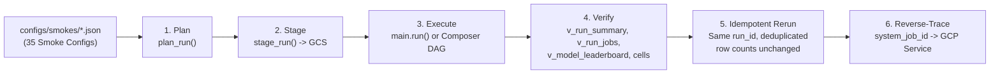

# Smoke Testing Guide

A **smoke test** is a small, end-to-end live run (20–100 time series) that verifies a specific runtime, hardware, backtesting, HPO, feature-engineering, or ensembling combination against live Google Cloud infrastructure.

- **Smoke Config Library**: [`configs/smokes/`](https://github.com/statmike/scale-forecasting/tree/main/configs/smokes) (35 JSON configs)
- **Direct Smoke Harness**: [`tests/smokes/smoke_harness.py`](https://github.com/statmike/scale-forecasting/blob/main/tests/smokes/smoke_harness.py)
- **Composer / Airflow Harness**: [`tests/smokes/airflow_smoke.py`](https://github.com/statmike/scale-forecasting/blob/main/tests/smokes/airflow_smoke.py)
- **Live Results Record**: [System Validation Ledger](validation.md)



---

## Smoke Suite Overview (`01`–`35`)

Configs are ordered from fastest/cheapest to most comprehensive:

| # | Config | What It Verifies |
|---|--------|------------------|
| `01` | `01_serverless_cpu.json` | Spark on Dataproc Serverless CPU (`statistical` + `ml` families) |
| `02` | `02_bq_native.json` | BigQuery-native models (`arima_plus`, `timesfm`) in BigQuery |
| `03` | `03_serverless_gpu.json` | Dataproc Serverless GPU (`deep_learning` family on NVIDIA L4) |
| `04` | `04_cluster_cpu.json` | Spark on an ephemeral Dataproc Standard Cluster (CPU) |
| `05` | `05_cluster_reuse.json` | Reusing a standing Dataproc Standard Cluster (`sf-smoke-cluster`) by name |
| `06` | `06_cluster_gpu.json` | Ephemeral Dataproc Standard Cluster with NVIDIA T4 GPUs |
| `07` | `07_ray_cpu.json` | Vertex AI Ray CPU (`statistical` + `ml` sharing one Ray cluster) |
| `08` | `08_ray_gpu.json` | Vertex AI Ray GPU (`deep_learning` family on NVIDIA T4) |
| `09` | `09_shared_ray.json` | Multiple families sharing one Vertex AI Ray cluster with CPU + GPU pools |
| `10` | `10_mixed_runtimes.json` | Dataproc Serverless Spark + Vertex AI Ray GPU + BigQuery concurrently under one `run_id` |
| `11` | `11_ensemble_barrier.json` | Ensembling in `barrier` gather mode (wait for all member families, then blend once) |
| `12` | `12_ensemble_microbatch.json` | Ensembling in `microbatch` gather mode (poll and blend completed series incrementally) |
| `13` | `13_native_format.json` | Reading directly from the native BigQuery source table (`source_series_native`) |
| `14` | `14_full_dag.json` | Flagship multi-family run: all 4 model families + native + ensemble under one `run_id` |
| `15` | `15_airflow_multi_engine.json` | Full multi-engine DAG orchestrated by Cloud Composer 3 / Airflow |
| `16` | `16_cluster_split_hardware.json` | Concurrent provisioning of two Dataproc Standard Clusters (one CPU, one GPU) in one run |
| `17` | `17_gpu_absent_serverless.json` | **Negative GPU contract (Serverless L4):** refuses execution when GPU is hidden |
| `18` | `18_gpu_absent_cluster.json` | **Negative GPU contract (Dataproc Cluster T4):** refuses execution when GPU is hidden |
| `19` | `19_gpu_absent_ray.json` | **Negative GPU contract (Vertex AI Ray T4):** refuses execution when GPU is hidden |
| `20` | `20_gpu_intent_cpu_family.json` | **Hardware override:** top-level `use_gpu: true` with `deep_learning` overridden to `hardware: "cpu"` |
| `21` | `21_full_catalogue.json` | **Catalogue sweep:** all 18 models and all 6 ensemble strategies in a single Serverless CPU run |
| `22` | `22_backtest_sliding_overlap.json` | **Backtest (1/4):** `sliding` refit scheme, `overlap` short-series policy, `control_arm: true`, `rmse` |
| `23` | `23_backtest_frozen_shrink.json` | **Backtest (2/4):** `expanding_frozen` refit scheme, `shrink_train` policy (`min_train_floor`), `mae` |
| `24` | `24_backtest_stale.json` | **Backtest (3/4):** `expanding_stale` refit scheme, default `adapt` short-series policy, `smape` |
| `25` | `25_backtest_skip.json` | **Backtest (4/4):** `skip` short-series policy (unscored backtest, horizon forecast preserved), `maape` |
| `26` | `26_hpo_fleetwide.json` | **HPO (1/2):** Optuna hyperparameter optimization with `granularity: "fleetwide"` |
| `27` | `27_hpo_per_series.json` | **HPO (2/2):** Optuna hyperparameter optimization with `granularity: "per_series"` |
| `28` | `28_features_off.json` | **Feature engineering baseline:** 6 feature-consuming models on 50 series with no `features` block |
| `29` | `29_features_on.json` | **Feature engineering (1/3):** `fourier`, `level_shift`, `exog_lags`, and `exog: ["is_holiday"]` |
| `30` | `30_features_boxcox.json` | **Feature engineering (2/3):** `transform: "boxcox"` (positive series succeed, non-positive guarded) |
| `31` | `31_features_exog.json` | **Feature engineering (3/3):** `features.exog` (`["is_holiday"]`) projected and extended over horizon |
| `32` | `32_covariates_three_tier.json` | **Three-tier covariates:** `static_covariates`, `future_covariates`, and lagged `past_covariates` (`rmsse`) |
| `33` | `33_expanded_stats_ml.json` | **Expanded statistical & ML models:** `auto_arima`, `auto_ces`, `auto_theta`, `tbats`, `fft`, `kalman`, `random_forest`, `catboost` (`msse`) |
| `34` | `34_global_hybrid_dl.json` | **Global & hybrid deep learning:** `tide`, `tft`, `tsmixer`, `patchtst` (global) and `neuralprophet` (hybrid) on Vertex AI Ray (`interval_score`) |
| `35` | `35_hierarchy_reconciliation.json` | **Hierarchical forecast reconciliation:** 3-level hierarchy across all 7 FPP3 reconciliation methods (`msis`) |

---

## Design Notes on Specialized Smokes

### Why Smoke `21` Exists alongside Smoke `14`
Smoke `14` proves the full architectural topology (four model families + ensemble under one `run_id`) using a representative subset of models. Smoke `21` runs **all 18 registered models** and **all 6 ensemble strategies** (including learned `ridge` and `xgb` stacking) on Dataproc Serverless CPU across 50 series, verifying that every model produces non-null forecasts and valid scores across all 15 metrics.

### Backtest Semantics Sweep (`22`–`25`)
Every series in the seeded benchmark panel has 1,460 daily observations. Smokes `22`–`25` request 6 folds of 28 days with `min_train_size: 1300` (which requires 1,468 observations for non-overlapping folds), intentionally triggering each short-series policy:

- **`22` (`overlap`)**: Compresses the step between fold cutoffs from 28 to 26 days to reach all 6 folds (`backtest_status='reduced'`), and enables `control_arm: true` to populate `yhat_stale`.
- **`23` (`shrink_train`)**: Reduces `min_train_size` from 1,300 to 1,292 (above `min_train_floor: 1000`) to reach all 6 folds, and tests `expanding_frozen` (`recondition` where supported by Darts, automatic refit fallback with `backtest_refit='unsupported'` where not).
- **`24` (`adapt`)**: Keeps the step and minimum training window intact and scores 5 of 6 folds (`backtest_status='reduced'`).
- **`25` (`skip`)**: Leaves short series unscored (`backtest_status='unscored'`, `n_folds_achieved=0`) while still generating all 28-step horizon forecasts.

### Negative GPU Contract Arms (`17`–`19`) and `SF_HIDE_DEVICES`
Smokes `03`, `06`, and `08` verify that GPU runs succeed when an accelerator is present. Smokes `17`–`19` verify that the platform **refuses to silently fall back to CPU** when a GPU is requested but absent:

```bash
SF_HIDE_DEVICES=probe .venv/bin/python tests/smokes/smoke_harness.py \
  configs/smokes/17_gpu_absent_serverless.json --no-rerun
```

| `SF_HIDE_DEVICES` Value | Worker Behavior | Purpose |
|---|---|---|
| `probe` | Device probe reports `cpu` while CUDA libraries remain intact | Exercises `_require_device` across all three runtimes and records `CONFIG_REPAIRABLE` cell errors |
| `cuda` | Sets `CUDA_VISIBLE_DEVICES=""` on the worker | Simulates a low-level CUDA driver/device absence |

The smoke harness refuses to launch `*_gpu_absent_*` configs unless `SF_HIDE_DEVICES` is set (or `--allow-unarmed` is passed explicitly). For these three negative arms, a failed run (`FAILED` status with `CONFIG_REPAIRABLE` cells) is the expected passing outcome.

### Ray Poll Recovery Fault Injection (`SF_RAY_POLL_FAULT`)
Long-running Vertex AI Ray jobs poll the Ray dashboard every 15 seconds and automatically recover from transient proxy `5xx` errors or 60-minute OAuth token expirations. You can test this recovery path on any Ray smoke config:

```bash
SF_RAY_POLL_FAULT=transport,auth .venv/bin/python tests/smokes/smoke_harness.py \
  configs/smokes/07_ray_cpu.json --force
```

The first poll of each Ray job injects a simulated transport (`503`) and/or auth (`401`) error, logs the injection and reconnect at `WARNING` level, mints a fresh token, and completes the run normally.

### Covariates, Global/Hybrid DL, and Hierarchical Reconciliation (`32`–`35`)
Smokes `32`–`35` exercise the Phase B expansion against the 100-series covariate + hierarchy benchmark tables (`source_series_covariates_iceberg` and `source_series_covariates_native`):

- **`32` (`32_covariates_three_tier.json`)**: Exercises `static_covariates` (`region`, `category`, `store_size`), `future_covariates` (`is_holiday`, `promo_depth`), and lookahead-safe lagged `past_covariates` (`foot_traffic` lagged `[1, 7]`) across 8 statistical and ML models (`decision_metric="rmsse"`).
- **`33` (`33_expanded_stats_ml.json`)**: Exercises all 6 new statistical models (`auto_arima`, `auto_ces`, `auto_theta`, `tbats`, `fft`, `kalman`) and 2 new ML models (`random_forest`, `catboost`) across 25 series on `source_series_covariates_native` (`decision_metric="msse"`).
- **`34` (`34_global_hybrid_dl.json`)**: Exercises multi-series panel training across all 4 `neuralforecast` global models (`tide`, `tft`, `tsmixer`, `patchtst`) and `neuralprophet` (`training_mode="hybrid"`) with three-tier covariates on Vertex AI Ray (`decision_metric="interval_score"`).
- **`35` (`35_hierarchy_reconciliation.json`)**: Aggregates 50 bottom series into a 57-node hierarchy (`__total__` → `region` → `region/category` → bottom) and reconciles base forecasts and prediction intervals across all 7 FPP3 methods (`bottom_up`, `top_down`, `middle_out`, `ols`, `wls_struct`, `wls_var`, `mint_shrink`) (`decision_metric="msis"`).

---

## Prerequisites

Export your environment variables directly from the deployed Terraform state in `terraform/main`:

```bash
cd terraform/main
eval "$(terraform output -json | python -c 'import json,sys
o=json.load(sys.stdin); g=lambda k: o[k]["value"]
print(f"export SF_PROJECT_ID={g(\"project_id\")}")
print(f"export SF_CONNECTION={g(\"iceberg_connection\")}")
print(f"export SF_WAREHOUSE_URI={g(\"warehouse_uri\")}")
print(f"export SF_DATASET_ID={g(\"dataset_id\")}")
print(f"export SF_CODE_BUCKET={g(\"code_bucket\")}")
print(f"export SF_CONTAINER_IMAGE={g(\"runtime_image_repo\")}:latest")
print(f"export SF_COMPUTE_SA={g(\"compute_sa\")}")
print(f"export SF_SUBNETWORK_URI={g(\"subnetwork_uri\")}")
print(f"export SF_RAY_NETWORK_ATTACHMENT={g(\"network_attachment_id\")}")
print(f"export SF_VENV_ARCHIVE={g(\"venv_archive_uri\")}")
gpu=o.get("gpu_image_uri", {}).get("value")
print(f"export SF_GPU_IMAGE={gpu}") if gpu else None')"
export SF_REGION=us-central1
```

Additional requirements by smoke category:
- **Source Tables**: `source_series_iceberg` and `source_series_native` (plus `source_series_covariates_iceberg` and `source_series_covariates_native` for Smokes `32`–`35`) must exist in your BigQuery dataset.
- **GPU Smokes (`03`, `06`, `08`, `09`, `10`, `14`, `15`, `16`)**: Requires regional GPU quota (`NVIDIA L4` for Dataproc Serverless; `NVIDIA T4` for Dataproc Standard Cluster and Vertex AI Ray).
- **Cluster Reuse Smoke (`05`)**: Requires a standing Dataproc cluster named `sf-smoke-cluster`.

---

## Running a Direct Smoke Test

Run any smoke configuration with a single command:

```bash
.venv/bin/python tests/smokes/smoke_harness.py configs/smokes/01_serverless_cpu.json
```

Useful flags:
- `--force` — Bump the attempt counter under the same `run_id`.
- `--no-rerun` — Execute once and skip the idempotent re-run verification step.

---

## Running the Cloud Composer / Airflow Smoke (`15`)

Smoke `15` (`15_airflow_multi_engine.json`) validates the Cloud Composer / Airflow integration end to end: staging artifacts, emitting `dag_<run_id>.py`, importing the DAG into Cloud Composer, triggering it via the Airflow REST API, and verifying all registry tables.

```bash
# 1. Provision Cloud Composer (optional module, off by default)
cd terraform/main
terraform plan -var create_composer=true -target=module.composer -out=composer.tfplan
terraform apply composer.tfplan

# 2. Sync the working tree's src/ directory to Composer's plugins bucket
cd ../..
make composer-sync

# 3. Execute the Airflow smoke end-to-end
.venv/bin/python tests/smokes/airflow_smoke.py configs/smokes/15_airflow_multi_engine.json \
    --composer-env scale-forecasting --location "$SF_REGION"

# 4. Tear down Composer when finished to stop billing
cd terraform/main
terraform plan -var create_composer=false -target=module.composer -out=composer-down.tfplan
terraform apply composer-down.tfplan
```

---

## Inspecting Results in BigQuery

Query the semantic views directly for any `run_id`:

```sql
-- Run-level status, timing, and efficiency summary
SELECT * FROM `PROJECT.DATASET.v_run_summary` WHERE run_id = 'RUN_ID';

-- Per-family runtime, hardware, and native platform job IDs
SELECT * FROM `PROJECT.DATASET.v_run_jobs` WHERE run_id = 'RUN_ID';

-- Model accuracy leaderboard ordered by WAPE
SELECT * FROM `PROJECT.DATASET.v_model_leaderboard` WHERE run_id = 'RUN_ID' ORDER BY mean_wape;
```

---

## Offline Guardrails

The smoke configuration library and harness logic are continuously verified in the offline test suite (`make test`):

- [`tests/smokes/test_smoke_configs.py`](https://github.com/statmike/scale-forecasting/blob/main/tests/smokes/test_smoke_configs.py) — Validates that all 35 smoke configs parse, validate, and plan cleanly across every runtime, hardware, and ensemble combination.
- [`tests/smokes/test_harness.py`](https://github.com/statmike/scale-forecasting/blob/main/tests/smokes/test_harness.py) — Unit-tests the harness verification and reverse-trace logic against fixture rows.
- [`tests/smokes/test_airflow_smoke.py`](https://github.com/statmike/scale-forecasting/blob/main/tests/smokes/test_airflow_smoke.py) — Unit-tests the Composer command builders and DAG ID derivation.
- [`tests/unit/test_airflow_dagbag.py`](https://github.com/statmike/scale-forecasting/blob/main/tests/unit/test_airflow_dagbag.py) — Loads emitted DAGs through a real `airflow.models.DagBag` in CI (`@airflow` marker).
