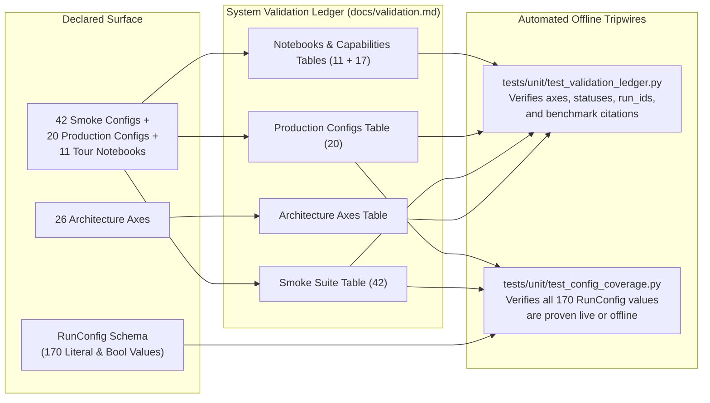

# System Validation Ledger

**What has been proven on live Google Cloud infrastructure, and on which architecture.**

This ledger is the single source of truth for live system validation across Dataproc Serverless, Dataproc Standard Clusters, Vertex AI Ray, Ray on Google Kubernetes Engine (`gke`), Vertex AI `CustomJob`, Vertex AI AutoML & Tabular Workflows (`vertex_automl`), Compute Engine Single-VM (`gce`), Google Kubernetes Engine Indexed Jobs (`gke`), BigQuery ML / AI.FORECAST, and Cloud Composer. Notice that **System Validation** refers to platform, runtime, and operational validation—for statistical forecast evaluation and backtesting, see [Backtesting and Model Selection](backtesting.md).

## How the Validation Tripwires Work

A live validation result is only meaningful relative to the architecture it ran on. Every entry in this ledger declares the **architecture axes** it depends on and the value each axis held when the run was proven:

1. **Staleness Tripwire (`tests/unit/test_validation_ledger.py`)**: When an architectural axis changes, any ledger entry pinned to the previous value becomes mechanically stale. The offline test suite refuses to allow an entry with a superseded axis value, an unrecorded `run_id`, or a missing config row to claim `CURRENT`. Benchmark citations in [Quota, Throughput, and Scale](quota_and_scale.md) are also cross-checked against this ledger.
2. **Config Surface Coverage Tripwire (`tests/unit/test_config_coverage.py`)**: Joins every reachable `Literal` member and `bool` state on `RunConfig` against the `CURRENT` rows in this ledger and the offline unit test suite. Every configuration value must be explicitly accounted for: **176 declared values — 133 proven live, 41 exercised offline, 0 genuine gaps, 2 not work.**

---

## Architecture Axes

Each axis represents a core architectural contract. Changing an axis value in code automatically invalidates any ledger row that depends on the previous value until that configuration is re-proven on live GCP infrastructure.

| Axis | Current value | Set by | Previous value |
|------|---------------|--------|----------------|
| `ray_deps` | `stock-image+uv-runtime-env` | `822ae25` (2026-08-28) | `custom-container-image` |
| `cluster_deps` | `packed-venv-init-action` | `eae3874` | `job-attached-archive` |
| `serverless_deps` | `container-image` | baseline | — |
| `gpu_cluster_image` | `driver-init-action+image-pinned-2.2.85` | `2026-09-12` | `driver-init-action` on floating `2.2-debian12` |
| `cluster_provisioning` | `concurrent-per-hardware` | `e1010be` (2026-09-12) | `sequential-per-hardware` |
| `native_source_pin` | `unpinned-all-sources` | `9af322a` (2026-08-25) | `unpinned-iceberg-only` |
| `python` | `3.11` | `515ecb0` | `mixed-per-surface` |
| `run_id_inputs` | `authored-config-only-v3` | `2026-09-09` | `authored-config-only-v2` |
| `fleet_sizing` | `derived-overlay-three-way-min` | `2026-09-07` | `derived-overlay` |
| `horizon_features` | `computed-at-future-dates` | `cb7d15f` (2026-08-31) | `first-rows-of-history` |
| `ray_pool_shape` | `autoscaling` | `2026-09-03` | `fixed-size` |
| `ray_slot_memory` | `harvest-only` | `efecb4c` (2026-09-04) | `driver-rss-prepass` |
| `dl_gpu_routing` | `resolved-per-family` | `2026-09-05` | `flat-compute.use_gpu` |
| `backtest_scoring` | `holdout-reserved+embargo-aware+auto-refit` | `11401bf`, `fae9cee`, `834ad6a` (2026-09-10) | `holdout-fold-reserved` |
| `gpu_device_probe` | `trainer-root-device` | `2026-09-09` | `parameter-tensor-after-fit` |
| `serverless_gpu_allocator` | `rapids-pool-released` | `2026-09-09` | `rapids-default-pool` |
| `job_status` | `derived-from-cell-tallies` | `bf12e96` (2026-09-10) | `launch-call-returned` |
| `gpu_batch_churn` | `executor-failure-budget+stall-watchdog` | `2026-09-10` | `unbounded-executor-replacement` |
| `gpu_fault_injection` | `probe-mode-default` | `2026-09-10` | `cuda-visible-devices-emptied` |
| `ray_poll_recovery` | `transient-transport+auth` | `2026-09-10` | `auth-expiry-only` |
| `serverless_cancel` | `operation-cancel` | `2026-09-11` | `batch-delete` |
| `ensemble_weighting` | `per-series-calculated+batch-fit-learned` | `2026-09-11` | `gather-order-dependent` |
| `job_wait` | `operator-dialed-24h+leave-cluster-up` | `2ca68f1` + `5f3c48e` (2026-09-14) | `fixed-2h-client-ceiling` |
| `gpu_slot_fraction` | `measured-on-device` | `29c19dc` (2026-09-16) | `head-node-probe-fallback` |

---

## Smoke Suite (`configs/smokes/`)

The 42 smoke configurations live in [`configs/smokes/`](https://github.com/statmike/scale-forecasting/tree/main/configs/smokes); see [Smoke Testing](smoke_testing.md) for how to execute and verify them. The ledger tripwire enforces a strict 1-to-1 mapping between `configs/smokes/*.json` and the rows below.

| # | Config | Proves | Status | Date | run_id | Axes at proof |
|---|--------|--------|--------|------|--------|---------------|
| 01 | `01_serverless_cpu.json` | Spark on Dataproc Serverless CPU (`statistical` + `ml` families, 100 series). | CURRENT | 2026-09-09 | `smoke-01-serverless-cpu-7a3d4234e0e1` (attempt 1) | `serverless_deps=container-image`, `python=3.11`, `fleet_sizing=derived-overlay-three-way-min`, `run_id_inputs=authored-config-only-v3`, `horizon_features=computed-at-future-dates` |
| 02 | `02_bq_native.json` | BigQuery-native models (`arima_plus` via BQML and `timesfm` via `AI.FORECAST`). | CURRENT | 2026-09-11 | `smoke-02-bq-native-e354a8652712` | `native_source_pin=unpinned-all-sources`, `python=3.11`, `run_id_inputs=authored-config-only-v3` |
| 03 | `03_serverless_gpu.json` | Dataproc Serverless GPU (`deep_learning` family on NVIDIA L4). | CURRENT | 2026-09-09 | `smoke-03-serverless-gpu-92763e0f2242` | `serverless_deps=container-image`, `serverless_gpu_allocator=rapids-pool-released`, `gpu_device_probe=trainer-root-device`, `dl_gpu_routing=resolved-per-family`, `python=3.11`, `fleet_sizing=derived-overlay-three-way-min`, `run_id_inputs=authored-config-only-v3`, `horizon_features=computed-at-future-dates` |
| 04 | `04_cluster_cpu.json` | Spark on an ephemeral Dataproc Standard Cluster (CPU), including create-then-delete lifecycle verification. | CURRENT | 2026-09-12 | `smoke-04-cluster-cpu-9196365250ac` | `cluster_deps=packed-venv-init-action`, `python=3.11`, `fleet_sizing=derived-overlay-three-way-min`, `horizon_features=computed-at-future-dates`, `run_id_inputs=authored-config-only-v3` |
| 05 | `05_cluster_reuse.json` | Reusing a standing Dataproc Standard Cluster by name (`sf-smoke-cluster`) without tearing it down after completion. | CURRENT | 2026-09-12 | `smoke-05-cluster-reuse-adbe6bd63644` | `cluster_deps=packed-venv-init-action`, `python=3.11`, `fleet_sizing=derived-overlay-three-way-min`, `horizon_features=computed-at-future-dates`, `run_id_inputs=authored-config-only-v3` |
| 06 | `06_cluster_gpu.json` | Ephemeral Dataproc Standard Cluster with NVIDIA T4 GPUs on pinned image `2.2.85-debian12` and GPU driver initialization. | CURRENT | 2026-09-13 | `smoke-06-cluster-gpu-eea70f834c66` | `cluster_deps=packed-venv-init-action`, `gpu_cluster_image=driver-init-action+image-pinned-2.2.85`, `gpu_device_probe=trainer-root-device`, `dl_gpu_routing=resolved-per-family`, `python=3.11`, `fleet_sizing=derived-overlay-three-way-min`, `horizon_features=computed-at-future-dates`, `run_id_inputs=authored-config-only-v3` |
| 07 | `07_ray_cpu.json` | Vertex AI Ray CPU with two model families sharing one cluster and live poll-recovery fault injection (`SF_RAY_POLL_FAULT=transport,auth`). | CURRENT | 2026-09-22 | `smoke-07-ray-cpu-ed27e03a2083` (attempts 2 and 3) | `ray_poll_recovery=transient-transport+auth`, `ray_pool_shape=autoscaling`, `ray_deps=stock-image+uv-runtime-env`, `ray_slot_memory=harvest-only`, `python=3.11`, `fleet_sizing=derived-overlay-three-way-min`, `run_id_inputs=authored-config-only-v3`, `horizon_features=computed-at-future-dates` |
| 08 | `08_ray_gpu.json` | Vertex AI Ray GPU (`neuralprophet` on NVIDIA T4 workers). | CURRENT | 2026-09-09 | `smoke-08-ray-gpu-497c57c3ad2c` | `ray_pool_shape=autoscaling`, `ray_deps=stock-image+uv-runtime-env`, `ray_slot_memory=harvest-only`, `gpu_device_probe=trainer-root-device`, `dl_gpu_routing=resolved-per-family`, `python=3.11`, `fleet_sizing=derived-overlay-three-way-min`, `run_id_inputs=authored-config-only-v3`, `horizon_features=computed-at-future-dates` |
| 09 | `09_shared_ray.json` | Multiple families (`statistical`, `ml`, `deep_learning`) sharing one Vertex AI Ray cluster with dedicated CPU and GPU worker pools. | CURRENT | 2026-09-12 | `smoke-09-shared-ray-859750fc97a5` | `ray_pool_shape=autoscaling`, `ray_deps=stock-image+uv-runtime-env`, `ray_slot_memory=harvest-only`, `gpu_device_probe=trainer-root-device`, `dl_gpu_routing=resolved-per-family`, `python=3.11`, `fleet_sizing=derived-overlay-three-way-min`, `run_id_inputs=authored-config-only-v3`, `horizon_features=computed-at-future-dates` |
| 10 | `10_mixed_runtimes.json` | Concurrent execution across Dataproc Serverless Spark, Vertex AI Ray GPU, and BigQuery ML under a single `run_id`. | CURRENT | 2026-09-12 | `smoke-10-mixed-runtimes-7aef85d2117b` | `ray_pool_shape=autoscaling`, `ray_deps=stock-image+uv-runtime-env`, `ray_slot_memory=harvest-only`, `serverless_deps=container-image`, `native_source_pin=unpinned-all-sources`, `gpu_device_probe=trainer-root-device`, `dl_gpu_routing=resolved-per-family`, `python=3.11`, `fleet_sizing=derived-overlay-three-way-min`, `horizon_features=computed-at-future-dates`, `run_id_inputs=authored-config-only-v3` |
| 11 | `11_ensemble_barrier.json` | Post-hoc ensembling in `barrier` gather mode across multiple families, producing identical blended forecasts to `microbatch` mode across all 2,800 cells. | CURRENT | 2026-09-11 | `smoke-11-ensemble-barrier-834f770ba38b` (attempt 2) | `ensemble_weighting=per-series-calculated+batch-fit-learned`, `backtest_scoring=holdout-reserved+embargo-aware+auto-refit`, `serverless_deps=container-image`, `native_source_pin=unpinned-all-sources`, `python=3.11`, `fleet_sizing=derived-overlay-three-way-min`, `horizon_features=computed-at-future-dates`, `run_id_inputs=authored-config-only-v3` |
| 12 | `12_ensemble_microbatch.json` | Post-hoc ensembling in `microbatch` gather mode, polling and blending member families incrementally as they complete. | CURRENT | 2026-09-11 | `smoke-12-ensemble-microbatch-9bcd1d294437` (attempt 2) | `ensemble_weighting=per-series-calculated+batch-fit-learned`, `backtest_scoring=holdout-reserved+embargo-aware+auto-refit`, `serverless_deps=container-image`, `native_source_pin=unpinned-all-sources`, `python=3.11`, `fleet_sizing=derived-overlay-three-way-min`, `horizon_features=computed-at-future-dates`, `run_id_inputs=authored-config-only-v3` |
| 13 | `13_native_format.json` | Reading directly from a standard BigQuery native table (`source_series_native`) alongside BigLake Iceberg tables. | CURRENT | 2026-09-11 | `smoke-13-native-format-0995c922faab` | `native_source_pin=unpinned-all-sources`, `serverless_deps=container-image`, `python=3.11`, `fleet_sizing=derived-overlay-three-way-min`, `horizon_features=computed-at-future-dates`, `run_id_inputs=authored-config-only-v3` |
| 14 | `14_full_dag.json` | Flagship multi-family run: four model families (`statistical`, `ml`, `deep_learning` on Serverless L4 GPU, `native`) plus ensembling under one `run_id` (11,200 blended rows). | CURRENT | 2026-09-11 | `smoke-14-full-dag-2cef0feb95da` | `ensemble_weighting=per-series-calculated+batch-fit-learned`, `backtest_scoring=holdout-reserved+embargo-aware+auto-refit`, `serverless_deps=container-image`, `serverless_gpu_allocator=rapids-pool-released`, `gpu_device_probe=trainer-root-device`, `dl_gpu_routing=resolved-per-family`, `native_source_pin=unpinned-all-sources`, `python=3.11`, `fleet_sizing=derived-overlay-three-way-min`, `horizon_features=computed-at-future-dates`, `run_id_inputs=authored-config-only-v3` |
| 15 | `15_airflow_multi_engine.json` | Full multi-engine DAG (`statistical`, `ml`, `deep_learning` on Ray T4 GPU, `native`, `ensemble`, `finalize`) emitted by `airflow_emit` and orchestrated end-to-end by Cloud Composer 3 / Airflow. | CURRENT | 2026-09-20 | `smoke-15-airflow-multi-engine-60d76b813135` | `ray_pool_shape=autoscaling`, `ray_deps=stock-image+uv-runtime-env`, `ray_slot_memory=harvest-only`, `serverless_deps=container-image`, `native_source_pin=unpinned-all-sources`, `gpu_device_probe=trainer-root-device`, `dl_gpu_routing=resolved-per-family`, `ensemble_weighting=per-series-calculated+batch-fit-learned`, `backtest_scoring=holdout-reserved+embargo-aware+auto-refit`, `python=3.11`, `fleet_sizing=derived-overlay-three-way-min`, `horizon_features=computed-at-future-dates`, `run_id_inputs=authored-config-only-v3` |
| 16 | `16_cluster_split_hardware.json` | Concurrent provisioning of two ephemeral Dataproc Standard Clusters in one run (`sf-cluster-<run_id>-cpu` on `2.2.87-debian12` and `sf-cluster-<run_id>-gpu` on `2.2.85-debian12`). | CURRENT | 2026-09-13 | `smoke-16-cluster-split-hardware-8a15339afe9b` | `cluster_provisioning=concurrent-per-hardware`, `cluster_deps=packed-venv-init-action`, `gpu_cluster_image=driver-init-action+image-pinned-2.2.85`, `gpu_device_probe=trainer-root-device`, `dl_gpu_routing=resolved-per-family`, `python=3.11`, `fleet_sizing=derived-overlay-three-way-min`, `horizon_features=computed-at-future-dates`, `run_id_inputs=authored-config-only-v3` |
| 17 | `17_gpu_absent_serverless.json` | **Negative GPU contract arm (Serverless L4):** with the GPU hidden at probe time, every cell fails with `CONFIG_REPAIRABLE` naming the service, and the batch terminates cleanly via the executor failure budget. | CURRENT | 2026-09-10 | `smoke-17-gpu-absent-serverless-ea3341fa9fd5` | `gpu_fault_injection=probe-mode-default`, `gpu_batch_churn=executor-failure-budget+stall-watchdog`, `job_status=derived-from-cell-tallies`, `serverless_deps=container-image`, `serverless_gpu_allocator=rapids-pool-released`, `gpu_device_probe=trainer-root-device`, `dl_gpu_routing=resolved-per-family`, `python=3.11`, `fleet_sizing=derived-overlay-three-way-min`, `run_id_inputs=authored-config-only-v3`, `horizon_features=computed-at-future-dates` |
| 18 | `18_gpu_absent_cluster.json` | **Negative GPU contract arm (Dataproc Cluster T4):** with the GPU hidden at probe time, every cell records `CONFIG_REPAIRABLE` and both `run_jobs` and `run_registry` close `FAILED`. | CURRENT | 2026-09-13 | `smoke-18-gpu-absent-cluster-ef1858b8b83d` | `gpu_fault_injection=probe-mode-default`, `job_status=derived-from-cell-tallies`, `cluster_deps=packed-venv-init-action`, `gpu_cluster_image=driver-init-action+image-pinned-2.2.85`, `gpu_device_probe=trainer-root-device`, `dl_gpu_routing=resolved-per-family`, `python=3.11`, `fleet_sizing=derived-overlay-three-way-min`, `run_id_inputs=authored-config-only-v3`, `horizon_features=computed-at-future-dates` |
| 19 | `19_gpu_absent_ray.json` | **Negative GPU contract arm (Vertex AI Ray T4):** with the GPU hidden at probe time, every cell records `CONFIG_REPAIRABLE` without crashing the Ray worker holding the GPU slot. | CURRENT | 2026-09-10 | `smoke-19-gpu-absent-ray-1c033f10707b` | `gpu_fault_injection=probe-mode-default`, `job_status=derived-from-cell-tallies`, `ray_pool_shape=autoscaling`, `ray_deps=stock-image+uv-runtime-env`, `ray_slot_memory=harvest-only`, `gpu_device_probe=trainer-root-device`, `dl_gpu_routing=resolved-per-family`, `python=3.11`, `fleet_sizing=derived-overlay-three-way-min`, `run_id_inputs=authored-config-only-v3`, `horizon_features=computed-at-future-dates` |
| 20 | `20_gpu_intent_cpu_family.json` | **Hardware override arm:** top-level `use_gpu: true` with `deep_learning` overridden to `hardware: "cpu"` provisions a CPU-only Ray pool and completes on CPU. | CURRENT | 2026-09-10 | `smoke-20-gpu-intent-cpu-family-239ba1e33242` | `dl_gpu_routing=resolved-per-family`, `ray_deps=stock-image+uv-runtime-env`, `ray_pool_shape=autoscaling`, `gpu_device_probe=trainer-root-device`, `python=3.11`, `fleet_sizing=derived-overlay-three-way-min`, `run_id_inputs=authored-config-only-v3`, `horizon_features=computed-at-future-dates` |
| 21 | `21_full_catalogue.json` | **Full catalogue sweep:** all 18 registered models and all 6 ensemble strategies (`mean`, `median`, `trimmed_mean`, `inverse_metric`, `ridge`, `xgb`) in a single run across 50 series, scoring all 15 metrics with zero NULLs (33,600 forecasts, 50,400 OOF rows). | CURRENT | 2026-09-23 | `smoke-21-full-catalogue-98e3cb319f96` | `ensemble_weighting=per-series-calculated+batch-fit-learned`, `backtest_scoring=holdout-reserved+embargo-aware+auto-refit`, `serverless_deps=container-image`, `native_source_pin=unpinned-all-sources`, `python=3.11`, `fleet_sizing=derived-overlay-three-way-min`, `horizon_features=computed-at-future-dates`, `run_id_inputs=authored-config-only-v3` |
| 22 | `22_backtest_sliding_overlap.json` | **Backtest semantics (1/4):** `sliding` refit scheme, `overlap` short-series policy (compressing fold step from 28 to 26 to achieve 6 folds with `backtest_status=reduced`), `control_arm: true` (`yhat_stale` populated), and `decision_metric="rmse"`. | CURRENT | 2026-09-23 | `smoke-22-backtest-sliding-overlap-eca75eb54835` | `backtest_scoring=holdout-reserved+embargo-aware+auto-refit`, `serverless_deps=container-image`, `python=3.11`, `fleet_sizing=derived-overlay-three-way-min`, `job_status=derived-from-cell-tallies`, `run_id_inputs=authored-config-only-v3` |
| 23 | `23_backtest_frozen_shrink.json` | **Backtest semantics (2/4):** `expanding_frozen` refit scheme, `shrink_train` short-series policy against `min_train_floor=1000`, `staleness_gap` calculation, and `decision_metric="mae"`. | CURRENT | 2026-09-23 | `smoke-23-backtest-frozen-shrink-ce2793df03f2` | `backtest_scoring=holdout-reserved+embargo-aware+auto-refit`, `serverless_deps=container-image`, `python=3.11`, `fleet_sizing=derived-overlay-three-way-min`, `job_status=derived-from-cell-tallies`, `run_id_inputs=authored-config-only-v3` |
| 24 | `24_backtest_stale.json` | **Backtest semantics (3/4):** `expanding_stale` refit scheme (`backtest_refit=extrapolate`), default `adapt` short-series policy (5 of 6 folds achieved with diagnostic note), and `decision_metric="smape"`. | CURRENT | 2026-09-23 | `smoke-24-backtest-stale-1c0d92a16531` | `backtest_scoring=holdout-reserved+embargo-aware+auto-refit`, `serverless_deps=container-image`, `python=3.11`, `fleet_sizing=derived-overlay-three-way-min`, `job_status=derived-from-cell-tallies`, `run_id_inputs=authored-config-only-v3` |
| 25 | `25_backtest_skip.json` | **Backtest semantics (4/4):** `skip` short-series policy (`backtest_status=unscored`, `n_folds_achieved=0` on short series while still producing all 560 horizon forecasts per model) and `decision_metric="maape"`. | CURRENT | 2026-09-23 | `smoke-25-backtest-skip-d28444e0a889` | `backtest_scoring=holdout-reserved+embargo-aware+auto-refit`, `serverless_deps=container-image`, `python=3.11`, `fleet_sizing=derived-overlay-three-way-min`, `job_status=derived-from-cell-tallies`, `run_id_inputs=authored-config-only-v3` |
| 26 | `26_hpo_fleetwide.json` | **Hyperparameter optimization (1/2):** Optuna HPO with `granularity="fleetwide"` — tunes each model on a fleet sample and stamps a single winning `best_params` across all 50 series. | CURRENT | 2026-09-26 | `smoke-26-hpo-fleetwide-3df8ee4169b8` | `backtest_scoring=holdout-reserved+embargo-aware+auto-refit`, `serverless_deps=container-image`, `python=3.11`, `fleet_sizing=derived-overlay-three-way-min`, `job_status=derived-from-cell-tallies`, `run_id_inputs=authored-config-only-v3` |
| 27 | `27_hpo_per_series.json` | **Hyperparameter optimization (2/2):** Optuna HPO with `granularity="per_series"` — runs an independent Optuna study inside each `(ts_id, model)` cell, yielding series-specific `best_params`. | CURRENT | 2026-09-26 | `smoke-27-hpo-per-series-343ed2bdf272` | `backtest_scoring=holdout-reserved+embargo-aware+auto-refit`, `serverless_deps=container-image`, `python=3.11`, `fleet_sizing=derived-overlay-three-way-min`, `job_status=derived-from-cell-tallies`, `run_id_inputs=authored-config-only-v3` |
| 28 | `28_features_off.json` | **Feature engineering baseline:** six feature-consuming models (`regression_lags`, `prophet`, `sarimax`, `xgboost`, `ucm`, `lightgbm`) on 50 series with no `features` block, providing the control baseline for smokes 29–31. | CURRENT | 2026-09-26 | `smoke-28-features-off-f9298e722d7a` | `backtest_scoring=holdout-reserved+embargo-aware+auto-refit`, `serverless_deps=container-image`, `python=3.11`, `fleet_sizing=derived-overlay-three-way-min`, `job_status=derived-from-cell-tallies`, `run_id_inputs=authored-config-only-v3` |
| 29 | `29_features_on.json` | **Feature engineering (1/3):** `fourier`, `level_shift`, and `exog_lags` (`{"is_holiday": [1, 7, 28]}`) alongside `exog: ["is_holiday"]` across all 300 cells. | CURRENT | 2026-09-26 | `smoke-29-features-on-e4ad80d90817` | `backtest_scoring=holdout-reserved+embargo-aware+auto-refit`, `serverless_deps=container-image`, `python=3.11`, `fleet_sizing=derived-overlay-three-way-min`, `job_status=derived-from-cell-tallies`, `run_id_inputs=authored-config-only-v3` |
| 30 | `30_features_boxcox.json` | **Feature engineering (2/3):** `transform: "boxcox"` across 50 series — fits and inverts Box-Cox on the 30 strictly positive series (`ok`) and cleanly flags the 20 non-positive series with `CONFIG_REPAIRABLE` (`error`). | CURRENT | 2026-09-26 | `smoke-30-features-boxcox-96c5368ce4ca` | `backtest_scoring=holdout-reserved+embargo-aware+auto-refit`, `serverless_deps=container-image`, `python=3.11`, `fleet_sizing=derived-overlay-three-way-min`, `job_status=derived-from-cell-tallies`, `run_id_inputs=authored-config-only-v3` |
| 31 | `31_features_exog.json` | **Feature engineering (3/3):** `features.exog` (`["is_holiday"]`) projected from the source table, validated, passed to all six models, and extended across the forecast horizon. | CURRENT | 2026-09-26 | `smoke-31-features-exog-8bc96fed0e7a` | `backtest_scoring=holdout-reserved+embargo-aware+auto-refit`, `serverless_deps=container-image`, `python=3.11`, `fleet_sizing=derived-overlay-three-way-min`, `job_status=derived-from-cell-tallies`, `run_id_inputs=authored-config-only-v3` |
| 32 | `32_covariates_three_tier.json` | **Three-tier covariates:** `static_covariates` (`region`, `category`, `store_size`), `future_covariates` (`is_holiday`, `promo_depth`), and lookahead-safe `past_covariates` (`foot_traffic` lagged `[1, 7]`) across 8 statistical & ML models on `source_series_covariates_iceberg` (`decision_metric="rmsse"`). | CURRENT | 2026-09-30 | `smoke-32-covariates-three-tier-77d614b503d1` | `backtest_scoring=holdout-reserved+embargo-aware+auto-refit`, `serverless_deps=container-image`, `python=3.11`, `fleet_sizing=derived-overlay-three-way-min`, `job_status=derived-from-cell-tallies`, `horizon_features=computed-at-future-dates`, `run_id_inputs=authored-config-only-v3` |
| 33 | `33_expanded_stats_ml.json` | **Expanded statistical & ML models:** all 6 new statistical models (`auto_arima`, `auto_ces`, `auto_theta`, `tbats`, `fft`, `kalman`) and 2 new ML models (`random_forest`, `catboost`) across 25 series on `source_series_covariates_native` (`decision_metric="msse"`). | CURRENT | 2026-09-30 | `smoke-33-expanded-stats-ml-dfb077c0de90` | `backtest_scoring=holdout-reserved+embargo-aware+auto-refit`, `serverless_deps=container-image`, `native_source_pin=unpinned-all-sources`, `python=3.11`, `fleet_sizing=derived-overlay-three-way-min`, `job_status=derived-from-cell-tallies`, `horizon_features=computed-at-future-dates`, `run_id_inputs=authored-config-only-v3` |
| 34 | `34_global_hybrid_dl.json` | **Global & hybrid deep learning:** multi-series panel training across all 4 `neuralforecast` global models (`tide`, `tft`, `tsmixer`, `patchtst`) and `neuralprophet` (`training_mode="hybrid"`) with three-tier covariates on Vertex AI Ray (`decision_metric="interval_score"`). | CURRENT | 2026-09-30 | `smoke-34-global-hybrid-dl-83e2e83c34a3` (attempt 3) | `ray_pool_shape=autoscaling`, `ray_deps=stock-image+uv-runtime-env`, `ray_slot_memory=harvest-only`, `dl_gpu_routing=resolved-per-family`, `backtest_scoring=holdout-reserved+embargo-aware+auto-refit`, `python=3.11`, `fleet_sizing=derived-overlay-three-way-min`, `job_status=derived-from-cell-tallies`, `horizon_features=computed-at-future-dates`, `run_id_inputs=authored-config-only-v3` |
| 35 | `35_hierarchy_reconciliation.json` | **Hierarchical forecast reconciliation:** 3-level hierarchy (`__total__` → `region` → `region/category` → 50 bottom series = 57 nodes) reconciled across all 7 FPP3 methods (`bottom_up`, `top_down`, `middle_out`, `ols`, `wls_struct`, `wls_var`, `mint_shrink`) on Dataproc Serverless (`decision_metric="msis"`). | CURRENT | 2026-09-30 | `smoke-35-hierarchy-reconciliation-80a8810304fc` | `backtest_scoring=holdout-reserved+embargo-aware+auto-refit`, `serverless_deps=container-image`, `python=3.11`, `fleet_sizing=derived-overlay-three-way-min`, `job_status=derived-from-cell-tallies`, `horizon_features=computed-at-future-dates`, `run_id_inputs=authored-config-only-v3` |
| 36 | `36_covariate_fallback_multi_runtime.json` | **Multi-runtime covariate fallback + HPO + ensemble:** 3-tier covariates across Spark (`theta`, `sarimax`, `xgboost`, `catboost`), Ray (`tide`, `patchtst` in `global` mode), and BigQuery ML (`arima_plus`, `timesfm`) with `on_unsupported_covariates="fallback"`, `fleetwide` HPO, and `ensemble` (`mean`, `inverse_error`, `nnls`). | CURRENT | 2026-10-01 | `smoke-36-covariate-fallback-multi-runtime-301a6be995a8` (attempt 2) | `ray_pool_shape=autoscaling`, `ray_deps=stock-image+uv-runtime-env`, `ray_slot_memory=harvest-only`, `dl_gpu_routing=resolved-per-family`, `serverless_deps=container-image`, `native_source_pin=unpinned-all-sources`, `ensemble_weighting=per-series-calculated+batch-fit-learned`, `backtest_scoring=holdout-reserved+embargo-aware+auto-refit`, `python=3.11`, `fleet_sizing=derived-overlay-three-way-min`, `job_status=derived-from-cell-tallies`, `horizon_features=computed-at-future-dates`, `run_id_inputs=authored-config-only-v3` |
| 37 | `37_hierarchy_covariates_ensemble.json` | **Hierarchy + covariates + ensemble:** 3-level hierarchical reconciliation (`bottom_up`, `wls_struct`, `mint_shrink`) combined with 3-tier covariates (`static_covariates: ["region", "category"]`), univariate fallback (`theta`), and post-hoc `ensemble` (`mean`, `inverse_error`, `nnls`) scoring finite `mase` and `rmsse` across all bottom and aggregated hierarchy nodes. | CURRENT | 2026-10-01 | `smoke-37-hierarchy-covariates-ensemble-e6be5fed8071` (attempt 2) | `ensemble_weighting=per-series-calculated+batch-fit-learned`, `backtest_scoring=holdout-reserved+embargo-aware+auto-refit`, `serverless_deps=container-image`, `python=3.11`, `fleet_sizing=derived-overlay-three-way-min`, `job_status=derived-from-cell-tallies`, `horizon_features=computed-at-future-dates`, `run_id_inputs=authored-config-only-v3` |
| 38 | `38_vertex_custom_job.json` | **Vertex AI `CustomJob` (`runtime = "vertex"`) — multi-VM worker pools across all families + dedicated per-model NVIDIA L4 GPU VMs:** 2-VM CPU worker pools (`workers=2` on `statistical` for `theta` + `sarimax` and on `ml` for `xgboost` + `lightgbm`) and automatic 3-VM NVIDIA L4 GPU worker pool (`3 x g2-standard-8 + L4`, 1 dedicated GPU VM per model for global/hybrid `tide`, `tsmixer`, `neuralprophet`) with GCS worker-pool barrier synchronization, profile-driven hardware sizing, 3-tier covariates, 3-level hierarchy reconciliation (`bottom_up`, `wls_struct`, `mint_shrink`), and post-hoc `ensemble` (`mean`, `inverse_error`, `nnls`). | CURRENT | 2026-10-03 | `smoke-38-vertex-custom-job-82b620bbd9ba` (attempt 1) | `serverless_deps=container-image`, `dl_gpu_routing=resolved-per-family`, `gpu_device_probe=trainer-root-device`, `ensemble_weighting=per-series-calculated+batch-fit-learned`, `backtest_scoring=holdout-reserved+embargo-aware+auto-refit`, `python=3.11`, `fleet_sizing=derived-overlay-three-way-min`, `job_status=derived-from-cell-tallies`, `horizon_features=computed-at-future-dates`, `run_id_inputs=authored-config-only-v3` |
| 39 | `39_gce_single_vm.json` | **Compute Engine Single-VM (`runtime = "gce"`) — zero-orphan container execution + hardware sizing:** single-VM Container-Optimized OS execution across `statistical` (`theta`, `sarimax`), `ml` (`xgboost`), and `deep_learning` (`tide` in `global` mode) with triple-redundant anti-orphan lifecycle guarantees (`maxRunDuration` + `instanceTerminationAction="DELETE"`, guest `trap cleanup EXIT` GCS status marker + self-delete, and client `finally` teardown leaving `0` orphaned VMs), profile-driven sizing, 3-tier covariates, hierarchy reconciliation (`bottom_up`, `wls_struct`), and post-hoc `ensemble` (`mean`, `inverse_error`, `nnls`). | CURRENT | 2026-10-03 | `smoke-39-gce-single-vm-4aa21163baa6` (attempt 1) | `serverless_deps=container-image`, `dl_gpu_routing=resolved-per-family`, `ensemble_weighting=per-series-calculated+batch-fit-learned`, `backtest_scoring=holdout-reserved+embargo-aware+auto-refit`, `python=3.11`, `fleet_sizing=derived-overlay-three-way-min`, `job_status=derived-from-cell-tallies`, `horizon_features=computed-at-future-dates`, `run_id_inputs=authored-config-only-v3` |
| 40 | `40_gke_indexed_job.json` | **Google Kubernetes Engine (`runtime = "gke"`, `gke_mode = "job"`) — multi-pod Kubernetes Indexed Jobs:** 2-pod distributed series sharding (`workers=2` via `JOB_COMPLETION_INDEX` on `statistical` for `theta` + `sarimax`), single-pod execution on `ml` (`xgboost`) and `deep_learning` (`tide` in `global` mode), in-memory `/dev/shm`, GCS worker-pool barrier synchronization, profile-driven sizing, 3-tier covariates, 3-level hierarchy reconciliation (`bottom_up`, `wls_struct`), and post-hoc `ensemble` (`mean`, `inverse_error`, `nnls`). | CURRENT | 2026-10-06 | `smoke-40-gke-indexed-job-c593ae5b6035` (attempt 2) | `serverless_deps=container-image`, `dl_gpu_routing=resolved-per-family`, `ensemble_weighting=per-series-calculated+batch-fit-learned`, `backtest_scoring=holdout-reserved+embargo-aware+auto-refit`, `python=3.11`, `fleet_sizing=derived-overlay-three-way-min`, `job_status=derived-from-cell-tallies`, `horizon_features=computed-at-future-dates`, `run_id_inputs=authored-config-only-v3` |
| 41 | `41_gke_ray.json` | **Ray on Google Kubernetes Engine (`gke_mode = "ray"` & `ray_mode = "gke"`):** multi-pod ephemeral Ray cluster on GKE (`workers=2`: 1 Ray head pod + 1 Ray worker pod via Kubernetes Headless Service + Deployment on `statistical` for `theta` + `sarimax`), `runtime = "ray"` with `ray_mode = "gke"` on `deep_learning` (`tide` in `global` mode), `runtime = "gke"` with `gke_mode = "job"` on `ml` (`xgboost`), and post-hoc `ensemble` (`mean`, `inverse_error`, `nnls`). | CURRENT | 2026-10-06 | `smoke-41-gke-ray-f9c3cd840845` (attempt 2) | `serverless_deps=container-image`, `dl_gpu_routing=resolved-per-family`, `ensemble_weighting=per-series-calculated+batch-fit-learned`, `backtest_scoring=holdout-reserved+embargo-aware+auto-refit`, `python=3.11`, `fleet_sizing=derived-overlay-three-way-min`, `job_status=derived-from-cell-tallies`, `horizon_features=computed-at-future-dates`, `run_id_inputs=authored-config-only-v3` |
| 42 | `42_vertex_automl_tabular_workflow.json` | **Vertex AI AutoML & Tabular Workflow for Forecasting (`runtime = "vertex_automl"`, `automl_mode = "tabular_workflow"`):** managed global panel forecasting (`vertex_tide`) via Vertex AI Pipelines + `BatchPredictionJob` with Tier 1 & Tier 2 feature attributions (`explanations` JSON), GCS `stage_1_tuning_result_artifact_uri` warm-start & indexing, 3-tier covariates, `ml` (`xgboost` on `vertex` CustomJob with TreeSHAP explanations), `native` (`arima_plus` on BigQuery ML), and post-hoc `ensemble` (`mean`, `inverse_error`, `nnls`). | CURRENT | 2026-10-07 | `smoke-42-vertex-automl-tabular-workflow-d3fea0c6efc5` (attempt 3) | `serverless_deps=container-image`, `native_source_pin=unpinned-all-sources`, `ensemble_weighting=per-series-calculated+batch-fit-learned`, `backtest_scoring=holdout-reserved+embargo-aware+auto-refit`, `python=3.11`, `fleet_sizing=derived-overlay-three-way-min`, `job_status=derived-from-cell-tallies`, `horizon_features=computed-at-future-dates`, `run_id_inputs=authored-config-only-v3` |

---

## Demonstration & Scale Configs (`configs/`)

The 20 production, demonstration, and scale benchmark configurations in [`configs/`](https://github.com/statmike/scale-forecasting/tree/main/configs) back the [Hands-On Workshop](workshop.md) and [Quota, Throughput, and Scale](quota_and_scale.md).

| Config | Proves | Status | Date | run_id | Axes at proof |
|--------|--------|--------|------|--------|---------------|
| `bq_native_demo.json` | BigQuery-native family (`arima_plus`, `timesfm`) with zero cluster provisioning (100 series). | CURRENT | 2026-09-15 | `bq-native-demo-afdc0507e8b5` | `native_source_pin=unpinned-all-sources`, `python=3.11`, `run_id_inputs=authored-config-only-v3` |
| `explode_demo.json` | Spark `explode` fan-out across `statistical` and `ml` families with GCS artifact persistence (10 series). | CURRENT | 2026-09-10 | `explode-demo-088f172ad2f5` | `serverless_deps=container-image`, `python=3.11`, `fleet_sizing=derived-overlay-three-way-min`, `run_id_inputs=authored-config-only-v3`, `horizon_features=computed-at-future-dates` |
| `mixed_demo.json` | Spark and BigQuery-native models under one `run_id`, backtested and ranked on a unified leaderboard (10 series). | CURRENT | 2026-09-10 | `mixed-demo-db2dfb2f675d` | `backtest_scoring=holdout-reserved+embargo-aware+auto-refit`, `serverless_deps=container-image`, `native_source_pin=unpinned-all-sources`, `python=3.11`, `fleet_sizing=derived-overlay-three-way-min`, `run_id_inputs=authored-config-only-v3`, `horizon_features=computed-at-future-dates` |
| `ensemble_demo.json` | Multi-family run with three ensemble strategies (`mean`, `median`, `inverse_metric`) ranked alongside base models (10 series). | CURRENT | 2026-09-12 | `ensemble-demo-b2ff15a4d418` (attempt 2) | `ensemble_weighting=per-series-calculated+batch-fit-learned`, `backtest_scoring=holdout-reserved+embargo-aware+auto-refit`, `serverless_deps=container-image`, `native_source_pin=unpinned-all-sources`, `python=3.11`, `fleet_sizing=derived-overlay-three-way-min`, `run_id_inputs=authored-config-only-v3`, `horizon_features=computed-at-future-dates` |
| `per_family_runtimes_demo.json` | Per-family runtime routing: `deep_learning` on Vertex AI Ray GPU, `statistical` and `ml` on Dataproc Serverless Spark, and `native` on BigQuery (50 series). | CURRENT | 2026-09-10 | `per-family-runtimes-demo-8fe8f224a7e1` | `serverless_deps=container-image`, `ray_deps=stock-image+uv-runtime-env`, `ray_pool_shape=autoscaling`, `native_source_pin=unpinned-all-sources`, `gpu_device_probe=trainer-root-device`, `dl_gpu_routing=resolved-per-family`, `python=3.11`, `fleet_sizing=derived-overlay-three-way-min`, `run_id_inputs=authored-config-only-v3`, `horizon_features=computed-at-future-dates` |
| `per_family_runtimes_cpu_demo.json` | Per-family runtime routing with `deep_learning` on CPU (`hardware: "cpu"`), matching the recommended CPU-first default for short univariate panels (50 series). | NEVER_RUN | — | — | — |
| `ray_cpu_demo.json` | Vertex AI Ray CPU alongside BigQuery-native models with backtesting (6 series). | CURRENT | 2026-09-15 | `ray-cpu-demo-1650659c3c20` | `ray_pool_shape=autoscaling`, `ray_deps=stock-image+uv-runtime-env`, `ray_slot_memory=harvest-only`, `native_source_pin=unpinned-all-sources`, `backtest_scoring=holdout-reserved+embargo-aware+auto-refit`, `python=3.11`, `fleet_sizing=derived-overlay-three-way-min`, `run_id_inputs=authored-config-only-v3`, `horizon_features=computed-at-future-dates` |
| `ray_gpu_demo.json` | Vertex AI Ray GPU (`neuralprophet` on T4) alongside BigQuery-native models, recording `device_verdict=ENGAGED_IDLE` on small univariate series (6 series). | CURRENT | 2026-09-15 | `ray-gpu-demo-fa53d37c8122` | `ray_pool_shape=autoscaling`, `ray_deps=stock-image+uv-runtime-env`, `ray_slot_memory=harvest-only`, `dl_gpu_routing=resolved-per-family`, `gpu_device_probe=trainer-root-device`, `native_source_pin=unpinned-all-sources`, `backtest_scoring=holdout-reserved+embargo-aware+auto-refit`, `python=3.11`, `fleet_sizing=derived-overlay-three-way-min`, `run_id_inputs=authored-config-only-v3`, `horizon_features=computed-at-future-dates` |
| `ray_autoscale_demo.json` | Shipped `ray_autoscale=true` default scaling 1→8 CPU worker nodes on 10,000 series. | CURRENT | 2026-09-10 | `ray-autoscale-demo-9728c900963a` | `ray_pool_shape=autoscaling`, `ray_deps=stock-image+uv-runtime-env`, `python=3.11`, `fleet_sizing=derived-overlay-three-way-min`, `run_id_inputs=authored-config-only-v3`, `horizon_features=computed-at-future-dates`, `ray_slot_memory=harvest-only` |
| `gke_demo.json` | Google Kubernetes Engine Indexed Job (`runtime = "gke"`, `gke_mode = "job"`) alongside BigQuery-native models (`arima_plus`, `timesfm`) with backtesting (6 series). | CURRENT | 2026-10-06 | `gke-demo-4886e298cb99` (attempt 4) | `serverless_deps=container-image`, `native_source_pin=unpinned-all-sources`, `backtest_scoring=holdout-reserved+embargo-aware+auto-refit`, `python=3.11`, `fleet_sizing=derived-overlay-three-way-min`, `run_id_inputs=authored-config-only-v3`, `horizon_features=computed-at-future-dates` |
| `explode_100k.json` | 100,000-series scale benchmark on Dataproc Serverless Spark (`statistical` + `ml`, 400,000 cells). | CURRENT | 2026-09-10 | `explode-100k-ef602ea229b4` | `serverless_deps=container-image`, `python=3.11`, `fleet_sizing=derived-overlay-three-way-min`, `run_id_inputs=authored-config-only-v3`, `horizon_features=computed-at-future-dates` |
| `ray_100k.json` | 100,000-series scale benchmark on Vertex AI Ray CPU (`statistical` + `ml`, 400,000 cells; supersedes earlier baseline harvest run `ray-100k-dcc77a9d1e9b`). | CURRENT | 2026-09-10 | `ray-100k-3fbc82fe3b6d` | `ray_pool_shape=autoscaling`, `ray_deps=stock-image+uv-runtime-env`, `python=3.11`, `fleet_sizing=derived-overlay-three-way-min`, `run_id_inputs=authored-config-only-v3`, `horizon_features=computed-at-future-dates`, `ray_slot_memory=harvest-only`, `ray_poll_recovery=transient-transport+auth` |
| `all_families_10k.json` | Four model families (`statistical`, `ml`, `deep_learning` on 12 T4s, `native`) across 10,000 series on Vertex AI Ray + BigQuery (9.0 NeuralProphet fits/min per T4 at 7 cells/card). | CURRENT | 2026-09-16 | `all-families-10k-a0f6797d69c1` | `gpu_slot_fraction=measured-on-device`, `ray_pool_shape=autoscaling`, `ray_deps=stock-image+uv-runtime-env`, `ray_slot_memory=harvest-only`, `ray_poll_recovery=transient-transport+auth`, `dl_gpu_routing=resolved-per-family`, `gpu_device_probe=trainer-root-device`, `native_source_pin=unpinned-all-sources`, `python=3.11`, `fleet_sizing=derived-overlay-three-way-min`, `run_id_inputs=authored-config-only-v3`, `horizon_features=computed-at-future-dates` |
| `all_families_10k_full.json` | Four families (`statistical`, `ml`, `deep_learning`, `native`) across 10,000 series with 2 backtest folds, holidays, `log1p` transform, and persisted artifacts (70,000 cells, 3,920,000 OOF rows, 50,000 persisted models, 9.1 NeuralProphet fits/min per T4). | CURRENT | 2026-09-16 | `all-families-10k-full-92a6080476d7` | `ray_pool_shape=autoscaling`, `ray_deps=stock-image+uv-runtime-env`, `ray_slot_memory=harvest-only`, `ray_poll_recovery=transient-transport+auth`, `backtest_scoring=holdout-reserved+embargo-aware+auto-refit`, `dl_gpu_routing=resolved-per-family`, `gpu_device_probe=trainer-root-device`, `native_source_pin=unpinned-all-sources`, `python=3.11`, `fleet_sizing=derived-overlay-three-way-min`, `run_id_inputs=authored-config-only-v3`, `horizon_features=computed-at-future-dates` |
| `repair_demo.json` | Repair ladder safety guard: a family interrupted mid-write leaves partial cells (`PARTIAL_WRITE`), which `--retry` classifies and refuses to overwrite (3,000 series). | CURRENT | 2026-09-11 | `repair-demo-55119d4c6f7c` | `serverless_deps=container-image`, `python=3.11`, `fleet_sizing=derived-overlay-three-way-min`, `run_id_inputs=authored-config-only-v3`, `horizon_features=computed-at-future-dates` |
| `repair_retry_demo.json` | Repair ladder surgical retry: a family lost during provisioning (`0` cells landed) is re-submitted under a `<family>_repair` token while a deliberately cancelled sibling family is untouched (300 series). | CURRENT | 2026-09-11 | `repair-retry-demo-59310436a6fd` | `serverless_deps=container-image`, `serverless_cancel=operation-cancel`, `python=3.11`, `fleet_sizing=derived-overlay-three-way-min`, `run_id_inputs=authored-config-only-v3`, `horizon_features=computed-at-future-dates` |
| `neuralprophet_ab_gpu.json` | Accelerator A/B benchmark (Ray GPU arm): 10,000 NeuralProphet series across 12 `n1-standard-8` + T4 nodes on Vertex AI Ray. | CURRENT | 2026-09-10 | `neuralprophet-ab-gpu-e530eea3a755` | `ray_deps=stock-image+uv-runtime-env`, `ray_pool_shape=autoscaling`, `ray_slot_memory=harvest-only`, `dl_gpu_routing=resolved-per-family`, `gpu_device_probe=trainer-root-device`, `backtest_scoring=holdout-reserved+embargo-aware+auto-refit`, `python=3.11`, `fleet_sizing=derived-overlay-three-way-min`, `run_id_inputs=authored-config-only-v3`, `horizon_features=computed-at-future-dates`, `ray_poll_recovery=transient-transport+auth` |
| `neuralprophet_ab_cpu.json` | Accelerator A/B benchmark (Ray CPU arm): identical 10,000 NeuralProphet series across 12 `n1-standard-8` CPU nodes on Vertex AI Ray. | CURRENT | 2026-09-11 | `neuralprophet-ab-cpu-f4bfff3b39e9` | `ray_deps=stock-image+uv-runtime-env`, `ray_pool_shape=autoscaling`, `ray_slot_memory=harvest-only`, `dl_gpu_routing=resolved-per-family`, `gpu_device_probe=trainer-root-device`, `backtest_scoring=holdout-reserved+embargo-aware+auto-refit`, `python=3.11`, `fleet_sizing=derived-overlay-three-way-min`, `run_id_inputs=authored-config-only-v3`, `horizon_features=computed-at-future-dates`, `ray_poll_recovery=transient-transport+auth` |
| `neuralprophet_ab_cluster_gpu.json` | Accelerator A/B benchmark (Dataproc Cluster GPU arm): 3,000 NeuralProphet series across 4 `n1-standard-8` + T4 workers on Dataproc Standard Cluster. | CURRENT | 2026-09-14 | `neuralprophet-ab-cluster-gpu-273d32b553c8` (attempt 2) | `cluster_deps=packed-venv-init-action`, `gpu_cluster_image=driver-init-action+image-pinned-2.2.85`, `gpu_device_probe=trainer-root-device`, `dl_gpu_routing=resolved-per-family`, `backtest_scoring=holdout-reserved+embargo-aware+auto-refit`, `job_status=derived-from-cell-tallies`, `job_wait=operator-dialed-24h+leave-cluster-up`, `python=3.11`, `fleet_sizing=derived-overlay-three-way-min`, `run_id_inputs=authored-config-only-v3`, `horizon_features=computed-at-future-dates` |
| `neuralprophet_ab_cluster_cpu.json` | Accelerator A/B benchmark (Dataproc Cluster CPU arm): identical 3,000 NeuralProphet series across 4 `n1-standard-8` CPU workers on Dataproc Standard Cluster. | CURRENT | 2026-09-15 | `neuralprophet-ab-cluster-cpu-a402414abf5e` (attempt 2) | `cluster_deps=packed-venv-init-action`, `gpu_device_probe=trainer-root-device`, `dl_gpu_routing=resolved-per-family`, `backtest_scoring=holdout-reserved+embargo-aware+auto-refit`, `job_status=derived-from-cell-tallies`, `job_wait=operator-dialed-24h+leave-cluster-up`, `python=3.11`, `fleet_sizing=derived-overlay-three-way-min`, `run_id_inputs=authored-config-only-v3`, `horizon_features=computed-at-future-dates` |

---

## Notebooks (`notebooks/`)

All 11 notebooks in [`notebooks/`](https://github.com/statmike/scale-forecasting/tree/main/notebooks) are verified against their declared architecture axes.

| Notebook | Status | Date | Axes at proof |
|----------|--------|------|---------------|
| `00_model_playground.ipynb` | CURRENT | 2026-10-07 | `python=3.11`, `run_id_inputs=authored-config-only-v3` |
| `01_bigquery_native_sql.ipynb` | CURRENT | 2026-10-04 | `python=3.11`, `native_source_pin=unpinned-all-sources`, `run_id_inputs=authored-config-only-v3` |
| `02_vertex_and_gce_vms.ipynb` | CURRENT | 2026-10-07 | `python=3.11`, `fleet_sizing=derived-overlay-three-way-min`, `run_id_inputs=authored-config-only-v3` |
| `03_spark_serverless_and_connect.ipynb` | CURRENT | 2026-10-04 | `serverless_deps=container-image`, `python=3.11`, `horizon_features=computed-at-future-dates`, `run_id_inputs=authored-config-only-v3` |
| `04_ray_on_vertex_gpu.ipynb` | CURRENT | 2026-10-04 | `ray_deps=stock-image+uv-runtime-env`, `ray_pool_shape=autoscaling`, `python=3.11`, `fleet_sizing=derived-overlay-three-way-min`, `native_source_pin=unpinned-all-sources`, `run_id_inputs=authored-config-only-v3` |
| `05_covariates_and_global_models.ipynb` | CURRENT | 2026-10-07 | `python=3.11`, `fleet_sizing=derived-overlay-three-way-min`, `horizon_features=computed-at-future-dates`, `run_id_inputs=authored-config-only-v3` |
| `06_hierarchical_reconciliation.ipynb` | CURRENT | 2026-10-04 | `python=3.11`, `fleet_sizing=derived-overlay-three-way-min`, `run_id_inputs=authored-config-only-v3` |
| `07_hpo_backtesting_and_ensembles.ipynb` | CURRENT | 2026-10-04 | `python=3.11`, `fleet_sizing=derived-overlay-three-way-min`, `native_source_pin=unpinned-all-sources`, `ensemble_weighting=per-series-calculated+batch-fit-learned`, `run_id_inputs=authored-config-only-v3` |
| `08_multi_engine_master_workflow.ipynb` | CURRENT | 2026-10-07 | `serverless_deps=container-image`, `python=3.11`, `fleet_sizing=derived-overlay-three-way-min`, `native_source_pin=unpinned-all-sources`, `job_status=derived-from-cell-tallies`, `ensemble_weighting=per-series-calculated+batch-fit-learned`, `run_id_inputs=authored-config-only-v3` |
| `09_custom_models_and_metrics.ipynb` | CURRENT | 2026-10-07 | `python=3.11`, `run_id_inputs=authored-config-only-v3` |
| `10_registry_operations_and_scale.ipynb` | CURRENT | 2026-10-07 | `python=3.11`, `job_status=derived-from-cell-tallies`, `run_id_inputs=authored-config-only-v3` |

---

## Operational & Registry Capabilities

| Capability | Status | Evidence |
|------------|--------|----------|
| Workshop Act 1 (100k history, Cloud Shell / VM) | NEVER_RUN | Individual scale configs (`explode_100k.json`, `ray_100k.json`, `all_families_10k.json`, `all_families_10k_full.json`) are all `CURRENT` above, and all CLI/SQL snippets were verified on 2026-09-02; full fresh-deploy interactive session walk remains tracked as `NEVER_RUN`. |
| Workshop Act 2 (pre-rendered notebook tour) | NEVER_RUN | All 11 notebooks are proven `CURRENT` via the headless execution harness; running the workshop pre-renderer script against a brand-new deployment remains `NEVER_RUN`. |
| Workshop Act 3 (live Colab Enterprise tour) | NEVER_RUN | Interactive execution of the 11 notebooks inside a fresh Colab Enterprise `sf-main` runtime session remains `NEVER_RUN`. |
| Run-inspection layer (`review.py`) | CURRENT | Exercised live through `08_multi_engine_master_workflow.ipynb` and `10_registry_operations_and_scale.ipynb` against the deployed BigQuery registry views. |
| Airflow DAG emitter (`airflow_emit`) | CURRENT | Proven live on `smoke-15-airflow-multi-engine-60d76b813135` (2026-09-20): emitted DAG parsed cleanly by Cloud Composer 3 / Airflow 2.10.5 and orchestrated all 7 tasks across Serverless Spark, Vertex AI Ray GPU, and BigQuery to `COMPLETED`. |
| RuntimeProbe read path (P1–P4) | CURRENT | Proven live across Dataproc Serverless, Dataproc Cluster, Vertex AI Ray, and BigQuery (`--probe` returning `TRUST_REGISTRY`, `RUNNING_CONFIRMED`, `STALE_REGISTRY`, and `LOST`). |
| RuntimeProbe cancel (P5) | CURRENT | Proven live (`--cancel --force`) stopping in-flight Dataproc Serverless batches and Vertex AI Ray jobs, recording `job_telemetry.cancel` audit metadata, and preserving sticky `CANCELLED` status on unwind. |
| Custom IAM roles (P6) | CURRENT | Applied live via Terraform (`roles/sfProbeReader` and `roles/sfJobCanceller`) and exercised by live probe and cancel operations. |
| Registry ops (`registry.ops`) | CURRENT | All 6 `@gcp` live integration tests in `tests/integration/test_registry_ops_live.py` pass (`init`, `doctor`, `drop_run` preview & execute, `sweep_orphans`, `snapshot`, `export`). |
| Registry ops — `close_runs` (7th verb) | CURRENT | Proven live (`close-runs --yes`) rolling terminal `run_jobs` statuses up to `run_registry` headers and closing header-only abandoned launches as `FAILED`. |
| Shipped baseline profile (`profiling.baseline`) | CURRENT | Baseline cost constants in `src/scale_forecasting/profiling/baseline.py` harvested on 2026-09-03 from live 100,000-series Ray run `ray-100k-dcc77a9d1e9b` via `read_compute_harvest`. |
| Registry ops — job-level settle (`--settle`) | CURRENT | Proven live (`--settle`) reconciling stale `run_jobs` rows from probe verdicts (`STALE_REGISTRY` → `COMPLETED` and `LOST` → `FAILED` / `RUNTIME_LOST`) with full `job_telemetry.settle` audit trails. |
| Run audit principal (P6) | CURRENT | Proven live (`resolve_principal()`) stamping the launching user or service account email onto `run_registry.user_id` (verified on `ray-100k-dcc77a9d1e9b` and `smoke-15-airflow-multi-engine-60d76b813135`). |
| Registry ops — Ray cluster reaper (`reap-clusters`) | CURRENT | Proven live (`reap-clusters --yes` and automatic `sweep_on_launch`) reclaiming orphaned Vertex AI Ray `PersistentResource` clusters while sparing active runs and respecting the 1,800-second grace floor. |
| Repair ladder end to end — a launcher killed mid-provision (`--probe` → `--settle` → `close-runs` → `reap-clusters`) | CURRENT | Proven live against `deadlock-11h-d09a1bf19be9` (2026-09-15): launcher killed during Vertex AI Ray cluster creation walked cleanly via `--probe` (`LOST`), `--settle --force` (`FAILED`/`RUNTIME_LOST`), `close-runs --yes`, and `reap-clusters --yes`. |
| Repair ladder end to end — a launcher killed *after* the submit, row stuck at `AWAITING_CAPACITY` | CURRENT | Proven live against `orphan-11h-28d65b370b23` (2026-09-15): launcher killed after Ray job submission (where the job finished 100/100 cells server-side) walked cleanly via `--probe` (`STALE_REGISTRY`), `--settle --force` (`COMPLETED`), `close-runs --yes`, and `reap-clusters --yes`. |
| Repair ladder end to end — the **Dataproc-cluster** shape of a launcher killed mid-provision | CURRENT | Proven live against `sig4-11h-35c7c0d03d55` (2026-09-19): launcher killed during ephemeral Dataproc cluster creation walked cleanly via deterministic job ID probing (`LOST`), `--settle --force` (`FAILED`/`RUNTIME_LOST`), `close-runs --yes`, and automatic Dataproc idle-TTL cluster deletion. |

---

## Known validation gaps

Items tracked as open or intentionally scoped in the validation matrix above:

- **`per_family_runtimes_cpu_demo.json` (`NEVER_RUN`)**: Identical to `per_family_runtimes_demo.json` (`CURRENT`) except that `deep_learning` sets `hardware: "cpu"` (which is already proven live in `smoke-20-gpu-intent-cpu-family-239ba1e33242` and the 10,000-series `neuralprophet-ab-cpu-f4bfff3b39e9` benchmark).
- **End-to-end Workshop Walkthrough (`Workshop Act 1–3`, `NEVER_RUN`)**: Every underlying scale config, SQL query, CLI command, and notebook in the workshop is individually `CURRENT`; only an unassisted start-to-finish walkthrough on a newly created GCP project is left marked `NEVER_RUN`.
- **Ray Smoke Suite Autoscaling Pin**: The four fast Ray smoke configs (`07`–`10`) set `ray_autoscale: false` for deterministic 2-node smoke timing, while the shipped `ray_autoscale: true` default is proven at 10,000-series scale by `ray_autoscale_demo.json`, `all_families_10k.json`, and `ray_100k.json`.
- **GPU Device Utilization Verdict Surface**: `device_audit` records `job_telemetry.device_use.verdict` (`ENGAGED_IDLE` when a GPU is allocated on small univariate series that use negligible VRAM) without failing the job; operators can inspect this verdict in `run_jobs.job_telemetry` and consult [Quota, Throughput, and Scale](quota_and_scale.md) for CPU vs. GPU sizing guidance.
