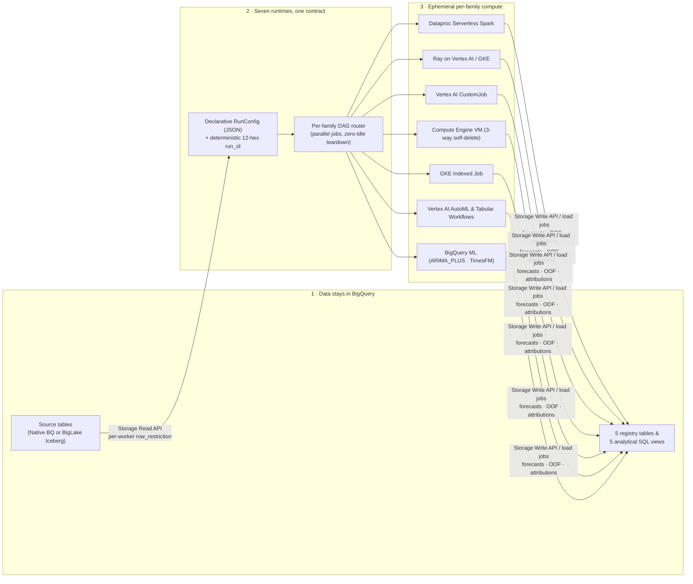

# Why Google Cloud for forecasting at any scale

`scale-forecasting` is built natively on Google Cloud's serverless data and AI stack so you can move from a 10-series laptop prototype to a 100,000+ series multi-family production pipeline without changing code, exporting data, or paying for idle clusters.

---

## Six architectural pillars

| Pillar | What it means for your team | Where it is proven in the repository |
| :--- | :--- | :--- |
| **1. Data stays in BigQuery** | Workers stream series directly from BigQuery (native tables or BigLake Iceberg on Cloud Storage) over the high-throughput Storage Read API with per-worker `[start_id, end_id]` row restrictions, and write forecasts, backtest out-of-fold rows, and feature attributions straight back into BigQuery. No staging CSV exports or duplicate data warehouses. | [`reading_source_data.md`](./reading_source_data.md) · [`writing_results.md`](./writing_results.md) · [`output_schemas.md`](./output_schemas.md) |
| **2. Compute runs only while needed** | The family DAG router dispatches one independent job per active model family in parallel (`statistical`, `ml`, `deep_learning`, `automl`, `native`). Fast CPU statistical jobs finish and release their resources immediately while GPU deep-learning jobs continue. Single-VM Compute Engine jobs enforce triple-redundant self-deletion. | [`architecture.md`](./architecture.md) · [`runtimes_reference.md`](./runtimes_reference.md) · [`validation.md`](./validation.md) |
| **3. Seven runtimes, one declarative contract** | The identical `RunConfig` JSON executes across **Dataproc Serverless Spark**, **Ray on Vertex AI or GKE**, **Vertex AI CustomJob**, **Compute Engine single VM**, **GKE Indexed Job**, **Vertex AI AutoML / Tabular Workflows**, and **BigQuery ML** (`ARIMA_PLUS` and `AI.FORECAST` / TimesFM). Switching runtimes is a one-field config change (`compute.runtime`), never a code rewrite. | [`choosing_a_runtime.md`](./choosing_a_runtime.md) · [`configuration_reference.md`](./configuration_reference.md) · [`smoke_testing.md`](./smoke_testing.md) |
| **4. Managed Google AI and open-source models on one leaderboard** | Evaluate Google's managed foundation and AutoML models (`AI.FORECAST` / TimesFM 2.0, `ARIMA_PLUS`, `vertex_automl`, `vertex_tide`, `vertex_tft`, `vertex_seq2seq`, `vertex_wavenet`) alongside 28 open-source statistical, tree, and PyTorch deep-learning models under the exact same rolling-origin backtest folds and 21 metrics. | [`models_reference.md`](./models_reference.md) · [`metrics_reference.md`](./metrics_reference.md) · [`backtesting.md`](./backtesting.md) |
| **5. Governed by construction** | Every run receives a deterministic, content-addressed `run_id` (`<slug>-<12hex>`) invariant to project/region plumbing, full execution lineage (`git_sha`, `container_digest`, `snapshot_millis`, per-family `$.sizing_executed`), five analytical SQL views (`v_model_leaderboard_comparable`, `v_run_summary`, `v_run_jobs`, `v_backtest_coverage`, `v_model_leaderboard`), and surgical per-cell repair (`retry_run`). | [`running_and_reviewing.md`](./running_and_reviewing.md) · [`operations.md`](./operations.md) · [`validation.md`](./validation.md) |
| **6. Transparent, controllable cost model** | Every cost statement in the documentation is labeled as an estimate, names the underlying Google Cloud services billed, and discloses any optional continuous billing (such as Cloud Composer 3 or standing GKE clusters) alongside the exact variable or command that turns it off. Dynamic 3-tier quota preflight prevents mid-run quota failures. | [`cost_estimates.md`](./cost_estimates.md) · [`quota_and_scale.md`](./quota_and_scale.md) · [`deploying_on_gcp.md`](./deploying_on_gcp.md) |

---

## How each Google Cloud service is used

| Google Cloud Service | Role in `scale-forecasting` | Idle Footprint |
| :--- | :--- | :--- |
| **BigQuery & BigQuery Storage API** | Source time-series tables (`source_series_native`, `source_series_iceberg`), 5 registry tables (`run_registry`, `run_jobs`, `forecast_metadata`, `forecast_predictions`, `backtest_oof`), and 5 analytical SQL views. | Storage only (per GB-month); zero compute when no queries run. |
| **BigQuery ML** | In-warehouse SQL forecasting via `ML.FORECAST` (`ARIMA_PLUS` with optional `XREG`) and zero-shot foundation model inference via `AI.FORECAST` (`TimesFM 2.0`). | Zero when no query is running. |
| **Dataproc Serverless for Spark** | Autoscale Spark batches for horizontal CPU statistical and tree fan-out without managing a standing cluster (`runtime = "spark"`). | Zero when no batch is running. |
| **Vertex AI Training (`CustomJob` & Ray)** | Serverless multi-worker CPU/GPU containers (`runtime = "vertex"`) and ephemeral Ray clusters on Vertex AI (`runtime = "ray"`, `ray_mode = "vertex"`). | Zero when jobs complete and clusters tear down (`reap-clusters` safety net included). |
| **Vertex AI Pipelines & AutoML** | Managed Tabular Workflows for Forecasting (`automl_mode = "tabular_workflow"`) and Python SDK AutoML jobs (`automl_mode = "training_job"`) for `vertex_automl`, `vertex_tide`, `vertex_tft`, `vertex_seq2seq`, and `vertex_wavenet`. | Zero when pipeline and batch prediction jobs finish. |
| **Compute Engine** | Single-VM container execution (`runtime = "gce"`) with triple-redundant self-deletion (`maxRunDuration` + guest `trap` REST self-delete + launcher `finally`). | Zero after the VM self-deletes at run completion. |
| **Google Kubernetes Engine (GKE)** | Indexed Jobs (`gke_mode = "job"`) and KubeRay clusters (`gke_mode = "ray"`), either on an ephemeral per-run cluster or a standing cluster whose CPU/GPU node pools autoscale to `0` at rest. | Ephemeral cluster: zero after teardown. Standing cluster (`create_gke = true`): GKE cluster management fee applies while the cluster exists; node pools scale to `0`. |
| **Cloud Storage & Artifact Registry** | Iceberg parquet warehouse, serialized model artifacts, runtime code staging, and the shared `linux/amd64` container image. | Pennies per GB-month stored. |
| **Cloud Composer 3 (Optional)** | Managed Apache Airflow environment (`create_composer = false` by default) for scheduled production DAGs emitted via `--emit-airflow`. | **Continuous billing** while the environment exists (plus its Cloud Storage bucket, which persists if the environment is deleted until removed manually). |

---

## Where next

- **[Choosing a runtime](./choosing_a_runtime.md)** — match your workload and team constraints to the right execution engine.
- **[Cost estimates & controls](./cost_estimates.md)** — review service-by-service billing drivers, order-of-magnitude run bands, and always-on disclosures.
- **[Getting started](./getting_started.md)** — install the package, run a zero-cloud forecast locally, and deploy to your Google Cloud project.
- **[Validation ledger](./validation.md)** — inspect the 42 live smoke configurations, 20 demo configurations, and 100k-series scale proofs.
