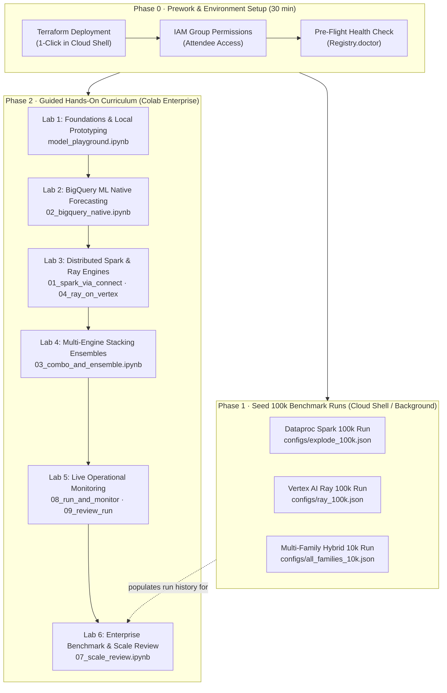

# Enterprise Hands-On Workshop: Massively Parallel Forecasting on Google Cloud

<p align="center">
  <b>A Guided Practitioner & Architecture Workshop for Forecasting 100,000+ Time Series</b><br>
  <i>From 1-click Terraform deployment to interactive modeling, hybrid multi-engine execution, and cross-platform benchmarking.</i>
</p>



---

## Workshop Overview & Objectives

In this hands-on workshop, you will deploy and operate **`scale-forecasting`** — Google Cloud's blueprint for enterprise time-series forecasting across **BigQuery ML**, **Dataproc Spark**, and **Vertex AI Ray**.

### Key Learning Outcomes
1. **Infrastructure as Code:** Deploy the complete data lakehouse and compute infrastructure using Terraform in under 15 minutes.
2. **Unified Modeling Contract:** Train, backtest, and evaluate 18 statistical, machine learning, and deep learning models with zero code changes.
3. **Multi-Engine Hybrid Execution:** Run Spark, Ray, and BigQuery ML concurrently under a single declarative configuration and deterministic `run_id`.
4. **Stacked Ensembling:** Train meta-learners (Non-Negative Least Squares, Ridge, XGBoost) over out-of-fold predictions to outperform any single model.
5. **Operational Observability:** Stream real-time cell telemetry into BigQuery via the Storage Write API, track live progress bars, and inspect 12 analytical SQL views.
6. **Enterprise Scale & Parity:** Benchmark 100,000 time series across distributed engines and verify cross-platform numerical parity.

---

## Target Audience & Prerequisites

- **Lead Data Scientists & Quantitative Researchers:** Interested in scaling models from single-series prototypes to hundreds of thousands of series without writing distributed infrastructure code.
- **Enterprise Cloud & Data Architects:** Evaluating hybrid execution patterns (BigQuery vs Dataproc vs Ray on Vertex AI) and Lakehouse storage (BigLake Apache Iceberg on GCS).
- **ML Platform & MLOps Engineers:** Seeking automated DAG orchestration, quota preflight validation, and unified lineage tracking.

### Prerequisites
- A Google Cloud Project with billing enabled.
- A user account or Google Group with `roles/owner` or the administrative roles listed in [deploying_on_gcp.md (Human Users)](./deploying_on_gcp.md#human-users-running-jobs--notebooks).
- A modern web browser with access to [Google Cloud Shell](https://console.cloud.google.com/?cloudshell=true) and [Colab Enterprise](https://console.cloud.google.com/vertex-ai/colab).

---

## Phase 0 · Prework & Environment Setup (Before the Workshop)

To ensure a seamless hands-on experience for attendees, complete this setup prior to the session.

### Step 1: 1-Click Platform Deployment (Cloud Shell)

Open [Google Cloud Shell](https://console.cloud.google.com/?cloudshell=true) and execute the following deployment sequence:

```bash
# 1. Install Terraform in Cloud Shell home directory (durable across sessions)
TF_VERSION=1.9.8
mkdir -p ~/bin && cd ~/bin
curl -fsSL -o terraform.zip "https://releases.hashicorp.com/terraform/${TF_VERSION}/terraform_${TF_VERSION}_linux_amd64.zip"
unzip -o terraform.zip && rm terraform.zip
export PATH="$HOME/bin:$PATH"

# 2. Authenticate Application Default Credentials (ADC)
gcloud auth application-default login

# 3. Clone the scale-forecasting repository
cd ~ && git clone https://github.com/statmike/scale-forecasting.git && cd scale-forecasting

# 4. Stage 1: Bootstrap Project & Remote Terraform State
cd terraform/bootstrap
cp terraform.tfvars.example terraform.tfvars
# Set your project_id, billing_account, and org_id
nano terraform.tfvars
terraform init && terraform apply -auto-approve

# 5. Stage 2: Deploy Platform & Seed 100,000 Time Series
cd ../main
cp terraform.tfvars.example terraform.tfvars
# Ensure project_id matches bootstrap
nano terraform.tfvars
terraform init && terraform apply -auto-approve
```

> [!NOTE]
> **What Terraform Provisions Automatically:**
> - **Lakehouse Storage:** 3 GCS buckets (`warehouse`, `artifacts`, `code`), BigQuery dataset (`scale_forecasting`), and BigLake Iceberg connection.
> - **Container Runtime:** Artifact Registry Docker repository and automated Cloud Build run for the shared Spark/Ray container image.
> - **Secure Networking:** Dedicated VPC subnet, Cloud NAT, and Private Service Connect (PSC-I) for Ray on Vertex AI.
> - **Interactive Runtimes:** Colab Enterprise **`sf-main`** Python 3.11 runtime template pre-configured with all required environment variables.
> - **100k Seed Dataset:** Dataproc Serverless batch generating 100,000 synthetic time series into both native BigQuery and BigLake Iceberg tables.

---

### Step 2: Grant Attendee Permissions (Google Groups)

If hosting multiple attendees, create a Google Group (e.g. `workshop-attendees@yourdomain.com`) and grant it the human user roles in your project:

```bash
PROJECT_ID="YOUR_PROJECT_ID"
GROUP_EMAIL="workshop-attendees@yourdomain.com"

# Core BigQuery, Colab Enterprise, and Compute viewer/launcher roles
for role in \
  roles/viewer \
  roles/bigquery.dataViewer \
  roles/bigquery.jobUser \
  roles/aiplatform.user \
  roles/dataproc.editor \
  roles/storage.objectViewer; do
  gcloud projects add-iam-policy-binding "$PROJECT_ID" \
    --member="group:$GROUP_EMAIL" \
    --role="$role"
done
```

---

### Step 3: Pre-Flight Health Check

Verify that all deployed services, BigQuery datasets, and network endpoints are healthy before beginning:

```bash
# In Cloud Shell:
uv sync
uv run python -m scale_forecasting.sdk.Registry.doctor
```

You should see all checks marked `OK` (BigQuery dataset reachable, BigLake connection valid, GCS code bucket writable, Colab template provisioned).

---

## Phase 1 · Seed 100k Benchmark Runs (Background / Optional)

To enable **Lab 6** (the cross-platform scale and accuracy review), launch three reference benchmark runs in Cloud Shell. Because these runs process tens of thousands of series, launch them in a `tmux` session before the workshop begins:

```bash
# Start a persistent tmux session so disconnects do not interrupt the wait
tmux new -s benchmark-runs

# Export deployment environment variables (deterministic by convention)
PROJECT="YOUR_PROJECT_ID"
REGION="us-central1"
export SF_PROJECT_ID="$PROJECT"
export SF_REGION="$REGION"
export SF_DATASET_ID="scale_forecasting"
export SF_CONNECTION="$PROJECT.$REGION.sf-iceberg"
export SF_WAREHOUSE_URI="gs://$PROJECT-warehouse/warehouse"
export SF_CODE_BUCKET="$PROJECT-code"
export SF_COMPUTE_SA="scale-forecasting-compute@$PROJECT.iam.gserviceaccount.com"
export SF_CONTAINER_IMAGE="$REGION-docker.pkg.dev/$PROJECT/scale-forecasting/spark-runtime:latest"
export SF_SUBNETWORK_URI="https://www.googleapis.com/compute/v1/projects/$PROJECT/regions/$REGION/subnetworks/scale-forecasting-compute"

# Launch the three benchmark configurations
uv run python -m scale_forecasting.main --config configs/explode_100k.json       # 100k series on Dataproc Spark
uv run python -m scale_forecasting.main --config configs/ray_100k.json           # 100k series on Vertex AI Ray
uv run python -m scale_forecasting.main --config configs/all_families_10k.json  # 10k series hybrid: Ray + BigQuery ML
```

### Monitoring Progress in BigQuery Studio

Attendees can watch cells accumulate in real time by querying `forecast_metadata` in [BigQuery Studio](https://console.cloud.google.com/bigquery):

```sql
SELECT
  run_id,
  COUNT(*) AS cells_completed,
  MAX(created_at) AS latest_heartbeat
FROM `scale_forecasting.forecast_metadata`
GROUP BY run_id
ORDER BY latest_heartbeat DESC;
```

---

## Phase 2 · Guided Hands-On Curriculum (Colab Enterprise)

Every notebook includes a direct **Run in Colab Enterprise** badge in its header. Attendees simply click the badge, select the pre-provisioned **`sf-main`** runtime template, and execute.

---

### Lab 1: Foundations & Local Prototyping
**Notebook:** [`notebooks/model_playground.ipynb`](notebooks/model_playground.ipynb)  
**Duration:** 15 minutes  
**Goal:** Explore the modeling contract, backtesting, and conformal interval calibration with zero cloud compute costs.

#### Key Highlights
- Inspect the 18 available time-series models across statistical, ML, and deep learning families.
- Generate synthetic multi-archetype series (trending, seasonal, intermittent, promo-spiky).
- Run [`worker.run_cell`](https://github.com/statmike/scale-forecasting/blob/main/src/scale_forecasting/worker.py) locally to fit a model, run 3-fold rolling-origin backtesting, and generate empirical conformal prediction bands.
- Run a multi-model bake-off on a single series and visualize point forecasts and confidence bounds.

---

### Lab 2: Serverless BigQuery ML Forecasting
**Notebook:** [`notebooks/02_bigquery_native.ipynb`](notebooks/02_bigquery_native.ipynb)  
**Duration:** 15 minutes  
**Goal:** Execute time-series forecasting directly inside BigQuery with pure SQL.

#### Key Highlights
- Train `ARIMA_PLUS` across multiple series using native BigQuery ML pipelines.
- Generate foundation model zero-shot forecasts via BigQuery `AI.FORECAST` (`TimesFM`).
- Query the resulting `v_model_leaderboard` and `v_forecast_results` views in BigQuery.
- Understand how SQL-native models integrate into the same unified metadata schema as Python models.

---

### Lab 3: Distributed Execution with Dataproc Spark & Vertex Ray
**Notebooks:** [`notebooks/01_spark_via_connect.ipynb`](notebooks/01_spark_via_connect.ipynb) & [`notebooks/04_ray_on_vertex.ipynb`](notebooks/04_ray_on_vertex.ipynb)  
**Duration:** 30 minutes  
**Goal:** Drive distributed cluster engines interactively and understand horizontal scaling.

#### Key Highlights
- **Spark Connect:** Open an interactive `DataprocSparkSession` from Colab Enterprise, partition series into groups, and execute `applyInPandas` pandas UDFs across remote executors.
- **Serverless Batches:** Submit fire-and-forget Dataproc Serverless batches with dynamic core allocation.
- **Vertex AI Ray:** Provision an autoscaling Ray cluster via Private Service Connect, pack deep learning fits (`NeuralProphet`) fractionally across NVIDIA T4 GPUs, and verify automatic cluster teardown upon job completion.

---

### Lab 4: Hybrid Multi-Engine Execution & Stacking Ensembles
**Notebook:** [`notebooks/03_combo_and_ensemble.ipynb`](notebooks/03_combo_and_ensemble.ipynb)  
**Duration:** 25 minutes  
**Goal:** Execute Python and BigQuery models in parallel under one `run_id`, followed by learned ensemble blending.

#### Key Highlights
- Configure a hybrid run: Spark executes statistical models while BigQuery ML concurrently fits `ARIMA_PLUS`.
- Blend base predictions using calculated consensus strategies (`mean`, `median`, `inverse_error`).
- Train meta-learners (`nnls`, `ridge`, `xgb`) over out-of-fold validation predictions to produce stacked ensemble forecasts.
- Plot the model leaderboard and measure **Ensemble Lift** (percentage error reduction over the best single base model).

---

### Lab 5: Operational Monitoring & Live Progress
**Notebooks:** [`notebooks/08_run_and_monitor.ipynb`](notebooks/08_run_and_monitor.ipynb) & [`notebooks/09_review_run.ipynb`](notebooks/09_review_run.ipynb)  
**Duration:** 25 minutes  
**Goal:** Monitor active distributed runs and perform comprehensive post-run quality audits.

#### Key Highlights
- Launch a multi-engine run on a background thread and render an interactive live-refreshing progress dashboard (`Forecaster.monitor()`).
- Observe automatic probe escalation: if an engine slows down, the monitor queries platform job APIs to diagnose executor health.
- Perform post-run review: analyze cross-series metric distributions (`p10`/`p50`/`p90` error quantiles) and visualize the end-to-end execution timeline.

---

### Lab 6: Enterprise Benchmark & Scale Review
**Notebook:** [`notebooks/07_scale_review.ipynb`](notebooks/07_scale_review.ipynb)  
**Duration:** 20 minutes  
**Goal:** Compare 100,000-series runs across Dataproc Spark, Vertex AI Ray, and BigQuery ML.

#### Key Highlights
- Load the completed 100k runs from **Phase 1** into a unified comparison dashboard.
- Compare wall-clock compute duration vs. cluster provisioning overhead across Spark and Ray.
- Review per-family placement via `v_run_jobs`.
- Inspect cross-runtime numerical parity: verify that identical statistical algorithms yield identical predictions regardless of the underlying execution engine.

---

## Phase 3 · Teardown & Cost Governance

To clean up resources after the workshop:

### 1. Sweep Temporary Registry Runs & Orphans
Use the `Registry` SDK or CLI to drop experimental runs and remove orphaned staging artifacts from GCS:

```bash
uv run python -m scale_forecasting.registry.ops sweep-orphans
uv run python -m scale_forecasting.registry.ops reap-clusters --max-age-hours 1
```

### 2. Full Infrastructure Teardown
If the Google Cloud project was created specifically for the workshop, destroy all provisioned infrastructure with Terraform:

```bash
cd terraform/main
terraform destroy -auto-approve

cd ../bootstrap
terraform destroy -auto-approve
```

---

## Summary of Workshop Deliverables & Resources

- **Main Architecture Guide:** [`docs/architecture.md`](./architecture.md)
- **Interactive Notebook Tour:** [`notebooks/README.md`](notebooks/README.md)
- **Configuration Reference:** [`docs/configuration_reference.md`](./configuration_reference.md)
- **Operations & Runbooks:** [`docs/operations.md`](./operations.md)
- **BigQuery Views & Schemas:** [`docs/output_schemas.md`](./output_schemas.md)
