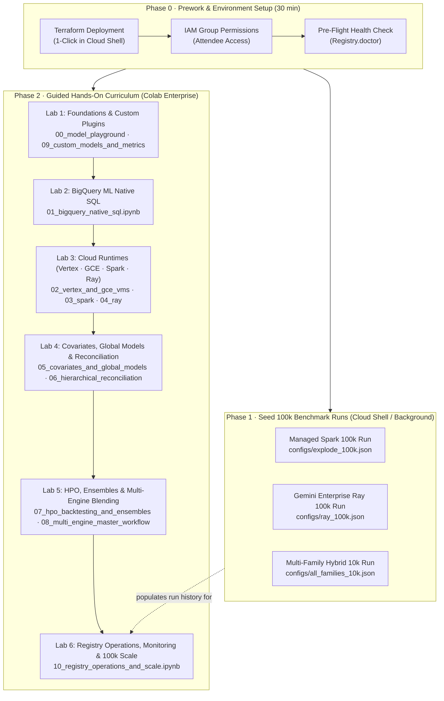

# Hands-On Workshop: Massively Parallel Forecasting on Google Cloud

<p align="center">
  <b>A Guided Practitioner & Architecture Workshop for Forecasting 100,000+ Time Series</b><br>
  <i>From 1-click Terraform deployment to interactive modeling, hybrid multi-engine execution, and cross-platform benchmarking.</i>
</p>



---

## Workshop Overview & Objectives

In this hands-on workshop, you will deploy and operate **`scale-forecasting`** — Google Cloud's blueprint for enterprise time-series forecasting across **BigQuery ML**, **Managed Service for Apache Spark (Dataproc)**, **Gemini Enterprise (Managed Ray on Vertex AI)**, **Vertex AI `CustomJob`**, and **Compute Engine (`gce`) Single-VM**.

### Key Learning Outcomes
1. **Infrastructure as Code:** Deploy the complete data lakehouse and compute infrastructure using Terraform in under 15 minutes.
2. **Unified Modeling Contract:** Train, backtest, and evaluate 30 statistical, machine learning, deep learning, and BigQuery SQL models with zero code changes.
3. **Multi-Engine Hybrid Execution:** Run Spark, Ray, Vertex `CustomJob`, GCE Single-VM, and BigQuery ML concurrently under a single declarative configuration and deterministic `run_id`.
4. **Stacked Ensembling:** Train meta-learners (Non-Negative Least Squares, Ridge, XGBoost) over out-of-fold predictions to outperform any single model.
5. **Operational Observability:** Stream real-time cell telemetry into BigQuery via the Storage Write API, track live progress bars, and inspect 5 analytical SQL views.
6. **Enterprise Scale & Parity:** Benchmark 100,000 time series across distributed engines and verify cross-platform numerical parity.

---

## Target Audience & Prerequisites

- **Lead Data Scientists & Quantitative Researchers:** Interested in scaling models from single-series prototypes to hundreds of thousands of series without writing distributed infrastructure code.
- **Enterprise Cloud & Data Architects:** Evaluating hybrid execution patterns (BigQuery vs Dataproc vs Ray on Vertex AI vs Vertex `CustomJob` vs GCE Single-VM) and Lakehouse storage (BigLake Apache Iceberg on GCS).
- **ML Platform & MLOps Engineers:** Seeking automated DAG orchestration, quota preflight validation, and unified lineage tracking.

### Prerequisites
- A Google Cloud Project with billing enabled.
- A user account or Google Group with `roles/owner` or the administrative roles listed in [deploying_on_gcp.md (Human Users)](./deploying_on_gcp.md#human-users-running-jobs--notebooks).
- A modern web browser with access to [Google Cloud Shell](https://console.cloud.google.com/?cloudshell=true) and [Colab Enterprise](https://console.cloud.google.com/vertex-ai/colab).

---

## Phase 0 · Prework & Environment Setup (Before the Workshop)

To ensure a seamless hands-on experience for attendees, complete this setup prior to the session.

### Step 1: 1-Click Platform Deployment (Cloud Shell)

Open [Google Cloud Shell](https://console.cloud.google.com/?cloudshell=true) and execute the following deployment sequence:

```bash
# 1. Install Terraform in Cloud Shell home directory (durable across sessions)
TF_VERSION=1.9.8
mkdir -p ~/bin && cd ~/bin
curl -fsSL -o terraform.zip "https://releases.hashicorp.com/terraform/${TF_VERSION}/terraform_${TF_VERSION}_linux_amd64.zip"
unzip -o terraform.zip && rm terraform.zip
export PATH="$HOME/bin:$PATH"

# 2. Authenticate Application Default Credentials (ADC)
gcloud auth application-default login

# 3. Clone the scale-forecasting repository
cd ~ && git clone https://github.com/statmike/scale-forecasting.git && cd scale-forecasting

# 4. Stage 1: Bootstrap Project & Remote Terraform State
cd terraform/bootstrap
cp terraform.tfvars.example terraform.tfvars
# Set your project_id, billing_account, and org_id
nano terraform.tfvars
terraform init && terraform apply -auto-approve

# 5. Stage 2: Deploy Platform & Seed 100,000 Time Series
cd ../main
cp terraform.tfvars.example terraform.tfvars
# Ensure project_id matches bootstrap
nano terraform.tfvars
terraform init && terraform apply -auto-approve
```

> [!NOTE]
> **What Terraform Provisions Automatically:**
> - **Lakehouse Storage:** 2 GCS buckets (`warehouse`, `code`), BigQuery dataset (`scale_forecasting`), and BigLake Iceberg connection.
> - **Container Runtime:** Artifact Registry Docker repository and automated Cloud Build run for the shared Spark/Vertex/GCE/Ray container image.
> - **Secure Networking:** Dedicated VPC subnet, Cloud NAT, and Private Service Connect (PSC-I) for Ray on Vertex AI.
> - **Interactive Runtimes:** Colab Enterprise **`sf-main`** Python 3.11 runtime template pre-configured with all required environment variables.
> - **100k Seed Dataset:** Dataproc Serverless batch generating 100,000 synthetic time series into both native BigQuery and BigLake Iceberg tables.

---

### Step 2: Grant Attendee Permissions (Google Groups)

If hosting multiple attendees, create a Google Group (e.g. `workshop-attendees@yourdomain.com`) and grant it the human user roles in your project:

```bash
PROJECT_ID="YOUR_PROJECT_ID"
GROUP_EMAIL="workshop-attendees@yourdomain.com"

# Core BigQuery, Colab Enterprise, and Compute viewer/launcher roles
for role in \
  roles/viewer \
  roles/bigquery.dataViewer \
  roles/bigquery.jobUser \
  roles/aiplatform.user \
  roles/dataproc.editor \
  roles/storage.objectViewer; do
  gcloud projects add-iam-policy-binding "$PROJECT_ID" \
    --member="group:$GROUP_EMAIL" \
    --role="$role"
done
```

---

### Step 3: Pre-Flight Health Check

Verify that all deployed services, BigQuery datasets, and network endpoints are healthy before beginning:

```bash
# In Cloud Shell:
uv sync
uv run python -m scale_forecasting.registry.ops doctor
```

You should see all checks marked `OK` (BigQuery dataset reachable, BigLake connection valid, GCS code bucket writable, Colab template provisioned).

---

## Phase 1 · Seed 100k Benchmark Runs (Background / Optional)

To enable **Lab 6** (the cross-platform scale and accuracy review), launch three reference benchmark runs in Cloud Shell. Because these runs process tens of thousands of series, launch them in a `tmux` session before the workshop begins:

```bash
# Start a persistent tmux session so disconnects do not interrupt the wait
tmux new -s benchmark-runs

# Export deployment environment variables (deterministic by convention)
PROJECT="YOUR_PROJECT_ID"
REGION="us-central1"
export SF_PROJECT_ID="$PROJECT"
export SF_REGION="$REGION"
export SF_DATASET_ID="scale_forecasting"
export SF_CONNECTION="$PROJECT.$REGION.sf-iceberg"
export SF_WAREHOUSE_URI="gs://$PROJECT-warehouse/warehouse"
export SF_CODE_BUCKET="$PROJECT-code"
export SF_COMPUTE_SA="scale-forecasting-compute@$PROJECT.iam.gserviceaccount.com"
export SF_CONTAINER_IMAGE="$REGION-docker.pkg.dev/$PROJECT/scale-forecasting/spark-runtime:latest"
export SF_SUBNETWORK_URI="https://www.googleapis.com/compute/v1/projects/$PROJECT/regions/$REGION/subnetworks/scale-forecasting-compute"

# Launch the three benchmark configurations
uv run python -m scale_forecasting.main --config configs/explode_100k.json       # 100k series on Dataproc Spark
uv run python -m scale_forecasting.main --config configs/ray_100k.json           # 100k series on Vertex AI Ray
uv run python -m scale_forecasting.main --config configs/all_families_10k.json  # 10k series hybrid: Ray + BigQuery ML
```

### Monitoring Progress in BigQuery Studio

Attendees can watch cells accumulate in real time by querying `forecast_metadata` in [BigQuery Studio](https://console.cloud.google.com/bigquery):

```sql
SELECT
  run_id,
  COUNT(*) AS cells_completed,
  MAX(created_at) AS latest_heartbeat
FROM `scale_forecasting.forecast_metadata`
GROUP BY run_id
ORDER BY latest_heartbeat DESC;
```

---

## Phase 2 · Guided Hands-On Curriculum (Colab Enterprise)

Every notebook includes a direct **Run in Colab Enterprise** badge in its header. Attendees simply click the badge, select the pre-provisioned **`sf-main`** runtime template, and execute.

---

### Lab 1: Foundations, Local Prototyping & Custom Plugins
**Notebooks:** [`notebooks/00_model_playground.ipynb`](notebooks/00_model_playground.ipynb) & [`notebooks/09_custom_models_and_metrics.ipynb`](notebooks/09_custom_models_and_metrics.ipynb)  
**Duration:** 20 minutes  
**Goal:** Explore the 30-model and 21-metric contracts, rolling-origin backtesting, conformal interval calibration, and custom plugin authoring with zero cloud compute costs.

#### Key Highlights
- Inspect `model_catalog()` (30 models) and `metric_catalog()` (21 metrics) across statistical, ML, deep learning, and native SQL families.
- Generate synthetic multi-archetype series (trending, seasonal, intermittent, promo-spiky) and run single-series and panel bake-offs (`compare_models`, `compare_panel`).
- Author custom `BaseModel` and `BaseMetric` plugins in [`notebooks/09_custom_models_and_metrics.ipynb`](notebooks/09_custom_models_and_metrics.ipynb) and verify them through the exact production worker contract (`run_cell`, `run_panel_model`).

---

### Lab 2: Serverless BigQuery ML Native SQL Forecasting
**Notebook:** [`notebooks/01_bigquery_native_sql.ipynb`](notebooks/01_bigquery_native_sql.ipynb)  
**Duration:** 15 minutes  
**Goal:** Execute time-series forecasting directly inside BigQuery with pure SQL (`ARIMA_PLUS` and `AI.FORECAST` `TimesFM`).

#### Key Highlights
- Preview execution plans with `Forecaster.explain()` before launching any cloud jobs.
- Train `ARIMA_PLUS` and generate zero-shot foundation model forecasts via BigQuery `AI.FORECAST` (`TimesFM`).
- Inspect results via `Forecaster.leaderboard_df()`, `Forecaster.predictions_df()`, and `Forecaster.plot_forecasts()`.

---

### Lab 3: Cloud Runtimes — Vertex AI, GCE Single-VM, Managed Spark & Ray on Vertex AI
**Notebooks:** [`notebooks/02_vertex_and_gce_vms.ipynb`](notebooks/02_vertex_and_gce_vms.ipynb), [`notebooks/03_spark_serverless_and_connect.ipynb`](notebooks/03_spark_serverless_and_connect.ipynb) & [`notebooks/04_ray_on_vertex_gpu.ipynb`](notebooks/04_ray_on_vertex_gpu.ipynb)  
**Duration:** 30 minutes  
**Goal:** Drive all four container and cluster compute runtimes and understand per-family hardware sizing.

#### Key Highlights
- **Vertex AI `CustomJob` & GCE Single-VM (`02`):** Compare managed multi-worker `CustomJob` sharding against low-latency single-VM `gce` execution with triple-redundant self-delete protection.
- **Managed Spark (`03`):** Run Serverless Batches, Named Clusters, and interactive **Spark Connect** sessions from Colab Enterprise.
- **Gemini Enterprise Managed Ray (`04`):** Pack deep learning fits (`nhits`, `nbeats`, `tft`, `deepar`, `neuralprophet`) fractionally across NVIDIA L4/T4 GPUs on Vertex AI Ray.

---

### Lab 4: Covariates, Global Training Modes & Hierarchical Reconciliation
**Notebooks:** [`notebooks/05_covariates_and_global_models.ipynb`](notebooks/05_covariates_and_global_models.ipynb) & [`notebooks/06_hierarchical_reconciliation.ipynb`](notebooks/06_hierarchical_reconciliation.ipynb)  
**Duration:** 25 minutes  
**Goal:** Master `local`, `global`, and `local+global` training modes with future/past/static covariates and bottom-up/MinT hierarchical reconciliation.

#### Key Highlights
- Compare per-series (`local`) vs cross-series (`global`) vs dual (`local+global`) training modes on promotional and weather covariates (`source_series_covariates_native`).
- Reconcile hierarchical forecasts (`bottom_up`, `top_down`, `ols`, `wls_struct`, `wls_var`, `mint_shrink`) and verify parent-child additivity with `Forecaster.hierarchy_df()` and `Forecaster.plot_hierarchy()`.

---

### Lab 5: Hyperparameter Tuning, Stacking Ensembles & Cross-Run Blending
**Notebooks:** [`notebooks/07_hpo_backtesting_and_ensembles.ipynb`](notebooks/07_hpo_backtesting_and_ensembles.ipynb) & [`notebooks/08_multi_engine_master_workflow.ipynb`](notebooks/08_multi_engine_master_workflow.ipynb)  
**Duration:** 25 minutes  
**Goal:** Combine Optuna hyperparameter tuning, multi-fold backtesting, in-run stacking ensembles, post-hoc re-ensembling, and cross-run multi-engine blending.

#### Key Highlights
- Run Optuna hyperparameter search and inspect tuned parameters per series via `Forecaster.best_params_df()`.
- Train meta-learners (`nnls`, `ridge`, `xgb`) over out-of-fold validation predictions and re-run ensemble strategies on completed runs via `Forecaster.reensemble()` without re-fitting base models.
- Combine completed runs from different engines into a single unified ensemble run via `Registry.ensemble_runs()`.

---

### Lab 6: Registry Operations, Live Monitoring & 100k Scale Review
**Notebook:** [`notebooks/10_registry_operations_and_scale.ipynb`](notebooks/10_registry_operations_and_scale.ipynb)  
**Duration:** 20 minutes  
**Goal:** Operate the platform at 100,000-series scale, audit the 5 analytical SQL views, and export production Airflow DAGs.

#### Key Highlights
- Run pre-flight health checks (`Registry.doctor()`), live cloud resource probes (`Registry.probe()`), and `Forecaster.run_live()`.
- Compare 100,000-series benchmark runs across Dataproc Spark, Vertex AI Ray, and BigQuery ML (`Registry.compare()`).
- Export standalone Cloud Composer 3 / Airflow DAG Python files via `Forecaster.emit_airflow()`.

---

## Phase 3 · Teardown & Cost Governance

To clean up resources after the workshop:

### 1. Sweep Temporary Registry Runs & Orphans
Use the `Registry` SDK or CLI to drop experimental runs and remove orphaned staging artifacts from GCS:

```bash
uv run python -m scale_forecasting.registry.ops sweep-orphans
uv run python -m scale_forecasting.registry.ops reap-clusters --max-age-hours 1
```

### 2. Full Infrastructure Teardown
If the Google Cloud project was created specifically for the workshop, destroy all provisioned infrastructure with Terraform:

```bash
cd terraform/main
terraform destroy -auto-approve

cd ../bootstrap
terraform destroy -auto-approve
```

---

## Summary of Workshop Deliverables & Resources

- **Main Architecture Guide:** [`docs/architecture.md`](./architecture.md)
- **Interactive Notebook Tour:** [`notebooks/README.md`](notebooks/README.md)
- **Configuration Reference:** [`docs/configuration_reference.md`](./configuration_reference.md)
- **Operations & Runbooks:** [`docs/operations.md`](./operations.md)
- **BigQuery Views & Schemas:** [`docs/output_schemas.md`](./output_schemas.md)
