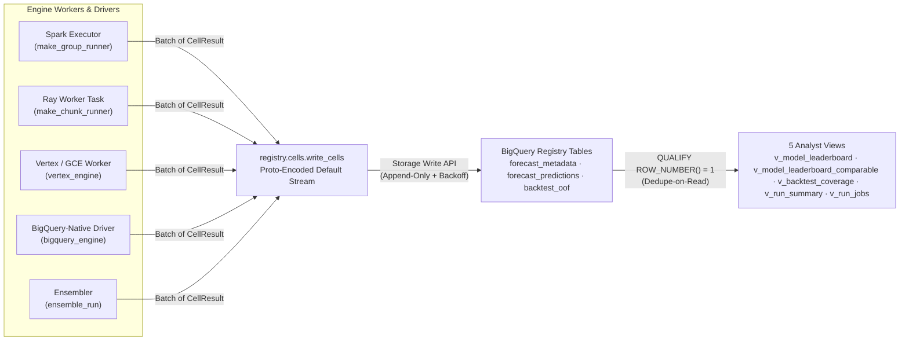

# Writing results — one write path, both table formats

A run produces a lot of rows — per-cell metrics, forecast values, out-of-fold truth, per-job
telemetry — from many workers at once. This doc explains **how** those rows land in BigQuery and,
more importantly, **why the write path is the way it is**: a single, deliberately-custom orchestration
over the BigQuery **Storage Write API**. For the *tables* themselves (every column, every view) see
[output_schemas.md](./output_schemas.md); this is the reader's companion to
[reading_source_data.md](./reading_source_data.md).

---

## The headline: one write path for both table formats

The BigQuery **Storage Write API** writes **both** native BigQuery tables **and** BigQuery-managed
Apache Iceberg tables — through the same client, the same proto-encoded append, the same code. So the
system has exactly **one** result-write path, and it does not care which format the destination is.
There is **no** separate Iceberg-output writer to build or maintain, now or later.

(As it happens, the five run-collection tables are themselves always **native** BigQuery — a reseed is
a clean truncate, and `raw_config`/`quantiles`/`best_params` are the real `JSON` type; see
[output_schemas.md](./output_schemas.md). The point stands regardless: were a destination Iceberg, the
same Storage Write API path would write it unchanged.)

---

## How results are written

Every engine — Spark, Ray, Vertex `CustomJob`, GCE Single-VM, and the BigQuery-native family — funnels its results through the **same**
writer, `registry.cells.write_cells`:

- **Workers return data, not RPCs.** A cell returns a `CellResult`; the engine hands a batch of them
  to `write_cells`, which proto-encodes the rows and appends them via the Storage Write API's default
  stream. Throughput is bounded by **compute** (how many workers are running), not by a tracking
  server's request rate.
- **Executor-side, in bulk, once per partition.** The Spark group-runner, Ray chunk-runner, and Vertex/GCE worker runner
  all call `write_cells` from the **worker**, streaming each bucket/chunk's rows directly to BigQuery.
  Results never round-trip through the driver, so the write scales with the fan-out.
- **Streaming, not row inserts, not load jobs.** The default-stream Storage Write API is a
  high-throughput streaming append — not `INSERT` statements (which don't scale to millions of rows)
  and not per-write load jobs (which are quota-limited per table per day).
- **The BigQuery-native family reuses the same encoder.** `arima_plus` (`ARIMA_PLUS` / `ARIMA_PLUS_XREG`) and `timesfm`
  compute inside BigQuery, but their metrics and predictions are written through the *same*
  `write_cells` proto path as the Python cells — one write path across all runtimes.

---

## Idempotency: append-only + dedupe-on-read

Writes are **append-only**, and the analyst views **dedupe on read**. Every view collapses duplicate
rows to the latest one per logical key (`QUALIFY ROW_NUMBER() OVER (PARTITION BY … ORDER BY created_at
DESC) = 1`), and the leaderboard roll-up dedupes to cell grain *before* it aggregates. So:

- A retried worker task that re-appends its cells doesn't corrupt anything — the views collapse the
  duplicates.
- A `--force` re-run of the same `run_id` re-appends rows; again, the views return one row per cell.

Dedupe-on-read is the **permanent** correctness guarantee, not a stopgap. Exactly-once streaming
would remove *task-retry* duplicates, but it can't remove *run-level* `--force` re-run duplicates —
those are two legitimate writes under one `run_id` — so the view-side dedupe is required regardless.
The tables cluster by `run_id`, so the dedupe predicate pushes down per run and stays cheap.

---

## Why not the framework-native sinks

The obvious "simpler" alternatives each **regress** at this system's scale, which is why the custom
orchestration is kept deliberately:

| Alternative | Why it regresses |
|-------------|------------------|
| Ray `Dataset.write_bigquery` | Its BigQuery sink writes via **load jobs** — capped per table per day — so a wide fan-out of many small writes exhausts the quota. The Storage Write API has no such cap. |
| Ray `Dataset.write_iceberg` | On the pinned Ray version it's alpha/append-only — no better than what the Storage Write API already gives, with a second dependency and code path. |
| Spark `df.writeStream.format("bigquery")` | Structured-streaming output would force a driver-side collect of the results frame, undoing the executor-side, per-partition write that makes the current path scale. |

All three would also add a **second, format- or framework-specific** write path — precisely the thing
the single Storage-Write-API path avoids.

---

## See also

- [output_schemas.md](./output_schemas.md) — the tables and views these writes populate, column by
  column.
- [reading_source_data.md](./reading_source_data.md) — the read companion (Storage Read API + Arrow).
- [architecture.md](./architecture.md) — where `write_cells` sits in the engine call tree (Layer 6).
