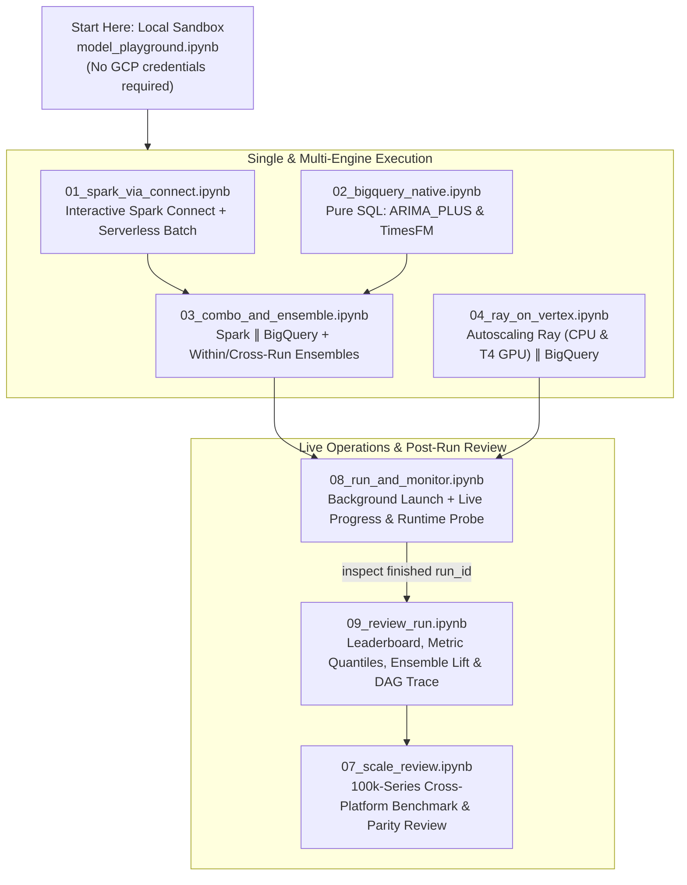

# Interactive Notebooks (`notebooks/`)

These eight notebooks provide an interactive, visual tour of `scale-forecasting` — from fitting your first model locally on synthetic data to launching multi-engine runs across **Dataproc Spark**, **Ray on Vertex AI**, and **BigQuery ML**, watching live progress bars, and comparing 100,000-series benchmark runs.

Every notebook can run either:
1. **In Google Cloud Colab Enterprise** with one click (using the Terraform-provisioned `sf-main` Python 3.11 runtime template, which already carries your project's `SF_*` environment variables).
2. **Locally in Jupyter / VS Code** against your `.venv` (`uv sync --all-extras`).



---

## Notebook Catalogue

| Notebook | Tier | Runtimes Exercised | What You Will Learn |
| :--- | :--- | :--- | :--- |
| [`model_playground.ipynb`](./model_playground.ipynb) | Local (Offline) | Local Python (`worker.run_cell`) | Fit, backtest, and plot any of the 16 Python models on a synthetic time series with custom holidays, transforms, and intervals — zero cloud setup required. |
| [`01_spark_via_connect.ipynb`](./01_spark_via_connect.ipynb) | Interactive + Batch | Dataproc Spark Connect & Serverless | Drive the Spark cross-join/explode engine interactively over a remote Spark Connect session, then compare it with a fire-and-forget Dataproc Serverless batch. |
| [`02_bigquery_native.ipynb`](./02_bigquery_native.ipynb) | Cloud SQL | BigQuery ML (`ARIMA_PLUS`, `TimesFM`) | Run SQL-native models in BigQuery over Apache Iceberg or native tables and inspect results in `v_model_leaderboard` and `v_forecast_results`. |
| [`03_combo_and_ensemble.ipynb`](./03_combo_and_ensemble.ipynb) | Multi-Engine | Spark Serverless $\parallel$ BigQuery + Ensembler | Execute Python and SQL-native families in parallel under one `run_id`, blend them with calculated and learned (`nnls`) ensembles, and re-ensemble across historical runs. |
| [`04_ray_on_vertex.ipynb`](./04_ray_on_vertex.ipynb) | Multi-Engine (CPU/GPU) | Ray on Vertex AI $\parallel$ BigQuery | Provision an autoscaling Ray-on-Vertex cluster (with fractional T4 GPU packing for `neuralprophet`), run in parallel with BigQuery, and verify automatic cluster teardown. |
| [`08_run_and_monitor.ipynb`](./08_run_and_monitor.ipynb) | Live Monitor | Spark Serverless $\parallel$ BigQuery | Launch a multi-engine run on a background thread and drive a live-refreshing dashboard (`Forecaster.monitor()`) that automatically escalates to `probe=True` if a family goes quiet. |
| [`09_review_run.ipynb`](./09_review_run.ipynb) | Read-Only Review | BigQuery Registry Queries | Point at any completed `run_id` to render the model leaderboard, per-series metric distribution (`p10`/`p50`/`p90`), ensemble lift over the best base model, and the execution timeline. |
| [`07_scale_review.ipynb`](./07_scale_review.ipynb) | Scale Benchmark | BigQuery Registry Queries (10k–100k runs) | Compare completed 10k and 100k runs across Spark, Ray, and BigQuery on wall-clock runtime, cluster provisioning overhead, and numerical accuracy parity. |

---

## Running the Notebooks

### Option 1: Colab Enterprise (Zero Configuration)

When you deploy the platform with Terraform (`create_colab_runtimes = true`, on by default), the **`sf-main`** runtime template is pre-configured with Python 3.11 and all required `SF_*` environment variables (`SF_PROJECT_ID`, `SF_DATASET_ID`, `SF_CONNECTION`, `SF_WAREHOUSE_URI`, `SF_CODE_BUCKET`, `SF_CONTAINER_IMAGE`, `SF_COMPUTE_SA`, `SF_SUBNETWORK_URI`, `SF_RAY_NETWORK`).

1. Click the **Open in Colab Enterprise** badge at the top of any notebook.
2. Select the **`sf-main`** runtime template.
3. Click **Run all** — the dependency bootstrap cell installs the locked environment from `docker/requirements.txt` and executes end-to-end.

### Option 2: Local Jupyter / VS Code

1. Install the locked Python 3.11 environment and register the kernel:
   ```bash
   uv sync --all-extras
   uv run python -m ipykernel install --user --name scale-forecasting
   ```
2. Export your deployment's `SF_*` environment variables (not needed for `model_playground.ipynb`):
   ```bash
   eval "$(cd terraform/main && terraform output -raw sf_env_exports)"
   ```
3. Open any notebook and select the `scale-forecasting` kernel.

---

## Automated Headless Verification

All eight notebooks are verified end-to-end against a live GCP deployment via the headless notebook acceptance harness (`src/scale_forecasting/notebook_acceptance.py`), which executes each notebook in Colab Enterprise and confirms zero cell errors:

```bash
uv run python -m scale_forecasting.notebook_acceptance --tier all
```

For details on runtime templates and interpreter pinning, see [`docs/notebook_runtimes.md`](https://github.com/statmike/scale-forecasting/blob/main/docs/notebook_runtimes.md).
