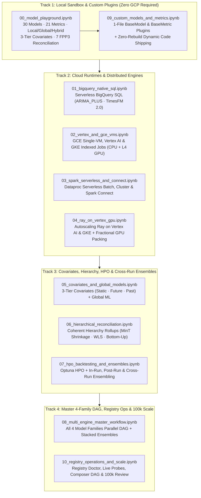

# Interactive Notebooks (`notebooks/`)

<p align="center">
  <b>A Complete Interactive Curriculum for Enterprise Scale Forecasting on Google Cloud</b><br>
  <i>From local zero-GCP prototyping across all 30 models and 21 metrics to distributed execution across BigQuery ML, GCE, Vertex AI, GKE (Indexed Jobs & Ray on GKE), Spark, and Ray — plus 3-tier covariates, 7-method FPP3 reconciliation, cross-run ensembling, custom 1-file plugins, and 100,000-series operations.</i>
</p>



---

## Eleven Focused & Combination Workflow Notebooks

Every cloud workflow notebook (`01`–`08`) is a **complete, self-contained 5-act journey**:
1. **Setup & Architecture Context:** Bootstrap, `Settings.resolve()`, and visual Mermaid architecture map.
2. **Configure & Explain Plan:** Author `RunConfig` and inspect the pre-flight execution table via `forecaster.explain()`.
3. **Launch & Monitor Live:** Execute asynchronously with live in-place progress bars and infrastructure probes via `forecaster.run_live()`.
4. **Retrieve & Review Results:** Inspect `forecaster.leaderboard_df()`, `plot_leaderboard()`, `plot_metric_distribution()`, `forecaster.plot_forecasts()`, `forecaster.cohorts_df()`, `forecaster.jobs_df()`, and `forecaster.trace()`.
5. **Deep Dive / Follow-Up Action:** Inspect 4-panel forecast decomposition (`forecaster.plot_forecast_explanation()`), empirical interval calibration by horizon step (`forecaster.plot_calibration()`), learned ensemble stacking weights (`forecaster.plot_ensemble_weights()`), post-run `reensemble()`, cross-run `ensemble_runs()`, or direct Spark/Ray engine embedding (`run_group`, `chunk_cells`).

### Track 1: Foundations, Local Prototyping & Extensibility (Zero GCP Setup)
| Notebook | Target Environment | What You Will Learn |
| :--- | :--- | :--- |
| [`00_model_playground.ipynb`](./00_model_playground.ipynb) | Local Python (Offline) | Explore the full 30-model and 21-metric catalogs (`model_catalog()`, `metric_catalog()`), generate synthetic panels (`sample_data()`), run 3-fold rolling-origin backtesting and conformal interval calibration (`run_model()`, `bakeoff()`), decompose forecasts into trend, regime level shift, seasonality, and exogenous covariate attribution (`explain_forecast_frame()`, `plot_forecast_explanation()`), compare `local` vs. `global` vs. `hybrid` training modes, and run all 7 FPP3 hierarchical reconciliation methods with zero cloud credentials. |
| [`09_custom_models_and_metrics.ipynb`](./09_custom_models_and_metrics.ipynb) | Local Python (Offline) | Author a custom 1-file `BaseModel` subclass (`@register`) and custom `BaseMetric` subclass, test them immediately in `run_model()` and `bakeoff()`, and inspect automatic BigQuery schema migration (`render_migrations`) and zero-rebuild `src.zip` shipping. |

---

### Track 2: Cloud Runtimes & Distributed Engines
| Notebook | Target Environment | What You Will Learn |
| :--- | :--- | :--- |
| [`01_bigquery_native_sql.ipynb`](./01_bigquery_native_sql.ipynb) | Serverless BigQuery ML | Execute `arima_plus` (`ML.FORECAST`) and Google Research `timesfm` (`AI.FORECAST` TimesFM 2.0) directly inside BigQuery SQL with zero cluster provisioning, understand why both are per-series (`local`) models, blend them into an ensemble, audit all 21 metrics, and inspect horizon-step interval calibration (`plot_calibration()`) and forecast decomposition (`plot_forecast_explanation()`). |
| [`02_vertex_and_gce_vms.ipynb`](./02_vertex_and_gce_vms.ipynb) | GCE Single-VM, Vertex AI CustomJob & GKE Indexed Jobs | Compare all three direct container runtimes powered by `vertex_engine.py`: ephemeral GCE Single-VM (`runtime="gce"`, triple-redundant auto-delete), multi-worker Vertex AI CustomJob (`runtime="vertex"`), and Google Kubernetes Engine Indexed Jobs (`runtime="gke", gke_mode="job"`, per-model GPU pod auto-expansion and independent node scale-down). |
| [`03_spark_serverless_and_connect.ipynb`](./03_spark_serverless_and_connect.ipynb) | Dataproc Spark (`serverless` / `cluster` / `connect`) | Run the distributed Arrow-backed `groupBy(bucket).applyInPandas` fan-out on Dataproc Serverless in parallel with BigQuery SQL, compare with Dataproc Standard Clusters and interactive Spark Connect (`DataprocSparkSession`), and embed the pure Spark UDF directly via `spark_io.run_group()`. |
| [`04_ray_on_vertex_gpu.ipynb`](./04_ray_on_vertex_gpu.ipynb) | Ray on Vertex AI & Ray on GKE (CPU & GPU) | Provision ephemeral autoscaling Ray clusters on Vertex AI (`ray_mode="vertex"`) or GKE (`ray_mode="gke"` / `runtime="gke", gke_mode="ray"`), pack PyTorch deep learning tasks fractionally onto GPUs (`gpu_fraction=0.25`), compare `local`, `global`, and `hybrid` neural network regimes, and embed Ray task chunking directly via `ray_io.chunk_cells()`. |

---

### Track 3: Advanced Modeling — Covariates, Hierarchy, HPO & Cross-Run Ensembles
| Notebook | Target Environment | What You Will Learn |
| :--- | :--- | :--- |
| [`05_covariates_and_global_models.ipynb`](./05_covariates_and_global_models.ipynb) | Vertex AI / Spark + Exog Table | Configure all 3 exogenous covariate tiers (`static_covariates`, `future_covariates`, lag-shifted `past_covariates`) on `source_series_covariates_native`, train global cross-series deep learning (`tide`, `tsmixer`) and ML models (`lightgbm`, `xgboost`), and visualize exogenous covariate attribution with `forecaster.plot_forecast_explanation(model_type="lightgbm")`. |
| [`06_hierarchical_reconciliation.ipynb`](./06_hierarchical_reconciliation.ipynb) | Vertex AI / Spark + Hierarchy | Configure multi-level business hierarchies (`region` $\rightarrow$ `category` $\rightarrow$ `ts_id`), reconcile forecasts across `bottom_up`, `wls_struct`, and `mint_shrink`, and verify exact coherence across levels with `forecaster.hierarchy_df()` and `forecaster.plot_hierarchy()`. |
| [`07_hpo_backtesting_and_ensembles.ipynb`](./07_hpo_backtesting_and_ensembles.ipynb) | BigQuery + Vertex AI | Tune hyperparameters with Optuna (`hpo.enabled=True`, `forecaster.best_params_df()`), inspect backtest cohort health (`cohorts_df()`), run **in-run ensembling**, add new stacked strategies in seconds with **post-run re-ensembling** (`forecaster.reensemble()`), combine base models across two separate runs using **cross-run ensembling** (`forecaster.ensemble_runs()`), and plot learned base-model weights (`plot_ensemble_weights()`). |

---

### Track 4: Master 4-Family Workflow, Registry Operations & 100k Scale
| Notebook | Target Environment | What You Will Learn |
| :--- | :--- | :--- |
| [`08_multi_engine_master_workflow.ipynb`](./08_multi_engine_master_workflow.ipynb) | Spark $\parallel$ Vertex / GKE $\parallel$ BigQuery | Dispatch all active model families concurrently across their optimal runtimes from a single `RunConfig` (**zero-idle per-family compute** — or all Python families on a single shared GKE cluster with fit-for-purpose CPU and GPU node pools), join them in a stacked ensemble, and run the complete diagnostic suite (`leaderboard_df`, `cohorts_df`, `jobs_df`, `plot_calibration`, `plot_ensemble_weights`, `plot_forecasts`, `plot_forecast_explanation`, `plot_trace`). |
| [`10_registry_operations_and_scale.ipynb`](./10_registry_operations_and_scale.ipynb) | BigQuery Registry & Ops | Zero-SQL registry health audit (`reg.doctor()`, `reg.runs_df()`), historical run reattachment (`Forecaster.from_run_id()`), pre-flight fold feasibility (`feasibility()`), preview-safe Day-2 verbs (`retry`, `settle`, `cancel`), **all 5 production launch pathways** (including live execution of the Cloud Composer 3 `airflow_tasks` DAG sequence against a GCS-staged config), and 100,000-series benchmark review. |

---

## How to Run the Notebooks

### Option 1: 1-Click in Google Cloud Colab Enterprise (Recommended)

When you deploy the platform via Terraform (`create_colab_runtimes = true`, enabled by default), the **`sf-main`** Python 3.11 runtime template is pre-configured with all required environment variables (`SF_PROJECT_ID`, `SF_DATASET_ID`, `SF_CONNECTION`, `SF_WAREHOUSE_URI`, `SF_CODE_BUCKET`, `SF_CONTAINER_IMAGE`, `SF_COMPUTE_SA`, `SF_SUBNETWORK_URI`).

1. Open any notebook and click the **Run in Colab Enterprise** badge at the top.
2. Select the **`sf-main`** runtime template.
3. Click **Run all** — the environment bootstrap cell automatically sets up the locked dependencies from `uv.lock` and executes smoothly.

---

### Option 2: Local Jupyter / VS Code

1. Install the pinned environment and register the Jupyter kernel:
   ```bash
   uv sync --all-extras
   uv run python -m ipykernel install --user --name scale-forecasting
   ```
2. Export your deployment's environment variables (not required for `00_model_playground.ipynb` or `09_custom_models_and_metrics.ipynb`):
   ```bash
   eval "$(cd terraform/main && terraform output -raw sf_env_exports)"
   ```
3. Open any notebook in your local IDE and select the `scale-forecasting` kernel.

---

## Automated Verification

All eleven notebooks are verified end-to-end using the headless acceptance test runner:

```bash
uv run python -m scale_forecasting.notebook_acceptance --tier all
```

For technical details on all 6 cloud compute runtimes and 4-tier scaling, see [`docs/runtimes_reference.md`](../runtimes_reference.md). For Colab Enterprise runtime templates and interpreter configurations, see [`docs/notebook_runtimes.md`](../notebook_runtimes.md).
