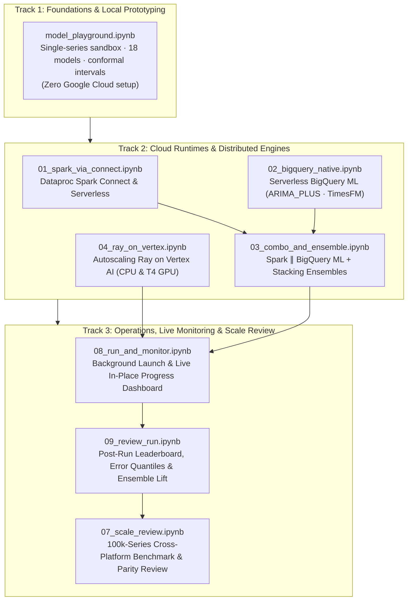

# Interactive Notebooks (`notebooks/`)

<p align="center">
  <b>A Guided Interactive Tour of Enterprise Scale Forecasting on Google Cloud</b><br>
  <i>From local single-series prototyping to distributed execution across Spark, Ray, and BigQuery ML, and 100,000-series scale benchmarking.</i>
</p>



---

## Three Learning Tracks

The eight notebooks are organized into three sequential learning tracks:

### Track 1: Foundations & Local Prototyping
| Notebook | Target Environment | What You Will Learn |
| :--- | :--- | :--- |
| [`model_playground.ipynb`](./model_playground.ipynb) | Local Python (Offline) | Experiment with any of the 18 time-series models on synthetic multi-archetype series. Perform 3-fold rolling-origin backtesting, calibrate conformal prediction intervals, and run multi-model bake-offs with zero GCP credentials. |

---

### Track 2: Distributed Cloud Engines
| Notebook | Target Environment | What You Will Learn |
| :--- | :--- | :--- |
| [`01_spark_via_connect.ipynb`](./01_spark_via_connect.ipynb) | Dataproc Spark Connect / Batch | Drive the distributed Spark cross-join UDF fan-out (`applyInPandas`) interactively over a remote Spark Connect session. Compare with a fire-and-forget Dataproc Serverless batch. |
| [`02_bigquery_native.ipynb`](./02_bigquery_native.ipynb) | Serverless BigQuery ML | Execute forecasting directly inside BigQuery using pure SQL (`ARIMA_PLUS`, `TimesFM`). Streamline operations with zero cluster provisioning and query results in `v_model_leaderboard`. |
| [`03_combo_and_ensemble.ipynb`](./03_combo_and_ensemble.ipynb) | Spark $\parallel$ BigQuery ML + Ensembler | Run a hybrid multi-engine workflow: Spark and BigQuery ML execute concurrently under a single `run_id`. Blend base forecasts using stacked meta-learners (`nnls`, `ridge`, `xgb`) and measure ensemble lift. |
| [`04_ray_on_vertex.ipynb`](./04_ray_on_vertex.ipynb) | Ray on Vertex AI $\parallel$ BigQuery | Deploy an ephemeral autoscaling Ray cluster over a Private Service Connect (PSC-I) network attachment. Pack deep learning fits (`NeuralProphet`) fractionally onto NVIDIA T4 GPUs and verify automatic cluster teardown. |

---

### Track 3: Operations, Live Monitoring & Scale Benchmarking
| Notebook | Target Environment | What You Will Learn |
| :--- | :--- | :--- |
| [`08_run_and_monitor.ipynb`](./08_run_and_monitor.ipynb) | Background Thread + BigQuery | Submit a multi-engine run asynchronously and render a live-refreshing in-place progress bar (`Forecaster.monitor()`). Experience automatic probe escalation when an engine goes quiet. |
| [`09_review_run.ipynb`](./09_review_run.ipynb) | BigQuery Registry (Read-Only) | Point at any completed `run_id` to generate the model leaderboard, inspect per-series error quantile distributions (`p10`/`p50`/`p90`), and trace the family execution timeline. |
| [`07_scale_review.ipynb`](./07_scale_review.ipynb) | BigQuery Registry (100k Runs) | Executive benchmark comparison across 100,000-series runs: evaluate compute vs. provisioning overhead on Spark and Ray, review family placement in `v_run_jobs`, and verify numerical parity. |

---

## How to Run the Notebooks

### Option 1: 1-Click in Google Cloud Colab Enterprise (Recommended)

When you deploy the platform via Terraform (`create_colab_runtimes = true`, enabled by default), the **`sf-main`** Python 3.11 runtime template is pre-configured with all required environment variables (`SF_PROJECT_ID`, `SF_DATASET_ID`, `SF_CONNECTION`, `SF_WAREHOUSE_URI`, `SF_CODE_BUCKET`, `SF_CONTAINER_IMAGE`, `SF_COMPUTE_SA`, `SF_SUBNETWORK_URI`).

1. Open any notebook and click the **Run in Colab Enterprise** badge at the top.
2. Select the **`sf-main`** runtime template.
3. Click **Run all** — the environment bootstrap cell automatically sets up the locked dependencies from `uv.lock` and executes smoothly.

---

### Option 2: Local Jupyter / VS Code

1. Install the pinned environment and register the Jupyter kernel:
   ```bash
   uv sync --all-extras
   uv run python -m ipykernel install --user --name scale-forecasting
   ```
2. Export your deployment's environment variables (not required for `model_playground.ipynb`):
   ```bash
   eval "$(cd terraform/main && terraform output -raw sf_env_exports)"
   ```
3. Open any notebook in your local IDE and select the `scale-forecasting` kernel.

---

## Automated Verification

All eight notebooks are continuously verified end-to-end against live Google Cloud infrastructure using the headless acceptance test runner:

```bash
uv run python -m scale_forecasting.notebook_acceptance --tier all
```

For technical details on runtime templates and interpreter configurations, see [`docs/notebook_runtimes.md`](../notebook_runtimes.md).
