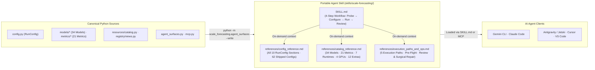

# `skills/` — Portable AI Agent Skills & Drift-Locked Reference Surfaces

This directory contains the portable `SKILL.md` package for `scale-forecasting` following the open [Agent Skills specification](https://agentskills.io). Any compatible AI coding assistant (Gemini CLI, Claude Code, Antigravity / Jetski, Cursor, VS Code Copilot, Windsurf) can load [`scale-forecasting/SKILL.md`](./scale-forecasting/SKILL.md) to configure, validate, dry-run, execute, review, and repair enterprise forecasting pipelines across all 7 runtimes and 5 launch surfaces.

To guarantee that the skill's documentation never drifts from the Python implementation, the three companion files under [`scale-forecasting/references/`](./scale-forecasting/references/) are generated deterministically from [`src/scale_forecasting/agent_surfaces.py`](../src/scale_forecasting/agent_surfaces.py) (`make agent-surfaces`) and verified in `.githooks/pre-commit` and CI by [`tests/unit/test_agent_surfaces.py`](../tests/unit/test_agent_surfaces.py).

---

## Architecture & Progressive Disclosure Flow



---

## Directory Inventory

| File | Generation Mode | Responsibility |
| :--- | :--- | :--- |
| [`README.md`](./README.md) | Hand-authored | Directory architecture map, progressive-disclosure flow diagram, and file inventory. |
| [`scale-forecasting/SKILL.md`](./scale-forecasting/SKILL.md) | Hand-authored | Main portable skill entry point with YAML frontmatter (`name: scale-forecasting`) and the mandatory 4-step workflow (Step 0 Environment Probe → Step 1 `RunConfig` Authoring → Step 2 Pre-Flight & Execution → Step 3 Review & Repair). |
| [`scale-forecasting/references/config_reference.md`](./scale-forecasting/references/config_reference.md) | Auto-generated (`agent_surfaces.py`) | Exhaustive field-by-field reference for all 10 `RunConfig` sections plus the inventory of 20 root demo configs and 42 smoke configs (`01`–`42`). |
| [`scale-forecasting/references/catalog_reference.md`](./scale-forecasting/references/catalog_reference.md) | Auto-generated (`agent_surfaces.py`) | Complete tables for all 34 models, 21 metrics, 7 compute runtimes, 4 GPU types, 12 dependency extras, and 5 BigQuery analytical SQL views. |
| [`scale-forecasting/references/execution_paths_and_ops.md`](./scale-forecasting/references/execution_paths_and_ops.md) | Auto-generated (`agent_surfaces.py`) | Commands and Python SDK snippets for environment probing, all 5 execution paths, pre-flight verification (`--dry-run`, `--feasibility`, `--check-quota`), and post-run review/repair (`review_run`, `calibration_report`, `retry_run`, `registry.ops`). |

---

## Keeping References Synchronized

Whenever you modify `RunConfig`, models, metrics, runtimes, GPUs, views, dependency extras, or shipped `configs/*.json` files, regenerate the reference surfaces before committing:

```bash
make agent-surfaces
# Equivalent to:
python -m scale_forecasting.agent_surfaces --write
```

Verify zero drift at any time with:

```bash
python -m scale_forecasting.agent_surfaces --check
```
