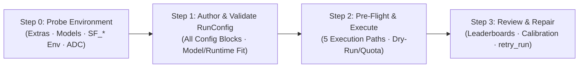

# `scale-forecasting` — Agent Skill & Workflow Guide

`scale-forecasting` is a declarative, config-driven enterprise time-series forecasting platform for Google Cloud and local Python environments. Everything is driven by a single Pydantic [`RunConfig`](../../src/scale_forecasting/config.py) JSON/dict contract that executes identically across all 5 execution paths (Offline Playground & Dry-Run, Cloud Preflight & Staging, Unified Multi-Family DAG Execution, Direct Per-Family Submitters, and Cloud Composer 3 Airflow DAG Emission).

---

## Progressive Disclosure References (Auto-Generated & Drift-Locked)

Read these companion reference files in [`references/`](./references/) whenever you need exhaustive field-by-field or catalog-level detail:

1. **[`references/config_reference.md`](./references/config_reference.md):** Every field, type, default, constraint, and cross-field rule across `RunConfig` and its 14 nested Pydantic blocks (`data`, `features`, `backtest`, `output`, `hpo`, `ensemble`, `hierarchy`, `compute`, `compute.families.<family>`, `compute.ensemble`, `compute.profile`, `compute.capacity`), GPU-to-VM shape resolution, and `run_id` digest exclusions.
2. **[`references/catalog_reference.md`](./references/catalog_reference.md):** All **34 models** (with family, runtime, package, `[extra]`, covariate support, explainability, training modes, and GPU capability), **21 evaluation metrics** (16 point + 5 interval), **7 compute runtimes**, **12 dependency extras**, **4 source tables / 5 registry tables / 5 analytical SQL views**, and all **62 shipped configs** (`20` root demos + `42` smoke configs `01`–`42`).
3. **[`references/execution_paths_and_ops.md`](./references/execution_paths_and_ops.md):** Step-by-step CLI commands and Python SDK patterns for `SF_*` environment variables, **all 5 Execution Paths**, **Pre-Flight Verification** (`--dry-run`, `--feasibility`, `--quota`, `--stage-only`, `--emit-airflow`), **Post-Run Review & Surgical Repair** (`review_run`, `calibration_report`, `retry_run`, `--probe`, `--settle`, `--cancel`), and **Registry Lifecycle Operations** (`scale_forecasting.registry.ops`).

> **Built-in MCP Server Available:** If your agent client supports the Model Context Protocol (MCP), run `python -m scale_forecasting.mcp` (or `python -m scale_forecasting.mcp --allow-launch` to unlock cloud job submission and registry repair). It exposes 7 structured `forecast://*` resources and 9 tools directly over `stdio`.

---

## Mandatory 4-Step Agent Workflow



### Step 0: Probe the Environment First (Never Guess Capabilities)

Before recommending an install command, model family, or execution path, inspect what is installed and configured in the active environment:

```bash
python -m scale_forecasting.agent_surfaces --probe-env
```

Or in Python / MCP (`probe_environment` tool or `forecast://environment` resource):
```python
from scale_forecasting.agent_surfaces import probe_environment

env = probe_environment()
```

Use the returned report to route your workflow:
- **`extras`** and **`models`**: Shows which of the 12 extras (`gcp`, `notebook`, `spark`, `ray`, `submit`, `models-stats`, `models-trees`, `models-prophet`, `models-dl`, `models-automl`, `models`, `all`) and which of the 34 models are importable right now, along with exact `pip install "scale-forecasting[<extra>]"` commands for any missing package.
  - Pure core (`pip install scale-forecasting`) includes 14 statistical and ML models (`croston`, `fft`, `holtwinters`, `kalman`, `naive_drift`, `naive_mean`, `naive_moving_average`, `naive_seasonal`, `random_forest`, `regression_lags`, `sarimax`, `stl_bagging`, `theta`, `ucm`) plus all 21 metrics, backtesting, ensembling, hierarchical reconciliation, and the MCP server — **zero model extras or GCP credentials required**.
- **`execution_paths_ready`**:
  - `path_1_offline_playground_and_dry_run` (`True` on every install): Use `scale_forecasting.playground` (`sample_data`, `run_model`, `bakeoff`, `summarize`) and `Forecaster.dry_run()` for instant zero-GCP benchmarking and config validation.
  - `path_5_airflow_dag_emission` (`True` on every install): Render Cloud Composer 3 / Airflow DAG Python source offline (`--emit-airflow`).
  - `path_2_cloud_plan_feasibility_and_stage`, `path_3_cloud_multi_family_dag_run`, and `path_4_direct_family_submitters`: True when `[gcp]` is installed and `SF_PROJECT_ID`, `SF_CONNECTION`, and `SF_WAREHOUSE_URI` are set (or loadable from `.env.infra`).

---

### Step 1: Author & Validate `RunConfig`

Always include `"$schema": "https://statmike.github.io/scale-forecasting/schemas/run_config.schema.json"` at the top of generated JSON files (it provides IDE autocomplete and is stripped before `run_id` hashing).

#### Key Rules When Constructing a `RunConfig`
1. **Start from the closest shipped template:** Check the 20 root demo configs in `configs/*.json` and 42 smoke configs in `configs/smokes/*.json` (cataloged in [`references/catalog_reference.md`](./references/catalog_reference.md)).
2. **Match `models` to family and runtime rules:**
   - Every config block enforces `extra="forbid"` — unknown keys fail immediately with `ConfigError`.
   - Statistical models (`statistical` family, 18 models) and Tree/ML models (`ml` family, 5 models) run on Python runtimes (`spark`, `ray`, `vertex`, `gce`, `gke`).
   - Deep learning models (`deep_learning` family: `neuralprophet`, `patchtst`, `tft`, `tide`, `tsmixer`) run on Python runtimes and support GPU acceleration (`hardware: "gpu"`).
   - Vertex AI AutoML models (`automl` family: `vertex_l2l`, `vertex_seq2seq`, `vertex_tft`, `vertex_tide`) require `compute.families.automl.runtime = "vertex_automl"`.
   - BigQuery-native models (`native` family: `arima_plus`, `timesfm`) execute as in-warehouse SQL on `bigquery`.
3. **Learned Ensembles & HPO Require Backtesting:**
   - `hpo.enabled = true` requires `backtest.enabled = true`.
   - If `ensemble.strategies` includes learned stackers (`"nnls"`, `"ridge"`, or `"xgb"`), you **must** set `"backtest": {"enabled": true, ...}` so out-of-fold (`backtest_oof`) predictions exist to train the combiner weights; otherwise `RunConfig` drops the learned strategies down to `"mean"` with a warning.
4. **Covariate Declarations (`features`):**
   - Known-in-advance future drivers (promotions, planned prices) go in `features.future_covariates` (`list[str]`) and `data.future_covariates_table`.
   - Historical-only drivers (observed weather, foot traffic) go in `features.past_covariates` (`list[str]`).
   - Time-invariant series attributes go in `features.static_covariates` (`list[str]`). All three lists must be mutually disjoint.
5. **Per-Family Compute Routing (`compute.families.<family>`):**
   - `scale-forecasting` dispatches **1 independent job per active model family in parallel** (`statistical`, `ml`, `deep_learning`, `automl`, `native`) so fast CPU families tear down immediately without waiting for GPU jobs.
   - Keep `machine_type: "auto"` unless pinning a specific shape from `resources/catalog.py`. Only `deep_learning` and `automl` families may set `hardware: "gpu"` or `gpu_type`.
   - On single-VM `gce`, `workers` must be `1`. On `vertex` and `gke` Indexed Jobs, `workers > 1` shards `ts_id` ranges across workers via BigQuery Storage Read API `row_restriction`.

#### Always Validate & Plan Offline Before Proceeding
```python
from scale_forecasting.config import load_config
from scale_forecasting.dag import gpu_usefulness_report, plan_dag
from scale_forecasting.registry.ids import make_run_id

cfg = load_config("configs/ensemble_demo.json")
run_id = make_run_id(cfg)
dag = plan_dag(cfg)
gpu_warnings = gpu_usefulness_report(cfg, dag.jobs)
```

---

### Step 2: Choose the Right Execution Path & Run Pre-Flight Checks

Select the execution path that matches the user's goal and `probe_environment()` readiness (full details in [`references/execution_paths_and_ops.md`](./references/execution_paths_and_ops.md)):

| Path | When to Use | Command / Entry Point |
| :--- | :--- | :--- |
| **Path 1: Offline Playground & Dry-Run** | Zero-GCP exploration, comparing models on synthetic or in-memory DataFrames, validating configs in seconds | `python -m scale_forecasting.playground --model holtwinters --backtest` or `from scale_forecasting.playground import sample_data, run_model, bakeoff` |
| **Path 2: Cloud Preflight & Staging** | Checking live BigQuery series lengths against backtest geometry, checking regional CPU/GPU quotas, or staging artifacts to GCS | `python -m scale_forecasting.main --config <path>.json [--dry-run --feasibility \| --quota \| --stage-only]` |
| **Path 3: Unified Multi-Family DAG (`main.run` / `Forecaster`)** | Running the full parallel multi-family DAG + ensemble node end-to-end from CLI, Python, or notebooks | `python -m scale_forecasting.main --config <path>.json` or `Forecaster.from_file("<path>.json").run()` |
| **Path 4: Direct Per-Family Submitters** | Submitting a single family or runtime (`submit`, `ray_submit`, `vertex_submit`, `gce_submit`, `gke_submit`, `automl_submit`, `ensemble_run`) | `python -m scale_forecasting.vertex_submit --config <path>.json --family ml` |
| **Path 5: Cloud Composer 3 / Airflow DAG Emission** | Rendering a self-contained Airflow DAG (`dag_<run_id>.py`) with per-family tasks and optional `--with-retry` repair node | `python -m scale_forecasting.main --config <path>.json --emit-airflow --with-retry` |

**Mandatory Pre-Flight Habit Before Any Live Cloud Run:**
1. Run `--dry-run` (or `Forecaster.dry_run()` / MCP `plan_execution(mode="dry_run")`) to inspect the exact `LaunchPlan`, resolved machine shapes, `run_id`, and idempotency status in `run_registry`.
2. Run `--feasibility` and `--quota` when testing a new dataset or GPU family to catch series-length shortfalls or regional quota limits before spinning up clusters.

---

### Step 3: Post-Run Monitoring, Review, Calibration & Surgical Repair

Every cloud run persists structured lineage and outputs to 5 BigQuery tables (`run_registry`, `run_jobs`, `forecast_metadata`, `forecast_predictions`, `backtest_oof`) and 5 SQL views (`v_model_leaderboard`, `v_model_leaderboard_comparable`, `v_backtest_coverage`, `v_run_summary`, `v_run_jobs`).

1. **Verify Run Completion & Job Telemetry:**
   - Check `run_registry` (or `v_run_summary`) for `status = 'COMPLETED'` and `overhead_seconds`.
   - Inspect `run_jobs` (or `v_run_jobs`) for per-family wall-clock duration, `machine_type`, and `$.sizing` / `$.sizing_executed` JSON telemetry.
2. **Run the Automated Data-Science Review & Calibration Report:**
   ```python
   from scale_forecasting.review import calibration_report, review_run

   review = review_run("ensemble-demo-8ca68173be52")
   cal = calibration_report("ensemble-demo-8ca68173be52")
   ```
   Or via MCP: `review_run(run_id="...")`. Returns `best_overall`, `best_per_family`, `ensemble_lift`, full model leaderboard (`score`, `pooled_wape`, `n_comparable_series`, `cohort`), point-forecast arm win-rate (`arms`), and empirical vs. nominal interval coverage (`coverage`, `mean_coverage`, `worst_step`).
3. **Surgical Repair of Failed or Partial Runs (Never Re-Run Everything Blindly):**
   - **Preview or submit surgical cell repair (`retry_run`):** Re-runs only missing or failed `(ts_id, model_type)` cells and re-runs the ensemble barrier if any cell was repaired:
     ```bash
     python -m scale_forecasting.main --run-id <run_id> --retry
     python -m scale_forecasting.main --run-id <run_id> --retry --force --reason "Repair transient worker OOM"
     ```
   - **Inspect, reconcile, or clean up registry state (`registry.ops`):**
     ```bash
     python -m scale_forecasting.registry.ops doctor
     python -m scale_forecasting.registry.ops close-runs --yes
     python -m scale_forecasting.registry.ops drop-run <run_id> --yes
     python -m scale_forecasting.registry.ops sweep-orphans --yes
     ```
