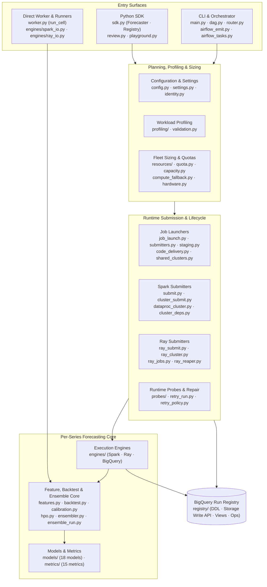

# `scale_forecasting` Package (`src/scale_forecasting/`)

`scale_forecasting` is structured around **one capability per file** and a strict separation between **pure planning/math** and **cloud I/O**. Every execution surface — local Python, Dataproc Spark (Serverless and GCE Clusters), Ray on Vertex AI, and Cloud Composer (Airflow) — imports this exact package and runs the same per-series unit of work ([`worker.run_cell`](./worker.py)).

The package root ([`__init__.py`](./__init__.py)) uses a PEP 562 lazy `__getattr__` loader so importing `scale_forecasting` never pulls in heavy optional dependencies (`pyspark`, `ray`, `torch`, `neuralprophet`) until the specific module or model is requested.

---

## Subpackages

Each subpackage has its own `README.md` with architecture diagrams and module guides:

| Subpackage | Purpose |
| :--- | :--- |
| **[`models/`](./models/README.md)** | The 18 forecasting models (`statistical`, `ml`, `deep_learning`, `native`), the `BaseModel` contract, recursive lag design matrix (`_lag_forecaster.py`), and model registry. |
| **[`metrics/`](./metrics/README.md)** | The 15 evaluation metrics (11 point metrics + 4 prediction-interval metrics), `BaseMetric` contract, and `METRIC_NAMES` schema driver. |
| **[`engines/`](./engines/README.md)** | Distributed fan-out engines for Dataproc Spark (`spark_explode.py`, `spark_io.py`), Ray on Vertex AI (`ray_engine.py`, `ray_io.py`), and BigQuery SQL (`bigquery_engine.py`, `bigquery_sql.py`). |
| **[`registry/`](./registry/README.md)** | BigQuery table DDL (`ddl.py`), deterministic `run_id` hashing (`ids.py`), Storage Write API streaming (`write_api.py`), SQL views (`views.py`), and operator maintenance verbs (`ops.py`). |
| **[`probes/`](./probes/README.md)** | Live runtime-to-registry reconciliation (`reconcile.py`), platform status readers (`runtimes.py`), safe job cancellation (`cancel.py`), and abandoned-row settling (`settle.py`). |
| **[`resources/`](./resources/README.md)** | Translates measured per-cell resource profiles and regional quotas into concrete executor/worker sizing for Dataproc Serverless, Dataproc Clusters, and Ray pools. |
| **[`profiling/`](./profiling/README.md)** | Empirical per-cell CPU, memory, and wall-time measurement (`measure.py`), representative series sampling (`sampling.py`), baseline fallbacks (`baseline.py`), and cost-weighted bucketing (`cost.py`). |
| **[`data_gen/`](./data_gen/README.md)** | Synthetic multi-archetype time-series panel generator (`generator.py`) and distributed Spark seeding job (`seed_spark.py`). |

---

## Top-Level Modules by Role

### 1. User & Orchestration Entrypoints
- **[`sdk.py`](./sdk.py):** The Python SDK (`Forecaster` for planning, running, monitoring, probing, cancelling, settling, and retrying runs; `Registry` for dataset maintenance).
- **[`main.py`](./main.py):** Primary CLI and orchestration entrypoint (`python -m scale_forecasting.main --config ...`).
- **[`review.py`](./review.py):** Live run progress monitoring (`monitor_run`) and post-run evaluation (`review_run`), plus matplotlib visualization helpers.
- **[`playground.py`](./playground.py):** Offline single-series sandbox (`python -m scale_forecasting.playground`) for testing models and backtests without cloud infrastructure.
- **[`airflow_emit.py`](./airflow_emit.py) & [`airflow_tasks.py`](./airflow_tasks.py):** Renders any `RunConfig` into a standalone Cloud Composer / Airflow Python DAG (`dag_<run_id>.py`) and provides the task callables it executes.

### 2. Core Forecasting & Evaluation Pipeline
- **[`worker.py`](./worker.py):** Defines `run_cell(series, model_name, cfg) -> CellResult` — the single per-series unit of work shared across local, Spark, and Ray execution.
- **[`features.py`](./features.py):** Builds historical and future exogenous design matrices (target transforms `log1p`/`boxcox`, country holidays, Fourier terms, binary-segmentation level shifts, `exog`, and `exog_lags`).
- **[`backtest.py`](./backtest.py):** Rolling-origin cross-validation (`expanding`, `sliding`, `expanding_frozen`, `expanding_stale`), short-series policies, fold geometry resolution, and metric panel scoring.
- **[`calibration.py`](./calibration.py):** Out-of-fold conformal prediction-interval calibration and automatic point-forecast arm selection (`raw`, `mean`, `median`, `auto`).
- **[`hpo.py`](./hpo.py):** Optuna hyperparameter optimization (`fleetwide` sampled pre-pass or `per_series` in-worker studies).
- **[`ensembler.py`](./ensembler.py) & [`ensemble_run.py`](./ensemble_run.py):** Pure mathematical blending (`mean`, `median`, `inverse_error`, `nnls`, `ridge`, `xgb`) and the registry-backed ensemble job runner (including cross-run ensembling).
- **[`seasonality.py`](./seasonality.py):** Maps pandas frequency codes (`D`, `W`, `MS`, `h`, etc.) to seasonal periods and Fourier harmonic counts.

### 3. DAG Planning, Sizing & Hardware Preflight
- **[`config.py`](./config.py):** Pydantic models defining `RunConfig` and all nested configuration blocks.
- **[`settings.py`](./settings.py) & [`identity.py`](./identity.py):** Resolves deployment settings from `SF_*` environment variables and parses `<slug>-<12hex>` run and job identifiers.
- **[`dag.py`](./dag.py) & [`router.py`](./router.py):** Splits a config's models into per-family `FamilyJobNode`s, wires shared-cluster brackets and ensemble dependencies, and routes in-process execution.
- **[`launch_plan.py`](./launch_plan.py) & [`commands.py`](./commands.py):** Builds dry-run plans, stages configs to GCS, records `STAGED`/`EMITTED` registry rows, and emits copy-pasteable `gcloud` / `python` launch commands.
- **[`validation.py`](./validation.py):** Panel inspection (`inspect_source_panel`), workload estimation (`estimate_workload`), and preflight feasibility reporting (`check_feasibility`).
- **[`hardware.py`](./hardware.py) & [`device_audit.py`](./device_audit.py):** GPU usefulness classification, hardware preflight validation, and runtime CUDA device verification.
- **[`quota.py`](./quota.py), [`capacity.py`](./capacity.py) & [`compute_fallback.py`](./compute_fallback.py):** Live regional CPU/GPU quota inspection, capacity-exhausted backoff/clamping, and multi-region/machine-type fallback chains.

### 4. Cloud Submission, Code Delivery & Cluster Lifecycle
- **[`code_delivery.py`](./code_delivery.py) & [`staging.py`](./staging.py):** Packages `src/scale_forecasting` into a deterministic zip for Spark and builds the locked `uv` `runtime_env` for Ray.
- **[`job_launch.py`](./job_launch.py), [`job_wait.py`](./job_wait.py), [`job_outcome.py`](./job_outcome.py) & [`submitters.py`](./submitters.py):** Dispatches family jobs in parallel threads, handles platform attempt-counter walks, polls job completion, and rolls family outcomes up into the run status.
- **[`submit.py`](./submit.py), [`batch_infra.py`](./batch_infra.py) & [`batch_telemetry.py`](./batch_telemetry.py):** Dataproc Serverless batch submission and telemetry extraction.
- **[`dataproc_cluster.py`](./dataproc_cluster.py), [`cluster_submit.py`](./cluster_submit.py), [`cluster_deps.py`](./cluster_deps.py) & [`cluster_telemetry.py`](./cluster_telemetry.py):** Ephemeral and named Dataproc GCE cluster creation, packed-venv init action wiring, PySpark job submission, and teardown.
- **[`ray_cluster.py`](./ray_cluster.py), [`ray_submit.py`](./ray_submit.py), [`ray_jobs.py`](./ray_jobs.py), [`ray_infra.py`](./ray_infra.py), [`ray_telemetry.py`](./ray_telemetry.py) & [`ray_reaper.py`](./ray_reaper.py):** Ray on Vertex AI cluster lifecycle, autoscaling pool configuration, bearer-token-resilient job polling, and leaked-cluster reaping (`reap-clusters` / `sweep_on_launch`).
- **[`shared_clusters.py`](./shared_clusters.py):** Reference-counted cluster sharing when multiple model families co-locate on one ephemeral Dataproc or Ray cluster.
- **[`retry_run.py`](./retry_run.py) & [`retry_policy.py`](./retry_policy.py):** Cell-level and family-level surgical repair (`--retry` / `Forecaster.retry()`), targeting only failed or missing `(series_id, model)` pairs.
- **[`spark_entry.py`](./spark_entry.py), [`ray_entry.py`](./ray_entry.py), [`_entry.py`](./_entry.py) & [`_infra_args.py`](./_infra_args.py):** On-cluster driver entrypoints executed inside Dataproc and Ray jobs.
- **[`smoke_run.py`](./smoke_run.py) & [`notebook_acceptance.py`](./notebook_acceptance.py):** Post-deploy Terraform smoke runner and headless Colab Enterprise notebook execution harness.
- **[`errors.py`](./errors.py):** Typed exception hierarchy (`ScaleForecastingError`, `ConfigError`, `DataValidationError`, `CapacityError`, `JobIdTaken`, `ExecutionError`, `ModelFitError`).
