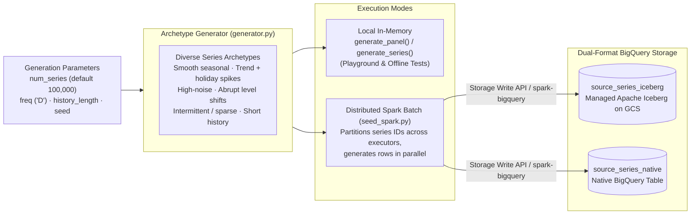

# Synthetic Data Generation & Seeding (`src/scale_forecasting/data_gen/`)

This subpackage generates the synthetic time-series panels used across the platform:
- **Locally** by [`playground.py`](../playground.py), [`notebooks/model_playground.ipynb`](../../../notebooks/model_playground.ipynb), and the offline unit test suite.
- **At 100,000-series scale in Google Cloud** by the Terraform `seed` module ([`terraform/main/modules/seed/`](../../../terraform/main/modules/seed/main.tf)), which populates both `source_series_iceberg` (BigLake Apache Iceberg on GCS) and `source_series_native` (native BigQuery table) from a single deterministic generation pass.



---

## Modules in This Subpackage

| File | Role |
| :--- | :--- |
| [`generator.py`](./generator.py) | Pure, deterministic NumPy/pandas time-series generator (`generate_series`, `generate_panel`). Assigns each `series_id` (`series_000000` … `series_099999`) to a reproducible archetype with configurable trend, multi-period seasonality (derived via [`seasonality.py`](../seasonality.py)), holiday effects (`is_holiday`), structural level shifts (`level_shift_prob`), intermittency/zeros, and observation noise. |
| [`seed_spark.py`](./seed_spark.py) | Distributed PySpark entrypoint executed by the Dataproc Serverless seed batch (`sf-seed-<label>-<num_series>-<hash>`). Ensures the target tables exist via [`registry/tables.py`](../registry/tables.py), generates the panel in parallel across Spark partitions, and writes identical rows into `source_series_native` and `source_series_iceberg`. |

---

## Running the Generator

### Local Panel Generation (Python)

```python
from scale_forecasting.data_gen.generator import generate_panel

df = generate_panel(n_series=5, n_periods=365, freq="D", seed=42)
print(df.head())
```

### Re-Seeding a Cloud Deployment

The 100k-series cloud dataset is seeded automatically on your first `terraform apply` (`run_seed = true`). To re-seed at a different scale (for example, a 100-series smoke seed or a custom series count), update `seed_num_series` and `seed_run_label` in `terraform/main/terraform.tfvars` and run `terraform apply`.
