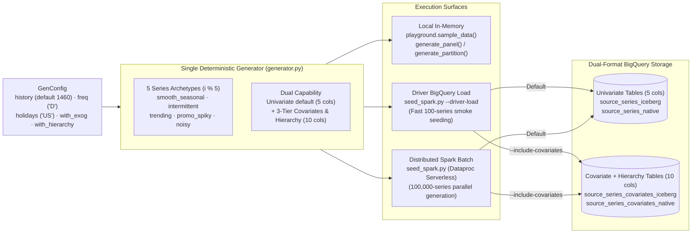

# Synthetic Data Generation & Seeding (`src/scale_forecasting/data_gen/`)

This subpackage provides **one unified, deterministic time-series generator** with **dual capability** (univariate by default, plus opt-in three-tier covariates and hierarchy dimensions) used across the entire platform:
- **Locally in memory** by [`playground.py`](../playground.py), [`notebooks/00_model_playground.ipynb`](../../../notebooks/00_model_playground.ipynb), and the offline unit test suite.
- **At 100- to 100,000-series scale in Google Cloud** by [`seed_spark.py`](./seed_spark.py) and the Terraform `seed` module ([`terraform/main/modules/seed/`](../../../terraform/main/modules/seed/main.tf)), populating both **BigLake Apache Iceberg** (`*_iceberg`) and **Native BigQuery** (`*_native`) tables from a single generation pass.



---

## Approach, Methodology & Why It Tests Everything

1. **Partition-Invariant Determinism (`(master_seed, series_index)`):**
   Every series `i` draws its parameters from an independent NumPy RNG seeded by `np.random.default_rng([master_seed, i])`. Consequently:
   - Series `s_000007` is **byte-for-byte identical** whether generated alone in a local test, inside a 3-series notebook sample, or across 512 Spark partitions in a 100,000-series cloud job (`generate_panel(n)` equals the union of any partitioning of `range(n)`).
   - Subsetting via `data.series_limit: k` is an exact prefix of the 100,000-series dataset.
   - Because `temperature` innovations draw from a dedicated child stream (`[master_seed, i, 1]`), turning on `with_hierarchy=True` leaves univariate `y` 100% unchanged, and `with_exog=False` preserves the exact pre-covariate baseline values.

2. **Five Diverse Series Archetypes (`ARCHETYPES[i % 5]`):**
   Each series is synthesized from `base + trend + short-cycle & annual seasonality + country holiday bumps + AR(1) colored noise (+ optional exogenous effects)`, then shaped by one of five archetypes designed so different model families win on different slices of the fleet:
   - **`smooth_seasonal`**: Strong weekly and annual harmonics with low AR(1) noise — favors harmonic/exponential-smoothing models (`theta`, `auto_theta`, `holtwinters`, `autoets`, `tbats`, `fft`).
   - **`intermittent`**: Low baseline with 60% zero-inflation (`zero_inflation=0.6`) — exercises intermittent-demand forecasters (`croston`), zero-safe metrics (`wape`, `maape`, `mase`, `rmsse`), and Box-Cox positivity guards.
   - **`trending`**: Steep positive drift (`trend_frac=(0.6, 1.8)`) with 15% probability of an abrupt structural level shift — exercises `naive_drift`, `kalman`, `ucm`, and `features.level_shift`.
   - **`promo_spiky`**: Regular seasonal baseline punctuated by promotional multipliers (`spike_mult=(2.5, 6.0)`) and holiday lifts — exercises tree/regression models (`xgboost`, `lightgbm`, `catboost`, `random_forest`, `regression_lags`) and exogenous regressors (`sarimax`, `prophet`, `arima_plus`).
   - **`noisy`**: High AR(1) persistence (`ar1_rho=(0.5, 0.85)`) and wide innovation variance — exercises regularized/global panel models (`tide`, `tft`, `tsmixer`, `patchtst`, `neuralprophet`), conformal interval calibration, and stacked ensembles (`nnls`, `ridge`, `xgb`).

3. **Dual Capability: Univariate Default + Three-Tier Covariates & Hierarchy:**
   - **Univariate mode (`with_exog=False, with_hierarchy=False` — default):** Emits 5 columns (`ts_id, ds, y, archetype, is_holiday`).
   - **Multivariate + Hierarchy mode (`with_exog=True, with_hierarchy=True` / `--include-covariates`):** Emits 10 columns covering all three covariate tiers and a 3-level hierarchy (`__total__` $\rightarrow$ 4 `region`s $\rightarrow$ 12 `region × category` cells $\rightarrow$ bottom `ts_id`), where **every tier injects realistic causal signal into `y`**:
     - **Static covariates & hierarchy levels (`static_covariates`):** `region` (`NA`, `EMEA`, `APAC`, `LATAM`) and `category` (`enterprise`, `SMB`, `consumer`) — drives region-specific baseline level & seasonal modulation plus category-specific trend drift and promotional elasticity (`consumer` responds $4\times$ stronger to promotions than `enterprise`).
     - **Known-future covariates (`future_covariates`):** `is_holiday` (country calendar bumps), `promo_flag` (deterministic 0/1 promotional calendar lifts), and `price_index` (smooth quarterly cycle with elasticity response).
     - **Historical-only covariates (`past_covariates`):** `temperature` (annual cycle + AR(1) weather noise) — injects contemporaneous + lag-1 + lag-season carry-over into `y` so lookahead-safe `exog_lags` carry genuine predictive signal into the forecast horizon.

---

## Modules in This Subpackage

| File | Role |
| :--- | :--- |
| [`generator.py`](./generator.py) | Pure, deterministic NumPy/pandas time-series generator (`GenConfig`, `generate_partition`, `generate_panel`, `is_holiday_flags`). Zero cloud or Spark dependencies. |
| [`seed_spark.py`](./seed_spark.py) | Cloud seeding entrypoint supporting both distributed PySpark execution on Dataproc Serverless and fast driver-side BigQuery loading (`--driver-load`). Writes identical panels to Iceberg and Native BigQuery tables (`source_series_{iceberg,native}` by default, or `source_series_covariates_{iceberg,native}` with `--include-covariates`). |

---

## How to Generate Data

### 1. Local In-Memory Generation (Python SDK / Playground)

```python
from scale_forecasting import playground
from scale_forecasting.data_gen.generator import GenConfig, generate_panel

# Quick sample via playground (univariate or with 3-tier covariates + hierarchy)
df_uni = playground.sample_data(n_series=3, history=730)
df_cov = playground.sample_data(n_series=12, history=730, with_exog=True, with_hierarchy=True)

# Direct generator control via GenConfig
cfg = GenConfig(history=1460, freq="D", holidays=("US",), with_exog=True, with_hierarchy=True)
panel = generate_panel(100, cfg, seed=20260726)
```

### 2. Seeding BigQuery & Iceberg Tables (`seed_spark.py`)

```bash
# Fast driver-side seed of the 100-series covariate + hierarchy tables (both Iceberg and Native)
uv run python -m scale_forecasting.data_gen.seed_spark \
  --n-series 100 --include-covariates --driver-load

# Distributed PySpark seed (e.g. 100,000 series across Spark partitions)
uv run python -m scale_forecasting.data_gen.seed_spark \
  --n-series 100000 --variant both
```

### 3. Automated Terraform Deployment Seeding

The 100,000-series cloud dataset (`source_series_iceberg` and `source_series_native`) is seeded automatically during initial deployment (`run_seed = true` in `terraform/main/modules/seed/`). To re-seed at a different scale, update `seed_num_series` and `seed_run_label` in `terraform/main/terraform.tfvars` and run `terraform apply`.
