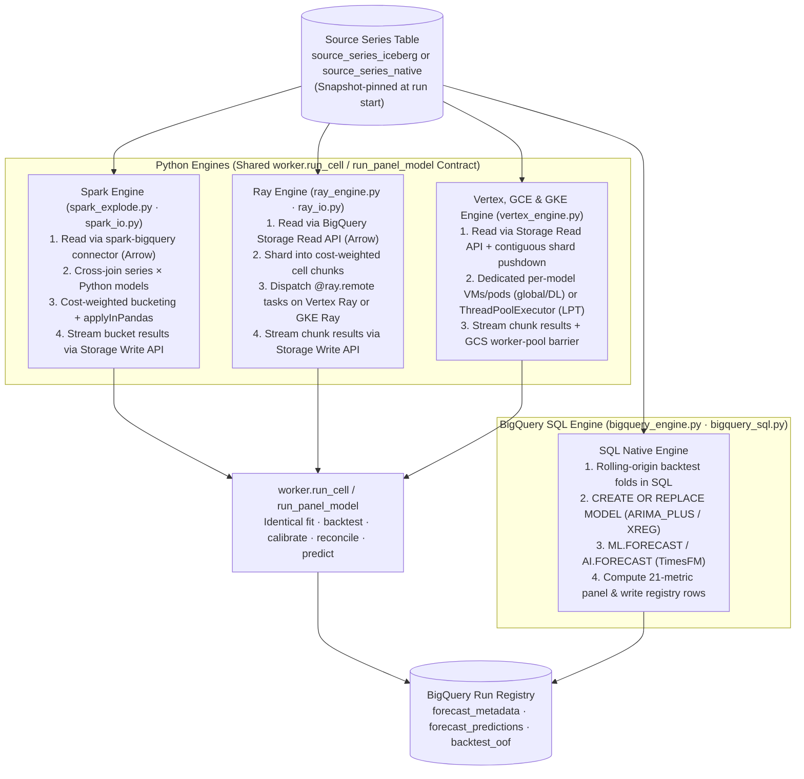

# Execution Engines (`src/scale_forecasting/engines/`)

This subpackage implements the four execution engines that run model families across all 6 cloud runtimes:
1. **Dataproc Spark** ([`spark_explode.py`](./spark_explode.py) + [`spark_io.py`](./spark_io.py))
2. **Ray on Vertex AI & GKE** ([`ray_engine.py`](./ray_engine.py) + [`ray_io.py`](./ray_io.py))
3. **Vertex AI `CustomJob`, Compute Engine Single-VM & GKE Indexed Jobs** ([`vertex_engine.py`](./vertex_engine.py))
4. **BigQuery SQL Native** ([`bigquery_engine.py`](./bigquery_engine.py) + [`bigquery_sql.py`](./bigquery_sql.py) + [`bigquery_names.py`](./bigquery_names.py))

The three Python engines (`spark_explode`, `ray_engine`, and `vertex_engine`) execute the exact same per-series unit of work — [`worker.run_cell(series, model_name, cfg)`](../worker.py) (plus [`worker.run_panel_model`](../worker.py) for cross-series global/hybrid models) — and stream results incrementally to the BigQuery registry so partial progress is durable even if a job is interrupted. The BigQuery native engine compiles `RunConfig` into multi-series `CREATE MODEL` and `ML.FORECAST` / `AI.FORECAST` SQL statements that execute entirely inside BigQuery.

---

## Modules in This Subpackage

| File | Engine | Role |
| :--- | :--- | :--- |
| [`spark_explode.py`](./spark_explode.py) | Spark | Orchestrates a Spark family run: resolves or measures the workload profile, performs fleet-wide HPO if enabled, groups `(series_id, model)` cells into cost-weighted buckets (`bucket_target_cells`), fans them out via `groupBy("_cell").applyInPandas(...)`, and streams each completed bucket to BigQuery. |
| [`spark_io.py`](./spark_io.py) | Spark | Low-level Spark I/O and UDF factories: snapshot-pinned `spark.read.format("bigquery")` (`read_source_series`), `make_group_runner`, and `make_chunk_runner`. Also exposed for direct user Spark scripts ([`docs/using_the_sdk.md`](../../../docs/using_the_sdk.md)). |
| [`ray_engine.py`](./ray_engine.py) | Ray | Orchestrates a Ray family run (on Vertex AI Ray or GKE Ray): connects to the local, Vertex, or GKE Ray cluster, runs the auto-GPU calibration probe (`gpu_fraction="auto"`) when on GPU, resolves the workload profile, groups cells into cost-weighted chunks (`chunk_cells`), dispatches `@ray.remote` tasks with tuned `num_cpus`/`num_gpus`/`memory`, and harvests completed chunks via `ray.wait`. |
| [`ray_io.py`](./ray_io.py) | Ray | Low-level Ray readers and task factories: high-throughput multi-stream BigQuery Storage Read API reader (`read_source_series` with `driver_collect` or `ray_data` mode), `chunk_cells`, and `make_chunk_runner`. |
| [`vertex_engine.py`](./vertex_engine.py) | Vertex / GCE / GKE | Executes Python families on serverless Vertex AI `CustomJob` (`runtime="vertex"`), single-VM Compute Engine (`runtime="gce"`), and Google Kubernetes Engine Indexed Jobs (`runtime="gke", gke_mode="job"`): plans VM/pod shape and thread slots (`plan_vertex_pool`), allocates 1 dedicated VM/pod per model for `deep_learning` / global models (`effective_worker_count`), pushes contiguous `ts_id` shard ranges into the BigQuery Storage Read API (`_read_source_panel`), orders local cells by Longest Processing Time first (`LPT`), and coordinates multi-worker pools with a GCS completion barrier. |
| [`bigquery_engine.py`](./bigquery_engine.py) | BigQuery | Executes `arima_plus` (`ARIMA_PLUS` / `ARIMA_PLUS_XREG`) and `timesfm` inside BigQuery: runs SQL backtest folds, scores the 21-metric panel (including out-of-fold conformal interval calibration and point-forecast arm selection), fits full-history models, and writes predictions and metadata to the registry. |
| [`bigquery_sql.py`](./bigquery_sql.py) | BigQuery | Pure SQL generators (no network I/O) for `CREATE OR REPLACE MODEL`, `ML.FORECAST`, `AI.FORECAST`, fold-cutoff planning, and exogenous feature SQL expressions. Snapshot-tested in [`tests/unit/test_bigquery_sql.py`](../../../tests/unit/test_bigquery_sql.py). |
| [`bigquery_names.py`](./bigquery_names.py) | BigQuery | Deterministic naming and reverse-matching for BigQuery ML model objects (`sf_model_<run_id>_<model>[_f<fold>]`) so [`registry/ops.py`](../registry/ops.py) (`drop-run`, `sweep-orphans`) can cleanly identify and remove BQML models belonging to a run. |

---

## Key Design Patterns

- **Cost-Weighted Cell Bucketing & Salvage:** All Python engines weight each `(series, model)` cell by its profiled runtime cost (`profiling/cost.py`) when packing buckets/chunks or ordering threads. Because results are committed to BigQuery after every bucket/chunk completes, a job that is cancelled or preempted midway retains all completed buckets in the registry (`PARTIAL` status), and [`retry_run.py`](../retry_run.py) (`--retry`) repairs only the missing cells.
- **Snapshot Pinning Across Engines:** Before launching family jobs, [`main.py`](../main.py) pins a millisecond epoch timestamp (`snapshot_epoch_ms`) on the source table. Every engine reads `FOR SYSTEM_TIME AS OF` that snapshot so parallel Spark, Ray, Vertex, GCE, GKE, and BigQuery jobs see the exact same input rows.
