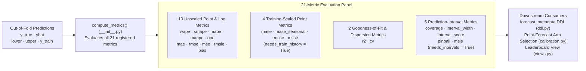

# Evaluation Metrics (`src/scale_forecasting/metrics/`)

This subpackage implements the **21 evaluation metrics** computed for every `(series, model)` cell during rolling-origin backtesting, along with the [`BaseMetric`](./base_metric.py) interface and the [`METRIC_NAMES`](./__init__.py) catalogue that drives BigQuery schema generation and leaderboard ranking.

---

## The 21 Built-In Metrics

Every metric is computed per fold during [`backtest.run_backtest`](../backtest.py) and averaged across folds to produce the cell's summary scores in `forecast_metadata`:

| Metric | File | Category | `direction` | `mean_optimal` | Formula / Interpretation |
| :--- | :--- | :--- | :---: | :---: | :--- |
| `wape` | [`wape.py`](./wape.py) | Point (Relative) | `lower` | `False` | **Weighted Absolute Percentage Error:** $\sum \|y - \hat{y}\| / \sum \|y\|$. Default `backtest.decision_metric`. |
| `smape` | [`smape.py`](./smape.py) | Point (Relative) | `lower` | `False` | **Symmetric MAPE:** $\text{mean}(2\|y - \hat{y}\| / (\|y\| + \|\hat{y}\|))$, bounded in $[0, 2]$. |
| `mape` | [`mape.py`](./mape.py) | Point (Relative) | `lower` | `False` | **Mean Absolute Percentage Error:** $\text{mean}(\|y - \hat{y}\| / \|y\|)$ on non-zero actuals (`NaN` when any $y_t = 0$). |
| `maape` | [`maape.py`](./maape.py) | Point (Relative) | `lower` | `False` | **Mean Arctangent Absolute Percentage Error:** $\text{mean}(\arctan(\|y - \hat{y}\| / \|y\|))$; finite even when $y_t = 0$. |
| `ope` | [`ope.py`](./ope.py) | Point (Relative) | `lower` | `False` | **Overall Percentage Error:** $\|\sum y - \sum \hat{y}\| / \|\sum y\|$; cumulative horizon volume accuracy. |
| `mae` | [`mae.py`](./mae.py) | Point (Scale-Dependent) | `lower` | `False` | **Mean Absolute Error:** $\text{mean}(\|y - \hat{y}\|)$ in native target units. |
| `rmse` | [`rmse.py`](./rmse.py) | Point (Scale-Dependent) | `lower` | `True` | **Root Mean Squared Error:** $\sqrt{\text{mean}((y - \hat{y})^2)}$ in native target units. |
| `mse` | [`mse.py`](./mse.py) | Point (Scale-Dependent) | `lower` | `True` | **Mean Squared Error:** $\text{mean}((y - \hat{y})^2)$. |
| `rmsle` | [`rmsle.py`](./rmsle.py) | Point (Log-Scale) | `lower` | `False` | **Root Mean Squared Logarithmic Error:** $\sqrt{\text{mean}((\ln(1+y) - \ln(1+\hat{y}))^2)}$ (`NaN` if any value $< 0$). |
| `bias` | [`bias.py`](./bias.py) | Point (Signed Diagnostic) | `zero` | `True` | **Signed Mean Error:** $\text{mean}(\hat{y} - y)$. Positive = over-forecasting; negative = under-forecasting. |
| `mase` | [`mase.py`](./mase.py) | Point (Scaled, `m=1`) | `lower` | `False` | **Mean Absolute Scaled Error (Naive-1):** $\text{MAE}$ divided by in-sample one-step naive error $\text{mean}(\|y_t - y_{t-1}\|)$. |
| `mase_seasonal` | [`mase_seasonal.py`](./mase_seasonal.py) | Point (Scaled, `m=P`) | `lower` | `False` | **Seasonal MASE:** $\text{MAE}$ divided by in-sample seasonal-naive error $\text{mean}(\|y_t - y_{t-m}\|)$. |
| `rmsse` | [`rmsse.py`](./rmsse.py) | Point (Scaled, `m=1`) | `lower` | `True` | **Root Mean Squared Scaled Error:** $\text{RMSE}$ divided by in-sample root mean squared one-step naive error. |
| `msse` | [`msse.py`](./msse.py) | Point (Scaled, `m=1`) | `lower` | `True` | **Mean Squared Scaled Error:** $\text{MSE}$ divided by in-sample mean squared one-step naive error ($\text{RMSSE}^2$). |
| `r2` | [`r2.py`](./r2.py) | Goodness-of-Fit | `higher` | `True` | **Coefficient of Determination ($R^2$):** $1 - \sum(y - \hat{y})^2 / \sum(y - \bar{y})^2$. |
| `cv` | [`cv.py`](./cv.py) | Dispersion | `lower` | `True` | **Coefficient of Variation of RMSE:** $\text{RMSE} / \bar{y}$ (`NaN` when $\bar{y} = 0$). |
| `coverage` | [`coverage.py`](./coverage.py) | Interval (`80%` PI) | `higher` | `False` | **Empirical Interval Coverage:** Fraction of actuals falling inside $[\hat{y}_{\text{lower}}, \hat{y}_{\text{upper}}]$. |
| `interval_width` | [`interval_width.py`](./interval_width.py) | Interval (`80%` PI) | `lower` | `False` | **Mean Interval Sharpness:** $\text{mean}(\hat{y}_{\text{upper}} - \hat{y}_{\text{lower}})$ in native target units. |
| `interval_score` | [`interval_score.py`](./interval_score.py) | Interval (Proper Score) | `lower` | `False` | **Winkler / Gneiting-Raftery Interval Score ($\alpha = 0.20$):** Width plus $\frac{2}{\alpha}$ penalty for out-of-bounds actuals. |
| `pinball` | [`pinball.py`](./pinball.py) | Interval (Quantile Loss) | `lower` | `False` | **Mean Pinball Loss:** Average quantile loss across the $q_{0.10}$ and $q_{0.90}$ bounds. |
| `msis` | [`msis.py`](./msis.py) | Interval (Scaled) | `lower` | `False` | **Mean Scaled Interval Score (M4):** `interval_score` normalized by in-sample seasonal naive error. |

---

## How `BaseMetric` Attributes Drive the Pipeline

Each metric class in this folder subclasses [`BaseMetric`](./base_metric.py) and declares:
1. **`direction`** (`"lower"`, `"higher"`, or `"zero"`) — Used by `loss_of(name, value)` to rank models consistently in HPO, `inverse_error` ensemble weighting, and `ensemble.prune_threshold`.
2. **`mean_optimal: bool`** — Used by [`calibration.py`](../calibration.py) when selecting the optimal point-forecast arm (`output.point_forecast: "auto"`). Squared-error and variance metrics (`rmse`, `mse`, `rmsse`, `msse`, `r2`, `cv`, `bias`) set `mean_optimal = True`, whereas absolute-error, percentage-error, log-error, and interval metrics set `mean_optimal = False`.
3. **`needs_train_history: bool`**, **`needs_intervals: bool`**, and **`needs_seasonal_period: bool`** — Declare optional inputs on `MetricContext` so plan-time validation can warn if a chosen `decision_metric` requires inputs that are disabled.

---

## Single Source of Truth (`METRIC_NAMES`)

The ordered tuple `METRIC_NAMES` in [`__init__.py`](./__init__.py) is the single source of truth for the metric schema across the entire codebase:
- [`registry/ddl.py`](../registry/ddl.py) generates the `FLOAT64` metric columns and `ADD COLUMN IF NOT EXISTS` migrations on `forecast_metadata` from `METRIC_NAMES`.
- [`registry/write_api.py`](../registry/write_api.py) and [`registry/rows.py`](../registry/rows.py) serialize those exact fields to BigQuery.
- [`registry/reads.py`](../registry/reads.py) and [`review.py`](../review.py) aggregate `mean_<metric>`, `p10_`, `p50_`, and `p90_` across all series.
- [`tests/unit/test_metrics_contract.py`](../../../tests/unit/test_metrics_contract.py) verifies that every metric in `_REGISTRY` satisfies the numerical and edge-case contract.

- **Complete mathematical reference:** [`docs/metrics_reference.md`](../../../docs/metrics_reference.md)
- **Adding a new metric in one file:** [`docs/adding_a_metric.md`](../../../docs/adding_a_metric.md) + [`docs/metric_template.py`](../../../docs/metric_template.py)
