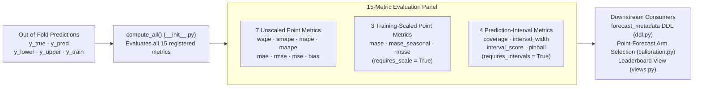

# Evaluation Metrics (`src/scale_forecasting/metrics/`)

This subpackage implements the **15 evaluation metrics** computed for every `(series, model)` cell during rolling-origin backtesting, along with the [`BaseMetric`](./base_metric.py) interface and the [`METRIC_NAMES`](./__init__.py) catalogue that drives BigQuery schema generation and leaderboard ranking.

---

## The 15 Built-In Metrics

Every metric is computed per fold during [`backtest.run_backtest`](../backtest.py) and averaged across folds to produce the cell's summary scores in `forecast_metadata`:

| Metric | File | Category | `mean_optimal` | Formula / Interpretation |
| :--- | :--- | :--- | :---: | :--- |
| `wape` | [`wape.py`](./wape.py) | Point (Relative) | `False` | **Weighted Absolute Percentage Error:** $\sum |y - \hat{y}| / \sum |y|$. Default `backtest.decision_metric`. |
| `smape` | [`smape.py`](./smape.py) | Point (Relative) | `False` | **Symmetric MAPE:** $\text{mean}(2|y - \hat{y}| / (|y| + |\hat{y}|))$, bounded in $[0, 2]$. |
| `mape` | [`mape.py`](./mape.py) | Point (Relative) | `False` | **Mean Absolute Percentage Error:** $\text{mean}(|y - \hat{y}| / |y|)$ on non-zero actuals (`NaN` when any $y_t = 0$). |
| `maape` | [`maape.py`](./maape.py) | Point (Relative) | `False` | **Mean Arctangent Absolute Percentage Error:** $\text{mean}(\arctan(|y - \hat{y}| / |y|))$; finite even when $y_t = 0$. |
| `mae` | [`mae.py`](./mae.py) | Point (Scale-Dependent) | `False` | **Mean Absolute Error:** $\text{mean}(|y - \hat{y}|)$ in native target units. |
| `rmse` | [`rmse.py`](./rmse.py) | Point (Scale-Dependent) | `True` | **Root Mean Squared Error:** $\sqrt{\text{mean}((y - \hat{y})^2)}$ in native target units. |
| `mse` | [`mse.py`](./mse.py) | Point (Scale-Dependent) | `True` | **Mean Squared Error:** $\text{mean}((y - \hat{y})^2)$. |
| `bias` | [`bias.py`](./bias.py) | Point (Signed Diagnostic) | `True` | **Signed Mean Error:** $\text{mean}(\hat{y} - y)$. Positive values indicate over-forecasting; negative values indicate under-forecasting. When chosen as `decision_metric`, models rank by `ABS(bias)`. |
| `mase` | [`mase.py`](./mase.py) | Point (Scaled, `m=1`) | `False` | **Mean Absolute Scaled Error (Naive-1):** $\text{MAE}$ divided by the in-sample one-step naive error $\text{mean}(|y_t - y_{t-1}|)$. Values $< 1.0$ beat a random walk. |
| `mase_seasonal` | [`mase_seasonal.py`](./mase_seasonal.py) | Point (Scaled, `m=P`) | `False` | **Seasonal MASE:** $\text{MAE}$ divided by the in-sample seasonal-naive error $\text{mean}(|y_t - y_{t-m}|)$ where $m$ matches the series frequency (`7` for daily, `12` for monthly, etc.). |
| `rmsse` | [`rmsse.py`](./rmsse.py) | Point (Scaled, `m=1`) | `True` | **Root Mean Squared Scaled Error:** $\text{RMSE}$ divided by the in-sample root mean squared one-step naive error (M5 competition metric). |
| `coverage` | [`coverage.py`](./coverage.py) | Interval (`80%` PI) | `False` | **Empirical Interval Coverage:** Fraction of actuals falling inside $[\hat{y}_{\text{lower}}, \hat{y}_{\text{upper}}]$. Ideal target is $0.80$ for the $(0.1, 0.9)$ quantile pair. |
| `interval_width` | [`interval_width.py`](./interval_width.py) | Interval (`80%` PI) | `False` | **Mean Interval Sharpness:** $\text{mean}(\hat{y}_{\text{upper}} - \hat{y}_{\text{lower}})$ in native target units. |
| `interval_score` | [`interval_score.py`](./interval_score.py) | Interval (Proper Score) | `False` | **Winkler / Gneiting-Raftery Interval Score ($\alpha = 0.20$):** Rewards narrow intervals and penalizes out-of-bounds actuals by $\frac{2}{\alpha}$ times the miss distance. |
| `pinball` | [`pinball.py`](./pinball.py) | Interval (Quantile Loss) | `False` | **Mean Pinball Loss:** Average quantile loss across the $q_{0.10}$ and $q_{0.90}$ bounds (equivalent to $0.10 \times \text{interval\_score}$). |

---

## How `BaseMetric` Attributes Drive the Pipeline

Each metric class in this folder subclasses [`BaseMetric`](./base_metric.py) and declares:
1. **`mean_optimal: bool`** — Used by [`calibration.py`](../calibration.py) when selecting the optimal point-forecast arm (`output.point_forecast: "auto"` or inverse-transform bias correction). Squared-error metrics (`rmse`, `mse`, `rmsse`) are minimized by the conditional **mean** (`mean_optimal = True`), whereas absolute-error metrics (`wape`, `mae`, `mase`, etc.) are minimized by the conditional **median** (`mean_optimal = False`).
2. **`requires_scale: bool`** — Indicates that `compute(y_true, y_pred, scale=...)` requires the fold's in-sample training naive error (`mase`, `mase_seasonal`, `rmsse`).
3. **`requires_intervals: bool`** — Indicates that `compute(y_true, y_pred, y_lower=..., y_upper=...)` evaluates the prediction interval bounds (`coverage`, `interval_width`, `interval_score`, `pinball`).

---

## Single Source of Truth (`METRIC_NAMES`)

The ordered tuple `METRIC_NAMES` in [`__init__.py`](./__init__.py) is the single source of truth for the metric schema across the entire codebase:
- [`registry/ddl.py`](../registry/ddl.py) generates the `FLOAT64` metric columns and `ADD COLUMN IF NOT EXISTS` migrations on `forecast_metadata` from `METRIC_NAMES`.
- [`registry/write_api.py`](../registry/write_api.py) and [`registry/rows.py`](../registry/rows.py) serialize those exact fields to BigQuery.
- [`registry/views.py`](../registry/views.py) and [`review.py`](../review.py) aggregate `AVG(<metric>)` across all series in `v_model_leaderboard`.
- [`tests/unit/test_metrics_contract.py`](../../../tests/unit/test_metrics_contract.py) verifies that every metric in `_REGISTRY` satisfies the numerical and edge-case contract.

To add a new metric in one file, follow **[`docs/adding_a_metric.md`](../../../docs/adding_a_metric.md)**.
