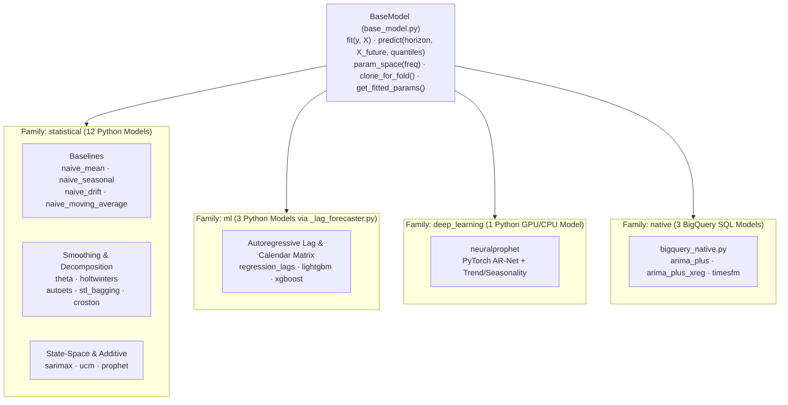

# Forecasting Models (`src/scale_forecasting/models/`)

This subpackage contains all **18 built-in forecasting models**, the [`BaseModel`](./base_model.py) interface they implement, the shared autoregressive lag/covariate engine ([`_lag_forecaster.py`](./_lag_forecaster.py)), and the model catalogue registry ([`__init__.py`](./__init__.py)).

Every model lives in its own file and registers itself on import via `register(ModelClass)`. Models are grouped into four **families** (`statistical`, `ml`, `deep_learning`, and `native`), which [`dag.py`](../dag.py) uses to route each family to its optimal compute runtime in parallel.

---

## Model Catalogue

| Model Name | File | Family | Runtime | Accepts `exog` | GPU Support | Description |
| :--- | :--- | :--- | :--- | :---: | :---: | :--- |
| `naive_mean` | [`naive_mean.py`](./naive_mean.py) | `statistical` | Python | No | CPU only | Constant forecast equal to the training sample mean with analytical Gaussian intervals. |
| `naive_seasonal` | [`naive_seasonal.py`](./naive_seasonal.py) | `statistical` | Python | No | CPU only | Repeats the final observed seasonal cycle (`m` inferred from series frequency). |
| `naive_drift` | [`naive_drift.py`](./naive_drift.py) | `statistical` | Python | No | CPU only | Linear trend connecting the first and last training observations with random-walk intervals. |
| `naive_moving_average` | [`naive_moving_average.py`](./naive_moving_average.py) | `statistical` | Python | No | CPU only | Trailing `window`-step simple moving average. |
| `theta` | [`theta.py`](./theta.py) | `statistical` | Python | No | CPU only | Assimakopoulos-Nikolopoulos Theta method (`statsmodels.tsa.forecasting.theta.ThetaModel`). |
| `holtwinters` | [`holtwinters.py`](./holtwinters.py) | `statistical` | Python | No | CPU only | Additive Holt-Winters exponential smoothing with automatic fallback on short series. |
| `autoets` | [`autoets.py`](./autoets.py) | `statistical` | Python | No | CPU only | State-space Exponential Smoothing (`ETSModel`) with analytical prediction intervals. |
| `croston` | [`croston.py`](./croston.py) | `statistical` | Python | No | CPU only | Intermittent-demand decomposition (`classic`, `sba`, or `tsb` variant) for zero-heavy series. |
| `stl_bagging` | [`stl_bagging.py`](./stl_bagging.py) | `statistical` | Python | No | CPU only | Bergmeir-Hyndman-Benítez STL decomposition with moving-block-bootstrapped ETS ensembles. |
| `sarimax` | [`sarimax.py`](./sarimax.py) | `statistical` | Python | Yes | CPU only | Seasonal ARIMA (`SARIMAX`) with exogenous regressor support and state-space intervals. |
| `ucm` | [`ucm.py`](./ucm.py) | `statistical` | Python | Yes | CPU only | Unobserved Components structural state-space model (local linear trend + trigonometric seasonality). |
| `prophet` | [`prophet_model.py`](./prophet_model.py) | `statistical` | Python | Yes | CPU only | Prophet piecewise trend + Fourier seasonality + country holidays and exogenous covariates. |
| `regression_lags` | [`regression_lags.py`](./regression_lags.py) | `ml` | Python | Yes | CPU only | L2-regularized (`Ridge`) linear model over recursive target lags (`1, 2, 3, 7, 14, 28`), calendar features, and `exog`. |
| `lightgbm` | [`lightgbm_model.py`](./lightgbm_model.py) | `ml` | Python | Yes | CPU only | `LGBMRegressor` fitted on recursive target lags, calendar features, and `exog` (`n_jobs=1` per worker). |
| `xgboost` | [`xgboost_model.py`](./xgboost_model.py) | `ml` | Python | Yes | Optional (`cuda`) | `XGBRegressor` (`tree_method="hist"`) over recursive target lags, calendar features, and `exog`. Supports GPU execution when provisioned, though CPU is recommended for short per-series tabular fits (`gpu_usefulness = "suboptimal"`). |
| `neuralprophet` | [`neuralprophet_model.py`](./neuralprophet_model.py) | `deep_learning` | Python | No | Beneficial (`cuda`) | PyTorch AR-Net + trend/seasonality + quantile regression (`gpu_usefulness = "beneficial"`). Designed for fractional-GPU packing on Ray-on-Vertex. |
| `arima_plus` | [`bigquery_native.py`](./bigquery_native.py) | `native` | BigQuery | No | Managed SQL | BigQuery ML `ARIMA_PLUS` executed across all series in SQL via [`bigquery_engine.py`](../engines/bigquery_engine.py). |
| `arima_plus_xreg` | [`bigquery_native.py`](./bigquery_native.py) | `native` | BigQuery | Yes | Managed SQL | BigQuery ML `ARIMA_PLUS_XREG` with exogenous covariates (`features.exog`, `holidays`, `fourier`). |
| `timesfm` | [`bigquery_native.py`](./bigquery_native.py) | `native` | BigQuery | No | Managed SQL | Zero-shot foundation-model forecasting via BigQuery `AI.FORECAST` (`TimesFM 2.0`). |

---

## Core Abstractions

### [`BaseModel`](./base_model.py)
Every model subclasses `BaseModel` and declares:
- **`name`**, **`runtime`** (`"python"` or `"bigquery"`), and **`family`** (`"statistical"`, `"ml"`, `"deep_learning"`, or `"native"`).
- **`supports_gpu`** (`bool`) and **`gpu_usefulness`** (`"none"`, `"suboptimal"`, or `"beneficial"`), which drive plan-time hardware preflight checks ([`hardware.py`](../hardware.py)).
- **`lags_covariates_internally`** (`bool`, default `False`), which tells [`features.py`](../features.py) whether to pass unlagged covariates only so a model never double-lags `features.exog_lags`.
- **`fit(y, X=None) -> Self`** and **`predict(horizon, X_future=None, quantiles=(0.1, 0.9)) -> DataFrame`** returning `ds`, `yhat`, `yhat_lower`, and `yhat_upper`.
- **`param_space(freq)`** for Optuna hyperparameter tuning ([`hpo.py`](../hpo.py)) and **`clone_for_fold()`** for `expanding_frozen` backtesting ([`backtest.py`](../backtest.py)).

### [`_lag_forecaster.py`](./_lag_forecaster.py)
Shared engine behind `regression_lags`, `lightgbm`, and `xgboost`. It constructs a tabular feature matrix combining target lags (`1, 2, 3, 7, 14, 28`), calendar features (`dow`, `dom`, `month`, `doy`), and exogenous covariates (`X`), performs recursive multi-step prediction where each step's `yhat` feeds subsequent target lags, and computes empirical residual prediction intervals scaled by $\sqrt{h}$.

---

## Adding a New Model

Copy [`docs/model_template.py`](../../../docs/model_template.py) into this directory, implement `fit` and `predict`, end the file with `register(MyModel)`, and import it in [`__init__.py`](./__init__.py). Every model in `_REGISTRY` is automatically tested against the 9-point model contract in [`tests/unit/test_models_contract.py`](../../../tests/unit/test_models_contract.py). See **[`docs/adding_a_model.md`](../../../docs/adding_a_model.md)** for a step-by-step guide.
